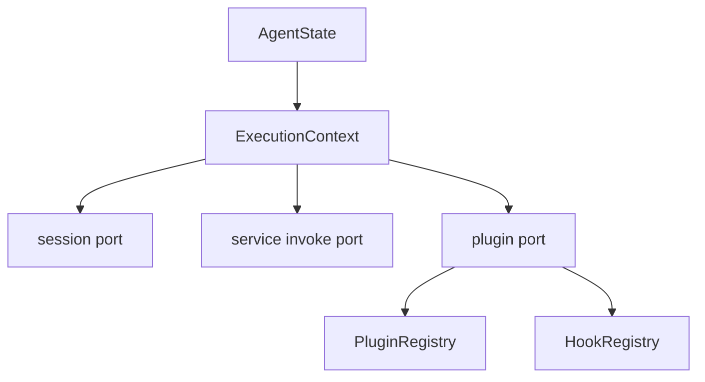
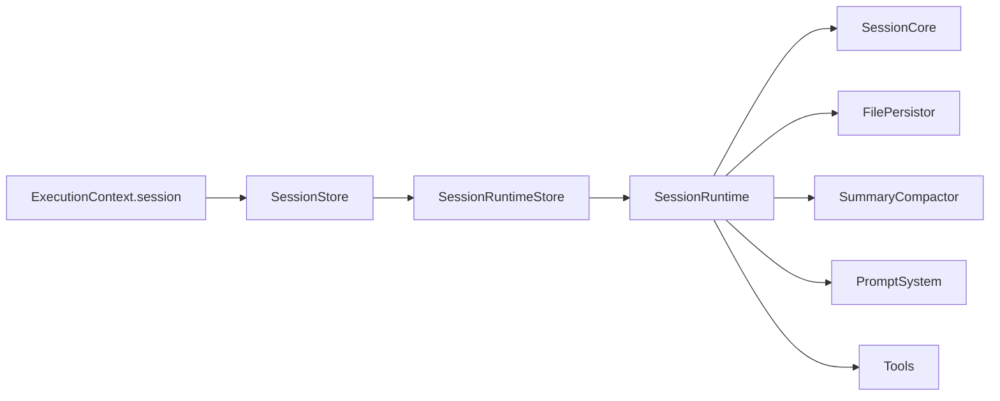
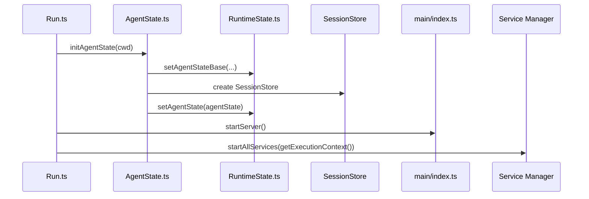

# Downcity Agent 与 Session 架构

这份文档专门解释：

1. `agent` 现在是什么
2. `ExecutionContext` 现在是什么
3. `session` 现在如何执行

---

## 1. `agent` 是什么

当前 `agent` 是**进程级宿主层**。

一个 `AgentState` 代表：

```text
一个 rootPath
+ 一份 config / env / logger / systems
+ 一份 execution model
+ 一份 SessionStore
```

当前关键文件：

- `agent/AgentState.ts`
- `agent/RuntimeState.ts`
- `agent/ExecutionContext.ts`

其中：

1. `RuntimeState.ts`
   - 持有 `AgentStateBase`
   - 持有 `AgentState`
   - 持有兼容阶段的 execution model 引用
2. `AgentState.ts`
   - 初始化宿主状态
   - 初始化 model / session store / plugin registry / service instances
   - 启动 prompt 热重载
3. `ExecutionContext.ts`
   - 把宿主态转换成统一执行视图

所以 `agent` 现在不是业务执行中心，而是：

- 宿主状态保存者
- execution context 提供者
- session registry 持有者

---

## 2. `ExecutionContext` 是什么

`ExecutionContext` 是从 `AgentState` 派生出来的统一执行视图。

当前包含：

1. `cwd`
2. `rootPath`
3. `logger`
4. `config`
5. `env`
6. `systems`
7. `session`
8. `invoke`
9. `plugins`

它的作用是：

- 给 service 和 plugin 暴露统一能力面
- 避免 service/plugin 直接依赖宿主内部结构

它不是：

- 第二套宿主
- 第二个进程
- 独立状态机

---

## 3. `ExecutionContext` 内部怎么构造

当前构造位置：

- `agent/ExecutionContext.ts`

内部主要做三件事：

1. 创建 plugin registry / hook registry
2. 创建 service invoke port
3. 创建 session port

图如下：



---

## 4. `session` 是什么

当前真正执行的是 `session`。

语义上：

1. 一条 chat 对话是一个 session
2. 一次 task run 也是一个 session

service 不直接执行模型主循环，而是通过：

```ts
runtime.session.run({ sessionId, query })
```

把执行送入 session。

所以更准确的表达是：

- `agent` 是宿主
- `session` 是执行实例

---

## 5. `session` 当前执行链



对应职责：

1. `SessionStore`
   - 统一入口
   - request context 绑定
   - append message
2. `SessionRuntimeStore`
   - `sessionId -> runtime/persistor` 映射与缓存
3. `SessionRuntime`
   - 装配 model、persistor、compactor、prompter、tools
4. `SessionCore`
   - 单次执行内核

---

## 6. 当前启动顺序

从 `main/commands/Run.ts` 开始：



详细阶段：

1. 解析 `rootPath`
2. 读取 config/env/systems
3. 创建 execution model
4. 创建 `SessionRuntimeStore`
5. 创建 `SessionStore`
6. 写入 ready `AgentState`
7. 启动 HTTP server
8. 启动全部 services

---

## 7. 当前最重要的结论

1. `AgentState` 是宿主态，不是执行实例
2. `ExecutionContext` 是统一执行视图，不是第二套 runtime 系统
3. `session` 才是真正执行 prompt / tools / history 的单位
4. service 通过 `runtime.session` 使用 session，而不是自己实现主执行循环
