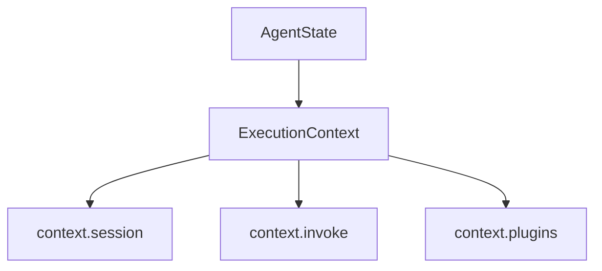
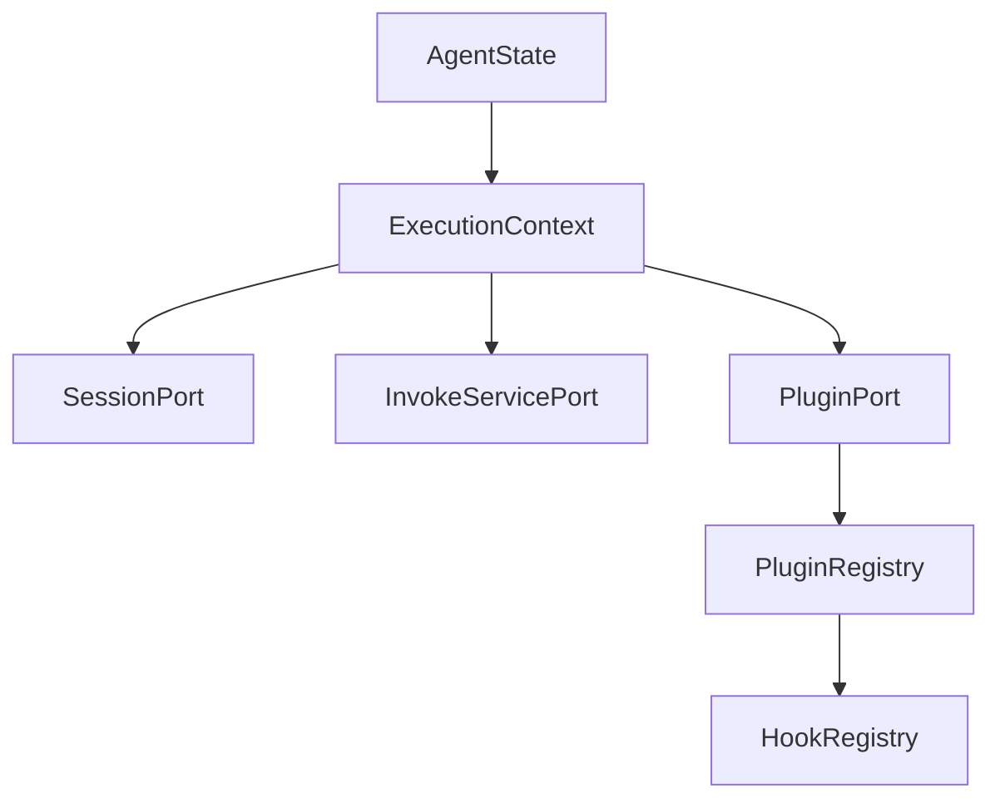
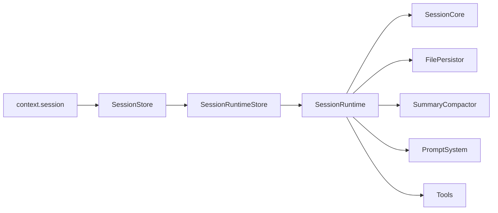
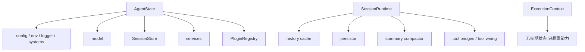
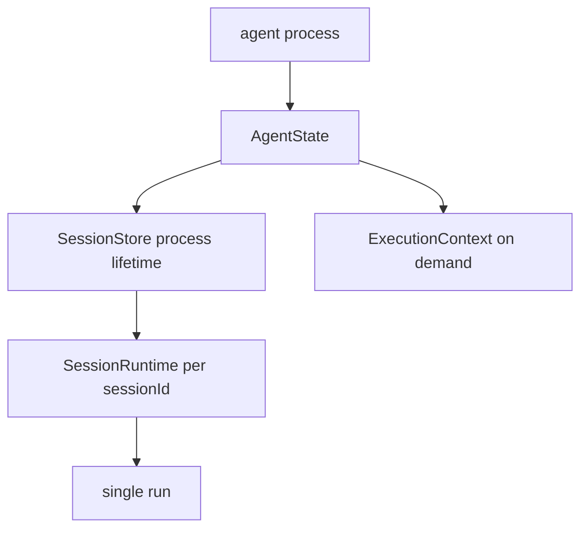
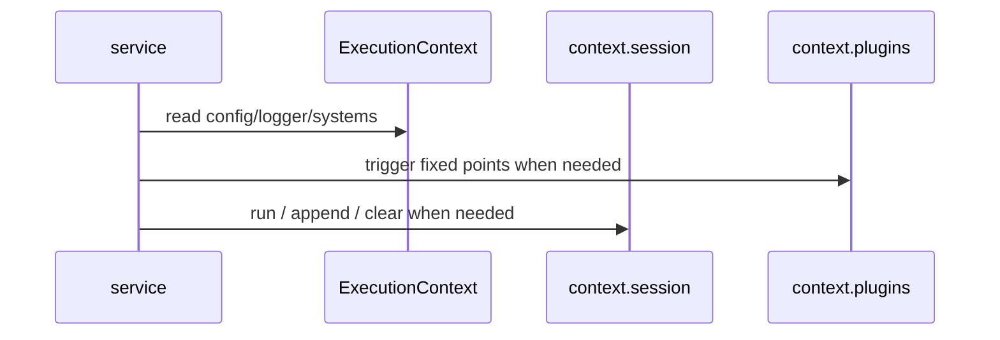

# Downcity Agent、ExecutionContext 与 Session

这份文档专门解释 4 件事：

1. `AgentState` 现在是什么
2. `ExecutionContext` 现在是什么
3. `session` 现在怎么执行
4. 三者的边界和状态归属是什么

---

## 1. `AgentState` 是什么

当前 `agent` 的准确实现载体是 `AgentState`。

一个 `AgentState` 表示：

```text
一个项目根目录
+ 一份 config / env / systems
+ 一份 model
+ 一份 SessionStore
+ 一组 service instances
+ 一份 PluginRegistry
```

它不是：

1. 一次会话执行
2. 一条 chat 消息
3. 一次 task run

它是：

1. 当前项目进程的宿主状态
2. `ExecutionContext` 的来源
3. `service / plugin / session` 的共同承载层

关键文件：

1. `agent/AgentState.ts`
2. `agent/RuntimeState.ts`
3. `types/AgentState.ts`

---

## 2. `ExecutionContext` 是什么

`ExecutionContext` 不是一个新的 runtime，也不是一个独立子系统。

它更准确的定位是：

**从 `AgentState` 派生出来的统一执行能力视图。**

当前主要暴露：

1. `cwd`
2. `rootPath`
3. `logger`
4. `config`
5. `env`
6. `systems`
7. `session`
8. `invoke`
9. `plugins`

图示：



这里最重要的结论：

1. `ExecutionContext` 不保存长期宿主状态
2. 它只把宿主能力整理成 service / plugin 可消费的接口
3. 它的意义是“统一能力面”，不是“再起一层宿主”

---

## 3. `ExecutionContext` 怎么构造

构造位置：

- `agent/ExecutionContext.ts`

当前主要做三件事：

1. 组装 `session port`
2. 组装 `invoke port`
3. 组装 `plugin port`

完整关系如下：



其中：

1. `context.session`
   - 负责进入或操作 session
2. `context.invoke`
   - 负责跨 service 调 action
3. `context.plugins`
   - 负责 plugin action 与固定点分发

---

## 4. `session` 是什么

当前真正执行 prompt / tools / history 的，是 `session`。

语义上：

1. 一条 chat 对话是一个 session
2. 一次 task run 也是一个 session

所以当前最准确的说法是：

1. `agent` 是宿主态
2. `ExecutionContext` 是统一能力面
3. `session` 是真正执行单元

service 不自己跑模型主循环，而是通过下面这个入口进入 session：

```ts
context.session.run({ sessionId, query })
```

---

## 5. `session` 的执行链

当前 session 侧主链如下：



职责拆分：

1. `SessionStore`
   - 统一入口
   - append message
   - run / clearRuntime / afterSessionUpdatedAsync
2. `SessionRuntimeStore`
   - `sessionId -> runtime/persistor` 的惰性缓存
3. `SessionRuntime`
   - 组装 model、persistor、compactor、prompt、tools
4. `SessionCore`
   - 执行单次模型循环

---

## 6. 状态归属

三者的状态归属现在应该这样看：



结论：

1. `AgentState` 持有长期宿主状态
2. `SessionRuntime` 持有某个 `sessionId` 对应的执行缓存
3. `ExecutionContext` 本身不应承担长期状态归属

---

## 7. 生命周期



逐层理解：

1. `AgentState`
   - 随 agent 进程存活
2. `SessionStore`
   - 随 agent 进程存活
3. `SessionRuntime`
   - 按 `sessionId` 惰性创建，可被 clear
4. 单次 run
   - 只覆盖这一次请求
5. `ExecutionContext`
   - 每次读取时派生，不是长期常驻态本体

---

## 8. service 和 plugin 怎么使用它们

当前正确关系：



也就是说：

1. service 直接拿 `ExecutionContext`
2. plugin 也直接拿 `ExecutionContext`
3. session 则通过 `context.session` 进入

---

## 9. 当前最重要的边界

1. `AgentState` 不是 session
2. `ExecutionContext` 不是第二套 runtime
3. `session` 才是真正执行 prompt / tool / history 的单位
4. service 应该通过 `context.session` 使用 session，而不是复制执行内核
