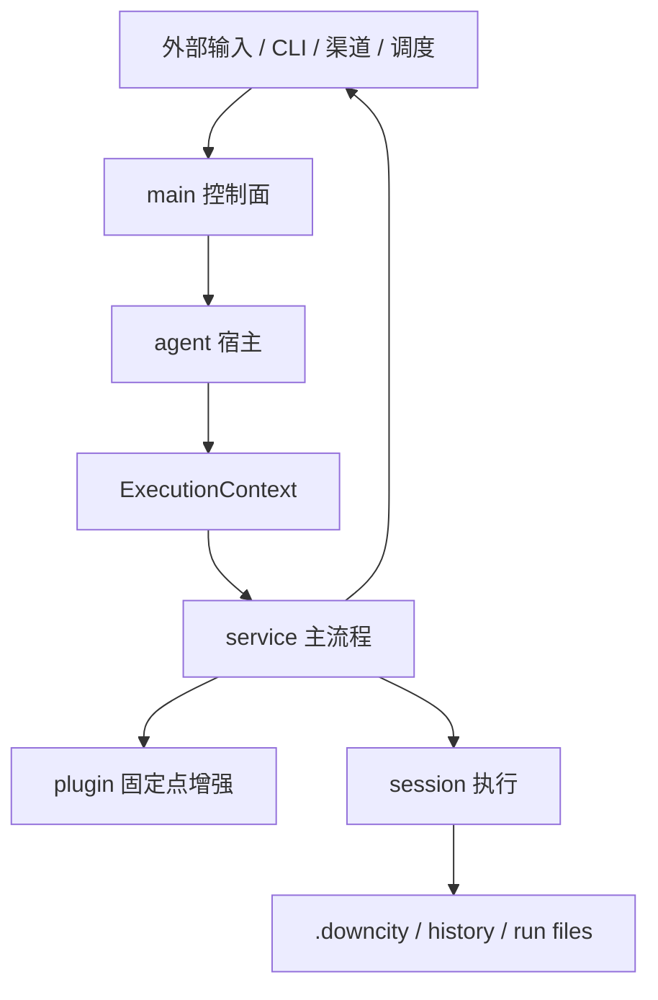

# Downcity 当前包架构说明

这份文档是 `devdocs/` 的总入口。

如果你要快速理解当前实现，建议按下面顺序阅读：

1. [文件结构与模块职责](./file-structure-and-dependencies.md)
2. [Agent 与 Session 架构](./agent-and-session.md)
3. [Service 与 Plugin 架构](./service-and-plugin.md)
4. [Chat 端到端流程](./chat-end-to-end-flow.md)
5. [启动与 HTTP/API 装配流程](./startup-and-api-flow.md)
6. [Task / Shell / Memory 执行链路](./task-shell-memory-flow.md)

---

## 1. 当前架构的最小心智模型

```text
main 负责装配
agent 负责宿主状态
ExecutionContext 负责统一执行视图
session 负责真正执行
service 负责主流程
plugin 负责被动扩展
```

---

## 2. 一张总图



---

## 3. 当前最重要的结论

1. `main` 是控制面与装配层
2. `agent` 是进程级宿主，不是单次执行实例
3. `ExecutionContext` 是统一能力视图，不是第二套宿主系统
4. `session` 才是真正执行 prompt / tools / history 的单位
5. `service` 是主流程层
6. `plugin` 是被动扩展层

---

## 4. 文档分工

### [文件结构与模块职责](./file-structure-and-dependencies.md)

适合回答：

- 目录现在怎么分
- 每层放什么文件
- 模块依赖方向是什么

### [Agent 与 Session 架构](./agent-and-session.md)

适合回答：

- `agent` 到底是什么
- `ExecutionContext` 和 `session` 的关系是什么
- 启动顺序是什么

### [Service 与 Plugin 架构](./service-and-plugin.md)

适合回答：

- service 怎么注册和调度
- plugin 怎么注册和接入
- 它们的职责边界是什么

### [Chat 端到端流程](./chat-end-to-end-flow.md)

适合回答：

- 一条渠道消息怎么进入系统
- queue、plugin、session、reply 各在哪一步发生

### [启动与 HTTP/API 装配流程](./startup-and-api-flow.md)

适合回答：

- daemon 和 run 的关系是什么
- agent 为什么要先 init state/context 再起 server
- service/plugin/execute 三类 API 分别怎么走

### [Task / Shell / Memory 执行链路](./task-shell-memory-flow.md)

适合回答：

- task 为什么会进入 session，而 shell/memory 不会
- 这三个 service 分别维护什么运行态
- 哪些 service 是常驻状态型，哪些是执行型

## 5. 对应关键代码入口

### 启动与宿主

- `packages/downcity/src/main/commands/Run.ts`
- `packages/downcity/src/agent/AgentState.ts`
- `packages/downcity/src/agent/RuntimeState.ts`
- `packages/downcity/src/agent/ExecutionContext.ts`

### 控制面与注册

- `packages/downcity/src/main/index.ts`
- `packages/downcity/src/main/service/Manager.ts`
- `packages/downcity/src/main/service/Services.ts`
- `packages/downcity/src/main/plugin/Plugins.ts`
- `packages/downcity/src/main/plugin/PluginRegistry.ts`

### Session 主轴

- `packages/downcity/src/sessions/SessionStore.ts`
- `packages/downcity/src/sessions/SessionRuntimeStore.ts`
- `packages/downcity/src/sessions/SessionRuntime.ts`
- `packages/downcity/src/sessions/SessionCore.ts`

### Chat 主流程

- `packages/downcity/src/services/chat/channels/BaseChatChannel.ts`
- `packages/downcity/src/services/chat/runtime/ChatQueueWorker.ts`
- `packages/downcity/src/services/chat/runtime/EnqueueDispatch.ts`
- `packages/downcity/src/services/chat/runtime/ReplyDispatch.ts`
