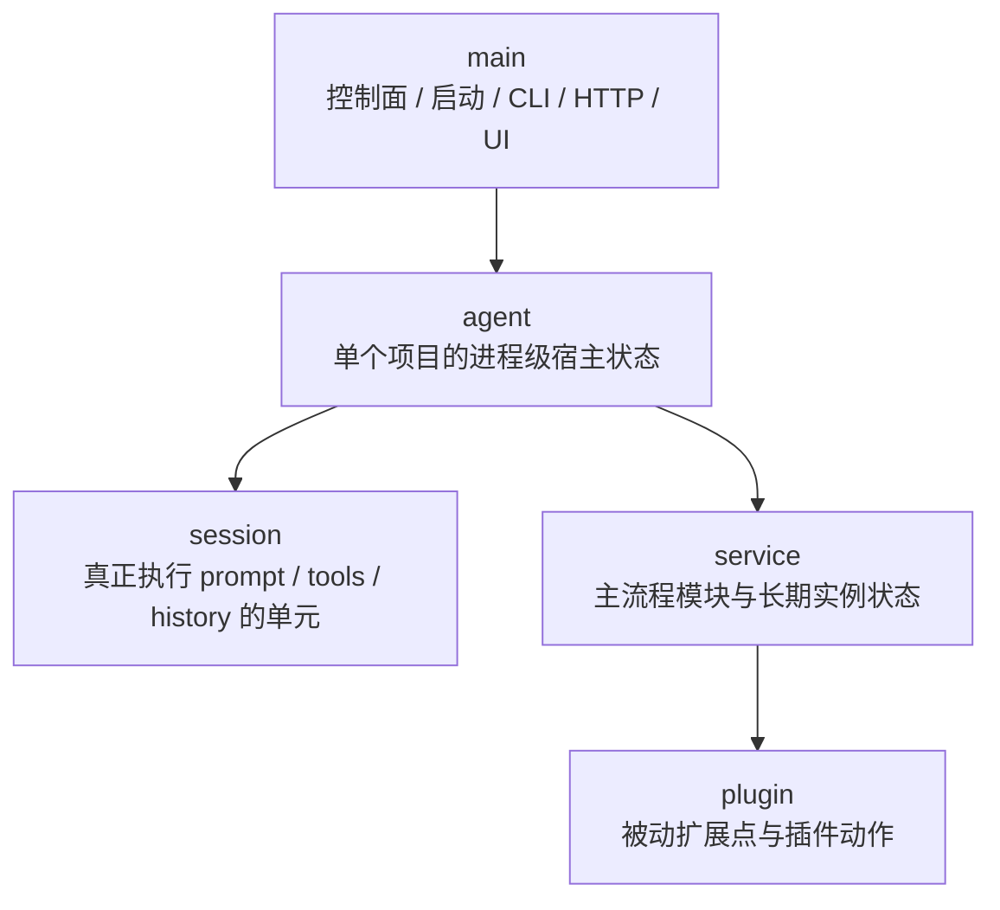
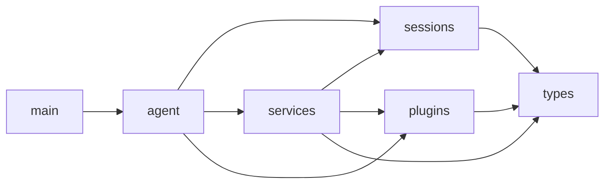
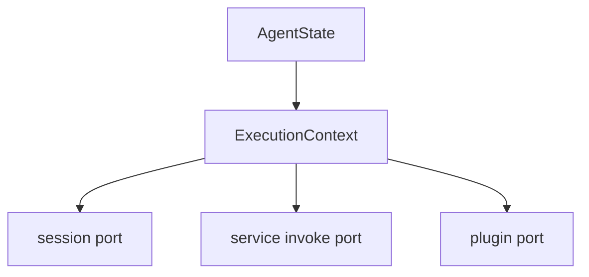
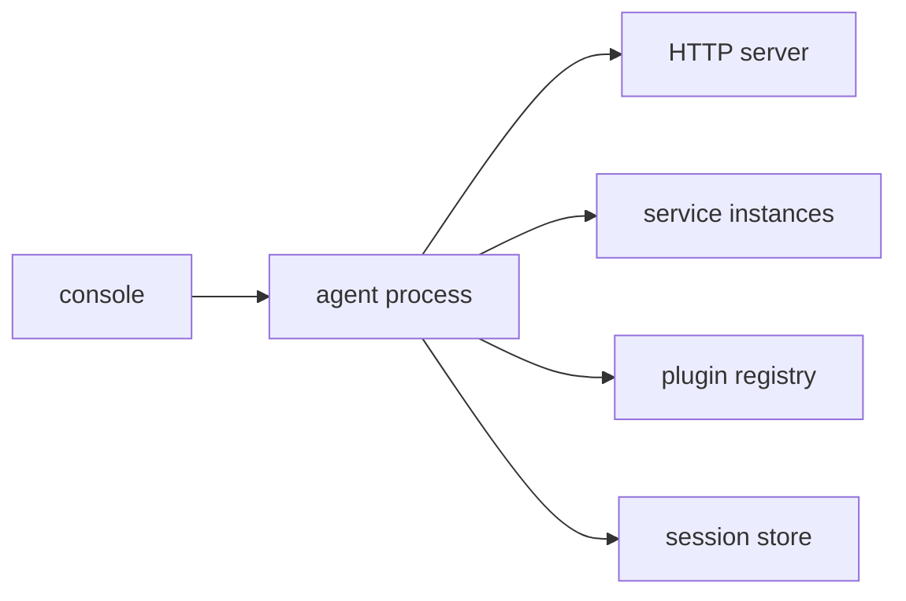
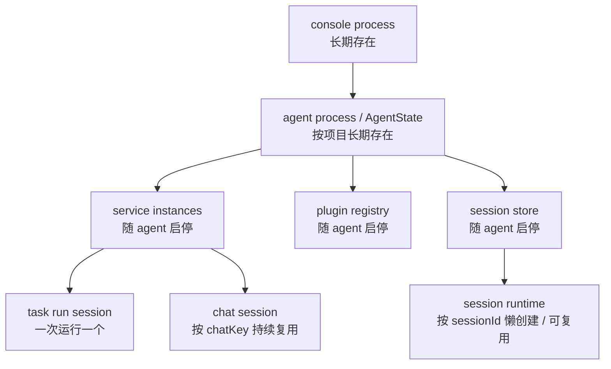
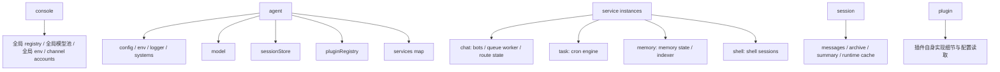
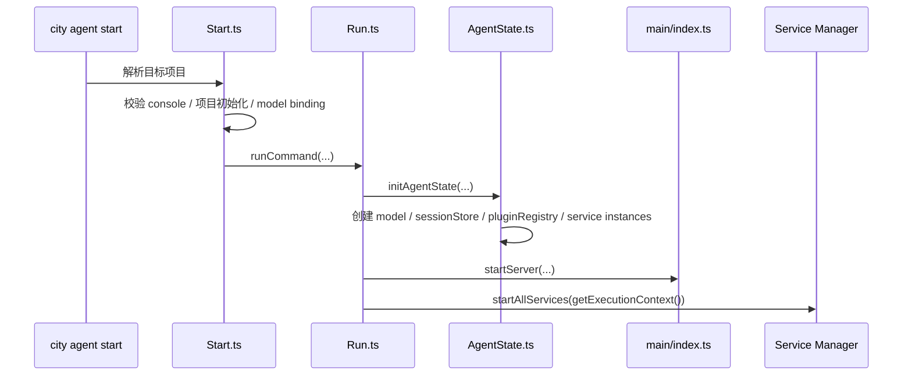
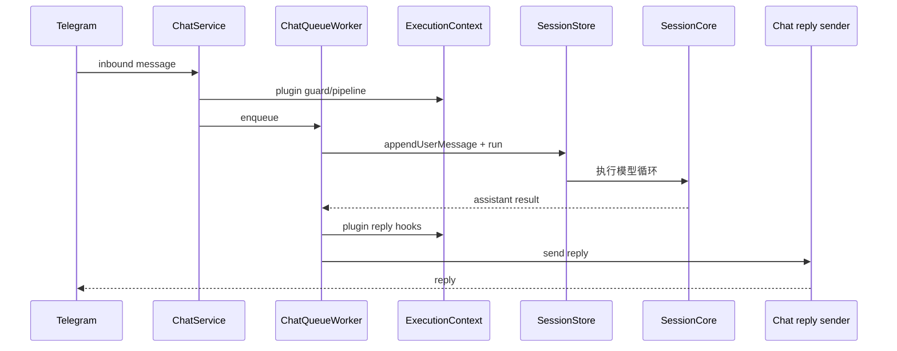

# Downcity 当前架构总览

这份文档只做一件事：

**把 `packages/downcity` 当前已经落地的架构，用一套从上到下的方式讲清楚。**

目标是回答 5 个问题：

1. 现在最大的几个部分是什么
2. 它们的依赖方向是什么
3. 每个部分的生命周期是什么
4. 状态分别属于谁
5. 一次真实请求是怎么穿过整套系统的

---

## 1. 五个主层级

当前实现可以先收敛成 5 个主层级：

```text
main
agent
session
service
plugin
```

它们不是并列关系，而是从上到下的装配关系：



最关键的判断标准：

1. `main` 负责装配和调度，不负责业务执行
2. `agent` 负责承载“这个项目当前进程”的宿主状态
3. `session` 才是真正跑模型循环的执行单元
4. `service` 是业务主流程层
5. `plugin` 只是扩展层，不拥有独立主流程

---

## 2. 一句话心智模型

如果只记一段话，当前实现可以理解成：

```text
console 先把一个 agent 进程拉起来；
agent 在启动时装配 model / session store / plugin registry / service instances；
外部请求进入 agent 后，由对应 service 接住；
需要模型执行时，service 再把任务送入 session；
plugin 只在 service 定义的固定点上参与增强。
```

---

## 3. 从代码目录看主边界

当前核心代码主要分布在这里：

```text
packages/downcity/src/
  main/       # 控制面
  agent/      # 宿主态与 ExecutionContext
  sessions/   # 执行内核
  services/   # 主流程模块
  plugins/    # 扩展模块实现
  types/      # 共享契约
```

对应关键入口：

1. `main/commands/Run.ts`
   - 真正启动 agent 进程
2. `agent/AgentState.ts`
   - 初始化 agent 宿主态
3. `agent/ExecutionContext.ts`
   - 从 agent 宿主态派生统一执行接口面
4. `sessions/SessionStore.ts`
   - session 执行统一入口
5. `main/registries/ServiceClassRegistry.ts`
   - service class 静态注册表
6. `main/plugin/PluginRegistry.ts`
   - plugin 注册表与 hook 分发

---

## 4. 依赖方向

依赖方向现在应该这样理解：



几个重要限制：

1. `main` 不应该保存业务运行态
2. `plugin` 不应该反向接管 `service`
3. `service` 不能把真正执行主循环又复制一套出来
4. `ExecutionContext` 只是能力接口面，不是第二套宿主

---

## 5. Agent 到底是什么

当前 `agent` 的正确理解是：

**一个项目对应一个 agent 进程；这个进程持有一份宿主态。**

它大致包含：

```text
rootPath
+ config
+ env
+ logger
+ systems
+ model
+ sessionStore
+ pluginRegistry
+ services(Map<string, BaseService>)
```

也就是说，`agent` 不是：

1. 单次执行对象
2. 某个 chat 会话
3. 某个 task run

它是：

1. 当前项目的进程级宿主
2. service/plugin/session 的共同承载层
3. `ExecutionContext` 的来源

---

## 6. Session 到底是什么

当前真正执行的是 `session`。

语义上：

1. 一条 chat 对话是一个 session
2. 一次 task run 也是一个 session

调用方式是：

```ts
runtime.session.run({ sessionId, query })
```

所以当前最准确的拆法是：

1. `agent` = 宿主态
2. `session` = 执行态

---

## 7. ExecutionContext 是什么

`ExecutionContext` 不是一个额外 runtime。

它更接近：

**从 `AgentState` 派生出来的一层统一执行接口面。**

当前它主要暴露：

1. `config`
2. `env`
3. `logger`
4. `systems`
5. `session`
6. `invoke`
7. `plugins`

图示如下：



所以它的定位是：

1. 给 service 暴露统一能力
2. 给 plugin 暴露统一能力
3. 让二者不直接耦合 `AgentState` 内部实现细节

---

## 8. Service 现在是什么

`service` 已经是类实例化架构，不再是模块级单例定义。

当前内建 service：

1. `chat`
2. `task`
3. `memory`
4. `shell`

静态注册入口：

- `main/service/Services.ts`
- `main/registries/ServiceClassRegistry.ts`

现在真正的事实源是：

```ts
export const SERVICE_CLASSES = [
  ChatService,
  TaskService,
  MemoryService,
  ShellService,
];
```

然后在 agent 启动时：

1. 根据 `SERVICE_CLASSES` 创建 per-agent service instances
2. 存到 `agent.services`

这意味着：

1. service 的长期状态属于 service 实例
2. 不是属于 `main`
3. 也不是全局模块单例

---

## 9. Plugin 现在是什么

`plugin` 是被动扩展模块。

当前内建 plugin：

1. `auth`
2. `skill`
3. `voice`

注册链路：

1. `main/plugin/Plugins.ts` 提供内建插件清单
2. `agent/ExecutionContext.ts` 创建 `PluginRegistry`
3. `registerBuiltinPlugins()` 注入内建插件
4. 通过 `ExecutionContext.plugins` 暴露给 service

当前重要结论：

1. plugin 没有独立宿主
2. plugin 没有独立主流程
3. plugin 没有自己的 runtime 概念
4. plugin 只是在固定点做增强或暴露 action

---

## 10. 生命周期图

### 10.1 进程级



### 10.2 对象级生命周期



---

## 11. 状态归属图

这是现在最容易混淆，但也是最关键的一张图：



结论是：

1. console 保存全局控制面状态
2. agent 保存项目级宿主状态
3. service 保存自己的长期实例状态
4. session 保存某次执行或某条会话的执行历史状态
5. plugin 不单独持有一套宿主运行态

---

## 12. Agent 启动时序

当前真实启动主链路：



启动顺序的核心原则：

1. 先让 `AgentState` ready
2. 再让 `ExecutionContext` 可用
3. 再起 HTTP server
4. 最后启动 service 生命周期

---

## 13. 一次真实请求怎么走

这里用“用户发一条 Telegram 消息”举例：



可以看到：

1. chat 渠道层不直接执行模型
2. queue 负责把入站消息变成有序执行流
3. 真正执行发生在 session
4. 回复属于 chat service
5. plugin 只在固定点参与

---

## 14. 当前实现最重要的结论

到这里，当前架构可以收敛成下面 10 条：

1. `main` 是控制面，不是业务运行态容器
2. 一个项目运行时，对应一个 `agent` 进程
3. `AgentState` 是宿主态，不是执行实例
4. `ExecutionContext` 是统一能力视图，不是第二套 runtime
5. `session` 是真正执行 prompt / tools / history 的单位
6. `service` 是主动主流程模块
7. `plugin` 是被动扩展模块
8. service 已经是 class-based，不再是模块级单例表
9. service 的长期状态属于 service 实例
10. plugin 不拥有独立 runtime 概念

---

## 15. 建议阅读顺序

如果接下来要继续改代码，推荐按这个顺序读：

1. [Agent 与 Session 架构](./agent-and-session.md)
2. [Service 与 Plugin 架构](./service-and-plugin.md)
3. [启动与 HTTP/API 装配流程](./startup-and-api-flow.md)
4. [Chat 端到端流程](./chat-end-to-end-flow.md)
5. [Task / Shell / Memory 执行链路](./task-shell-memory-flow.md)
