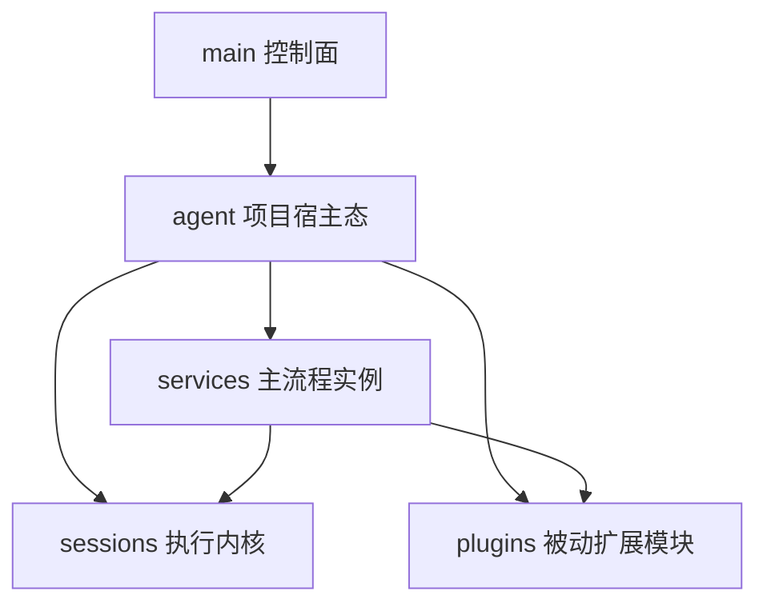
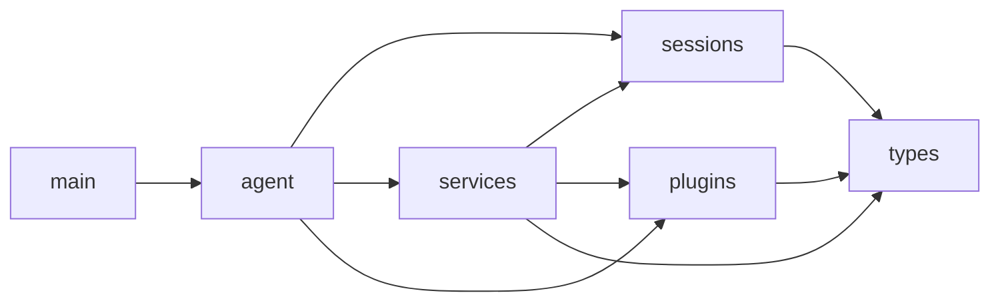
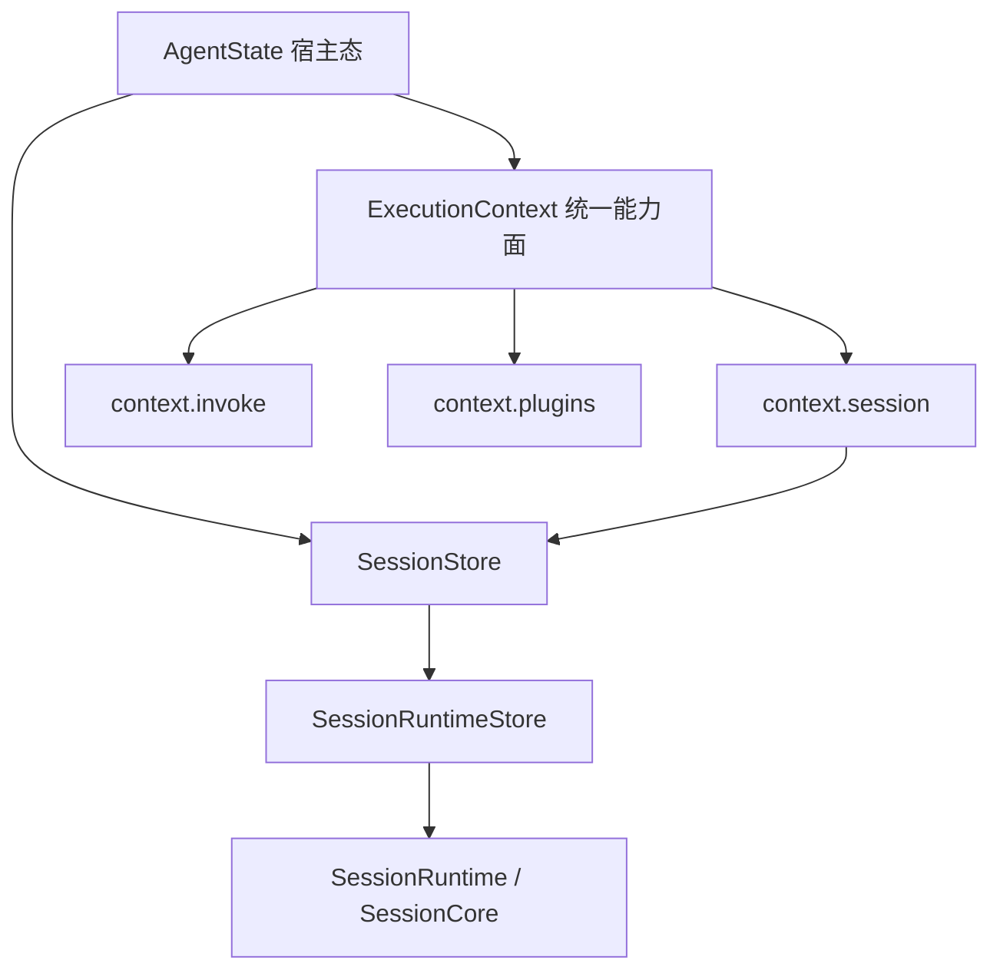
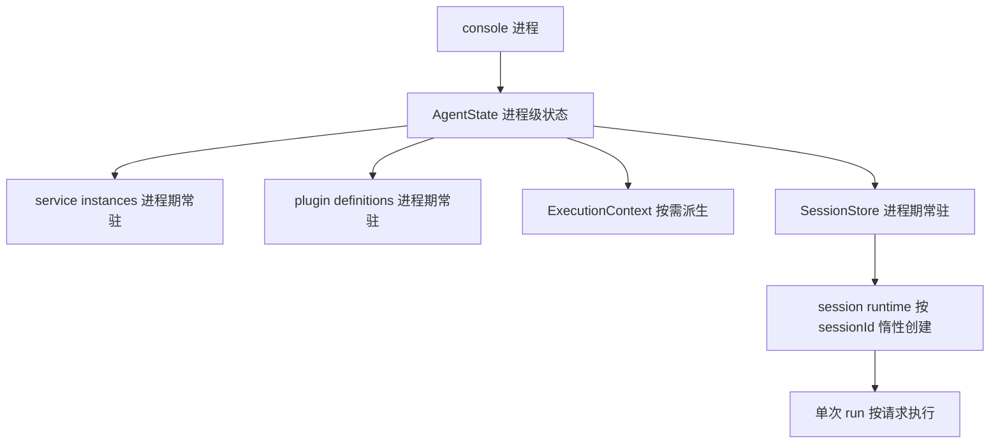
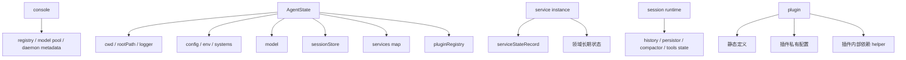
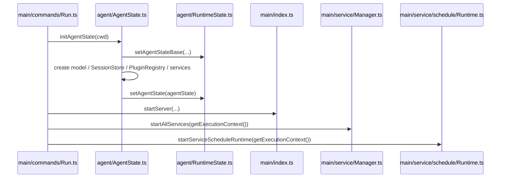
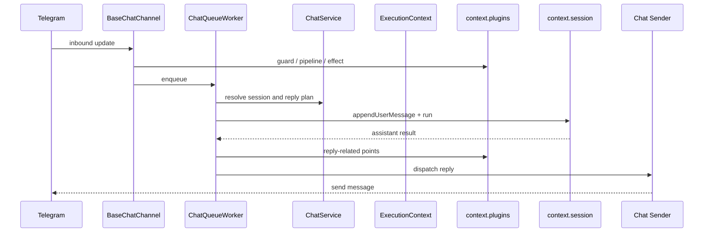

# Downcity 当前架构总览

这份文档只回答 6 个问题：

1. 现在最大的几个部分是什么
2. 它们的依赖方向是什么
3. 每个部分的生命周期是什么
4. 状态分别属于谁
5. 一次真实请求怎么穿过整套系统
6. 当前这套实现最重要的边界约束是什么

---

## 1. 顶层结构

当前 `packages/downcity` 可以先收敛成 5 个主层级：

```text
main
agent
sessions
services
plugins
```

从语义上看，它们不是并列关系，而是自上而下的装配关系：



最核心的判断标准：

1. `main` 负责控制面、启动、CLI、HTTP、UI，不负责业务主执行
2. `agent` 负责持有单个项目进程的宿主状态
3. `sessions` 才是真正执行 prompt / tools / history 的地方
4. `services` 负责主流程和领域状态
5. `plugins` 只在固定扩展点参与，不拥有自己的主流程

---

## 2. 一句话心智模型

当前实现最准确的一句话是：

```text
console 先把一个 agent 进程拉起来；
agent 在启动时装配 model、session store、plugin registry、service instances；
外部请求进入 agent 后，由对应 service 接住；
真正需要模型执行时，再进入某个 session；
plugin 只在 service 预留的固定点上增强流程。
```

也就是说：

1. `session` 才是真正执行单元
2. `service` 是主路径编排者
3. `plugin` 只是增强层
4. `ExecutionContext` 只是统一能力面，不是第二套宿主

---

## 3. 代码目录与依赖方向

当前核心目录：

```text
packages/downcity/src/
  main/       # 控制面
  agent/      # 宿主态与 ExecutionContext 构造
  sessions/   # 执行内核
  services/   # 主流程模块
  plugins/    # 被动扩展模块
  types/      # 共享契约
```

关键入口文件：

1. `main/commands/Run.ts`
2. `agent/AgentState.ts`
3. `agent/ExecutionContext.ts`
4. `sessions/SessionStore.ts`
5. `main/registries/ServiceClassRegistry.ts`
6. `main/plugin/PluginRegistry.ts`

依赖方向应该这样理解：



当前约束：

1. `main` 不应保存业务长期状态
2. `plugin` 不应反向接管 `service`
3. `service` 不应再复制一套 session 主循环
4. `ExecutionContext` 只是接口面，不是第二套 runtime 概念

---

## 4. `AgentState`、`ExecutionContext`、`Session` 的关系

三者的关系现在可以明确成：



正确理解：

1. `AgentState` 保存长期宿主状态
2. `ExecutionContext` 是从 `AgentState` 派生出来的统一能力视图
3. `SessionStore` 和 `SessionRuntimeStore` 负责 session 的创建、缓存与清理
4. 真正的模型执行发生在 `SessionRuntime / SessionCore`

---

## 5. 生命周期图

当前各层生命周期如下：



逐层理解：

1. `console`
   - 生命周期跨多个 agent
2. `AgentState`
   - 从 agent 进程启动到退出
3. `service instances`
   - 随 agent 进程存在
4. `plugin definitions / registry`
   - 随 agent 进程存在
5. `ExecutionContext`
   - 本质上是按需读取或派生的视图
6. `session runtime`
   - 按 `sessionId` 惰性创建，可被 clear
7. 单次 `session.run()`
   - 只覆盖当前一次执行

---

## 6. 状态归属图

当前状态归属应该这样看：



最关键的归属规则：

1. 项目级宿主状态属于 `AgentState`
2. service 生命周期状态属于各自 service instance
3. session 历史与执行缓存属于 session runtime
4. plugin 不拥有一套独立“平台级运行态”
5. plugin 依赖与资产应内聚在 plugin 自己的实现内部

---

## 7. 从启动开始的顺序

agent 真正启动时，主链路是：



这个顺序的关键点：

1. 先有 `AgentState`
2. 再有 `ExecutionContext`
3. 再启动 HTTP server 与 services
4. service schedule runtime 仍属于控制面调度设施，不是某个 plugin 或 session

---

## 8. 从 Telegram 消息到回复的顺序

当前一条 chat 请求的总链路可以概括成：



这里最值得记住的是：

1. 渠道适配器不直接跑模型
2. `ChatQueueWorker` 是 chat 主执行链的协调者
3. 真正执行仍然发生在 `session`
4. 回复策略属于 `chat service`
5. plugin 只在固定点增强

---

## 9. 当前设计的硬边界

现在这套实现已经比较清晰的边界是：

1. `main`
   - 只做控制面与装配
2. `agent`
   - 只做项目级宿主状态承载
3. `ExecutionContext`
   - 只做统一能力暴露
4. `session`
   - 只做真正执行
5. `service`
   - 负责主路径、状态与编排
6. `plugin`
   - 负责被动增强与显式 plugin action

因此：

1. 不需要额外的 plugin 宿主概念
2. 不需要把 plugin asset 暴露到 `AgentState` 或 `ExecutionContext`
3. service 间协作优先走 `context.invoke`
4. plugin 获取 agent 相关能力时，直接通过 `ExecutionContext`

---

## 10. 推荐阅读顺序

如果要继续往下看，建议顺序是：

1. `agent-and-session.md`
2. `service-and-plugin.md`
3. `chat-end-to-end-flow.md`
4. `startup-and-api-flow.md`
5. `task-shell-memory-flow.md`
