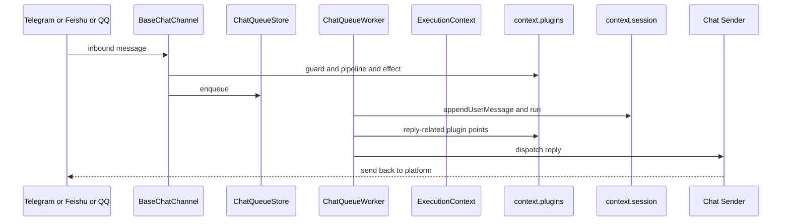

# Downcity Chat 端到端流程

这份文档只解释一件事：

**一条 chat 消息现在是怎么从渠道进入，到 session 执行，再回到渠道的。**

---

## 1. 总流程图



---

## 2. 渠道接入层

当前平台适配器包括：

1. `services/chat/channels/telegram/*`
2. `services/chat/channels/feishu/*`
3. `services/chat/channels/qq/*`

它们统一收敛到：

- `services/chat/channels/BaseChatChannel.ts`

这意味着：

1. 各平台可以各自解析消息
2. 但入站增强、鉴权、session 解析、入队动作会被收敛到统一主链

---

## 3. 入站阶段发生什么

`BaseChatChannel` 当前负责：

1. 计算 `chatKey`
2. 观测入站主体
3. 调鉴权 guard
4. 解析和增强入站文本与附件
5. 解析或创建 `sessionId`
6. 写 history / meta / ingress
7. 触发 `prepareChatEnqueue()`
8. 调 `enqueueChatQueue()` 入队

边界很清楚：

1. 渠道层不直接执行模型
2. 渠道层只负责把消息整理并送入 queue

---

## 4. queue 阶段发生什么

主执行器是：

- `services/chat/runtime/ChatQueueWorker.ts`

它负责：

1. 监听 queue lane
2. 同 lane 串行执行
3. 启动前消息合并
4. 通过 `ChatQueueSessionBridge` 处理 session 消息桥接
5. 调 `context.session.run()` 执行
6. 处理 assistant 输出
7. 发送回复

所以 chat service 的主执行中枢其实是 `ChatQueueWorker`。

---

## 5. plugin 在 chat 流程里怎么参与

### 入队前

主要经过：

1. `prepareChatEnqueue()`
2. `emitChatEnqueueEffect()`

### 回复前后

主要经过：

1. `prepareChatReplyText()`
2. `emitChatReplyEffect()`

也就是说：

1. plugin 只在固定点增强 chat 流程
2. plugin 不直接控制 queue
3. plugin 也不直接控制 session 生命周期

---

## 6. session 执行阶段

`ChatQueueWorker` 与 session 之间有一层薄桥接：

- `services/chat/runtime/ChatQueueSessionBridge.ts`

它负责：

1. 是否补写 ingress 到 session
2. step 合并时如何构造用户消息
3. 运行失败时如何补写 assistant error
4. 运行完成后如何补写最终 assistant 与 deferred user messages

之后主链才进入：

```ts
context.session.run({ sessionId, query })
```

再继续进入：

1. `SessionStore`
2. `SessionRuntimeStore`
3. `SessionRuntime`
4. `SessionCore`

真正的 prompt、工具、模型调用，都在这条链里完成。

---

## 7. 回复阶段

session 返回结果后，`ChatQueueWorker` 会：

1. 提取用户可见文本
2. 走 `prepareChatReplyText()`
3. 解析 reply target
4. 调 sender 回发到平台
5. 走 `emitChatReplyEffect()`

边界很清楚：

1. session 负责产出结果
2. chat service 负责如何发送
3. plugin 只能在固定点增强

---

## 8. 当前这条链最值得记住的结论

1. 渠道适配器不直接执行模型
2. chat queue 把入站流量变成有序执行流
3. 真正执行仍然发生在 session
4. 回复策略属于 chat service
5. plugin 只是增强，不是主流程控制器
