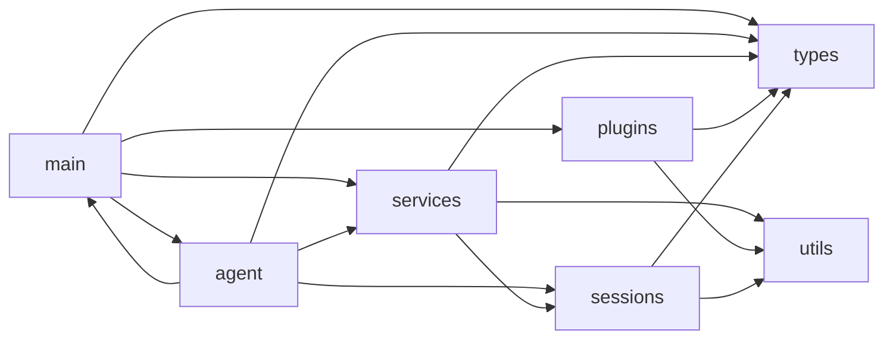

# Downcity 文件结构与模块职责

这份文档只回答两个问题：

1. `packages/downcity/src` 现在按什么层次组织
2. 这些模块之间的依赖方向是什么

---

## 1. 顶层目录

当前核心代码位于：

```text
packages/downcity/src/
  agent/
  main/
  sessions/
  services/
  plugins/
  types/
  utils/
```

推荐从上到下理解：

1. `main`
   - 控制面、启动、静态装配
2. `agent`
   - 进程级宿主状态与 execution runtime 构造
3. `sessions`
   - 执行内核
4. `services`
   - 主流程与平台工作流
5. `plugins`
   - 被动扩展模块
6. `types`
   - 共享类型契约
7. `utils`
   - 通用工具和基础设施

---

## 2. `agent/`

```text
agent/
  AgentRuntime.ts
  ExecutionRuntime.ts
  RuntimeState.ts
```

职责：

1. `AgentRuntime.ts`
   - 启动装配入口
   - 热重载协调
   - 对外公共导出
2. `RuntimeState.ts`
   - 保存宿主状态与 execution model
3. `ExecutionRuntime.ts`
   - 从宿主状态派生统一执行上下文
   - 装配 session port、service invoke port、plugin port

---

## 3. `main/`

```text
main/
  commands/
  constants/
  daemon/
  env/
  model/
  plugin/
  project/
  routes/
  runtime/
  service/
  ui/
  index.ts
```

职责分组：

1. 控制面
   - `commands/`
   - `daemon/`
   - `runtime/`
   - `routes/`
   - `ui/`
2. 静态装配面
   - `env/`
   - `model/`
   - `service/`
   - `plugin/`
   - `project/`

关键文件：

- `main/commands/Run.ts`
- `main/commands/Model.ts`
- `main/commands/ModelCreateCommand.ts`
- `main/commands/ModelReadCommand.ts`
- `main/commands/ModelManageCommand.ts`
- `main/commands/ModelCommandShared.ts`
- `main/index.ts`
- `main/service/Manager.ts`
- `main/service/RuntimeController.ts`
- `main/service/ServiceActionRunner.ts`
- `main/service/ServiceActionApi.ts`
- `main/service/Services.ts`
- `main/service/ServiceSystemProviders.ts`
- `main/plugin/PluginRegistry.ts`
- `main/plugin/Plugins.ts`

`main/service/` 现在进一步分成四层：

```text
main/service/
  Manager.ts
  RuntimeController.ts
  ServiceActionRunner.ts
  ServiceActionApi.ts
  ServiceSystemProviders.ts
  Services.ts
  schedule/
```

分别负责：

1. `Manager.ts`
   - 门面导出
   - 对外保持稳定入口
2. `RuntimeController.ts`
   - service runtime record
   - `start / stop / restart / status`
   - runtime snapshot
3. `ServiceActionRunner.ts`
   - `runServiceCommand`
   - action 执行
   - 调度任务落盘
4. `ServiceActionApi.ts`
   - `/service/<service>/<action>` route 注册
   - API payload -> action input 映射
5. `ServiceSystemProviders.ts`
   - 静态 service system provider 清单
   - 避免 prompt system 反向依赖完整 service instance

`main/commands/` 中，`city console model` 相关命令也已经拆成更清晰的控制面结构：

```text
main/commands/
  Model.ts
  ModelCreateCommand.ts
  ModelReadCommand.ts
  ModelManageCommand.ts
  ModelCommandShared.ts
  ModelSupport.ts
```

分别负责：

1. `Model.ts`
   - `city console model` 命令组入口
   - 只负责子命令装配
2. `ModelCreateCommand.ts`
   - 交互式 `create` 流程
   - 负责 provider/model 的向导式创建
3. `ModelReadCommand.ts`
   - `list/get/discover/use`
   - 负责读取、发现与项目 primary model 绑定
4. `ModelManageCommand.ts`
   - `add/pause/remove/update/test`
   - 负责写入类与联通性测试类命令
5. `ModelCommandShared.ts`
   - provider 类型校验
   - option 解析
   - store 命令统一错误输出
6. `ModelSupport.ts`
   - provider discover
   - projectRoot / downcity.json 写入等辅助逻辑

---

## 4. `sessions/`

```text
sessions/
  RequestContext.ts
  SessionCore.ts
  SessionId.ts
  SessionRegistry.ts
  SessionRuntime.ts
  SessionRuntimeRegistry.ts
  components/
  helpers/
  prompts/
  runtime/
  tools/
```

职责：

1. `SessionRegistry`
   - 统一 session 入口
2. `SessionRuntimeRegistry`
   - 管理 `sessionId -> runtime/persistor`
3. `SessionRuntime`
   - 组装一次会话执行所需依赖
4. `SessionCore`
   - 实际模型执行内核
5. `runtime/*`
   - persistor / compactor / orchestrator 等底层能力
6. `prompts/*`
   - prompt 系统
7. `tools/*`
   - session 可用工具

---

## 5. `services/`

当前内建 service：

```text
services/
  chat/
  memory/
  shell/
  task/
```

由 `main/service/Services.ts` 静态聚合。

当前 service 目录推荐结构：

```text
<service>/
  Index.ts
  <Domain>Service.ts
  Action.ts
  runtime/
  types/
  PROMPT*.txt
```

角色：

1. `chat`
   - 渠道接入、队列、session 路由、回复分发
2. `task`
   - task 调度、run 执行、run 文件落盘
3. `memory`
   - 记忆写入、检索、flush、system 提供
4. `shell`
   - shell session 生命周期管理

其中 `chat/` 现在已经拆成更清晰的类化结构：

```text
services/chat/
  Index.ts
  ChatService.ts
  Action.ts
  runtime/
    ChatServiceActions.ts
    ChatServiceSystem.ts
    ChatChannelCore.ts
    ChatChannelLifecycle.ts
    ChatChannelConfig.ts
    ChatChannelActions.ts
    ChatChannelRuntime.ts
    ChatActionInput.ts
    ChatActionExecution.ts
    ChatQueueSessionBridge.ts
    ChatQueueWorkerSupport.ts
    ChatQueueReplyDispatch.ts
    ChatQueueWorker.ts
    ...
  channels/
    telegram/
      Bot.ts
      TelegramPlatformClient.ts
      TelegramInbound.ts
    feishu/
      Feishu.ts
      FeishuPlatformClient.ts
      FeishuInbound.ts
    qq/
      QQ.ts
      QQGatewayClient.ts
      QQInbound.ts
      QQEventCapture.ts
      QQSendSupport.ts
  types/
```

这表示：

1. `ChatService.ts`
   - 实例入口
   - 持有 `channelState`
   - 持有 `queueWorker`
   - 管理 lifecycle
2. `runtime/ChatServiceActions.ts`
   - 装配 chat 的 action 注册表
   - 把 CLI/API/execute 绑定到各个 runtime 模块
3. `runtime/ChatServiceSystem.ts`
   - 组装 chat system prompt
4. `runtime/ChatChannelCore.ts`
   - 渠道名、channel account、基础 state helper
5. `runtime/ChatChannelLifecycle.ts`
   - 管理渠道 bot 生命周期
6. `runtime/ChatChannelConfig.ts`
   - 状态快照、配置摘要、config patch、downcity.json 落盘
7. `runtime/ChatChannelActions.ts`
   - status/test/reconnect/open/close/configuration/configure 等 action 执行
8. `runtime/ChatChannelRuntime.ts`
   - chat channel 子模块门面导出
9. `runtime/ChatActionInput.ts`
   - 处理 CLI/API 输入映射与参数校验
10. `runtime/ChatActionExecution.ts`
   - 执行 list/info/history/send/react/delete 等 action
11. `runtime/ChatQueueSessionBridge.ts`
   - 处理 queue worker 与 session port 的桥接细节
   - 统一 ingress/error/result 的 session 写入协议
12. `runtime/ChatQueueWorkerSupport.ts`
   - burst merge、错误文本、worker config 归一化等辅助能力
13. `runtime/ChatQueueReplyDispatch.ts`
   - direct/fallback 回复分发
14. `runtime/ChatQueueWorker.ts`
   - chat queue 的实际消费执行器
   - 现在由 `ChatService` 生命周期负责创建与销毁
15. `channels/qq/QQ.ts`
   - QQ 渠道门面
   - 只保留授权、命令处理、入站编排与消息入队
16. `channels/qq/QQGatewayClient.ts`
   - QQ 鉴权、WS、心跳、重连与消息回发
17. `channels/qq/QQInbound.ts`
   - QQ 文本清洗、作者识别、标题解析、附件归一化
18. `channels/qq/QQEventCapture.ts`
   - QQ 原始 Gateway 事件落盘调试
19. `channels/qq/QQSendSupport.ts`
   - QQ 回发重试与错误归因辅助
20. `channels/feishu/Feishu.ts`
   - Feishu 渠道门面
   - 只保留授权、命令处理、入站编排与消息入队
21. `channels/feishu/FeishuPlatformClient.ts`
   - Feishu SDK、token、Open API 查询、附件上传下载、消息发送
22. `channels/feishu/FeishuInbound.ts`
   - Feishu 发送者身份提取、群聊判定、@mention 清理
23. `channels/telegram/Bot.ts`
   - Telegram 渠道门面
   - 只保留授权、命令处理、入站编排与消息入队
24. `channels/telegram/TelegramPlatformClient.ts`
   - Telegram polling、runtime snapshot、webhook 清理、自愈重试、消息发送
25. `channels/telegram/TelegramInbound.ts`
   - Telegram chatKey、audit 文本、messageId 解析、mention 清理、附件保存

`task/` 也已经进入同样的类化结构：

```text
services/task/
  Index.ts
  TaskService.ts
  Action.ts
  Scheduler.ts
  runtime/
    TaskServiceActions.ts
    TaskServiceSystem.ts
    TaskActionInput.ts
    TaskActionExecution.ts
    TaskRunnerProgress.ts
    TaskRunnerSession.ts
    TaskRunnerRound.ts
    Runner.ts
    CronRuntime.ts
    CronTrigger.ts
    ...
  types/
```

这表示：

1. `TaskService.ts`
   - 实例入口
   - 持有 `cronEngine`
   - 管理 task lifecycle
2. `runtime/TaskServiceActions.ts`
   - 装配 task action 注册表
3. `runtime/TaskServiceSystem.ts`
   - 提供 task service system prompt
4. `runtime/TaskActionInput.ts`
   - 处理 CLI/API 输入映射
5. `runtime/TaskActionExecution.ts`
   - 处理 create/update/delete/run/list 等 task action
   - 负责任务变更后的 scheduler reload 协调
6. `runtime/TaskRunnerProgress.ts`
   - progress 快照写入与文本摘要辅助
7. `runtime/TaskRunnerSession.ts`
   - task 专用 session runtime 与 messages.jsonl 落盘
8. `runtime/TaskRunnerRound.ts`
   - agent/script 单轮执行、输出提取、模拟用户判定
9. `runtime/Runner.ts`
   - task run 的主编排链
   - 组装多轮执行状态并写入最终 run 产物
10. `Scheduler.ts` 与 `runtime/CronRuntime.ts`
   - 负责 cron job 注册与重载

---

## 6. `plugins/`

当前内建 plugin：

```text
plugins/
  auth/
  skill/
  voice/
```

由 `main/plugin/Plugins.ts` 聚合注册。

统一结构：

```text
<plugin>/
  Plugin.ts
  Action.ts
  runtime/
  Config.ts
  PROMPT.txt
```

角色：

1. `auth`
   - 授权与角色策略
2. `skill`
   - skill 发现、读取、提示拼装
3. `voice`
   - 语音依赖与转写

---

## 7. `types/`

`types/` 是共享契约层。

代表类型：

- `ExecutionRuntime.ts`
- `DowncityConfig.ts`
- `FeishuChannel.ts`
- `Plugin.ts`
- `Service.ts`
- `Services.ts`
- `SessionMessage.ts`
- `SessionRun.ts`
- `Store.ts`

作用：

1. 统一跨层数据结构
2. 防止类型重新散落到业务目录
3. `Service.ts` 现在是 service 共享契约的单一事实源

---

## 8. `utils/`

```text
utils/
  cli/
  logger/
  storage/
  store/
  Time.ts
```

作用：

1. logger
2. store
3. CLI 基础工具
4. 时间与存储工具

其中 `utils/store/` 现在已经拆成：

```text
utils/store/
  index.ts
  StoreSchema.ts
  StoreModelRepository.ts
  StoreSecureSettings.ts
  StoreEnvRepository.ts
  StoreChannelAccountRepository.ts
  StoreShared.ts
  crypto.ts
  schema.ts
```

这表示：

1. `store/index.ts`
   - `ConsoleStore` 门面
   - 对外保持单一入口
2. `store/StoreSchema.ts`
   - 建表与轻量迁移
3. `store/StoreModelRepository.ts`
   - provider/model 读写
4. `store/StoreSecureSettings.ts`
   - console/agent 加密配置
5. `store/StoreEnvRepository.ts`
   - global/agent env 单表读写
6. `store/StoreChannelAccountRepository.ts`
   - 渠道账号读写与敏感字段加解密
7. `store/StoreShared.ts`
   - store 内部共享类型与纯工具

---

## 9. 当前依赖方向



需要明确：

1. 概念上 `main` 在上、`agent` 在下
2. 代码实现上，`agent` 仍会依赖部分 `main` 装配能力
3. `services` 不直接依赖 `main/service/Manager.ts`，只依赖 `ExecutionRuntime`
4. `main/service` 是控制面，不是 service 实例状态归属地
5. 真正长期状态应放在 `agent` 宿主持有的 service instance 内
