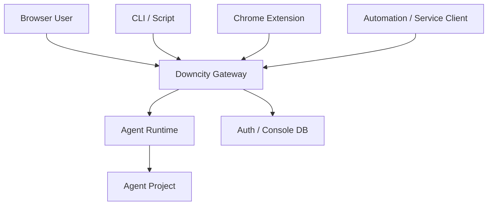
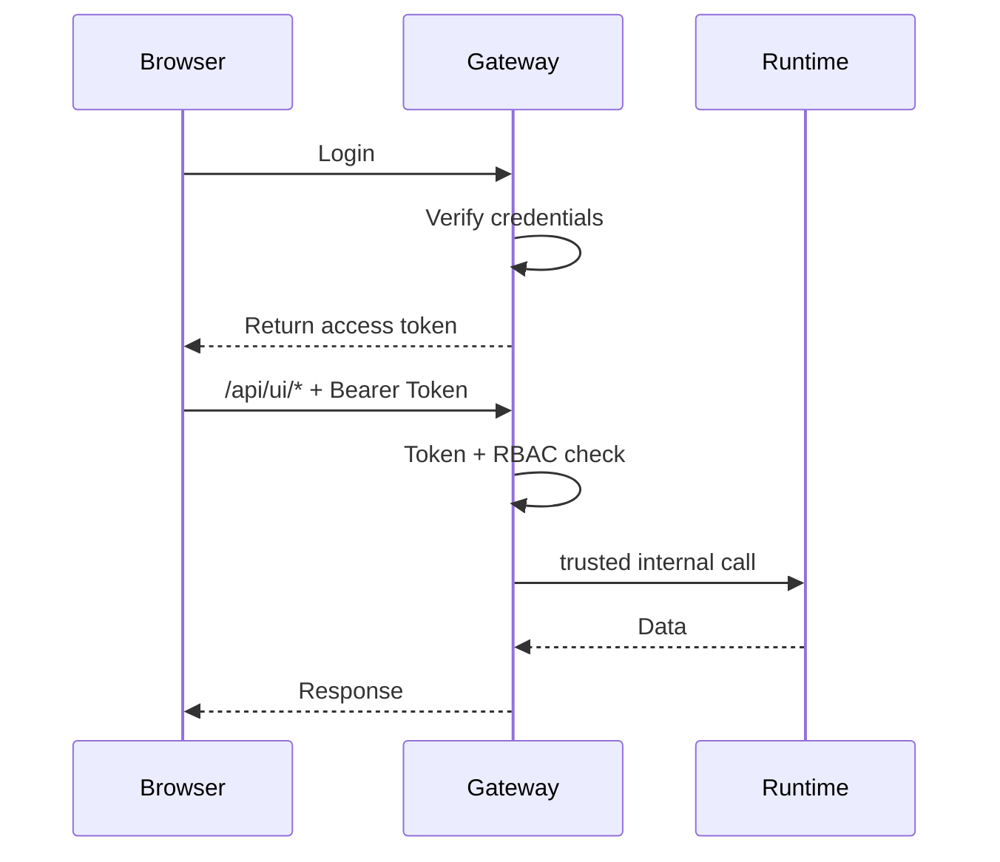
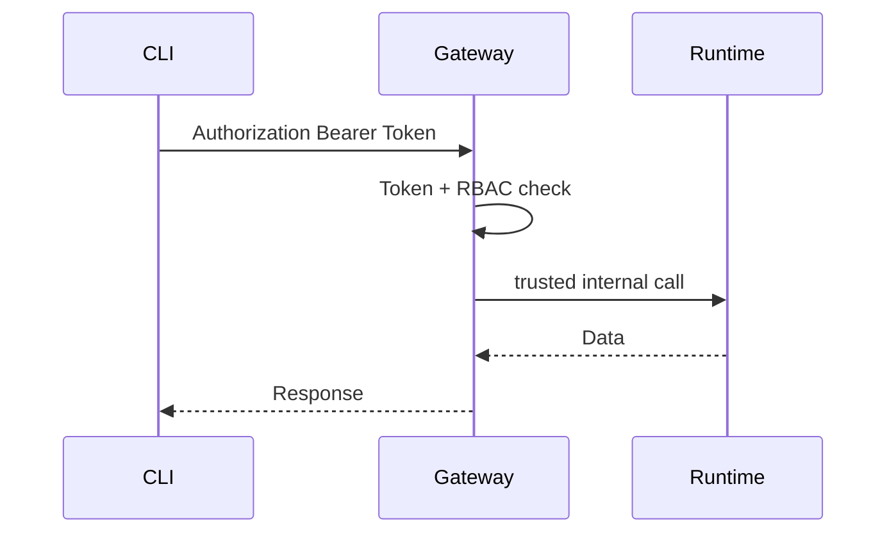
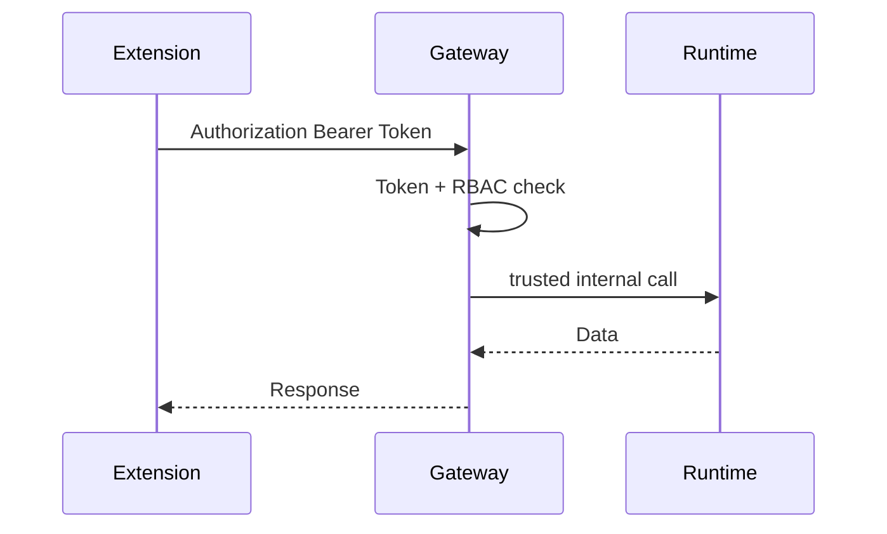

# Downcity 统一账户系统架构设计稿

这份文档描述的是 `packages/downcity` 面向“服务器部署 + 本地客户端接入”的统一账户系统设计。

本文刻意避免把认证架构写成多套平行方案，而是统一收敛成一个单一体系：

1. 一个账户系统
2. 一个登录入口
3. 一套用户身份源
4. 一种统一的 Bearer Token 访问方式

目标不是给当前实现打补丁，而是直接建立后续可扩展的安全基线。

本文回答 10 个问题：

1. 为什么不能继续使用“本地裸露控制面”
2. 目标部署形态是什么
3. 最终采用什么统一认证模型
4. 管理员账户和普通账户如何设计
5. CLI / Chrome Extension / 自动化如何接入
6. 权限模型如何拆分
7. 需要哪些数据表
8. 需要新增哪些模块和文件
9. 推荐按什么顺序实施
10. 后续如果系统继续演进，应该如何扩展

---

## 1. 设计结论

正式方案统一采用“账户系统 + Bearer Token”。

也就是说：

1. 所有外部调用都归属于某个用户账户
2. 用户通过登录获得访问 token
3. 浏览器、CLI、Chrome Extension、自动化脚本统一使用 `Authorization: Bearer <token>`
4. 先不把系统拆成多套认证方案

当前阶段的核心结论只有一句：

```text
Downcity 使用统一账户系统作为唯一身份源，所有受保护 API 都通过该账户系统签发的 Bearer Token 访问。
```

这套方案的优势是：

1. 概念足够简单
2. 接入方式统一
3. 能先快速收口现有裸露控制面
4. 后续仍可在内部演进，而不影响外部接入模型

---

## 2. 目标部署形态

目标部署不再假设所有调用都来自同一台机器。

未来建议的拓扑如下：



职责划分：

1. `Gateway`
   - 负责登录、token 校验、权限判断、审计
   - 是唯一建议暴露到公网或团队网络的入口
2. `Runtime`
   - 负责 agent 执行、service、session、task、shell 等运行时逻辑
   - 默认不直接暴露公网
3. `Auth DB`
   - 存储用户、角色、token、审计日志

核心原则：

1. Runtime 不应直接面向公网
2. Gateway 才是外部访问入口
3. 所有控制面 API 必须先经过 Gateway 的鉴权与授权

---

## 3. 统一认证模型

统一认证模型分成两步：

1. 用户登录
2. 使用该用户签发的 Bearer Token 访问受保护接口

无论调用方是谁，外部接口层都只认一件事：

1. token 是否有效
2. token 属于哪个用户
3. 用户是否有权限访问目标资源

### 3.1 登录

登录接口职责：

1. 校验用户名和密码
2. 返回访问 token
3. 记录登录时间与审计信息

### 3.2 访问

访问接口职责：

1. 从 `Authorization` 头读取 Bearer Token
2. 查 token hash
3. 找到所属用户
4. 做角色/权限判断
5. 允许或拒绝请求

### 3.3 统一接入对象

这套模型统一覆盖：

1. Console UI
2. CLI
3. Chrome Extension
4. 自动化脚本

因此：

1. Console UI 不单独搞另一套登录语义
2. CLI 不单独搞另一套本地 secret 体系
3. Chrome Extension 不单独搞另一套 app credential 体系

它们都只是“统一账户系统”的不同客户端。

---

## 4. 为什么不把客户端也设计成公钥/私钥

统一账户系统架构里，客户端不需要直接维护密钥对。

原因：

1. 浏览器不适合持有私钥
2. Chrome Extension 持有私钥风险过高
3. CLI 的密钥分发、轮换、吊销成本高
4. 当前最需要先解决的是“统一身份和访问控制”，不是“复杂签名体系”

因此，当前正式设计只保留：

1. 账户
2. 密码登录
3. Bearer Token

如果未来内部服务拆分严重，再考虑把“服务间调用”升级成签名 token。

---

## 5. 账户与管理员模型

### 5.1 用户类型

建议至少支持：

1. `admin`
2. `operator`
3. `viewer`

### 5.2 管理员账户

管理员账户是必须的。

管理员能力包括：

1. 用户管理
2. 角色分配
3. env 管理
4. model 管理
5. channel account 管理
6. auth 配置管理
7. shell 执行
8. agent 生命周期控制

### 5.3 推荐初始化方式

建议增加 bootstrap 流程：

1. 首次部署执行 `city auth bootstrap-admin`
2. 写入首个管理员账户
3. 关闭匿名初始化入口

---

## 6. Token 模型

V1 先只保留一种访问 token。

统一约定：

1. 登录成功后签发访问 token
2. 所有客户端都用这类 token
3. 服务端只保存 token hash
4. 明文 token 只在签发时返回一次

建议字段：

1. token id
2. user id
3. token hash
4. name
5. expires at
6. revoked at
7. last used at
8. created at

V1 不强制区分：

1. Web Session
2. PAT
3. Service Token

这些概念如果以后需要，可以在统一 token 模型之上扩展，而不是现在就拆开。

---

## 7. 授权模型

授权采用 RBAC + Scope 的组合。

### 7.1 角色

默认角色：

1. `admin`
2. `operator`
3. `viewer`

### 7.2 Scope

建议第一批 scope：

1. `agent.read`
2. `agent.write`
3. `agent.execute`
4. `service.read`
5. `service.write`
6. `task.read`
7. `task.run`
8. `model.read`
9. `model.write`
10. `env.read`
11. `env.write`
12. `channel.read`
13. `channel.write`
14. `auth.read`
15. `auth.write`
16. `shell.execute`
17. `plugin.read`
18. `plugin.write`
19. `session.read`
20. `session.write`

### 7.3 资源分级

建议把接口按资源归类：

1. `agent`
2. `model`
3. `env`
4. `channel`
5. `authorization`
6. `session`
7. `task`
8. `service`
9. `plugin`
10. `shell`

### 7.4 规则

建议规则如下：

1. 所有写操作默认拒绝
2. 高危读操作也要求显式 scope
3. `env.read` 默认返回脱敏值
4. `shell.execute` 只允许 `admin`

---

## 8. 请求流设计

### 8.1 浏览器 Console UI



### 8.2 CLI / Script



### 8.3 Chrome Extension



---

## 9. 数据模型

建议新增或抽象出以下表。

### 9.1 身份表

1. `auth_users`

建议字段：

1. `id`
2. `username`
3. `password_hash`
4. `status`
5. `created_at`
6. `updated_at`

### 9.2 角色与权限表

1. `auth_roles`
2. `auth_permissions`
3. `auth_role_permissions`
4. `auth_user_roles`

### 9.3 Token 表

1. `auth_tokens`

建议字段：

1. `id`
2. `name`
3. `token_hash`
4. `user_id`
5. `scopes_json`
6. `last_used_at`
7. `expires_at`
8. `revoked_at`
9. `created_at`
10. `updated_at`

### 9.4 审计表

1. `auth_audit_logs`

建议记录：

1. actor
2. actor type
3. target resource
4. action
5. request id
6. result
7. ip
8. user agent
9. created at

---

## 10. 路由保护策略

路由分成 3 类：

1. `public`
2. `token-auth`
3. `internal-trusted`

### 10.1 Public

仅允许：

1. `/health`
2. 必要静态资源
3. 登录相关入口

### 10.2 Token Auth

用于所有外部客户端：

1. Console UI
2. CLI
3. 扩展
4. 自动化

覆盖：

1. `/api/ui/*`
2. `/api/v1/*`

### 10.3 Internal Trusted

用于 Gateway 到 Runtime 的内部转发：

1. Runtime 的执行与控制面接口

关键原则：

1. Gateway 是唯一推荐外部入口
2. Runtime 不再直接对公网暴露
3. 外部统一走 token，内部再根据部署形态决定是否进一步升级签名机制

---

## 11. 模块拆分设计

新的认证域建议集中在 `packages/downcity/src/main/auth/`。

### 11.1 计划新增目录

1. `/Users/wangenius/Documents/github/downcity/packages/downcity/src/main/auth`
2. `/Users/wangenius/Documents/github/downcity/packages/downcity/src/main/auth/routes`
3. `/Users/wangenius/Documents/github/downcity/packages/downcity/src/main/auth/runtime`
4. `/Users/wangenius/Documents/github/downcity/packages/downcity/src/main/auth/token`
5. `/Users/wangenius/Documents/github/downcity/packages/downcity/src/main/auth/policy`
6. `/Users/wangenius/Documents/github/downcity/packages/downcity/src/main/auth/store`
7. `/Users/wangenius/Documents/github/downcity/packages/downcity/src/types/auth`

### 11.2 计划新增文件

1. [AuthService.ts](/Users/wangenius/Documents/github/downcity/packages/downcity/src/main/auth/AuthService.ts)
2. [AuthConfig.ts](/Users/wangenius/Documents/github/downcity/packages/downcity/src/main/auth/AuthConfig.ts)
3. [AuthBootstrap.ts](/Users/wangenius/Documents/github/downcity/packages/downcity/src/main/auth/AuthBootstrap.ts)
4. [AuthMiddleware.ts](/Users/wangenius/Documents/github/downcity/packages/downcity/src/main/auth/AuthMiddleware.ts)
5. [RoutePolicy.ts](/Users/wangenius/Documents/github/downcity/packages/downcity/src/main/auth/policy/RoutePolicy.ts)
6. [PermissionPolicy.ts](/Users/wangenius/Documents/github/downcity/packages/downcity/src/main/auth/policy/PermissionPolicy.ts)
7. [BearerTokenAuth.ts](/Users/wangenius/Documents/github/downcity/packages/downcity/src/main/auth/runtime/BearerTokenAuth.ts)
8. [TokenService.ts](/Users/wangenius/Documents/github/downcity/packages/downcity/src/main/auth/token/TokenService.ts)
9. [AuditLogService.ts](/Users/wangenius/Documents/github/downcity/packages/downcity/src/main/auth/AuditLogService.ts)
10. [AuthRoutes.ts](/Users/wangenius/Documents/github/downcity/packages/downcity/src/main/auth/routes/AuthRoutes.ts)
11. [TokenRoutes.ts](/Users/wangenius/Documents/github/downcity/packages/downcity/src/main/auth/routes/TokenRoutes.ts)
12. [AdminUserRoutes.ts](/Users/wangenius/Documents/github/downcity/packages/downcity/src/main/auth/routes/AdminUserRoutes.ts)
13. [AdminRoleRoutes.ts](/Users/wangenius/Documents/github/downcity/packages/downcity/src/main/auth/routes/AdminRoleRoutes.ts)
14. [AuthStore.ts](/Users/wangenius/Documents/github/downcity/packages/downcity/src/main/auth/store/AuthStore.ts)
15. [AuthSchema.ts](/Users/wangenius/Documents/github/downcity/packages/downcity/src/main/auth/store/AuthSchema.ts)
16. [AuthTypes.ts](/Users/wangenius/Documents/github/downcity/packages/downcity/src/types/auth/AuthTypes.ts)
17. [AuthToken.ts](/Users/wangenius/Documents/github/downcity/packages/downcity/src/types/auth/AuthToken.ts)
18. [AuthPermission.ts](/Users/wangenius/Documents/github/downcity/packages/downcity/src/types/auth/AuthPermission.ts)

### 11.3 计划修改文件

1. [packages/downcity/src/main/index.ts](/Users/wangenius/Documents/github/downcity/packages/downcity/src/main/index.ts)
2. [packages/downcity/src/main/routes/execute.ts](/Users/wangenius/Documents/github/downcity/packages/downcity/src/main/routes/execute.ts)
3. [packages/downcity/src/main/routes/services.ts](/Users/wangenius/Documents/github/downcity/packages/downcity/src/main/routes/services.ts)
4. [packages/downcity/src/main/routes/plugins.ts](/Users/wangenius/Documents/github/downcity/packages/downcity/src/main/routes/plugins.ts)
5. [packages/downcity/src/main/service/ServiceActionApi.ts](/Users/wangenius/Documents/github/downcity/packages/downcity/src/main/service/ServiceActionApi.ts)
6. [packages/downcity/src/main/ui/ConsoleUIGateway.ts](/Users/wangenius/Documents/github/downcity/packages/downcity/src/main/ui/ConsoleUIGateway.ts)
7. [packages/downcity/src/main/ui/ConsoleUIGatewayRoutes.ts](/Users/wangenius/Documents/github/downcity/packages/downcity/src/main/ui/ConsoleUIGatewayRoutes.ts)
8. [packages/downcity/src/main/ui/gateway/Proxy.ts](/Users/wangenius/Documents/github/downcity/packages/downcity/src/main/ui/gateway/Proxy.ts)
9. [packages/downcity/src/main/ui/EnvApiRoutes.ts](/Users/wangenius/Documents/github/downcity/packages/downcity/src/main/ui/EnvApiRoutes.ts)
10. [packages/downcity/src/main/ui/ModelApiRoutes.ts](/Users/wangenius/Documents/github/downcity/packages/downcity/src/main/ui/ModelApiRoutes.ts)
11. [packages/downcity/src/main/ui/ChannelAccountApiRoutes.ts](/Users/wangenius/Documents/github/downcity/packages/downcity/src/main/ui/ChannelAccountApiRoutes.ts)
12. [packages/downcity/src/main/ui/DashboardAuthorizationRoutes.ts](/Users/wangenius/Documents/github/downcity/packages/downcity/src/main/ui/DashboardAuthorizationRoutes.ts)
13. [packages/downcity/src/main/ui/dashboard/SessionRoutes.ts](/Users/wangenius/Documents/github/downcity/packages/downcity/src/main/ui/dashboard/SessionRoutes.ts)
14. [packages/downcity/src/main/ui/dashboard/TaskRoutes.ts](/Users/wangenius/Documents/github/downcity/packages/downcity/src/main/ui/dashboard/TaskRoutes.ts)
15. [packages/downcity/src/main/ui/gateway/AgentActions.ts](/Users/wangenius/Documents/github/downcity/packages/downcity/src/main/ui/gateway/AgentActions.ts)
16. [packages/downcity/src/main/commands/IndexAgentCommand.ts](/Users/wangenius/Documents/github/downcity/packages/downcity/src/main/commands/IndexAgentCommand.ts)
17. [packages/downcity/src/main/commands/Run.ts](/Users/wangenius/Documents/github/downcity/packages/downcity/src/main/commands/Run.ts)
18. [packages/downcity/src/main/commands/UI.ts](/Users/wangenius/Documents/github/downcity/packages/downcity/src/main/commands/UI.ts)
19. [products/console-ui/src/lib/dashboard-api.ts](/Users/wangenius/Documents/github/downcity/products/console-ui/src/lib/dashboard-api.ts)
20. [products/chrome-extension/src/services/http.ts](/Users/wangenius/Documents/github/downcity/products/chrome-extension/src/services/http.ts)
21. [products/chrome-extension/src/services/storage.ts](/Users/wangenius/Documents/github/downcity/products/chrome-extension/src/services/storage.ts)
22. [products/chrome-extension/src/types/extension.ts](/Users/wangenius/Documents/github/downcity/products/chrome-extension/src/types/extension.ts)
23. [products/chrome-extension/src/options/App.tsx](/Users/wangenius/Documents/github/downcity/products/chrome-extension/src/options/App.tsx)

### 11.4 计划新增命令

1. `city auth bootstrap-admin`
2. `city auth login`
3. `city auth token create`
4. `city auth token list`
5. `city auth token revoke`

---

## 12. 存储策略

建议分两阶段：

### 12.1 单机阶段

使用现有 console DB 扩展 auth 表。

适用：

1. 单节点部署
2. 先快速落地账号体系

### 12.2 服务器阶段

切换到 PostgreSQL。

适用：

1. 多实例
2. 团队协作
3. 更正式的审计与运维

建议做法：

1. 先把 `AuthStore` 抽象出来
2. 不在上层业务中直接耦合 SQLite 细节

---

## 13. 安全基线

正式版必须满足：

1. Runtime 默认不公网暴露
2. 所有控制面接口都需要认证
3. 所有敏感写操作都需要授权
4. `env.read` 默认脱敏
5. token 仅保存 hash
6. shell 执行只允许高权限角色
7. 所有管理动作写审计日志
8. 所有敏感配置不允许再使用固定 fallback

---

## 14. 推荐实施顺序

### Phase 1

1. 引入账户系统与管理员 bootstrap
2. 建立统一登录接口
3. 建立统一 Bearer Token
4. 所有 Console UI / API 统一鉴权

### Phase 2

1. CLI 完成 `login` 与 token 管理命令
2. Chrome Extension 改走统一 token
3. 自动化脚本改走统一 token

### Phase 3

1. 上线审计日志
2. 细化 scope
3. 补充用户文档与部署文档

---

## 15. 后续扩展原则

如果未来系统继续演进，也必须遵循“统一账户系统”原则。

允许扩展的方向：

1. token 增加更多类型
2. role 与 scope 继续细化
3. 内部调用增加签名机制

但这些都应被视为：

1. 同一账户系统下的能力增强
2. 而不是引入第二套独立身份体系

---

## 16. 本设计的最终判断

最终正式方案不是：

1. 继续依赖 localhost
2. 每个客户端自己维护密钥对
3. 再并行维护一套“本地 token 体系”和一套“服务器账户体系”

最终正式方案应该是：

1. 账户系统
2. 管理员账户
3. 统一登录
4. 统一 Bearer Token
5. RBAC + Scope
6. 审计日志

这套设计可以同时覆盖：

1. 本地开发
2. 单机部署
3. 服务器部署
4. 后续继续扩展
