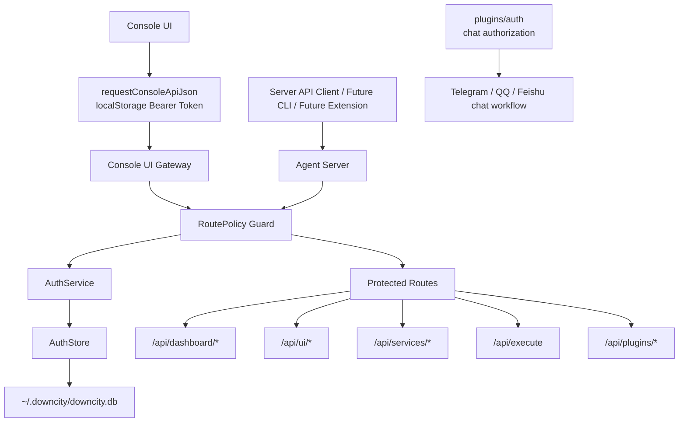
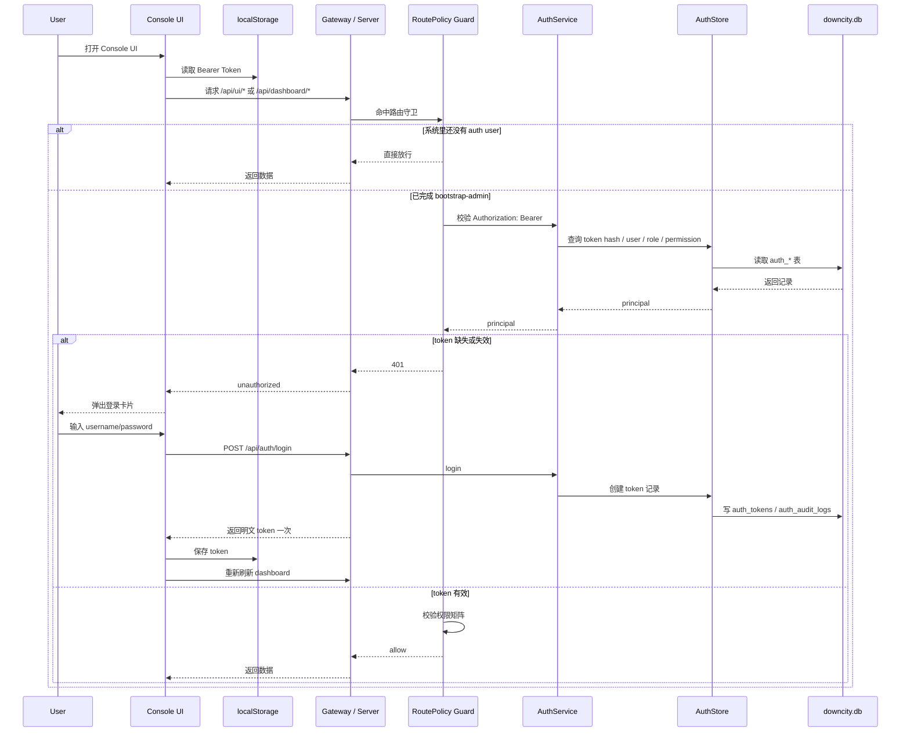

# Downcity 统一账户当前实现状态

这页不是设计稿，而是当前仓库里已经落盘的真实状态说明。

目标只有一个：

1. 把“设计里想做什么”
2. 和“代码里已经做了什么”
3. 以及“下一步还缺什么”

明确分开。

---

## 0. 全链路总览图

### 0.1 分层关系图



### 0.2 当前真实时序



---

## 1. 当前已经落地的部分

### 1.1 数据表

统一账户相关表已经进入 console SQLite schema：

- `auth_users`
- `auth_roles`
- `auth_permissions`
- `auth_user_roles`
- `auth_role_permissions`
- `auth_tokens`
- `auth_audit_logs`

位置：

- `packages/downcity/src/utils/store/StoreSchema.ts`

也就是说，auth 的底层存储已经不是草稿，表结构已经真实建表。

### 1.2 类型与模块目录

统一账户 V1 的基础模块已经建立：

- `packages/downcity/src/types/auth/`
- `packages/downcity/src/main/auth/`

当前主要文件：

- `AuthPermission.ts`
- `AuthTypes.ts`
- `AuthToken.ts`
- `AuthRoute.ts`
- `AuthStore.ts`
- `AuthService.ts`
- `AuthMiddleware.ts`
- `AuthRoutes.ts`
- `RoutePolicy.ts`
- `PasswordHasher.ts`
- `TokenService.ts`

这说明 auth 已经从“设计概念”进入了可运行模块阶段。

### 1.3 已实现 API

当前已经真实可用的接口：

- `POST /api/auth/bootstrap-admin`
- `POST /api/auth/login`
- `GET /api/auth/me`
- `GET /api/auth/token/list`
- `POST /api/auth/token/create`
- `POST /api/auth/token/revoke`

位置：

- `packages/downcity/src/main/auth/AuthRoutes.ts`

当前行为：

- 首个管理员只能 bootstrap 一次
- 登录会签发 Bearer Token
- token 明文只在签发时返回一次
- 服务端只存 token hash
- token 可列出、创建、吊销

### 1.4 已实现 Bearer 鉴权

现在 server 和 console-ui gateway 都已经接入统一路由守卫。

位置：

- `packages/downcity/src/main/index.ts`
- `packages/downcity/src/main/ui/ConsoleUIGateway.ts`
- `packages/downcity/src/main/auth/RoutePolicy.ts`

当前规则：

1. 如果系统里还没有任何 auth user，受保护接口默认放行
2. 一旦完成 `bootstrap-admin`，受保护接口开始要求 Bearer Token
3. 命中权限矩阵的接口会继续做权限校验

这个“bootstrap 前放行”的设计是当前实现里的关键兼容层，用来避免首次部署时把控制面直接锁死。

### 1.5 已接入的权限矩阵

当前已经显式进入路由权限矩阵的接口包括：

- `/api/execute` -> `agent.execute`
- `/api/services/list` -> `service.read`
- `/api/services/control` -> `service.write`
- `/api/services/command` -> `service.write`
- `/api/plugins/list` -> `plugin.read`
- `/api/plugins/availability` -> `plugin.read`
- `/api/plugins/action` -> `plugin.write`
- `/api/dashboard/authorization` -> `auth.read`
- `/api/dashboard/authorization/config` -> `auth.write`
- `/api/dashboard/authorization/action` -> `auth.write`

此外：

- `/api/dashboard/*`
- `/api/ui/*`

已经进入“需要登录”的受保护范围，但其中很多接口还只是粗粒度保护，不是细粒度读写权限。

### 1.6 Console UI 已接入登录态

console-ui 现在已经不再是假定“控制面天然可信”。

当前已实现：

- 请求层自动读取本地 Bearer Token
- 自动注入 `Authorization: Bearer ...`
- 当控制面返回 `401` 时，前端进入登录态
- 登录成功后把 token 落到 localStorage
- 顶栏显示当前登录用户，并支持退出

位置：

- `products/console-ui/src/lib/dashboard-api.ts`
- `products/console-ui/src/hooks/useConsoleDashboard.ts`
- `products/console-ui/src/hooks/dashboard/useDashboardRefresh.ts`
- `products/console-ui/src/components/dashboard/AuthLoginCard.tsx`

---

## 2. 当前真实调用链

### 2.1 Server 侧

当前主链路可以理解为：

```text
Request
  -> logger / cors
  -> route auth guard
  -> 具体 router
  -> auth route / dashboard route / service route / plugin route / execute route
```

其中 auth guard 会做：

1. 看当前 path/method 是否命中 `RoutePolicy`
2. 如果该接口不受保护，直接放行
3. 如果当前系统还没有 auth user，也直接放行
4. 如果已经初始化统一账户，则要求 Bearer Token
5. 若策略声明了权限，则校验 `principal.permissions`

### 2.2 Console UI 侧

当前 console-ui 的真实链路是：

```text
UI action
  -> requestConsoleApiJson
  -> localStorage 中的 Bearer Token
  -> fetch /api/*
  -> 401 时前端切到登录卡片
  -> 登录成功后重试 dashboard refresh
```

也就是说，现在 console-ui 已经和统一账户形成闭环，而不再只是纯匿名控制面。

---

## 3. 当前还没有完成的部分

下面这些是“设计里有，但代码里还没完全收口”的部分。

### 3.1 权限矩阵仍然偏粗

虽然 `/api/ui/*` 和 `/api/dashboard/*` 已经进入保护范围，但目前很多策略仍然只是：

- 已登录即可访问
- 或者使用较粗的 `read` 权限

还没有把所有具体接口拆到足够细，例如：

- `env.read` / `env.write`
- `model.read` / `model.write`
- `channel.read` / `channel.write`
- `session.read` / `session.write`
- `task.read` / `task.run`
- `shell.execute`

### 3.2 CLI 还没有全面接入统一账户

当前已经接上的客户端主要是：

- server API
- console-ui

但 CLI 还没有形成统一登录、token 存储、自动注入的完整体验。

### 3.3 Chrome Extension 还没有接入统一账户

设计目标里提到 Console UI、CLI、Chrome Extension 共用一套 token。

当前 extension 还没有真正接入这条链。

### 3.4 auth 管理面还不完整

现在已完成的是：

- 统一账户 bootstrap
- 登录
- token 管理
- 路由保护

但还没有真正进入：

- 用户管理界面
- 角色管理界面
- 权限管理界面
- 审计日志查询界面

### 3.5 现有聊天授权插件仍然并存

仓库里本来就有一套“聊天用户授权”体系：

- `packages/downcity/src/plugins/auth/`

它解决的是“聊天渠道里谁能和 agent 说话”的问题。

当前新落地的统一账户解决的是：

- 谁能访问控制面 API
- 谁能调用 runtime 管理接口

这两套 auth 现在是并存关系，不是同一套系统。

所以当前必须明确区分：

1. `plugins/auth`
   - chat authorization
   - 面向 Telegram / QQ / Feishu 的聊天用户授权
2. `main/auth`
   - unified account auth
   - 面向 console / server / UI / API client 的统一账户

---

## 4. 当前推荐认知模型

如果你现在要继续做 auth，建议用下面这个模型理解：

### 4.1 统一账户层

负责：

- 管理员 bootstrap
- 登录
- Bearer Token
- 控制面 API 鉴权
- 路由权限矩阵

代码目录：

- `packages/downcity/src/main/auth/`

### 4.2 聊天授权层

负责：

- 渠道用户观测
- 角色绑定
- 权限组判断
- 是否允许消息进入 chat workflow

代码目录：

- `packages/downcity/src/plugins/auth/`

### 4.3 当前系统状态

所以现在的真实状态不是“auth 已经全部统一完成”，而是：

1. 统一账户主干已经建立
2. 控制面 Bearer Token 已经跑通
3. console-ui 已接入登录态
4. 权限矩阵仍需继续细化
5. CLI / Extension 还没接完
6. 聊天授权插件仍然是独立体系

---

## 5. 下一步最合理的顺序

如果按当前代码状态继续推进，建议顺序是：

1. 把 `/api/ui/*` 细化为真正的 `read/write/execute` 权限矩阵
2. 把 `/api/dashboard/*` 继续拆成 session/task/model/env/shell 级权限
3. 给 CLI 加统一登录与 token 存储
4. 给 Chrome Extension 加 token 配置与注入
5. 再决定是否要把“统一账户”和“聊天授权”继续往一个更高层的权限模型上收敛

这才是当前实现最稳的推进方式。
