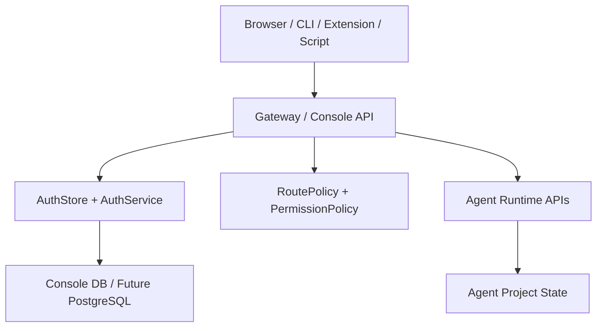

# Downcity 认证与授权 V1 详细设计稿

这份文档继续承接：

1. 《统一账户系统架构设计稿》
2. 《认证与授权 V1 实施稿》

目标是把 V1 继续细化到“可以直接开始编码”的粒度。

本文重点回答：

1. 表结构应该长什么样
2. API 请求和响应应该长什么样
3. 中间件链路应该怎么串
4. 模块应该怎么拆
5. 哪些现有文件会被如何改造
6. 测试应该覆盖哪些场景

---

## 1. V1 最终范围

V1 只做统一账户系统，不做多套认证产品。

V1 目标能力：

1. 初始化首个管理员
2. 登录并签发 Bearer Token
3. 所有受保护接口统一校验 Token
4. 以角色和权限控制高危操作
5. Console UI、CLI、Chrome Extension 使用同一种 Token 访问
6. 关键操作写审计日志

V1 不做：

1. refresh token
2. OAuth / 第三方登录
3. 用户注册
4. 密码找回
5. 多租户
6. 客户端密钥对
7. 内部 JWT 签名链路

---

## 2. 运行时拓扑



V1 判断：

1. 所有外部请求先到 Gateway
2. Gateway 负责认证与授权
3. Runtime 仍然承载执行逻辑
4. Auth 数据先放 Console DB，后续可切 PostgreSQL

---

## 3. 数据库详细设计

## 3.1 `auth_users`

用途：

1. 存储系统用户

建议字段：

1. `id`
   - `TEXT`
   - 主键
2. `username`
   - `TEXT`
   - 唯一索引
3. `password_hash`
   - `TEXT`
4. `display_name`
   - `TEXT`
5. `status`
   - `TEXT`
   - 允许值：`active` / `disabled`
6. `created_at`
   - `TEXT`
7. `updated_at`
   - `TEXT`

建议索引：

1. `UNIQUE(username)`

说明：

1. V1 不存邮箱，先只用 `username + password`
2. `display_name` 可为空

## 3.2 `auth_roles`

用途：

1. 定义角色

建议字段：

1. `id`
2. `name`
3. `description`
4. `created_at`
5. `updated_at`

建议索引：

1. `UNIQUE(name)`

默认数据：

1. `admin`
2. `operator`
3. `viewer`

## 3.3 `auth_permissions`

用途：

1. 定义权限点

建议字段：

1. `id`
2. `key`
3. `description`
4. `created_at`
5. `updated_at`

建议索引：

1. `UNIQUE(key)`

默认权限集合：

1. `agent.read`
2. `agent.write`
3. `agent.execute`
4. `service.read`
5. `service.write`
6. `task.read`
7. `task.run`
8. `model.read`
9. `model.write`
10. `env.read`
11. `env.write`
12. `channel.read`
13. `channel.write`
14. `auth.read`
15. `auth.write`
16. `shell.execute`
17. `session.read`
18. `session.write`
19. `plugin.read`
20. `plugin.write`

## 3.4 `auth_user_roles`

用途：

1. 用户与角色的多对多关系

建议字段：

1. `id`
2. `user_id`
3. `role_id`
4. `created_at`

建议索引：

1. `UNIQUE(user_id, role_id)`
2. `INDEX(user_id)`
3. `INDEX(role_id)`

## 3.5 `auth_role_permissions`

用途：

1. 角色与权限的多对多关系

建议字段：

1. `id`
2. `role_id`
3. `permission_id`
4. `created_at`

建议索引：

1. `UNIQUE(role_id, permission_id)`
2. `INDEX(role_id)`
3. `INDEX(permission_id)`

## 3.6 `auth_tokens`

用途：

1. 存储访问 Token 的服务端记录

建议字段：

1. `id`
   - token 记录 id
2. `user_id`
   - 外键指向用户
3. `name`
   - 用户可见名称，例如 `console-ui`、`chrome-extension`
4. `token_hash`
   - 明文 token 的 hash
5. `expires_at`
6. `revoked_at`
7. `last_used_at`
8. `created_at`
9. `updated_at`

建议索引：

1. `UNIQUE(token_hash)`
2. `INDEX(user_id)`
3. `INDEX(expires_at)`

关键规则：

1. 明文 token 不入库
2. 登录返回明文 token 一次
3. 后续仅能看到摘要信息

## 3.7 `auth_audit_logs`

用途：

1. 记录认证与授权相关操作

建议字段：

1. `id`
2. `actor_user_id`
3. `actor_token_id`
4. `resource_type`
5. `resource_id`
6. `action`
7. `result`
8. `request_id`
9. `ip`
10. `user_agent`
11. `meta_json`
12. `created_at`

建议索引：

1. `INDEX(actor_user_id, created_at)`
2. `INDEX(action, created_at)`
3. `INDEX(resource_type, resource_id)`

---

## 4. Token 设计

## 4.1 明文 Token 格式

推荐：

```text
dc_pat_<random_base64url_or_hex>
```

说明：

1. 带固定前缀，便于识别来源
2. 长度建议至少 32 字节随机熵

## 4.2 Token Hash

推荐：

1. 使用 `sha256`
2. 存储十六进制或 base64url 结果

V1 可接受：

1. `sha256(token)`

后续可升级：

1. `sha256(server_secret + token)`

## 4.3 默认有效期

建议默认：

1. 登录签发 token：30 天
2. 手动创建 token：90 天

V1 简化版也可统一先做：

1. 默认 30 天

---

## 5. API 契约详细设计

所有响应统一建议字段：

1. `success`
2. `error`
3. `data`

错误码建议：

1. `400` 参数错误
2. `401` 未登录 / token 无效
3. `403` 权限不足
4. `404` 资源不存在
5. `409` 状态冲突
6. `500` 服务内部错误

## 5.1 `POST /api/auth/bootstrap-admin`

用途：

1. 初始化首个管理员

请求体：

```json
{
  "username": "admin",
  "password": "your-password",
  "displayName": "Admin"
}
```

响应：

```json
{
  "success": true,
  "data": {
    "userId": "usr_xxx",
    "username": "admin",
    "role": "admin",
    "bootstrapped": true
  }
}
```

规则：

1. 仅当系统中没有任何用户时允许执行
2. 成功后写入默认角色与权限

## 5.2 `POST /api/auth/login`

用途：

1. 校验用户名密码
2. 返回 Bearer Token

请求体：

```json
{
  "username": "admin",
  "password": "your-password",
  "tokenName": "console-ui"
}
```

响应：

```json
{
  "success": true,
  "data": {
    "token": "dc_pat_xxx",
    "expiresAt": "2026-04-30T00:00:00.000Z",
    "user": {
      "id": "usr_xxx",
      "username": "admin",
      "displayName": "Admin",
      "roles": ["admin"],
      "permissions": ["agent.read", "agent.write"]
    }
  }
}
```

规则：

1. 用户不存在返回 `401`
2. 密码错误返回 `401`
3. 用户禁用返回 `403`

## 5.3 `GET /api/auth/me`

用途：

1. 返回当前 token 对应的用户身份

请求头：

```http
Authorization: Bearer dc_pat_xxx
```

响应：

```json
{
  "success": true,
  "data": {
    "user": {
      "id": "usr_xxx",
      "username": "admin",
      "displayName": "Admin",
      "roles": ["admin"],
      "permissions": ["agent.read", "agent.write"]
    },
    "token": {
      "id": "tok_xxx",
      "name": "console-ui",
      "expiresAt": "2026-04-30T00:00:00.000Z"
    }
  }
}
```

## 5.4 `POST /api/auth/token/create`

用途：

1. 为当前用户创建新 token

请求体：

```json
{
  "name": "chrome-extension",
  "expiresInDays": 30
}
```

响应：

```json
{
  "success": true,
  "data": {
    "token": "dc_pat_xxx",
    "tokenId": "tok_xxx",
    "name": "chrome-extension",
    "expiresAt": "2026-04-30T00:00:00.000Z"
  }
}
```

## 5.5 `GET /api/auth/token/list`

用途：

1. 查看当前用户 token 摘要

响应：

```json
{
  "success": true,
  "data": {
    "items": [
      {
        "id": "tok_xxx",
        "name": "console-ui",
        "expiresAt": "2026-04-30T00:00:00.000Z",
        "lastUsedAt": "2026-03-31T13:00:00.000Z",
        "revokedAt": null
      }
    ]
  }
}
```

## 5.6 `POST /api/auth/token/revoke`

用途：

1. 吊销当前用户的某个 token

请求体：

```json
{
  "tokenId": "tok_xxx"
}
```

响应：

```json
{
  "success": true,
  "data": {
    "tokenId": "tok_xxx",
    "revoked": true
  }
}
```

---

## 6. 中间件链路设计

建议顺序：

1. `requestId`
2. `logger`
3. `origin guard`
4. `auth middleware`
5. `permission middleware`
6. `route handler`

## 6.1 `requestId`

职责：

1. 为每个请求生成 `request_id`
2. 透传到日志与审计

## 6.2 `origin guard`

职责：

1. 对浏览器来源做额外限制
2. 防止恶意网页直接调用本地控制面

规则：

1. 有 `Origin` 时必须在 allowlist
2. 无 `Origin` 时按非浏览器客户端处理

说明：

1. 统一账户系统不等于可以忽略来源限制
2. Token 和 Origin 校验应同时存在

## 6.3 `auth middleware`

职责：

1. 解析 Bearer Token
2. 查找 token 记录
3. 查找用户
4. 生成 `AuthPrincipal`

输出到上下文：

1. `principal.user`
2. `principal.roles`
3. `principal.permissions`
4. `principal.token`

## 6.4 `permission middleware`

职责：

1. 读取 `RoutePolicy`
2. 判断当前 principal 是否满足权限
3. 返回 `403` 或继续执行

---

## 7. 模块详细职责

建议目录：

```text
packages/downcity/src/main/auth/
  AuthConfig.ts
  AuthService.ts
  AuthBootstrap.ts
  AuditLogService.ts
  runtime/
    BearerTokenAuth.ts
  policy/
    RoutePolicy.ts
    PermissionPolicy.ts
  routes/
    AuthRoutes.ts
    TokenRoutes.ts
  store/
    AuthStore.ts
    AuthSchema.ts
  token/
    TokenService.ts
```

## 7.1 `AuthSchema.ts`

职责：

1. 定义 auth 域表结构
2. 初始化默认角色和权限

## 7.2 `AuthStore.ts`

职责：

1. 封装用户、角色、权限、token、审计日志的底层 CRUD

## 7.3 `TokenService.ts`

职责：

1. 生成 token
2. hash token
3. 写入 token 记录
4. 校验 token
5. 吊销 token

## 7.4 `AuthService.ts`

职责：

1. 登录
2. 读取当前用户
3. 拼装用户角色与权限摘要

## 7.5 `AuthBootstrap.ts`

职责：

1. 初始化管理员
2. 创建默认角色和权限
3. 绑定 admin 用户

## 7.6 `RoutePolicy.ts`

职责：

1. 路由到权限点的映射

建议导出：

1. `resolveRoutePolicy(path, method)`
2. `isPublicRoute(path, method)`

## 7.7 `PermissionPolicy.ts`

职责：

1. principal 是否满足权限要求
2. admin 是否直接放行

## 7.8 `BearerTokenAuth.ts`

职责：

1. 解析 `Authorization`
2. 提取 `Bearer <token>`
3. 校验格式
4. 调用 `TokenService`

## 7.9 `AuthRoutes.ts`

职责：

1. `bootstrap-admin`
2. `login`
3. `me`

## 7.10 `TokenRoutes.ts`

职责：

1. `token/create`
2. `token/list`
3. `token/revoke`

---

## 8. 现有文件改造说明

## 8.1 `packages/downcity/src/main/index.ts`

改造：

1. 注册 auth routes
2. 对现有 `/api/*` 接统一 auth middleware
3. 保留 `/health` 和静态资源为 public

## 8.2 `packages/downcity/src/main/routes/execute.ts`

改造：

1. 强制 `agent.execute`

## 8.3 `packages/downcity/src/main/routes/services.ts`

改造：

1. `list` 需要 `service.read`
2. `control` / `command` 需要 `service.write`

## 8.4 `packages/downcity/src/main/service/ServiceActionApi.ts`

改造：

1. 给自动注册 action route 提供默认权限策略
2. 避免 service action 裸露

## 8.5 `packages/downcity/src/main/ui/EnvApiRoutes.ts`

改造：

1. 全部需要 `env.read` 或 `env.write`
2. `GET /api/ui/env` 默认返回脱敏值

## 8.6 `packages/downcity/src/main/ui/gateway/AgentActions.ts`

改造：

1. `executeConsoleUiShellCommand` 需要 `shell.execute`

## 8.7 `products/console-ui/src/lib/dashboard-api.ts`

改造：

1. 统一附加 Bearer Token
2. 支持 `401` 时跳转登录态处理

## 8.8 `products/chrome-extension/src/services/storage.ts`

改造：

1. 增加 `accessToken`

## 8.9 `products/chrome-extension/src/services/http.ts`

改造：

1. 统一附加 Bearer Token

---

## 9. 路由权限矩阵

| 路由 | 方法 | 权限 |
| --- | --- | --- |
| `/api/auth/bootstrap-admin` | `POST` | public with bootstrap guard |
| `/api/auth/login` | `POST` | public |
| `/api/auth/me` | `GET` | authenticated |
| `/api/auth/token/create` | `POST` | authenticated |
| `/api/auth/token/list` | `GET` | authenticated |
| `/api/auth/token/revoke` | `POST` | authenticated |
| `/api/execute` | `POST` | `agent.execute` |
| `/api/services/list` | `GET` | `service.read` |
| `/api/services/control` | `POST` | `service.write` |
| `/api/services/command` | `POST` | `service.write` |
| `/api/plugins/list` | `GET` | `plugin.read` |
| `/api/plugins/action` | `POST` | `plugin.write` |
| `/api/dashboard/sessions` | `GET` | `session.read` |
| `/api/dashboard/sessions/:id/execute` | `POST` | `session.write` |
| `/api/dashboard/tasks` | `GET` | `task.read` |
| `/api/dashboard/tasks/run` | `POST` | `task.run` |
| `/api/ui/env` | `GET` | `env.read` |
| `/api/ui/env/upsert` | `POST` | `env.write` |
| `/api/ui/command/execute` | `POST` | `shell.execute` |

说明：

1. `authenticated` 表示只要求登录，不额外要求专门 scope
2. V1 里 `admin` 可直接拥有全部 scope

---

## 10. 前端与客户端集成设计

## 10.1 Console UI

建议最小流程：

1. 增加登录页
2. 登录成功后保存 token
3. 所有 API 请求自动带 token
4. 收到 `401` 时清理 token 并跳回登录页

## 10.2 CLI

建议新增命令：

1. `city auth bootstrap-admin`
2. `city auth login`
3. `city auth token create`
4. `city auth token list`
5. `city auth token revoke`

本地 token 存储建议：

1. 放在 console runtime 目录
2. 仅当前用户可读

## 10.3 Chrome Extension

建议最小流程：

1. 设置页增加 access token 字段
2. 所有请求统一带 token
3. `401` 时在 UI 中提示 token 失效

---

## 11. 测试矩阵

## 11.1 Store 层

至少覆盖：

1. 创建用户
2. 创建 token
3. 吊销 token
4. 读取用户角色
5. 读取角色权限

## 11.2 Service 层

至少覆盖：

1. 登录成功
2. 登录失败
3. bootstrap-admin 只能执行一次
4. token 校验成功
5. token 过期失败
6. token 吊销失败

## 11.3 Middleware 层

至少覆盖：

1. 无 `Authorization` 返回 `401`
2. 非法格式返回 `401`
3. 权限不足返回 `403`
4. public route 可匿名访问

## 11.4 集成层

至少覆盖：

1. `/api/execute` 未登录不可访问
2. `/api/ui/env` 未登录不可访问
3. `/api/ui/command/execute` 非 admin 不可访问
4. 登录后访问 `/api/auth/me` 正常

---

## 12. 实施阶段

## 阶段 1：Schema 和 Store

产物：

1. `AuthSchema`
2. `AuthStore`
3. 基础迁移或初始化逻辑

## 阶段 2：登录和 Token

产物：

1. `AuthService`
2. `TokenService`
3. `AuthRoutes`
4. `TokenRoutes`

## 阶段 3：鉴权中间件

产物：

1. `AuthMiddleware`
2. `RoutePolicy`
3. `PermissionPolicy`

## 阶段 4：收口现有接口

产物：

1. runtime routes 全部接保护
2. console-ui routes 全部接保护
3. env / shell / execute 等高危接口权限收口

## 阶段 5：客户端接入

产物：

1. Console UI 登录与 token 管理
2. CLI 登录命令
3. Chrome Extension token 接入

---

## 13. 完成判定

V1 详细设计落地完成应满足：

1. 系统可 bootstrap 第一个管理员
2. 登录成功可拿到 Bearer Token
3. 所有受保护接口统一校验 Token
4. 高危操作按权限点拦截
5. Token 只存 hash 不存明文
6. Console UI、CLI、Chrome Extension 可统一访问
7. 关键安全动作有审计记录
