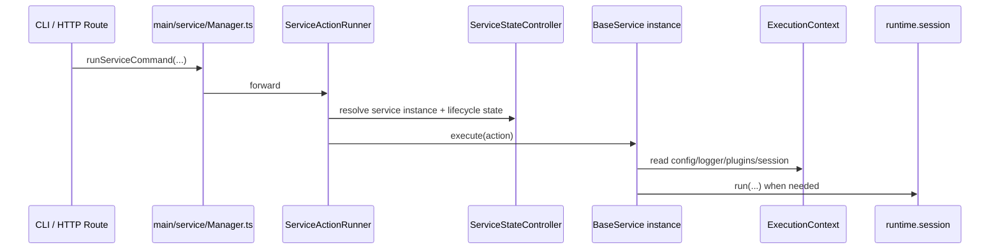
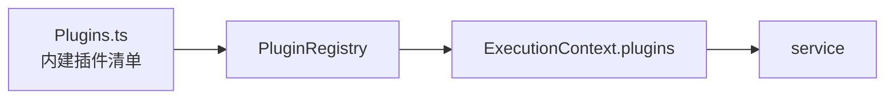
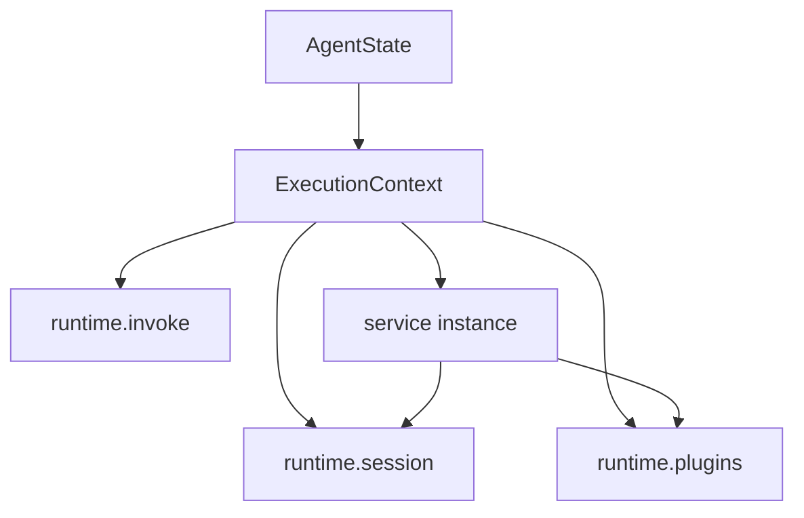
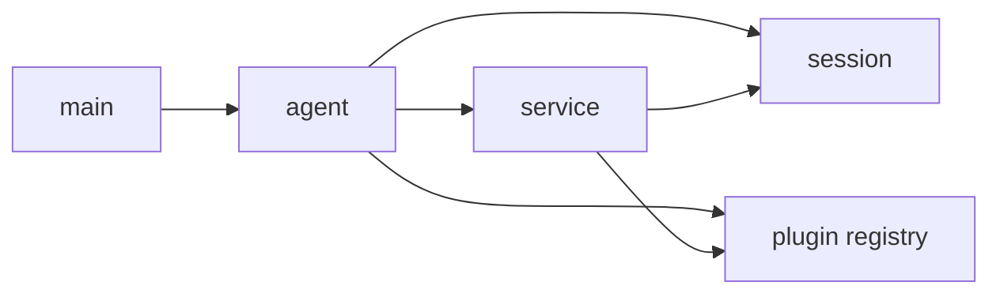

# Downcity Service 与 Plugin 架构

这份文档专门说明三件事：

1. service 现在怎么注册、怎么实例化、怎么调度
2. plugin 现在怎么注册、怎么被调用
3. 它们和 `agent / session / ExecutionContext` 的边界到底是什么

---

## 1. 先说结论

当前实现里：

1. `service` 是主动主流程模块
2. `plugin` 是被动扩展模块
3. service 已经是 class-based 实例架构
4. plugin 没有独立 runtime，也没有独立主流程
5. 需要模型执行时，service 会把任务送进 `runtime.session`

一句话总结：

```text
service 负责“做什么”和“流程怎么走”；
plugin 负责“在固定点上增强什么”。
```

---

## 2. Service 是什么

当前内建 service：

1. `chat`
2. `task`
3. `memory`
4. `shell`

统一静态注册入口：

- `main/service/Services.ts`
- `main/registries/ServiceClassRegistry.ts`

现在的注册事实源已经是 class 列表：

```ts
export const SERVICE_CLASSES = [
  ChatService,
  TaskService,
  MemoryService,
  ShellService,
];
```

这里非常关键：

1. 不再有 `SERVICES = [chatService, taskService, ...]` 这种模块级单例表
2. `Services.ts` 负责声明有哪些 service class
3. `ServiceClassRegistry.ts` 负责按需创建实例

---

## 3. Service 怎么实例化

实例化发生在 agent 启动阶段。

链路是：

1. `initAgentState()` 启动 agent
2. `createAgentServices()` 调用 `createRegisteredServiceInstances(agent)`
3. 根据 `SERVICE_CLASSES` 为当前 agent 创建一组实例
4. 最终存入 `agent.services`

图如下：


所以现在每个 agent 都有自己的一组 service instances。

---

## 4. Service 状态属于谁

当前原则已经比较清晰：

1. 通用生命周期状态
   - 归属于 `service.serviceStateRecord`
2. 领域长期状态
   - 归属于各自 service 实例字段

例如：

1. `ChatService`
   - channel bots
   - queue worker
   - route/channel 相关状态
2. `TaskService`
   - cron engine
3. `MemoryService`
   - memory state / indexer
4. `ShellService`
   - shell sessions

也就是说：

1. 这些状态不属于 `main`
2. 不属于全局模块单例
3. 也不属于 plugin

---

## 5. Service 怎么调度

当前 service 调度已经拆成几块：

1. `main/service/Manager.ts`
   - 门面导出
2. `main/service/ServiceStateController.ts`
   - 管理 service 生命周期调用与状态快照
3. `main/service/ServiceActionRunner.ts`
   - 负责执行 service action
4. `main/service/ServiceActionApi.ts`
   - 负责 HTTP action route 注册

可以理解为：

```text
Manager = 门面
StateController = lifecycle 控制
ActionRunner = action 调度
ActionApi = HTTP 接入
```

调用时序：



这里最重要的是：

1. 调度中心仍在 `main/service/*`
2. 真正的长期状态已经下沉到 service 实例
3. 真正的模型执行并不发生在 `main/service/*`

---

## 6. 哪些 service 会进 session

不是所有 service 都会走 `runtime.session.run()`。

当前更准确的理解是：

1. `chat`
   - 会进入 session
2. `task`
   - agent 模式任务会进入 session
3. `shell`
   - 不走 session 主循环
4. `memory`
   - 不走 session 主循环

所以 `service` 既包含：

1. 主流程型 service
2. 状态型 / 工具型 service

但它们共享同一套 service 注册与 action 调度体系。

---

## 7. Plugin 是什么

当前内建 plugin：

1. `auth`
2. `skill`
3. `voice`

统一静态注册清单：

- `main/plugin/Plugins.ts`

真正的注册表创建位置：

- `agent/ExecutionContext.ts`

链路是：

1. 创建 `HookRegistry`
2. 创建 `PluginRegistry`
3. `registerBuiltinPlugins()` 注册内建插件
4. 通过 `ExecutionContext.plugins` 暴露出来

图如下：



---

## 8. Plugin 怎么参与执行

当前 plugin 参与方式主要有两类：

### 8.1 显式 action

例如：

1. `city plugin action voice status`
2. `city skill list`

这类调用会直接走：

1. `/api/plugins/action`
2. `runtime.plugins.runAction()`
3. `PluginRegistry.runAction()`

### 8.2 固定扩展点

也就是 service 在固定点上调用：

1. `pipeline()`
2. `guard()`
3. `effect()`
4. `resolve()`

以 chat 为例：

1. 入队前
   - pipeline / effect
2. 回复前后
   - pipeline / effect

所以 plugin 不是自由接管流程，而是：

**service 预先定义点位，plugin 再在这些点位上参与。**

---

## 9. Plugin 不是什么

为了避免概念继续发散，plugin 现在明确不应该被理解为：

1. 独立 service
2. 独立 session
3. 独立 runtime
4. 独立生命周期主轴

它可以有：

1. 自己的 action
2. 自己的 hook 逻辑
3. 自己的内部依赖
4. 自己的项目配置块 `plugins.<name>`

但它不应该拥有：

1. 另一套宿主
2. 另一套 service manager
3. 另一套状态机入口

---

## 10. Service / Plugin 与 ExecutionContext 的关系

`ExecutionContext` 是它们共享的能力面。



所以：

1. service 从 `ExecutionContext` 拿到 session/plugins/config/logger
2. plugin 也从 `ExecutionContext` 拿到自己可见的统一能力
3. 两边都不必直接依赖 `AgentState` 内部结构

---

## 11. 边界图

把边界再画清楚一次：



边界可以总结成：

### `main`

负责：

1. 启动
2. CLI
3. HTTP route
4. service/plugin 调度门面

### `agent`

负责：

1. 宿主状态
2. service instances
3. plugin registry
4. session store

### `service`

负责：

1. 主流程
2. 长期实例状态
3. action 定义
4. 定义 plugin 扩展点

### `plugin`

负责：

1. 被动增强
2. action
3. hook 点行为

### `session`

负责：

1. prompt
2. tools
3. history
4. 模型调用循环

---

## 12. 当前最关键的结论

最后把当前实现收敛成 8 条：

1. service 已经统一成 class-based 架构
2. service 注册事实源是 `SERVICE_CLASSES`
3. agent 启动时创建 per-agent service instances
4. service 的长期状态属于实例自己
5. plugin 没有独立 runtime
6. plugin 只通过 action 和固定扩展点参与
7. `ExecutionContext` 是共享能力面
8. 真正执行 prompt / tools / history 的永远是 session
