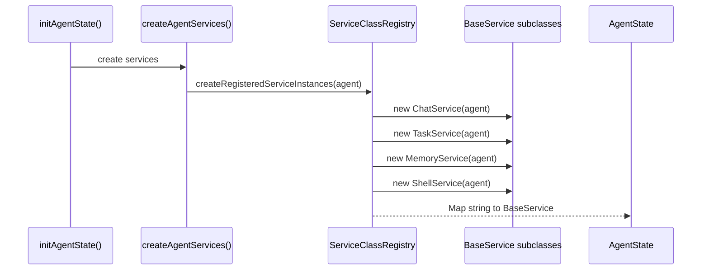
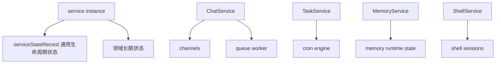
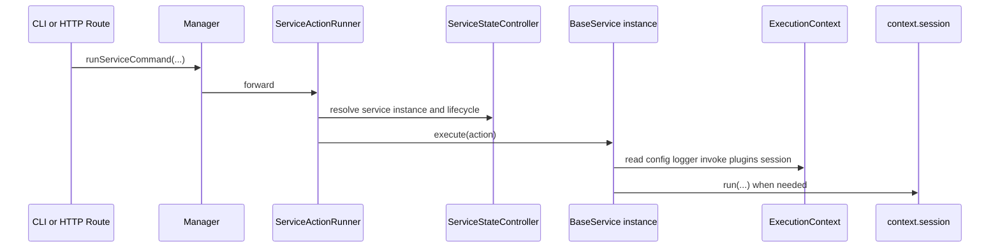
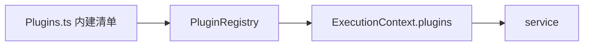
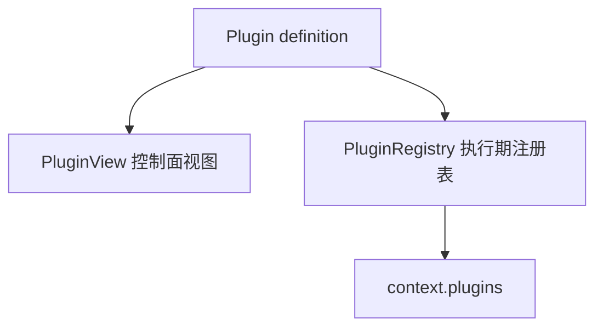
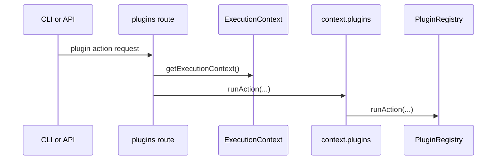
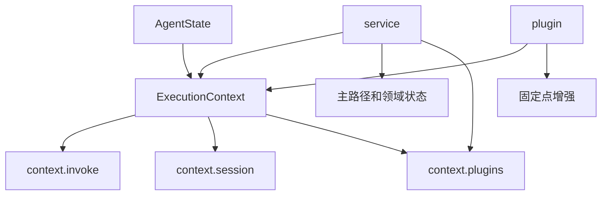

# Downcity Service 与 Plugin 架构

这份文档专门说明 5 件事：

1. service 现在怎么注册、实例化、调度
2. plugin 现在怎么注册、暴露、调用
3. 它们和 `ExecutionContext` 的边界是什么
4. 它们各自的状态应该放在哪里
5. 为什么现在不再需要额外的 plugin 宿主概念

---

## 1. 先说结论

当前实现里：

1. `service` 是主动主流程模块
2. `plugin` 是被动扩展模块
3. service 已经是 class-based 实例架构
4. plugin 没有独立 runtime，也没有独立主流程
5. service 与 plugin 共享同一个 `ExecutionContext`

一句话总结：

```text
service 决定主路径怎么走；
plugin 只在固定点上增强这条路径。
```

---

## 2. Service 是什么

当前内建 service：

1. `chat`
2. `task`
3. `memory`
4. `shell`

统一静态注册入口：

1. `main/service/Services.ts`
2. `main/registries/ServiceClassRegistry.ts`

现在的事实源是：

```ts
export const SERVICE_CLASSES = [
  ChatService,
  TaskService,
  MemoryService,
  ShellService,
];
```

这意味着：

1. 不再有 service 模块级单例表
2. 每个 agent 都会创建自己的一组 service instances
3. service 的长期状态应该跟着实例走

---

## 3. Service 怎么实例化

实例化发生在 agent 启动时。



关键结论：

1. service instance 生命周期跟 agent 进程一致
2. service 的生命周期状态也跟着实例走
3. `main` 只是创建和调度，不拥有 service 领域状态

---

## 4. Service 状态属于谁

当前状态归属应这样看：



因此：

1. 通用 lifecycle 状态属于 `serviceStateRecord`
2. 领域状态属于各自 service instance 字段
3. 这些状态不属于 `main`
4. 这些状态也不属于 `plugin`

---

## 5. Service 怎么调度

当前 service 调度已经分成四层：

1. `main/service/Manager.ts`
2. `main/service/ServiceStateController.ts`
3. `main/service/ServiceActionRunner.ts`
4. `main/service/ServiceActionApi.ts`

可以把它理解成：

```text
Manager = 门面
StateController = lifecycle 控制
ActionRunner = action 调度
ActionApi = HTTP 接入
```

调用时序：



最关键的点：

1. `main/service/*` 负责调度，不负责领域状态
2. 真正执行领域逻辑的是 service instance
3. 真正的模型执行还是发生在 `session`

---

## 6. Plugin 是什么

当前内建 plugin：

1. `auth`
2. `skill`
3. `voice`

统一静态注册清单：

- `main/plugin/Plugins.ts`

注册表构造逻辑位置：

- `agent/ExecutionContext.ts`

实例创建与挂载位置：

- `agent/AgentState.ts`

链路是：

1. `agent/AgentState.ts` 在初始化时调用 `createAgentPluginRegistry()`
2. `agent/ExecutionContext.ts` 内部构造 `HookRegistry` 与 `PluginRegistry`
3. `registerBuiltinPlugins()` 注册内建 plugin
4. registry 挂到 `AgentState`
5. 通过 `context.plugins` 暴露给执行链路

图如下：



---

## 7. Plugin 现在有哪些边界

plugin 当前有两类对外边界：

1. `PluginView`
   - 控制面静态概览
   - 用于 CLI / UI 列表展示
2. `ExecutionContext.plugins`
   - 执行期端口
   - 用于 action / pipeline / guard / effect / resolve

所以现在应该这样理解：



这也是为什么现在不需要额外的 plugin 宿主层：

1. plugin 没有独立宿主态
2. plugin 直接消费 `ExecutionContext`
3. 控制面展示则直接消费 `PluginView`

---

## 8. Plugin 怎么参与执行

当前 plugin 参与方式有两类。

### 8.1 显式 plugin action

例如：

1. `city plugin action voice status`
2. `city plugin action auth snapshot`

调用链：



### 8.2 固定扩展点

也就是 service 在固定点上调用：

1. `pipeline()`
2. `guard()`
3. `effect()`
4. `resolve()`

这是 plugin 的主要参与方式。

---

## 9. Service 和 Plugin 的关系

它们现在的关系可以画成：



结论：

1. service 和 plugin 都共享同一个 `ExecutionContext`
2. service 拥有主路径
3. plugin 只能通过 service 预留点参与
4. plugin 不能接管 service 的生命周期和主流程

---

## 10. plugin 的状态应该放哪里

当前原则是：

1. plugin 静态定义
   - 放在 plugin definition 自己
2. plugin 配置
   - 放在项目配置或 plugin 自己的持久化存储
3. plugin 私有依赖和辅助能力
   - 放在 plugin 内部 helper / runtime 目录
4. 不需要一份“全局 plugin 宿主状态”

也就是说：

1. asset 不需要挂到 `AgentState`
2. asset 也不需要暴露到 `ExecutionContext`
3. plugin 在执行时直接拿 `ExecutionContext`
4. plugin 自己内部需要什么依赖，就在自己实现里解决

---

## 11. 当前最重要的设计约束

1. service 持有主路径与领域状态
2. plugin 持有被动增强逻辑
3. service 间协作优先走 `context.invoke`
4. plugin 直接消费 `ExecutionContext`
5. 不再引入额外的 plugin 宿主层或 service 宿主层这类重复概念
