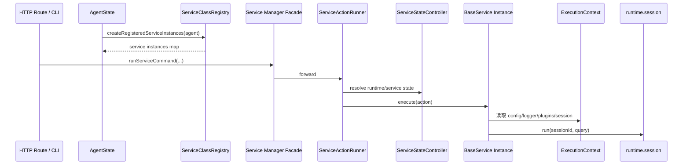
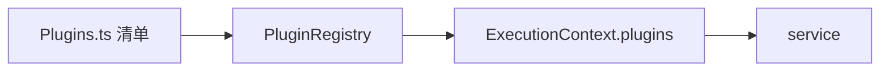
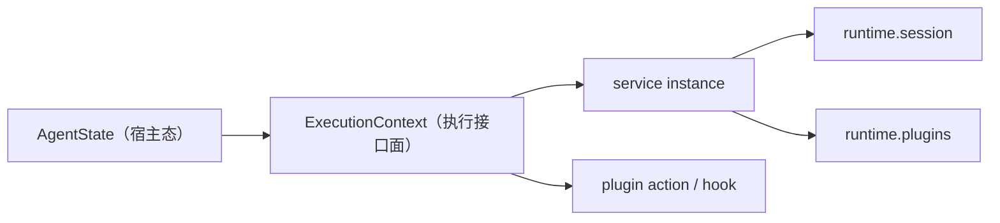

# Downcity Service 与 Plugin 架构

这份文档解释：

1. service 现在怎么注册、怎么调度
2. plugin 现在怎么注册、怎么调用
3. service 和 plugin 的边界是什么

---

## 1. service 是什么

service 是主流程模块。

当前内建 service：

1. `chat`
2. `task`
3. `memory`
4. `shell`

统一注册入口：

- `main/service/Services.ts`
- `main/registries/ServiceClassRegistry.ts`

统一调度入口：

- `main/service/Manager.ts`
- `main/service/ServiceStateController.ts`
- `main/service/ServiceActionRunner.ts`
- `main/service/ServiceActionApi.ts`

---

## 2. service 现在如何注册

`main/service/Services.ts` 与 `main/registries/ServiceClassRegistry.ts` 一起组成 service 的静态装配层：

```ts
export const SERVICES = [
  chatService,
  taskService,
  memoryService,
  shellService,
];
```

这意味着：

1. service 集合是静态装配的
2. `Services.ts` 负责声明“有哪些 service”
3. `ServiceClassRegistry.ts` 负责声明“如何创建 service instance”
4. CLI、HTTP、service lifecycle 都围绕这套静态定义工作

另一个重要静态装配点是：

- `main/service/ServiceSystemProviders.ts`

它负责：

1. 暴露 service 级 system provider 清单
2. 让 prompt system 只依赖“system provider”，而不是反向依赖完整 service 实例
3. 避免 `task -> prompt -> system domain -> service instance` 的循环依赖

---

## 3. service 现在如何调度

现在 service 调度被拆成三块：

1. `ServiceStateController.ts`
   - service state record
   - `start / stop / restart / status`
   - state snapshot
2. `ServiceActionRunner.ts`
   - `runServiceCommand`
   - action 执行包装
   - schedule 桥接
3. `ServiceActionApi.ts`
   - 专用 action API route 注册
   - payload 映射与 schedule 字段剥离

而 `Manager.ts` 本身只保留门面导出。

而真正的实例化发生在 agent 侧：

1. agent 启动
2. `ServiceClassRegistry.createRegisteredServiceInstances(agent)`
3. `agent.services` 持有这些 per-agent service instances

时序图：



关键理解：

- manager 现在只是调度入口门面
- 真正的 runtime 控制和 command 分发已经拆开
- agent 持有 per-agent service instances
- 真正执行仍然发生在 session 中

---

## 4. plugin 是什么

plugin 是被动扩展模块。

当前内建 plugin：

1. `auth`
2. `skill`
3. `voice`

统一注册清单：

- `main/plugin/Plugins.ts`

真正实例化 plugin registry 的位置：

- `agent/ExecutionContext.ts`

---

## 5. plugin 现在如何注册

链路是：

1. `main/plugin/Plugins.ts` 提供内建 plugin 清单
2. `agent/ExecutionContext.ts` 创建 `PluginRegistry`
3. `registerBuiltinPlugins()` 把内建 plugin 注册进去
4. 最后通过 `runtime.plugins` 暴露能力

图如下：



---

## 6. plugin 现在如何被调用

当前 plugin port 主要暴露：

1. `list()`
2. `availability()`
3. `runAction()`
4. `pipeline()`
5. `guard()`
6. `effect()`
7. `resolve()`

所以 plugin 的参与方式是：

1. service 显式调用 plugin action
2. service 在固定点触发 hook/pipeline/guard/effect/resolve

plugin 不会自己接管主流程。

---

## 7. service 和 plugin 的边界

### service 负责

1. 主流程
2. 领域状态
3. session 路由
4. 外部输入与输出
5. 定义扩展点
6. 持有自己的实例级运行态

以 `chat` 为例：

1. `ChatService` 自己持有 channel bots
2. `ChatService` 自己持有 `ChatQueueWorker`
3. agent 不再直接 new/start chat worker

### plugin 负责

1. 被动增强
2. action
3. hook point 行为
4. 自己的依赖与内部实现
5. 必要时读取 `ExecutionContext`，但不拥有独立 runtime 宿主

### plugin 不负责

1. 建立独立生命周期主轴
2. 持有独立 runtime 状态机
3. 把 service 主流程拆走

---

## 8. service / plugin 与 ExecutionContext 的关系

`ExecutionContext` 是两者共享的统一执行接口面。



需要注意：

1. `ExecutionContext` 不是 service 状态机，也不是 plugin 状态机
2. 它只是把 agent 宿主能力整理成一套统一接口
3. service 和 plugin 都从这里拿到：
   - `config`
   - `logger`
   - `session`
   - `plugins`
   - `invoke`
4. plugin 自己不保存独立 runtime 状态
5. service 的长期状态放在 service instance 内

---

## 9. 当前最关键的结论

1. service 是主动层
2. plugin 是被动层
3. plugin 通过 `ExecutionContext.plugins` 接入
4. plugin 没有独立 runtime
5. 主流程始终属于 service
6. service 的长期状态更适合放在 service instance 内，而不是 main
