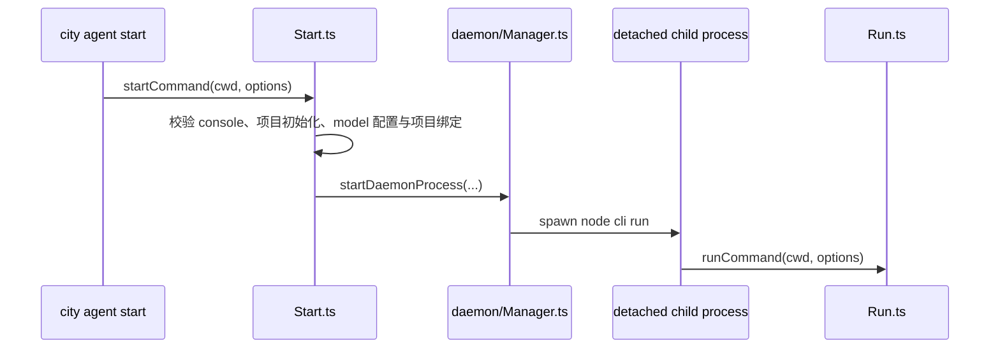
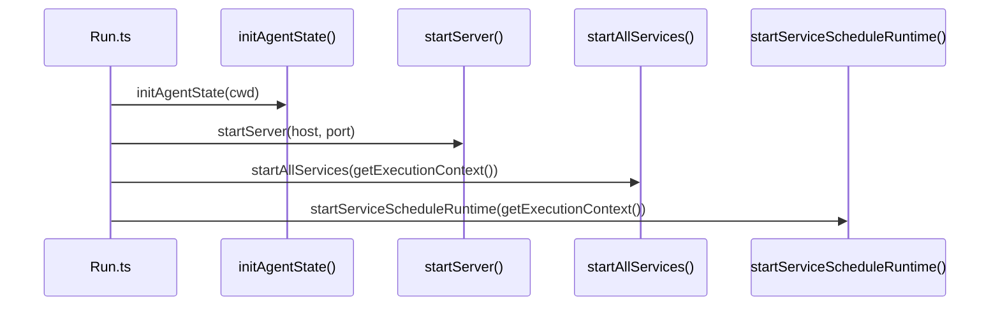
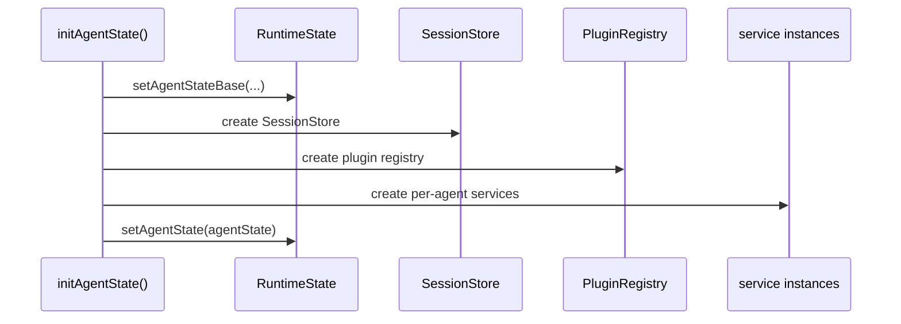
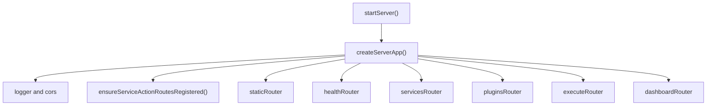
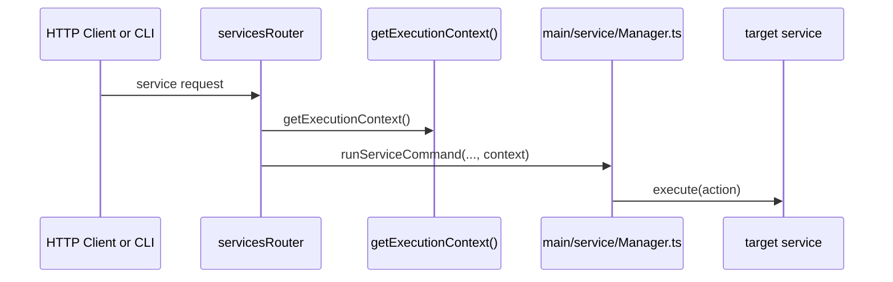
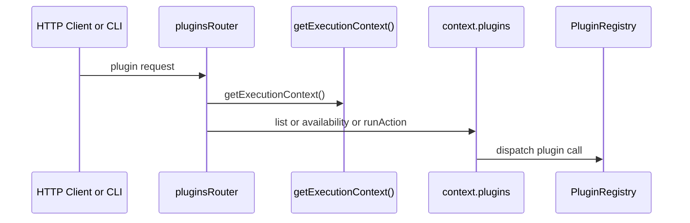
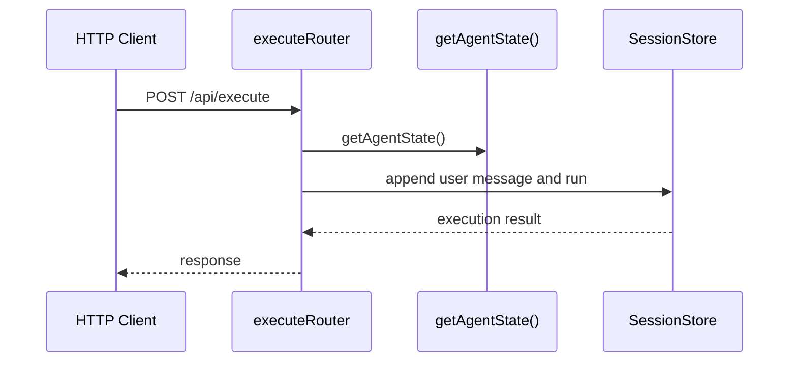

# Downcity 启动与 HTTP/API 装配流程

这份文档专门说明两条控制面链路：

1. agent 是怎么启动到 ready 的
2. HTTP/API 是怎么装配到 service / plugin / session 的

---

## 1. 两个启动入口

当前 agent 有两个主要启动方式：

1. 前台运行
   - `main/commands/Run.ts`
2. 后台 daemon 运行
   - `main/commands/Start.ts`
   - `main/daemon/Manager.ts`

它们最终都会进入真正运行入口：

- `main/commands/Run.ts`

区别只是：

1. `Start.ts`
   - 负责后台拉起 detached 子进程
   - 负责 `.downcity/debug/` 下的 pid/log/meta
2. `Run.ts`
   - 负责真正初始化 `AgentState`
   - 启动 HTTP server
   - 启动 services 与 schedule

---

## 2. 后台 daemon 启动流程

当前职责边界：

1. `Start.ts` 负责前置校验与后台启动
2. `daemon/Manager.ts` 负责子进程与调试元数据
3. `Run.ts` 负责真实的 agent 启动

---

## 3. 前台运行入口流程

可以把 `Run.ts` 理解成：

1. 先让 `AgentState` ready
2. 再让 HTTP server ready
3. 再启动全部 services
4. 最后启动持久化调度设施

---

## 4. `initAgentState()` 内部阶段

真正的宿主初始化发生在：

- `agent/AgentState.ts`

当前主要阶段：

1. 解析 `rootPath`
2. 绑定 logger
3. 确保 `.downcity/` 目录存在
4. 读取 env 与 `downcity.json`
5. 写入 base `AgentState`
6. 读取静态 systems
7. 创建 model
8. 创建 `SessionStore`
9. 创建 `PluginRegistry`
10. 创建 per-agent service instances
11. 写入 ready `AgentState`
12. 绑定 shell tool 的 invoke port
13. 启动 prompt 热重载

时序图：

关键理解：

1. `AgentState` ready 之后，`getExecutionContext()` 才有完整能力面
2. route 层与 service lifecycle 都建立在这个前提上

---

## 5. HTTP server 当前如何装配

入口文件：

- `main/index.ts`

`createServerApp()` 当前主要做：

1. 创建 Hono app
2. 挂 logger / cors 中间件
3. 延迟注册 service action routes
4. 挂载各类 route domain

当前挂载的主要路由域：

1. `staticRouter`
2. `healthRouter`
3. `servicesRouter`
4. `pluginsRouter`
5. `executeRouter`
6. `dashboardRouter`

图如下：

这里的关键点：

1. service action routes 不是 import 时立刻注册
2. 而是在 server 启动时再装配
3. 这样可以避免非 agent 命令在 import 阶段提前触发执行依赖

---

## 6. `/api/services/*` 当前怎么走

入口文件：

- `main/routes/services.ts`

主要 API：

1. `/api/services/list`
2. `/api/services/control`
3. `/api/services/command`

调用链：

这说明：

1. route 层不懂 service 业务细节
2. route 层只负责取 `ExecutionContext` 并转发给 manager
3. manager 再分发到目标 service instance

---

## 7. `/api/plugins/*` 当前怎么走

入口文件：

- `main/routes/plugins.ts`

主要 API：

1. `/api/plugins/list`
2. `/api/plugins/availability`
3. `/api/plugins/action`

调用链：

关键区别：

1. plugin action 不经过 service manager
2. plugin action 直接走 `context.plugins`
3. 控制面静态列表则可直接读取 `PluginView`

---

## 8. `/api/execute` 当前怎么走

入口文件：

- `main/routes/execute.ts`

它是一条更靠近 session 的直通链路。

这个入口的特点：

1. 更接近 session 执行本身
2. 不先经过某个 service manager
3. 适合 dashboard 或内部执行入口

---

## 9. 服务启动和 API 装配的先后顺序

当前顺序必须保持：

1. 先 `initAgentState()`
2. 再 `startServer()`
3. 再 `startAllServices()`
4. 再 `startServiceScheduleRuntime()`

原因：

1. route 层需要 `getExecutionContext()`
2. service lifecycle 也需要 `ExecutionContext`
3. schedule 执行 service action 时同样依赖 `ExecutionContext`

---

## 10. 当前最重要的边界

1. `Run.ts` 是启动编排入口
2. `AgentState` 是宿主态初始化入口
3. `main/index.ts` 只负责 HTTP app 装配
4. `services route` 走 service manager
5. `plugins route` 直接走 `context.plugins`
6. `execute route` 更直接地进入 session 链
