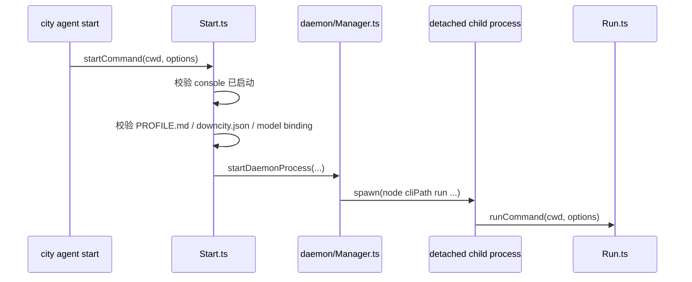
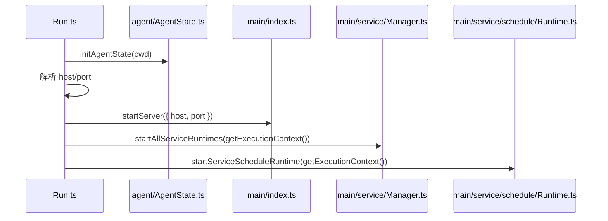
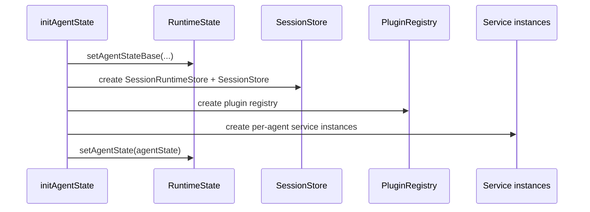
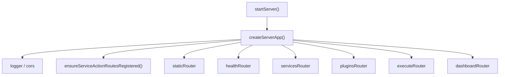
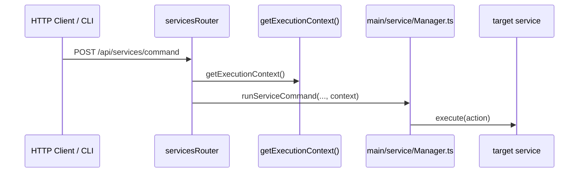
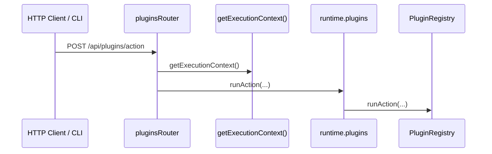
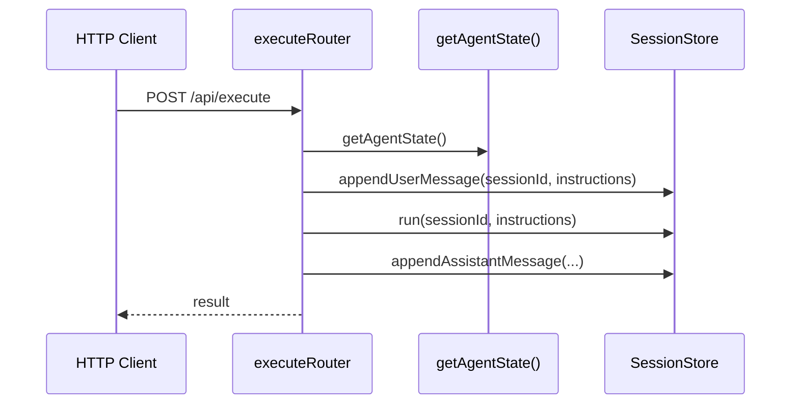

# Downcity 启动与 HTTP/API 装配流程

这份文档专门说明当前实现里的两条控制面链路：

1. agent 是怎么启动到 ready 的
2. HTTP/API 是怎么装配到 service / plugin / execute 的

---

## 1. 两个启动入口

当前 agent 有两个主要启动方式：

1. 前台运行
   - `main/commands/Run.ts`
2. 后台 daemon 运行
   - `main/commands/Start.ts`
   - `main/daemon/Manager.ts`

它们最终都会进入同一个真正运行入口：

- `main/commands/Run.ts`

区别只是：

1. `Start.ts`
   - 负责后台拉起 detached 子进程
   - 负责 `.downcity/debug/` 下的 pid/log/meta
2. `Run.ts`
   - 负责真正初始化 agent state / execution context、启动 HTTP server、启动 services

---

## 2. 后台 daemon 启动流程

`Start.ts` 当前职责：

1. 检查 console 是否已经在运行
2. 检查项目是否初始化完成
3. 检查 model binding 是否有效
4. 组装 `run` 子命令参数
5. 通过 daemon manager 后台启动子进程

`daemon/Manager.ts` 当前职责：

1. 清理 stale pid/meta
2. detached + unref 拉起子进程
3. 写入 `.downcity/debug/` 下的 pid/log/meta
4. 同步 console registry

---

## 3. 前台运行入口流程

当前真正运行入口：

- `main/commands/Run.ts`

流程如下：

这里可以把 `Run.ts` 理解成：

1. 先让 agent state ready
2. 再让 HTTP server ready
3. 再让 service lifecycle ready
4. 最后再进入长期驻留状态

---

## 4. `initAgentState()` 内部阶段

真正的宿主初始化发生在：

- `agent/AgentState.ts`

内部主要阶段：

1. 解析 `rootPath`
2. 绑定 logger 到当前项目
3. 确保 `.downcity/` 目录结构存在
4. 读取 global env + project env + `downcity.json`
5. 写入 base `AgentState`
6. 读取静态 systems
7. 创建 execution model
8. 创建 `SummaryCompactor`
9. 创建 `PromptSystem`
10. 创建 `SessionRuntimeStore`
11. 创建 `SessionStore`
12. 创建 `PluginRegistry`
13. 创建 per-agent service instances
14. 写入 ready `AgentState`
15. 绑定 shell tool 的 invoke port
16. 启动 prompt 热重载

时序图：

关键理解：

- `AgentState` ready 之后，`getExecutionContext()` 才有完整执行上下文
- HTTP route 与 service lifecycle 都建立在这个前提上

---

## 5. HTTP server 当前如何装配

入口文件：

- `main/index.ts`

当前 `createServerApp()` 主要做：

1. 创建 Hono app
2. 挂 logger / cors 中间件
3. 调 `ensureServiceActionRoutesRegistered()`
4. 挂载路由域

当前挂载的路由域：

1. `staticRouter`
2. `healthRouter`
3. `servicesRouter`
4. `pluginsRouter`
5. `executeRouter`
6. `dashboardRouter`

图如下：

这里有个关键点：

- service action routes 不是模块 import 时立刻注册
- 而是在 server 启动时延迟注册
- 这是为了避免不需要 runtime 的命令在 import 阶段提前触发执行依赖

---

## 6. `/api/services/*` 当前怎么走

入口文件：

- `main/routes/services.ts`

主要 API：

1. `/api/services/list`
2. `/api/services/control`
3. `/api/services/command`

调用链：

也就是说：

- route 层不懂具体 service 逻辑
- route 层只负责取 `ExecutionContext` 并转发给 manager
- manager 再去调对应 service

---

## 7. `/api/plugins/*` 当前怎么走

入口文件：

- `main/routes/plugins.ts`

主要 API：

1. `/api/plugins/list`
2. `/api/plugins/availability`
3. `/api/plugins/action`

调用链更短：

这里说明当前 plugin action 不经过 service manager，而是直接走 `runtime.plugins`。

---

## 8. `/api/execute` 当前怎么走

入口文件：

- `main/routes/execute.ts`

它是一个更“直通 session”的 API。

调用链：

它和 `/api/services/command` 的差异是：

1. `/api/services/command`
   - 先进入 service manager
   - 再进入具体 service
2. `/api/execute`
   - 直接面向 session registry
   - 更接近“原始执行入口”

---

## 9. 当前控制面的边界

### `main` 负责

1. CLI 命令
2. daemon 管理
3. HTTP server 与 route 装配
4. service/plugin 静态注册
5. UI / dashboard API

### `main` 不负责

1. 具体 session 执行细节
2. plugin 内部实现
3. chat/task/memory/shell 的领域内部状态

---

## 10. 当前最值得记住的结论

1. 后台 daemon 启动和前台运行是两层逻辑
2. 真正运行入口始终是 `Run.ts`
3. `initAgentState()` 先让宿主 ready
4. HTTP route 只做桥接，不做业务执行
5. `/api/services/*` 走 service manager
6. `/api/plugins/*` 直接走 `runtime.plugins`
7. `/api/execute` 直接走 `SessionStore`
