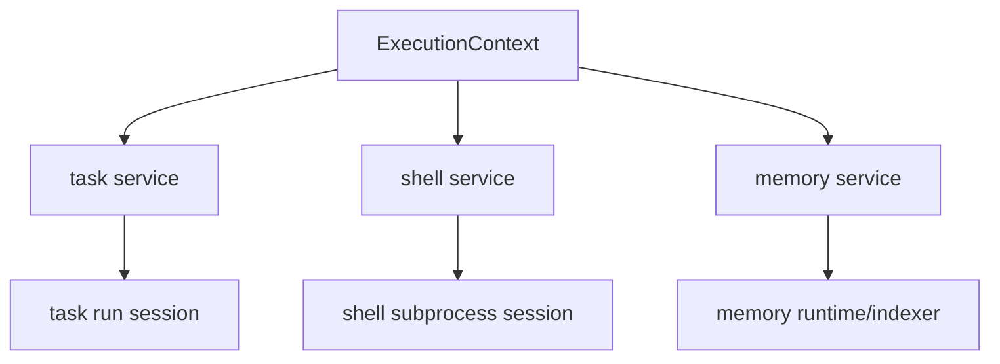
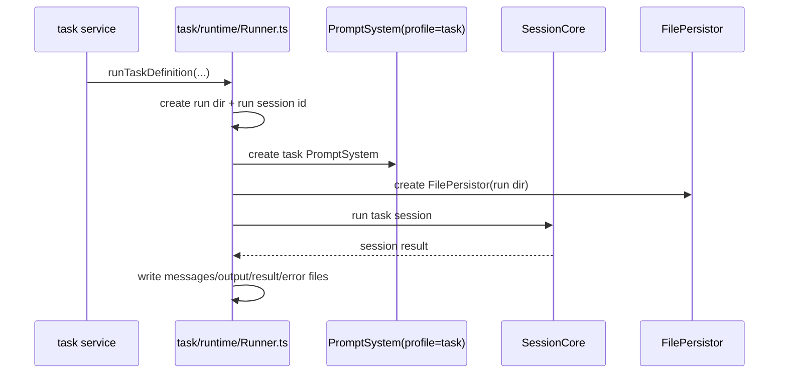
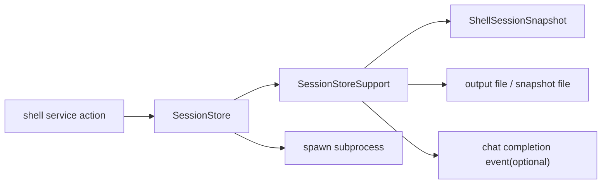
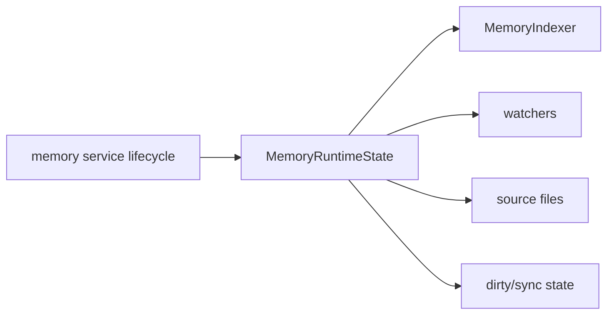

# Downcity Task / Shell / Memory 执行链路

这份文档解释当前三个非 chat service 的真实执行方式：

1. `task`
2. `shell`
3. `memory`

重点不是命令参数，而是：

- 它们分别属于哪一层
- 它们怎样使用 `ExecutionContext`
- 它们是否进入 `session`

---

## 1. 一张总图

这个图已经说明三者的根本差异：

1. `task`
   - 会进入 session 执行
2. `shell`
   - 自己维护 shell session / subprocess 生命周期
3. `memory`
   - 自己维护 memory runtime / indexer / watcher

---

## 2. `task` 的位置

入口文件：

- `services/task/Index.ts`

运行态关键文件：

- `services/task/runtime/Runner.ts`
- `services/task/runtime/CronRuntime.ts`
- `services/task/Scheduler.ts`

### `task` 的语义

当前 `task` 是 service。

但一次具体 `task run` 本质上也是一个 session 执行实例。

所以现在最准确的话是：

- `task service` 负责调度与任务定义
- `task run` 负责真正执行

---

## 3. `task` 当前怎么启动与调度

`services/task/Index.ts` 提供：

1. actions
2. service lifecycle

其中 lifecycle 会调用：

- `startTaskCronRuntime(context)`
- `stopTaskCronRuntime()`
- `restartTaskCronRuntime(context)`

`CronRuntime.ts` 当前职责：

1. 持有一个 `TaskCronTriggerEngine`
2. 根据任务定义注册 cron jobs
3. 统一 start / stop / restart

所以 `task` 的 service 状态语义是：

- 一个 agent 进程里有一套 task cron 状态
- 这套状态负责触发 future task runs
- 真正执行 task 时，再进入具体 run

---

## 4. `task run` 当前如何执行

核心文件：

- `services/task/runtime/Runner.ts`
- `services/task/runtime/TaskRunArtifacts.ts`

它不是直接复用 `SessionStore` 的缓存状态，而是给 task run 建一套**独立 task session**。

主链路如下：

关键点：

1. task run 会创建独立 run 目录
2. task run 使用 `profile: "task"` 的 prompt system
3. task run 会把消息与结果写入 run 目录
4. task run 确实是 session 语义，但不是简单复用 chat 的 session registry cache

补充说明：

1. `Runner.ts`
   - 负责 task run 主编排
   - 协调 script / agent 执行主链
2. `TaskRunArtifacts.ts`
   - 负责 `input/output/result/error/dialogue/run.json`
   - 统一 run 产物的 markdown/json 格式

所以 `task` 的结论是：

- service 负责调度
- run 负责执行
- run 的执行核心仍然是 session core

---

## 5. `shell` 的位置

入口文件：

- `services/shell/Index.ts`

运行态关键文件：

- `services/shell/runtime/SessionStore.ts`
- `services/shell/runtime/SessionStoreSupport.ts`

### `shell` 的语义

`shell` 现在是一个独立 service。

它不再是 agent tool 内部随手维护的子进程表，而是：

- 一个明确的 service
- 有自己的 action 面
- 有自己的 shell session 状态机

当前 actions 包括：

1. `exec`
2. `start`
3. `status`
4. `read`
5. `write`
6. `wait`
7. `close`

而 session tool 侧对应的桥接层现在位于：

- `sessions/tools/shell/Tool.ts`
- `sessions/tools/shell/ToolSchemas.ts`
- `sessions/tools/shell/ToolSupport.ts`

分工是：

1. `Tool.ts`
   - tool 公开导出
   - 把 tool 输入映射到 shell service actions
2. `ToolSchemas.ts`
   - shell tool 参数 schema
3. `ToolSupport.ts`
   - shell runtime 注入
   - bridge 协议
   - shell 响应扁平化

---

## 6. `shell` 当前怎么运行

`shellService.lifecycle.start()` 会：

- `bindShellRuntime(context)`

`shellService.lifecycle.stop()` 会：

- `closeAllShellSessions(true)`

真正的运行态都在：

- `services/shell/runtime/SessionStore.ts`
- `services/shell/runtime/SessionStoreSupport.ts`

其中：

1. `SessionStore.ts`
   - 负责 `start/status/read/write/wait/close/exec` 这些公开 action 编排
2. `SessionStoreSupport.ts`
   - 负责 shell env 组装
   - 负责 snapshot/output 持久化
   - 负责 waiter 协调、session 查找、终态通知辅助
3. `sessions/tools/shell/*`
   - 只负责 session tool 协议适配
   - 不再持有 shell service 本体状态

图如下：

这里的关键理解：

- `shell` 不走 `runtime.session.run()`
- `shell` 自己管理 shell session
- 它的“session”是 shell subprocess session，而不是 LLM session

---

## 7. `memory` 的位置

入口文件：

- `services/memory/Index.ts`

运行态关键文件：

- `services/memory/runtime/Store.ts`
- `services/memory/runtime/Indexer.ts`
- `services/memory/runtime/Search.ts`
- `services/memory/runtime/SystemProvider.ts`

### `memory` 的语义

`memory` 是一个长期状态 service。

它主要负责：

1. memory 文件体系
2. indexer
3. watcher
4. dirty/sync 状态
5. search/get/store/flush/index/status actions

---

## 8. `memory` 当前怎么运行

`memoryService.lifecycle.start(context)` 会：

1. `ensureMemoryDirectories(context.rootPath)`
2. `startMemoryRuntime(context)`

`memoryService.lifecycle.stop(context)` 会：

1. `stopMemoryRuntime(context)`

`Store.ts` 当前负责：

1. 管理 `MemoryRuntimeState`
2. 枚举 memory source files
3. 管理 watcher
4. 管理 dirty / syncing / lastSyncAt / lastError
5. 驱动 indexer 同步

图如下：

关键理解：

- `memory` 不是一次性执行 service
- `memory` 更像一个常驻状态 service
- 它服务于搜索、注入、flush，而不是自己去跑一轮 session 执行

---

## 9. 三个 service 的本质区别

### `task`

- 主体：任务调度 service
- 真正执行：task run session
- 是否进入 `SessionCore`：是

### `shell`

- 主体：shell 生命周期 service
- 真正执行：subprocess
- 是否进入 `SessionCore`：否

### `memory`

- 主体：长期状态与索引 service
- 真正执行：index/search/store/watch
- 是否进入 `SessionCore`：否

可以用一张表记：

| service | 主语义 | 是否进入 SessionCore | 主要运行态 |
| --- | --- | --- | --- |
| `task` | 调度 + run | 是 | task run session |
| `shell` | 子进程生命周期 | 否 | shell session store |
| `memory` | 长期状态与索引 | 否 | memory state |

---

## 10. 当前最值得记住的结论

1. `task` 是最接近 chat 的非 chat service，因为它最终还是进入 session 执行
2. `shell` 已经被抽成独立 service，不再把子进程状态塞进 agent tool
3. `memory` 是常驻状态 service，关注的是文件、索引、watcher、search
4. `service` 这个概念本身不等于“都会进入 session”
5. 当前只有部分 service 会把执行继续送入 session core
