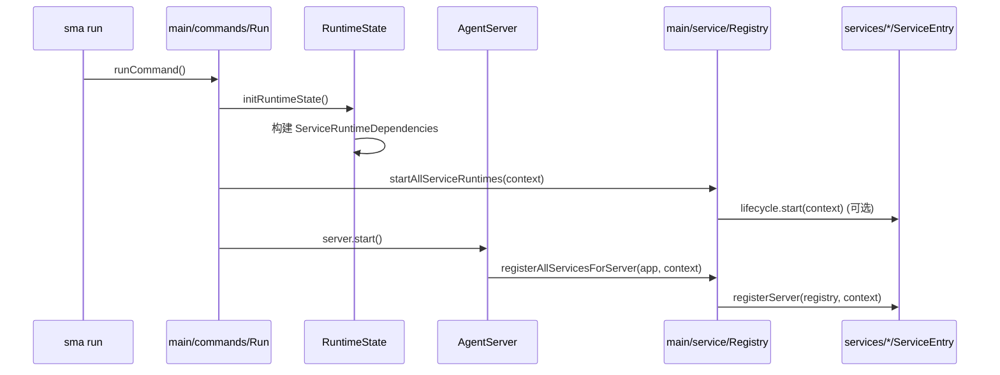
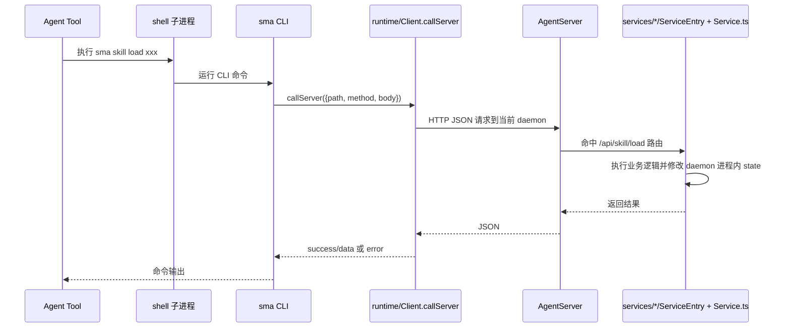
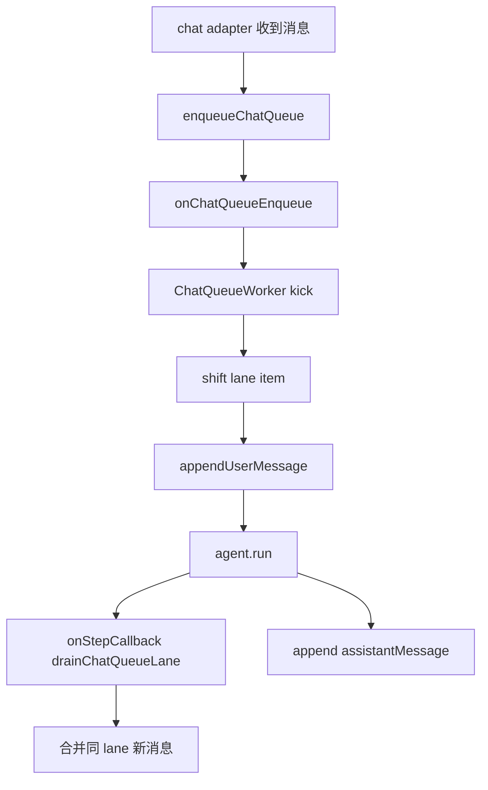

# 1. 当前真实链路图

## 1.1 Server 启动并加载 services



关键点：

- SERVICES 清单在 main/service/Services.ts 是单一事实源。
- 每个 service 的路由注册由 registerServer 完成。
- lifecycle 是否实现由 service 决定（chat/task 常用，skills 可选）。

## 1.2 Agent 工具调用 sma <service> ... 的链路



关键点：

- sma 本身不直接改 server 内存。
- 真正改状态发生在 daemon 进程内的 service handler。

## 1.3 Chat 入队与执行链路（当前实现）



关键点：

- 队列是事实中心；同 lane 串行。
- onStepCallback 在 step boundary 合并后续输入。

# 2. 一个完整 service 如何创建（当前架构）

以下按现有代码模式给出最小完整步骤。

## 2.1 新建目录

建议结构：

```text
src/services/echo/
  ServiceEntry.ts
  Service.ts
  runtime/
    Store.ts
  types/
    EchoCommand.ts
```

说明：

- 对外协议放 types/。
- 业务编排放 Service.ts。
- 注册入口只放 ServiceEntry.ts。
- 运行态细节放 runtime/。

## 2.2 定义协议类型（types/）

src/services/echo/types/EchoCommand.ts

```ts
/**
 * Echo service command types.
 */
export type EchoRequest = {
  text: string;
};

export type EchoResponse = {
  success: boolean;
  text?: string;
  error?: string;
};
```

## 2.3 实现业务逻辑（Service.ts）

src/services/echo/Service.ts

```ts
import type { EchoRequest, EchoResponse } from "./types/EchoCommand.js";

/**
 * Echo service core logic.
 */
export async function runEcho(request: EchoRequest): Promise<EchoResponse> {
  const text = String(request.text || "").trim();
  if (!text) return { success: false, error: "Missing text" };
  return { success: true, text };
}
```

## 2.4 实现注册入口（ServiceEntry.ts）

src/services/echo/ServiceEntry.ts

```ts
import type { Command } from "commander";
import type { Service } from "@main/service/ServiceManager.js";
import type { JsonObject } from "@/types/Json.js";
import { printResult } from "@main/utils/CliOutput.js";
import { callServer } from "@main/runtime/Client.js";
import { runEcho } from "./Service.js";
import type { EchoResponse } from "./types/EchoCommand.js";

function parsePortOption(value: string): number {
  const port = Number.parseInt(value, 10);
  if (!Number.isInteger(port) || port <= 0 || port > 65535) {
    throw new Error(`Invalid port: ${value}`);
  }
  return port;
}

export const echoService: Service = {
  name: "echo",

  registerCli(registry) {
    registry.group("echo", "Echo 服务命令", (group) => {
      group.command("send <text>", "回显文本", (command: Command) => {
        command
          .option("--path <path>", "项目根目录", ".")
          .option("--host <host>", "Server host")
          .option("--port <port>", "Server port", parsePortOption)
          .option("--json [enabled]", "JSON 输出", true)
          .action(async (text: string, opts: { path?: string; host?: string; port?: number; json?: boolean }) => {
            const projectRoot = String(opts.path || ".");
            const remote = await callServer<EchoResponse>({
              projectRoot,
              path: "/api/echo/send",
              method: "POST",
              host: opts.host,
              port: opts.port,
              body: { text },
            });
            printResult({
              asJson: opts.json,
              success: Boolean(remote.success && remote.data?.success),
              title: remote.data?.success ? "echo sent" : "echo failed",
              payload: remote.success ? remote.data : { error: remote.error || "request failed" },
            });
          });
      });
    });
  },

  registerServer(registry) {
    registry.post("/api/echo/send", async (c) => {
      let body: JsonObject = {};
      try {
        const parsed = await c.req.json();
        body = parsed && typeof parsed === "object" && !Array.isArray(parsed)
          ? (parsed as JsonObject)
          : {};
      } catch {
        return c.json({ success: false, error: "Invalid JSON body" }, 400);
      }

      const text = String(body.text || "");
      const result = await runEcho({ text });
      return c.json(result, result.success ? 200 : 400);
    });
  },
};
```

## 2.5 注册到服务清单

编辑 src/main/service/Services.ts：

```ts
import { echoService } from "@services/echo/ServiceEntry.js";

export const SERVICES: Service[] = [chatService, skillsService, taskService, echoService];
```

## 2.6 可选：接入 lifecycle/command

如果需要 start/stop/restart/status 或统一命令桥接（/api/services/command），在 ServiceEntry.ts 增加：

```ts
lifecycle: {
  async start(context) {},
  async stop(context) {},
  async command({ context, command, payload }) {
    if (command === "ping") return { success: true, data: { pong: true } };
    return { success: false, message: `Unknown command: ${command}` };
  },
}
```

# 3. 验证清单（创建后）

1. 能启动：sma run 后 service 出现在 /api/services/list
2. 能路由：registerServer 暴露的 API 可访问
3. 能命令：CLI 子命令能通过 callServer 返回结果
4. 能停启（若实现 lifecycle）：/api/services/control 正常
5. 能串行（如有共享状态）：在 service 内做必要并发保护

# 4. 你当前问题的直接结论

当 Agent 通过 shell 执行 sma <service> ... 时，建议始终走：

1. sma 作为 thin client（只转发）
2. daemon 内 service 执行真正 action
3. 结果通过 HTTP JSON 回传

这样才能保证“修改的是当前 server 进程里的 service 能力”。