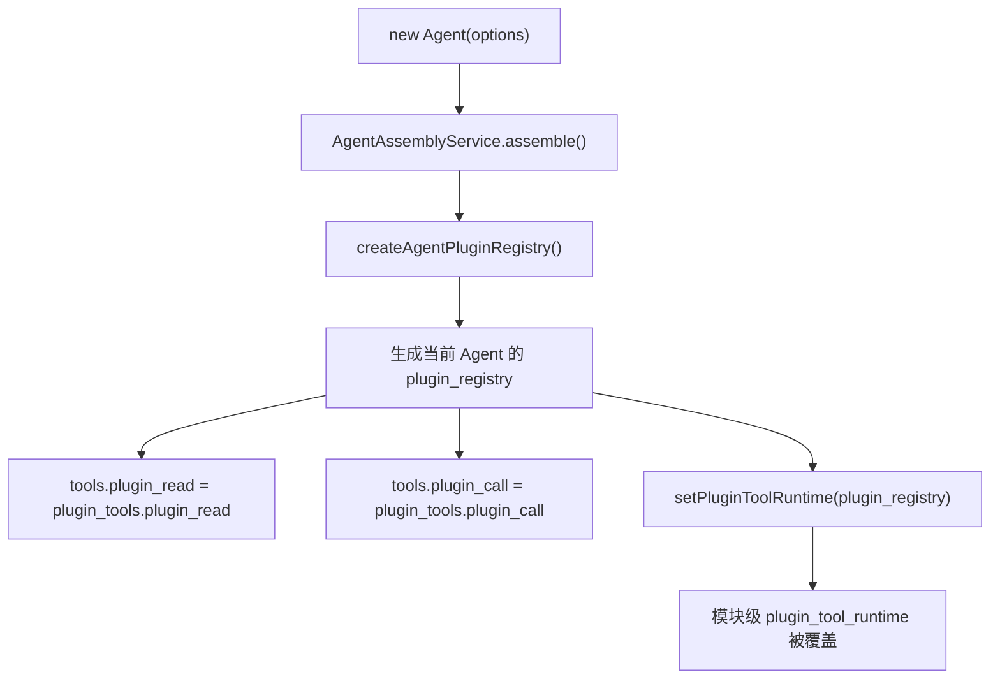
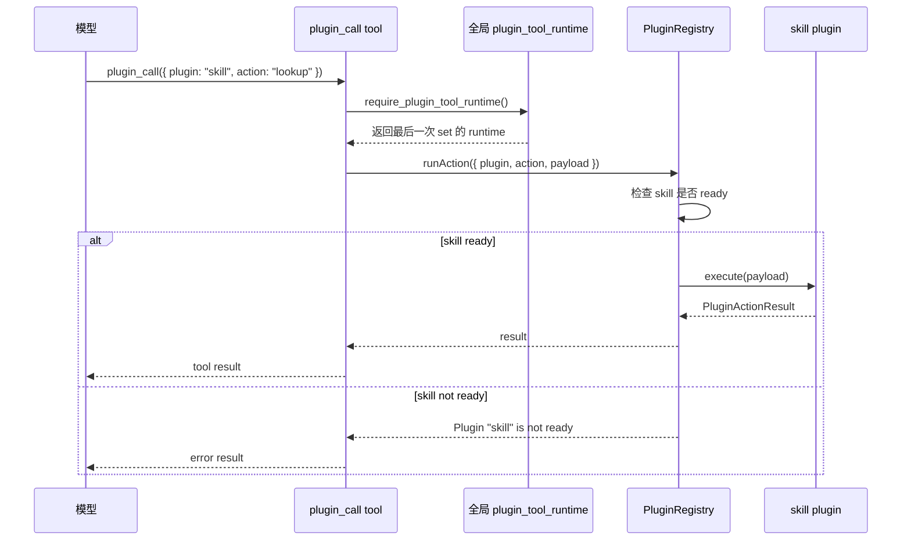
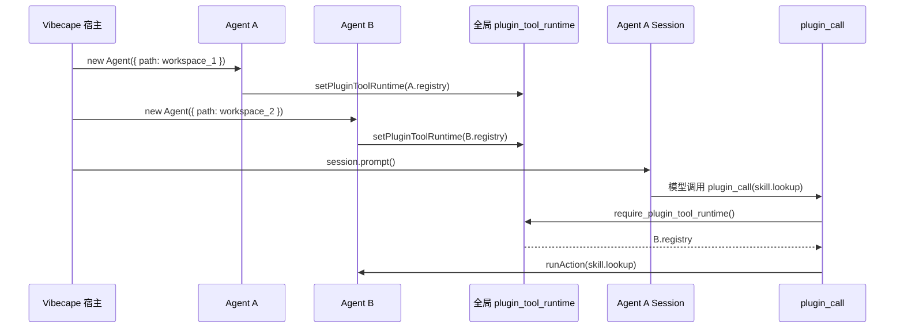
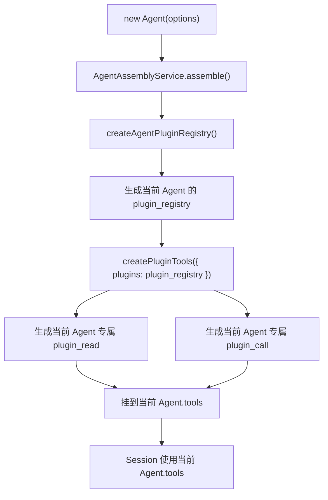
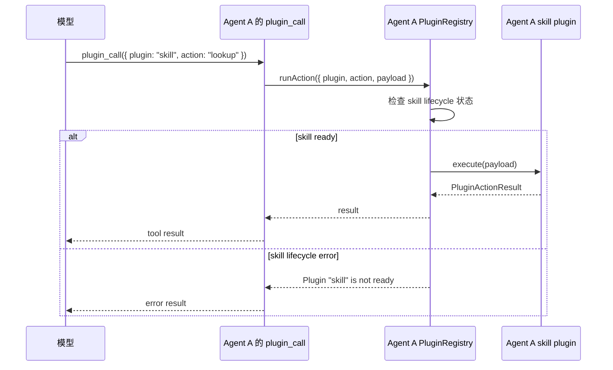
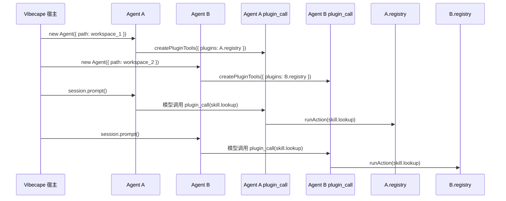
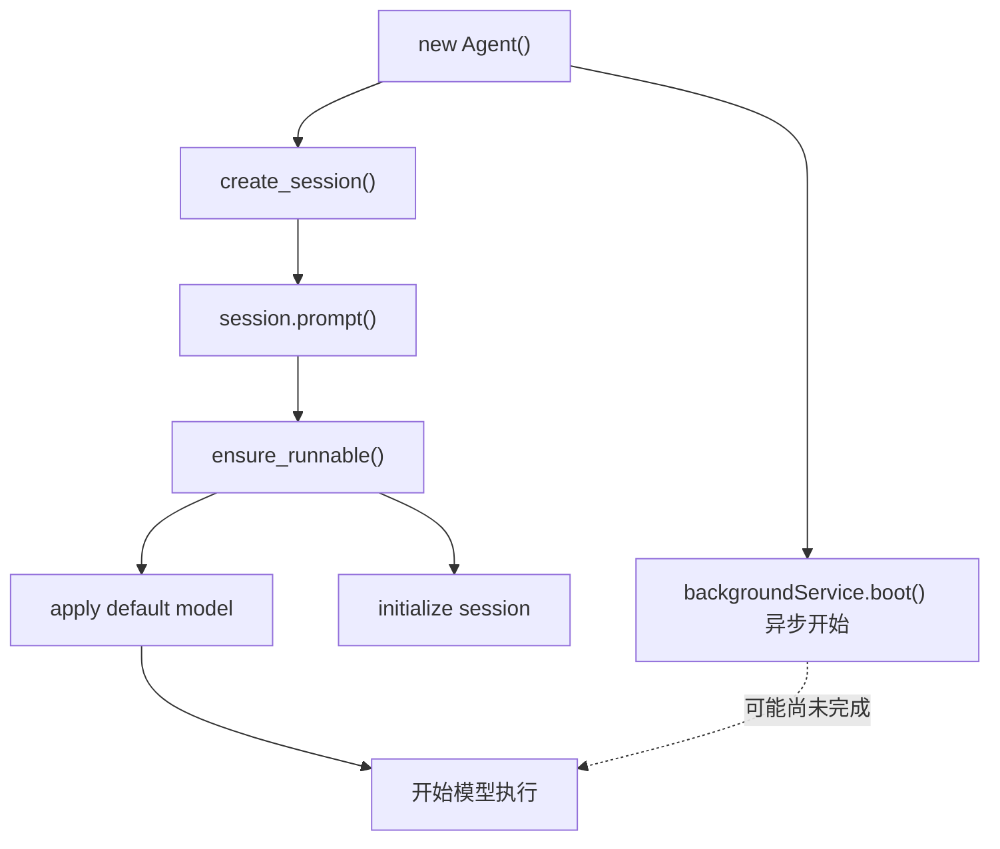
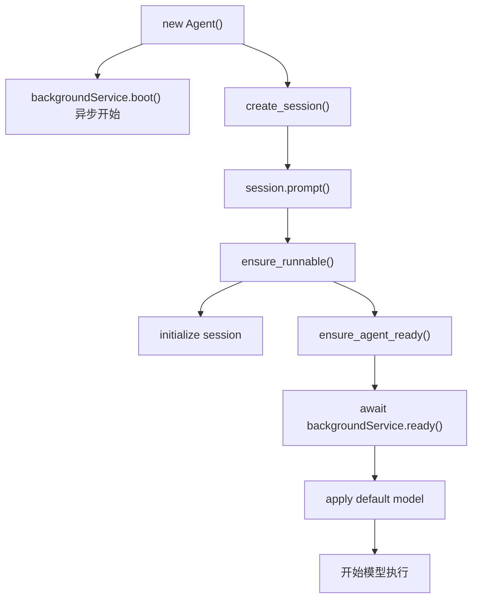
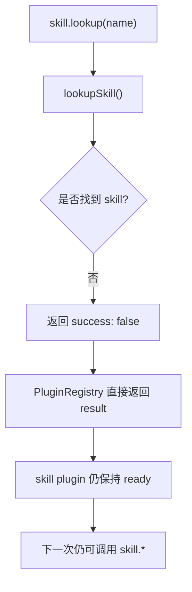

# Agent Plugin Runtime 重设计 PRD

## 1. 文档目的

本文档描述 `@downcity/agent` 中 `plugin_call` / `plugin_read` 的 runtime 绑定重设计。

这次重设计要解决三个核心问题：

- 多 Agent 宿主场景下，`plugin_call` 可能读到其他 Agent 的 plugin registry。
- `session.prompt()` 当前没有真正等待 Agent 后台 plugin lifecycle 完成。
- 普通 plugin action 失败会污染 plugin 生命周期状态，导致后续出现误导性的 `Plugin "skill" is not ready`。

目标是让 SDK 在 Vibecape 这类多 Agent 缓存、切换、并发执行的宿主里保持确定行为。

## 2. 背景与现状结论

当前 `plugin_call` 表面上是一个模型可调用 tool：

```text
plugin: skill
action: lookup
payload: { name: "..." }
```

但它内部并不直接绑定某个 Agent 实例，而是通过模块级变量读取“当前 plugin runtime”。

这在单 Agent 场景下通常能工作；但在多 Agent 场景下，最后创建的 Agent 会覆盖之前的 runtime。

因此会出现：

```text
当前执行的是 Agent A 的 session
但 plugin_call 实际调用的是 Agent B 的 plugin registry
```

如果 Agent B 中的 `skill` plugin 已经进入 `error` 状态，Agent A 的调用就会收到：

```text
Plugin "skill" is not ready
```

## 3. 当前逻辑

### 3.1 当前 SDK 入口链路

用户侧典型入口：

```ts
const agent = new Agent({
  id: "repo-helper",
  path: "/path/to/project",
  plugins: createBuiltinPlugins(),
  model,
});

const session = await agent.session_collection().create_session();
const turn = await session.prompt({
  query: "帮我查一个 skill",
});
```

当前用户并不会显式调用 `plugin_call`。模型在 session 执行过程中根据系统提示决定调用：

```ts
plugin_call({
  plugin: "skill",
  action: "lookup",
  payload: {
    name: "xxx",
  },
});
```

### 3.2 当前装配流程



当前关键点：

- `plugin_tools.plugin_call` 是共享导出的静态 tool。
- `setPluginToolRuntime(plugin_registry)` 会把模块级变量改成当前 Agent 的 registry。
- 任何 Agent 被创建时，都会覆盖全局 runtime。

### 3.3 当前 `plugin_call` 执行流程



### 3.4 当前多 Agent 串线流程



这个流程的本质问题：

```text
执行上下文属于 Agent A
plugin runtime 来源却是 Agent B
```

### 3.5 当前 plugin 状态污染流程

当前 `PluginRegistry.runAction()` 中，如果 action 返回 `success: false`，会把整个 plugin 状态设置为 `error`。

```mermaid
flowchart TD
  A["skill.lookup(name)"] --> B["lookupSkill()"]
  B --> C{"是否找到 skill?"}
  C -- "否" --> D["返回 success: false"]
  D --> E["PluginRegistry.update_record_state(skill, error)"]
  E --> F["skill plugin 状态变成 error"]
  F --> G["下一次调用 skill.*"]
  G --> H["返回 Plugin \"skill\" is not ready"]
```

这会把普通业务失败误判为 plugin 生命周期失败。

例如：

```text
第一次调用:
Skill not found: xxx

第二次调用:
Plugin "skill" is not ready
```

更合理的行为应该是：

```text
第一次调用:
Skill not found: xxx

第二次调用:
Skill not found: xxx
```

`skill` plugin 本身仍然是可用的。

## 4. 当前问题清单

### 4.1 全局 runtime 导致多 Agent 串线

问题：

- `plugin_call` 不知道自己属于哪个 Agent。
- 它只读取最后一次 `setPluginToolRuntime()` 注入的 runtime。
- 多 Agent 创建顺序会影响运行结果。

影响：

- workspace A 的 session 可能访问 workspace B 的 skills、memory、task。
- action 结果不可预测。
- 错误栈显示来自 SDK，但触发条件和宿主多 Agent 生命周期有关。

### 4.2 `session.prompt()` 没有真正等待 Agent ready

文档当前表达是：

```text
Session 入口内部已经隐式等待后台启动
```

但代码链路里，`session.prompt()` 主要等待的是 session 初始化和 model 配置，没有等待当前 Agent 的 `backgroundService.ready()`。

影响：

- session 可能在 plugin lifecycle 未完成时开始执行。
- plugin system blocks 与 action runtime 可能处在未完全一致的时间点。

### 4.3 action 业务失败污染 plugin 生命周期状态

问题：

- action 返回 `success: false` 后，registry 会把 plugin 标成 `error`。
- `error` 状态会导致后续 action 被拦截为 `Plugin "x" is not ready`。

影响：

- 普通业务失败不可重试。
- 报错信息从真实原因变成泛化的 not ready。
- `skill.lookup` 查不到 skill 这种正常失败会让整个 `skill` plugin 不可用。

### 4.4 错误语义混在一起

当前这些情况可能都表现成类似错误：

- plugin lifecycle 启动失败。
- plugin action 普通业务失败。
- 多 Agent 串线后读到另一个 registry。
- action 不存在。
- payload 校验失败。

需要拆开错误语义，方便宿主诊断。

## 5. 优化后逻辑

### 5.1 设计原则

- 每个 Agent 拥有自己的 plugin registry。
- 每个 Agent 拥有自己的 `plugin_call` / `plugin_read` tool 实例。
- tool 实例通过闭包绑定当前 Agent 的 registry。
- session 执行前等待当前 Agent 后台能力 ready。
- action 失败不改变 plugin 生命周期状态。
- plugin `error` 只表示 lifecycle 或 runtime 层不可恢复问题。

## 6. 优化后 SDK 入口变化

### 6.1 用户侧入口

用户使用 `Agent` 的主入口不变。

```ts
const agent = new Agent({
  id: "repo-helper",
  path: "/path/to/project",
  plugins: createBuiltinPlugins(),
  model,
});

const session = await agent.session_collection().create_session();
const turn = await session.prompt({
  query: "帮我查一个 skill",
});
```

用户仍然可以显式调用：

```ts
await agent.ready();
```

但语义变成：

- `agent.ready()` 是显式检查点。
- `session.prompt()` 内部也会等待当前 Agent ready。
- 宿主不再必须用 `await agent.ready()` 规避时序问题。

### 6.2 SDK 内部入口

当前内部入口：

```ts
import { plugin_tools, setPluginToolRuntime } from "...";

tools.plugin_call = plugin_tools.plugin_call;
tools.plugin_read = plugin_tools.plugin_read;
setPluginToolRuntime(plugins);
```

优化后内部入口：

```ts
import { createPluginTools } from "...";

const plugin_tools = createPluginTools({
  plugins,
});

tools.plugin_call = tools.plugin_call || plugin_tools.plugin_call;
tools.plugin_read = tools.plugin_read || plugin_tools.plugin_read;
```

关键变化：

- 不再存在生产路径上的 `setPluginToolRuntime()`。
- 不再存在生产路径上的共享 `plugin_tool_runtime`。
- `plugin_call` tool 在创建时绑定当前 Agent 的 `plugins`。

### 6.3 内部 API 变化

新增内部工厂：

```ts
export interface CreatePluginToolsOptions {
  /** 当前 Agent 自己的 plugin registry。 */
  plugins: AgentPlugins;
}

export function createPluginCallTool(options: CreatePluginToolsOptions): Tool;

export function createPluginReadTool(options: CreatePluginToolsOptions): Tool;

export function createPluginTools(
  options: CreatePluginToolsOptions,
): {
  plugin_call: Tool;
  plugin_read: Tool;
};
```

移除或降级测试专用：

```ts
setPluginToolRuntime(...)
```

如果测试仍需要直接调用 bridge，可以改为：

```ts
invokePluginCallTool({
  runtime: plugins,
  input,
});
```

或者让测试直接使用 `createPluginCallTool({ plugins })`。

## 7. 优化后装配流程



关键点：

```text
plugin_call tool 实例属于 Agent
plugin registry 也属于 Agent
两者生命周期一致
```

## 8. 优化后 `plugin_call` 执行流程



优化后不会出现：

```text
Agent A 的 tool 访问 Agent B 的 registry
```

## 9. 优化后多 Agent 并发流程



## 10. 优化后 ready 语义

### 10.1 当前 ready 语义



### 10.2 优化后 ready 语义



### 10.3 底层注入方式

`AgentSessionManager` 增加依赖：

```ts
export interface AgentSessionManagerOptions {
  /** 等待当前 Agent 后台能力启动完成。 */
  ensure_agent_ready: () => Promise<void>;
}
```

创建 session 时：

```ts
ensureConfigured: async (session) => {
  await this.ensure_agent_ready();
  await this.apply_session_defaults(session);
}
```

`Agent` 构造时传入：

```ts
ensure_agent_ready: async () => {
  await this.backgroundService.ready();
}
```

需要注意构造顺序，避免 `backgroundService` 还未赋值时闭包被同步执行。推荐使用延迟 getter：

```ts
let background_service_ref: AgentBackgroundService | null = null;

ensure_agent_ready: async () => {
  if (!background_service_ref) return;
  await background_service_ref.ready();
}
```

构造完成后：

```ts
this.backgroundService = new AgentBackgroundService(...);
background_service_ref = this.backgroundService;
```

## 11. 优化后 plugin 状态语义

### 11.1 状态定义

继续保留最简状态：

```ts
export type PluginState = "ready" | "error";
```

但重新定义语义：

- `ready`：plugin lifecycle 已启动成功，可以调用 action。
- `error`：plugin lifecycle 启动失败，或 plugin runtime 出现不可恢复错误。

### 11.2 action 失败不污染状态

当前逻辑：

```ts
const result = await action.execute(...);

if (!result.success) {
  update_record_state(record, "error", result.error || result.message);
}

return result;
```

优化后：

```ts
const result = await action.execute(...);
return result;
```

action 抛异常时，默认也只返回 action 失败：

```ts
try {
  return await action.execute(...);
} catch (error) {
  return {
    success: false,
    error: String(error),
    message: String(error),
  };
}
```

只有 lifecycle 启动失败才进入：

```ts
update_record_state(record, "error", String(error));
```

### 11.3 优化后业务失败流程



## 12. 错误语义设计

### 12.1 plugin 未注册

```json
{
  "success": false,
  "error": "Unknown plugin: skill",
  "message": "Unknown plugin: skill"
}
```

### 12.2 plugin lifecycle 未就绪或失败

```json
{
  "success": false,
  "error": "Plugin \"skill\" is not ready",
  "message": "Plugin \"skill\" is not ready"
}
```

仅用于：

- lifecycle start 失败。
- plugin runtime 明确处在不可用状态。

### 12.3 action 不存在

```json
{
  "success": false,
  "error": "Plugin \"skill\" does not implement action \"lookup\"",
  "message": "Plugin \"skill\" does not implement action \"lookup\""
}
```

### 12.4 payload 校验失败

```json
{
  "success": false,
  "error": "Invalid payload for skill.lookup: ...",
  "message": "Invalid payload for skill.lookup"
}
```

### 12.5 action 业务失败

```json
{
  "success": false,
  "error": "Skill not found: xxx",
  "message": "Skill not found: xxx"
}
```

这种失败不改变 plugin 状态。

## 13. 涉及模块

### 13.1 `PluginToolDefinition.ts`

职责变化：

- 从静态 tool 定义改为 tool 工厂。
- 暴露 `createPluginCallTool()`、`createPluginReadTool()`、`createPluginTools()`。
- 不再导出生产路径使用的 `setPluginToolRuntime()`。

### 13.2 `PluginToolBridge.ts`

职责变化：

- 移除模块级 `plugin_tool_runtime`。
- `invokePluginCallTool()` 接收显式 runtime。
- `invokePluginReadTool()` 接收显式 runtime。

建议形态：

```ts
export async function invokePluginCallTool(params: {
  plugins: AgentPlugins;
  input: PluginCallInput;
}): Promise<PluginCallToolResult>;

export async function invokePluginReadTool(params: {
  plugins: AgentPlugins;
  input: PluginReadInput;
}): Promise<PluginReadToolResult>;
```

### 13.3 `AgentAssemblyService.ts`

职责变化：

- 当前 Agent 装配当前 Agent 专属 plugin tools。
- 删除 `setPluginToolRuntime(plugins)`。

当前：

```ts
tools.plugin_read = tools.plugin_read || plugin_tools.plugin_read;
tools.plugin_call = tools.plugin_call || plugin_tools.plugin_call;
setPluginToolRuntime(plugins);
```

优化后：

```ts
const plugin_tools = createPluginTools({ plugins });
tools.plugin_read = tools.plugin_read || plugin_tools.plugin_read;
tools.plugin_call = tools.plugin_call || plugin_tools.plugin_call;
```

### 13.4 `Agent.ts`

职责变化：

- 为 `AgentSessionManager` 提供 `ensure_agent_ready`。
- 保持 `agent.ready()` 公开 API 不变。

### 13.5 `AgentSessionManager.ts`

职责变化：

- 在 session 执行配置阶段等待当前 Agent ready。
- 保证 `session.prompt()` 真正隐式等待后台能力启动。

### 13.6 `PluginRegistry.ts`

职责变化：

- action 业务失败不再修改 plugin state。
- lifecycle start 失败仍设置 `error`。
- `Plugin "x" is not ready` 只表达 lifecycle/runtime 不可用。

### 13.7 homepage docs

因为这是 SDK 用户可见行为变化，需要更新 homepage 中的用户文档：

- `homepage/content/agent-sdk-docs/zh/local-agent/quickstart.mdx`
- `homepage/content/agent-sdk-docs/zh/local-agent/tools-and-plugins.mdx`
- `homepage/content/agent-sdk-docs/zh/plugins/plugin-call-surfaces.mdx`
- `homepage/content/agent-sdk-docs/zh/plugins/plugin-availability.mdx`
- 英文对应文档

## 14. 对外行为变化

### 14.1 多 Agent 场景

之前：

```text
Agent A 的 session 可能调用到 Agent B 的 registry
```

之后：

```text
Agent A 的 session 只调用 Agent A 的 registry
Agent B 的 session 只调用 Agent B 的 registry
```

### 14.2 session ready 语义

之前：

```text
session.prompt() 不保证 Agent plugin lifecycle 已完成
```

之后：

```text
session.prompt() 保证当前 Agent ready 后再执行模型
```

### 14.3 action 失败语义

之前：

```text
skill.lookup 查不到 skill
skill plugin 可能变成 error
后续返回 Plugin "skill" is not ready
```

之后：

```text
skill.lookup 查不到 skill
返回 Skill not found
skill plugin 仍 ready
后续可以继续调用
```

## 15. 兼容策略

项目规则要求不考虑向后兼容，直接迭代为最佳实践。

因此：

- 不保留生产路径上的全局 `plugin_tool_runtime`。
- 不保留生产路径上的 `setPluginToolRuntime()`。
- 内部测试改为显式传入 `plugins`。
- 用户侧 `Agent` / `Session` 主入口保持不变，因为这个入口本身就是正确抽象。

## 16. 验收标准

- 创建两个 Agent，分别绑定不同 workspace 和不同 plugin registry。
- Agent A 创建后，再创建 Agent B，不会影响 Agent A 已有 session 的 `plugin_call`。
- Agent A 和 Agent B 并发执行时，各自只访问自己的 registry。
- `session.prompt()` 在模型执行前等待当前 Agent 的 `backgroundService.ready()`。
- `skill.lookup` 查不到 skill 后，`skill` plugin 仍保持 `ready`。
- lifecycle start 失败时，plugin 状态仍会进入 `error`。
- `Plugin "x" is not ready` 只在 lifecycle/runtime 不可用时出现。
- assistant file parts 的 materialize 行为保持不变。
- `plugin_read` metadata 读取行为保持不变。

## 17. 测试计划

### 17.1 新增测试

```text
plugin tools are bound per agent
plugin_call does not use latest constructed agent
plugin_read does not use latest constructed agent
plugin action failure does not mark plugin error
session.prompt waits for agent background ready
skill lookup failure remains retryable
```

### 17.2 回归测试

```text
plugin_call validates payload schema
plugin_read returns action metadata
assistant file parts are materialized
lifecycle start failure marks plugin error
unknown plugin returns Unknown plugin
unknown action returns does not implement action
```

### 17.3 多 Agent 并发测试建议

构造两个 fake plugin：

```ts
const plugin_a = createPlugin({
  name: "skill",
  actions: {
    lookup: createAction({
      execute: async () => ({
        success: true,
        data: {
          owner: "agent_a",
        },
      }),
    }),
  },
});

const plugin_b = createPlugin({
  name: "skill",
  actions: {
    lookup: createAction({
      execute: async () => ({
        success: true,
        data: {
          owner: "agent_b",
        },
      }),
    }),
  },
});
```

断言：

```text
Agent A plugin_call 返回 owner = agent_a
Agent B plugin_call 返回 owner = agent_b
创建顺序不影响结果
并发执行不影响结果
```

## 18. 发布与构建要求

这属于 `@downcity/agent` 的 SDK 用户可见行为变化。

实现完成并准备提交时，需要执行：

```bash
pnpm agent:patch:build
```

之后补跑受影响区域：

```bash
pnpm --filter @downcity/agent typecheck
```

如果实际脚本名称以 package.json 为准，则按仓库脚本执行。

## 19. 实施顺序

1. 重构 `PluginToolBridge.ts`，让 invoke 函数显式接收 `plugins`。
2. 重构 `PluginToolDefinition.ts`，提供 `createPluginTools()`。
3. 修改 `AgentAssemblyService.ts`，为每个 Agent 创建专属 plugin tools。
4. 删除生产路径上的 `setPluginToolRuntime()` 调用。
5. 修改 `AgentSessionManager.ts`，注入并调用 `ensure_agent_ready()`。
6. 调整 `Agent.ts` 构造顺序，安全提供 `backgroundService.ready()`。
7. 修改 `PluginRegistry.ts`，action 失败不再污染 plugin state。
8. 补多 Agent、ready、action failure 测试。
9. 更新 homepage 用户文档。
10. 执行 patch build、typecheck、必要测试。

## 20. 最终判断

这次问题不是单纯 Vibecape 集成问题，也不是单纯 SDK 使用问题。

更准确的判断是：

```text
SDK 当前 plugin_call runtime 绑定方式默认了单 Agent 执行环境。
Vibecape 是多 Agent 宿主，所以更容易触发这个设计缺陷。
```

合理修复边界是：

- Vibecape 可以临时通过 `await agent.ready()` 降低时序风险。
- SDK 必须从根上移除全局 plugin runtime。
- SDK 必须让 `plugin_call` 绑定当前 Agent 自己的 plugin registry。
- SDK 必须区分 action 业务失败和 plugin lifecycle 失败。

