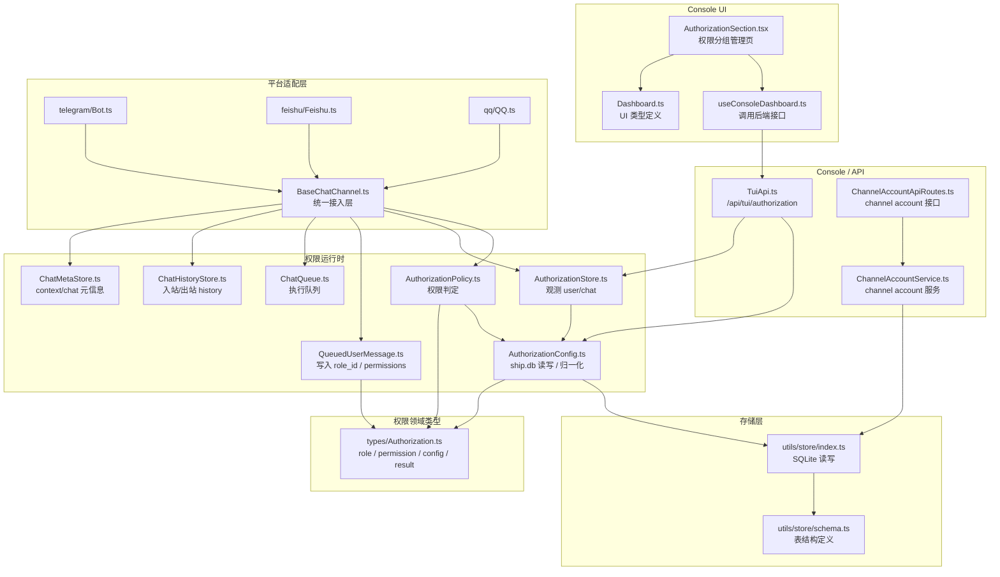
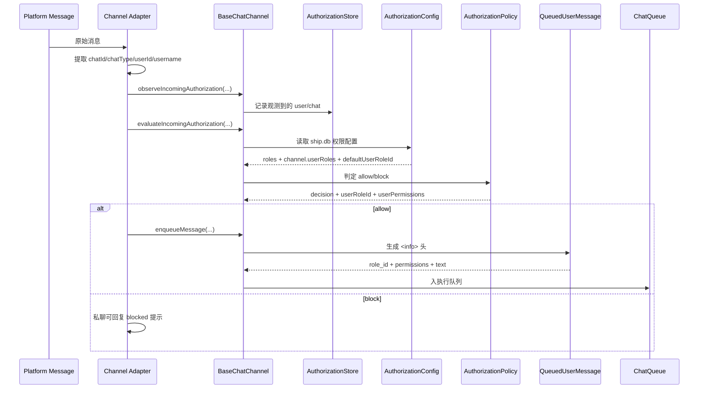

**调用顺序图**



**按目录理解**

```text
package/src/services/chat/
├── types/
│   └── Authorization.ts
│      只定义权限领域模型
│
├── runtime/
│   ├── AuthorizationConfig.ts
│   │  只负责读写 ship.db 权限配置
│   ├── AuthorizationPolicy.ts
│   │  只负责判定 allow / block
│   ├── AuthorizationStore.ts
│   │  只负责记录观测到的 user/chat
│   └── QueuedUserMessage.ts
│      只负责把权限信息写进入队消息
│
└── channels/
   ├── BaseChatChannel.ts
   │  统一串起“观测 -> 判定 -> 入队”
   ├── telegram/Bot.ts
   ├── feishu/Feishu.ts
   └── qq/QQ.ts
      各平台只负责提取平台字段并接入统一链路
```

**一句话版**

- `Authorization.ts` 定义“权限长什么样”
- `AuthorizationConfig.ts` 管“权限配在哪里”
- `AuthorizationPolicy.ts` 管“怎么判”
- `AuthorizationStore.ts` 管“看到了谁”
- `BaseChatChannel.ts` 管“把消息接进来后怎么走”
- 各平台 adapter 只负责“把平台消息翻译成统一输入”

如果你要，我下一步可以再给你画一张“ship.db 里权限数据结构图”。