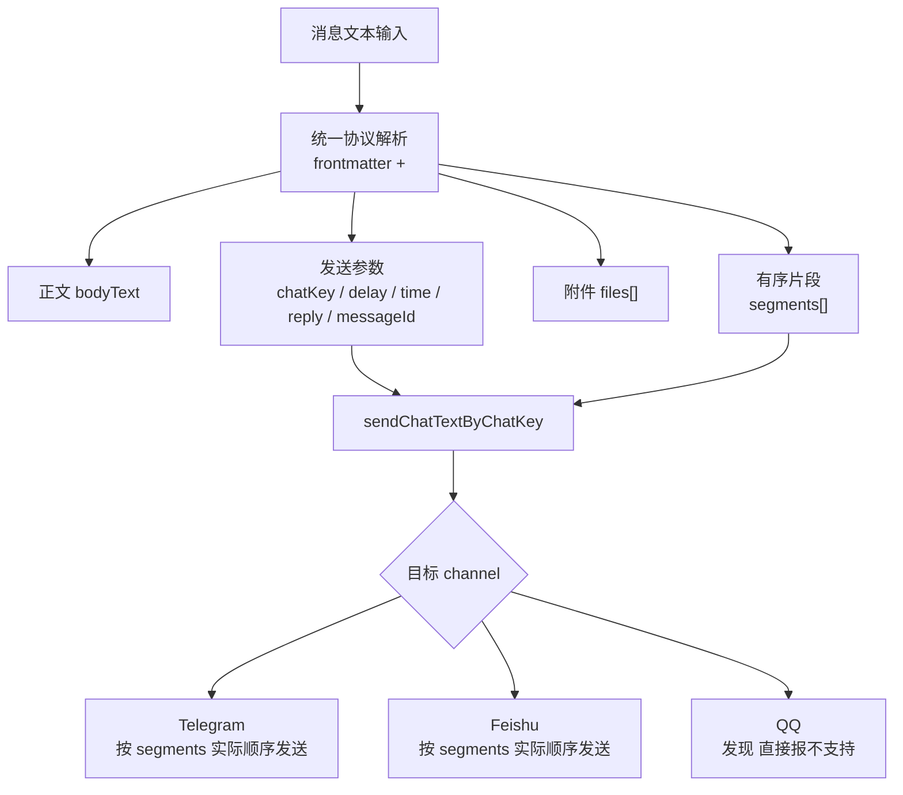
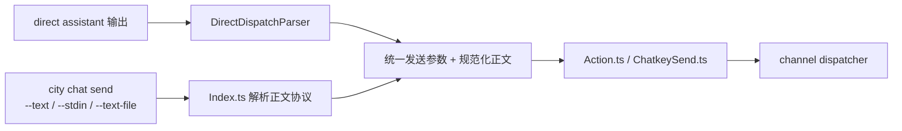
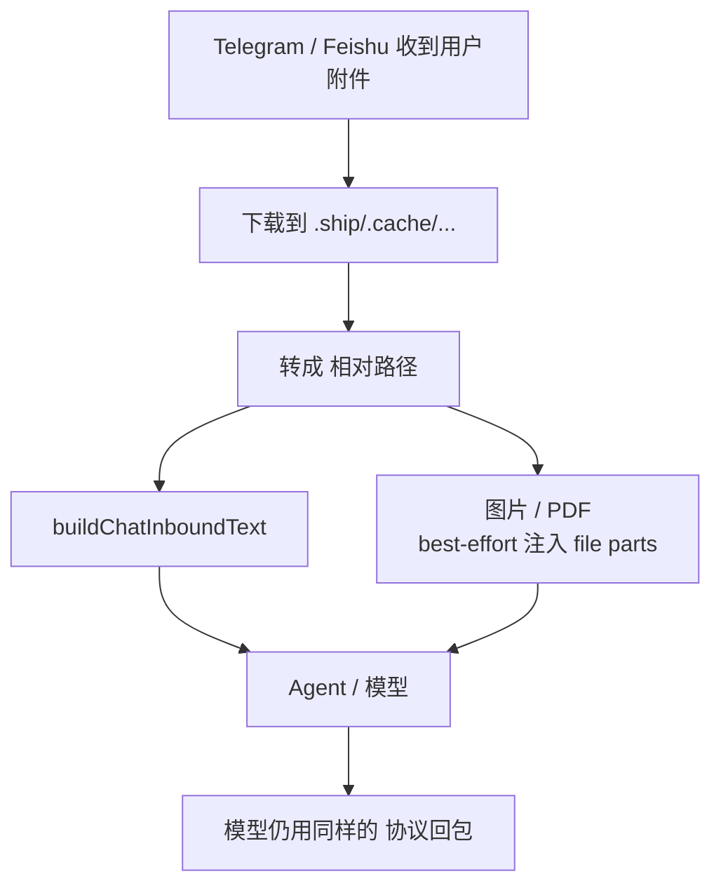

**统一协议**

现在只有一套消息协议：

- frontmatter metadata：表示 `chat send` 参数
- `<file ...>...</file>`：表示附件
- `react`：只在 direct 模式额外支持

也就是说，附件协议统一为 `<file>`。核心解析在 [ChatMessageMarkup.ts](/Users/wangenius/Documents/github/shipmyagent/packages/downcity/src/services/chat/runtime/ChatMessageMarkup.ts) 和 [ChatSendMetadata.ts](/Users/wangenius/Documents/github/shipmyagent/packages/downcity/src/services/chat/runtime/ChatSendMetadata.ts)。

补充两条当前行为：

- 出站会先解析成有序 `segments[]`，正文和附件按它们在消息里的真实出现顺序发送，不再固定“正文先发、附件后发”。
- 入站图片和 PDF 除了保留 `<file>` 文本协议，还会 best-effort 注入为 LLM `file parts`，便于多模态模型直接读取。



**两条入口**



- direct 入口在 [DirectDispatchParser.ts](/Users/wangenius/Documents/github/shipmyagent/packages/downcity/src/services/chat/runtime/DirectDispatchParser.ts)
- `city chat send` 入口在 [Index.ts](/Users/wangenius/Documents/github/shipmyagent/packages/downcity/src/services/chat/Index.ts)
- 实际发送在 [Action.ts](/Users/wangenius/Documents/github/shipmyagent/packages/downcity/src/services/chat/Action.ts) 和 [ChatkeySend.ts](/Users/wangenius/Documents/github/shipmyagent/packages/downcity/src/services/chat/runtime/ChatkeySend.ts)

**入站到模型**

入站附件也统一注入成 `<file>`，这样模型看到的协议和它输出的协议一致。



- Telegram 入站注入在 [Bot.ts](/Users/wangenius/Documents/github/shipmyagent/packages/downcity/src/services/chat/channels/telegram/Bot.ts)
- Feishu 入站注入在 [Feishu.ts](/Users/wangenius/Documents/github/shipmyagent/packages/downcity/src/services/chat/channels/feishu/Feishu.ts)

**一个例子**

```text
---
chatKey: ctx_xxx
reply: true
messageId: "128"
---
这是今天的报告开头。

<file type="document" caption="日报">reports/daily.pdf</file>

请重点看第 3 页。

<file type="photo" caption="截图">assets/chart.png</file>

最后给我一个三行结论。
```

这段现在的含义是：

- `chatKey=ctx_xxx`
- 以 reply 方式发到 `messageId=128`
- 按真实顺序拆成 5 段：文本 -> PDF -> 文本 -> 图片 -> 文本
- 如果是入站用户消息，`reports/daily.pdf` 和 `assets/chart.png` 会继续保留为 `<file>`；其中 PDF/图片还会 best-effort 变成模型可读的 `file parts`

如果你愿意，我可以再给你画一张“direct 模式 vs city chat send”的对比图。