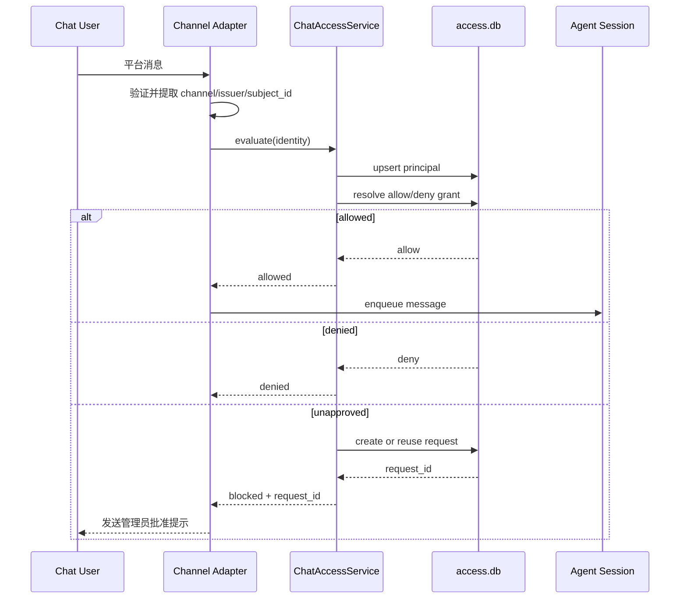
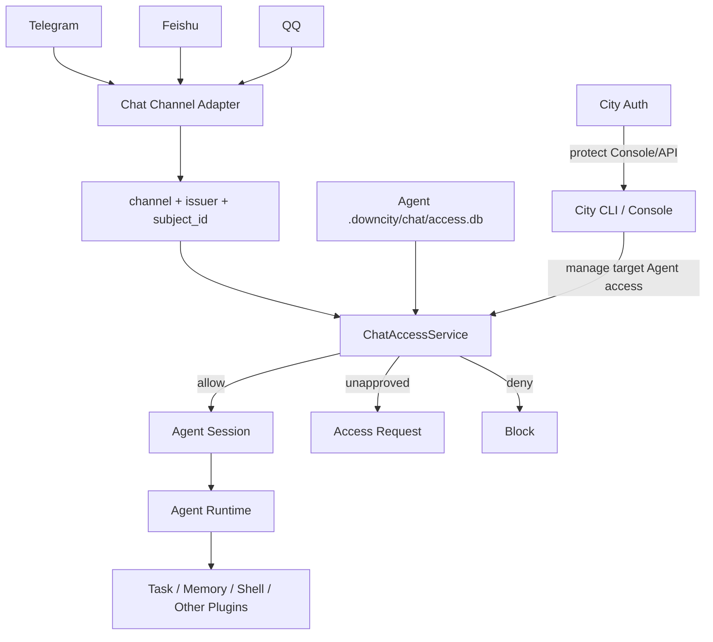

# Chat Access 统一准入控制 PRD

## 1. 文档目的

本文档定义 Downcity Chat Plugin 的统一准入控制能力。

本次设计解决以下问题：

- Telegram、飞书、QQ 等外部用户如何获得某个 Agent 的 Chat 访问权。
- Chat Access 应该放在 City 全局还是某个 Agent 下。
- Chat 平台原始用户身份如何转换成稳定、无冲突的访问主体。
- 管理员如何通过一条明确命令批准访问。
- 如何避免继续使用当前目录、交互式默认角色和散落 JSON 带来的错误。
- Chat Access 与 City Auth、Agent、其他 Plugin 的边界如何保持清晰。

最终结论：

```text
Chat Access 属于 Chat Plugin。
Chat Access 只负责外部 Chat 用户进入 Agent Session 前的准入。
Chat Access 不进入 Agent Core，也不向其他 Plugin 传播用户权限。
Chat Access 数据按 Agent 隔离，保存在 Agent 项目的 .downcity/chat/access.db。
```

## 2. 背景

### 2.1 当前实现

当前 Chat 用户授权由以下模块实现：

```text
packages/plugins/src/auth/
packages/plugins/src/chat/runtime/ChatAuthorizationRuntime.ts
packages/plugins/src/chat/channels/BaseChatChannel.ts
packages/cli/src/city/command/ChatAuthCommand.ts
```

数据保存在：

```text
<agent_project>/.downcity/chat/authorization/config.json
<agent_project>/.downcity/chat/authorization/state.json
```

当前处理流程：

```text
平台消息
  -> Channel Adapter 提取 userId
  -> Chat Authorization Guard
  -> 按 userId 查询 Role
  -> 检查 chat.dm.use / chat.group.use
  -> 允许或拒绝进入 Agent Session
```

### 2.2 当前问题

1. `auth` 同时表示 City 管理端认证和 Chat 用户准入，命名冲突。
2. `downcity chat auth set` 默认使用当前目录，容易写入错误 Agent。
3. 命令执行后还需要选择 Role，默认可能仍是无权限 Role。
4. 拒绝消息只提供用户 ID，没有携带目标 Agent。
5. 系统已经记录了用户，CLI 却再次要求管理员手动输入平台和用户 ID。
6. Telegram、飞书、QQ 的用户 ID 稳定范围不同，仅使用 `channel + userId` 可能冲突。
7. `config.json` 和 `state.json` 使用整文件读改写，并发消息可能互相覆盖。
8. 当前 Role 包含 `agent.manage`、日志等越过 Chat Plugin 边界的权限。
9. 用户 Role 和权限被写入消息 `<info>`，容易让人误以为其他 Plugin 也在执行这些权限。

## 3. 产品边界

### 3.1 City Auth

City Auth 负责 City HTTP/Console 控制面的身份认证和路由权限。

示例：

```text
POST /api/execute
POST /api/plugins/action
GET  /api/plugins/list
POST /api/ui/agents/start
```

City Auth 使用 Bearer Token，回答：

```text
谁可以通过 HTTP 或 Console 操作 City？
```

City Auth 不负责 Telegram、飞书、QQ 用户准入。

### 3.2 Chat Access

Chat Access 负责外部 Chat 用户进入某个 Agent Session 前的准入，回答：

```text
这个平台用户是否可以通过 Chat 使用当前 Agent？
```

### 3.3 Agent

Agent 只接收 Chat Plugin 已允许的输入。

输入进入 Agent 后：

- Agent 按自身 Plugin、Tool、Sandbox 和 Approval 配置运行。
- 不再携带 Chat Access Role 约束每个 Plugin Action。
- 其他 Plugin 不读取 Chat Access 数据。

### 3.4 其他 Plugin

Task、Memory、Shell、Image 等 Plugin 不感知 Chat Access。

它们接收的是 Agent 的调用，不是 Telegram 用户的直接调用。

## 4. 为什么不内化到 Agent Core

当前请求入口已有明确边界：

| 请求入口 | 安全边界 |
|---|---|
| City HTTP / Console | City Auth |
| 本地 CLI | 本机可信用户 |
| SDK | SDK 宿主管理 |
| Scheduler | Agent 内部运行时 |
| Plugin 间调用 | Agent 内部执行链 |
| Telegram / 飞书 / QQ | Chat Access |

只有 Chat Plugin 会持续接收未知外部用户输入。

因此把 Chat 用户主体、Role 和权限传播到 Session、PluginRegistry、所有 Plugin Action，会引入：

- Agent Core 类型复杂度。
- 所有 Plugin 的权限声明成本。
- Scheduler 和 Plugin 间调用的主体传播问题。
- 两套控制面权限重叠。
- 当前产品没有明确需求的细粒度 RBAC。

本期不建设通用 Agent Access Runtime。

## 5. 产品目标

### 5.1 直接

管理员收到请求后，可执行一条命令完成批准：

```bash
downcity chat access approve req_01JABCDEFG --agent assistant
```

### 5.2 无歧义

命令必须明确目标 Agent，不允许静默使用任意当前目录。

### 5.3 按 Agent 隔离

允许用户访问 Agent A，不自动允许其访问 Agent B。

### 5.4 平台统一

Telegram、飞书、QQ 使用同一套 Chat Access Service 和 Store。

平台差异仅存在于身份提取层。

### 5.5 热更新

批准、拒绝或撤销后，下一条消息立即生效，不需要重启 Agent。

### 5.6 并发安全

使用 SQLite 事务处理用户观测、请求和授权状态，避免整文件覆盖。

## 6. 非目标

本期不处理：

- 限制某个 Chat 用户只能使用部分 Plugin。
- 限制某个 Chat 用户只能调用部分 Plugin Action。
- 将 Chat 用户身份传播到 PluginRegistry。
- 跨 Agent 全局授权。
- 组织、团队和租户 RBAC。
- 自动合并同一自然人的多个平台账号。
- Chat 用户管理 City HTTP Token。
- 自定义 Role 和通用 Capability 系统。

如果未来出现明确的“同一 Agent 内不同用户拥有不同 Tool/Plugin 权限”需求，应单独设计 Agent Capability 系统，不扩张本 PRD。

## 7. 设计原则

### 7.1 Chat 内聚

身份提取、准入判定、待批准请求和拒绝提示都归 Chat Plugin。

### 7.2 Agent 隔离

所有授权记录必须包含当前 Agent 的物理存储边界。

不提供隐式全局 Allowlist。

### 7.3 准入后不传播

准入成功后，Chat Access 判定结束。

Agent Session 只接收正常用户消息和必要的展示元信息，不接收可用于运行时授权的权限集合。

### 7.4 默认拒绝

未明确批准的外部 Chat 用户默认不能触发 Agent 执行。

### 7.5 管理入口可信

Chat Access 的修改入口为：

- 本地 City CLI。
- 受 City Auth 保护的 Console/API。

V1 不允许普通 Chat 消息自行修改 Chat Access。

## 8. 核心术语

### 8.1 Chat Identity

从平台消息中提取的原始身份。

字段：

```text
channel
issuer
subject_id
display_name
```

### 8.2 Channel

平台类型：

```text
telegram
feishu
qq
```

### 8.3 Issuer

识别用户身份的 Bot/App 账号边界。

优先使用 City 全局 Chat Account ID，例如：

```text
telegram-main
feishu-work
qq-official
```

Standalone SDK 未绑定 Channel Account 时，使用平台 Bot/App 的稳定公开身份：

- Telegram Bot ID。
- 飞书 App ID。
- QQ App ID。

不得使用 Bot Token 或 Secret 作为 Issuer。

### 8.4 Subject ID

平台提供的用户稳定标识。

例如：

```text
Telegram message.from.id
Feishu sender.open_id / user_id
QQ openid / author_id
```

### 8.5 Principal

Chat Access 内部规范化后的用户主体。

唯一键：

```text
channel + issuer + subject_id
```

例如：

```text
telegram:telegram-main:8444574557
```

### 8.6 Access Request

未授权用户首次尝试访问时生成的待批准记录。

具有稳定 `request_id`：

```text
req_01JABCDEFG
```

### 8.7 Access Grant

管理员明确授予某个 Principal 的 Chat 准入记录。

## 9. Access 模型

### 9.1 不再使用通用 Role

V1 删除以下 Role 心智：

```text
default
member
admin
custom role
```

Chat Access 只需要回答准入问题，不需要通用 RBAC。

### 9.2 准入范围

持久化 Grant 支持两种范围；管理入口额外提供 `all` 作为命令别名：

| Scope | 含义 |
|---|---|
| `direct` | 仅私聊 |
| `group` | 仅群聊 |
| `all` | 管理输入别名，写入时展开为 `direct` 和 `group` 两条 Grant |

批准请求时默认授予该请求对应的范围：

- 私聊请求默认 `direct`。
- 群聊请求默认 `group`。

管理员可以显式指定：

```bash
--scope all
```

### 9.3 状态

Principal 的有效状态由 Grant 决定：

```text
unapproved
allowed
denied
```

- `unapproved`：没有 Grant，也没有显式 Deny。
- `allowed`：对应范围存在 Allow Grant。
- `denied`：对应范围存在显式 Deny。

显式 Deny 优先于 Allow。

### 9.4 为什么保留 Deny

撤销表示回到未批准状态，用户再次发送消息会产生新请求。

拒绝表示管理员明确不允许，后续消息不重复生成请求。

因此：

```text
revoke != deny
```

## 10. 存储归属

### 10.1 最终路径

```text
<agent_project>/.downcity/chat/access.db
```

### 10.2 为什么放在 Agent 项目下

1. Chat Plugin 实例属于具体 Agent。
2. 准入目标是具体 Agent。
3. 同一个平台用户访问不同 Agent 时应独立批准。
4. SDK 模式不依赖 City 全局数据库。
5. Agent 项目迁移时，Chat Access 可随项目一起迁移。
6. 删除 Agent 时可以完整删除其 Chat 访问数据。

### 10.3 为什么不放 City 全局库

Bot 账号和密钥是可复用资源，适合 City 全局保存。

用户是否能访问某个 Agent 不是共享资源，不应成为：

```text
telegram:user_id -> 全局允许所有 Agent
```

### 10.4 存储边界表

| 数据 | 存储位置 |
|---|---|
| Chat Account、Bot Token、App Secret | `~/.downcity/downcity.db` |
| Agent 绑定的 Channel Account | City Agent 配置 |
| Chat Principal | `<agent>/.downcity/chat/access.db` |
| Access Request | `<agent>/.downcity/chat/access.db` |
| Allow/Deny Grant | `<agent>/.downcity/chat/access.db` |
| Chat Access Audit | `<agent>/.downcity/chat/access.db` |
| Chat 路由 | `<agent>/.downcity/channel/meta.json` |
| Chat 事件历史 | `<agent>/.downcity/chat/<session_id>/history.jsonl` |

Chat 路由和历史不迁入 Access DB，避免 Access Store 扩张成通用 Chat Store。

## 11. SQLite Schema

### 11.1 数据库配置

```sql
PRAGMA journal_mode = WAL;
PRAGMA foreign_keys = ON;
PRAGMA busy_timeout = 5000;
```

目录权限建议 `0700`，数据库文件权限建议 `0600`。

数据库不保存 Bot Token、App Secret 或消息正文。

### 11.2 `chat_access_meta`

```sql
CREATE TABLE chat_access_meta (
  key TEXT PRIMARY KEY NOT NULL,
  value TEXT NOT NULL,
  updated_at TEXT NOT NULL
);
```

保存：

```text
schema_version
policy_version
```

### 11.3 `chat_access_principals`

```sql
CREATE TABLE chat_access_principals (
  principal_id TEXT PRIMARY KEY NOT NULL,
  channel TEXT NOT NULL,
  issuer TEXT NOT NULL,
  subject_id TEXT NOT NULL,
  display_name TEXT,
  first_seen_at TEXT NOT NULL,
  last_seen_at TEXT NOT NULL,
  last_chat_id TEXT,
  last_chat_type TEXT,
  UNIQUE (channel, issuer, subject_id)
);
```

### 11.4 `chat_access_grants`

```sql
CREATE TABLE chat_access_grants (
  grant_id TEXT PRIMARY KEY NOT NULL,
  principal_id TEXT NOT NULL,
  scope TEXT NOT NULL,
  effect TEXT NOT NULL,
  created_by TEXT NOT NULL,
  created_at TEXT NOT NULL,
  updated_at TEXT NOT NULL,
  UNIQUE (principal_id, scope),
  FOREIGN KEY (principal_id)
    REFERENCES chat_access_principals(principal_id)
    ON DELETE CASCADE
);
```

约束：

```text
scope  = direct | group
effect = allow | deny
```

### 11.5 `chat_access_requests`

```sql
CREATE TABLE chat_access_requests (
  request_id TEXT PRIMARY KEY NOT NULL,
  principal_id TEXT NOT NULL,
  scope TEXT NOT NULL,
  chat_id TEXT NOT NULL,
  chat_type TEXT NOT NULL,
  status TEXT NOT NULL,
  resolved_by TEXT,
  created_at TEXT NOT NULL,
  last_requested_at TEXT NOT NULL,
  resolved_at TEXT,
  FOREIGN KEY (principal_id)
    REFERENCES chat_access_principals(principal_id)
    ON DELETE CASCADE
);
```

状态：

```text
pending
approved
denied
expired
```

同一个 Principal、Scope 存在 pending 请求时必须复用，并更新 `last_requested_at`。

### 11.6 `chat_access_audit_events`

```sql
CREATE TABLE chat_access_audit_events (
  event_id TEXT PRIMARY KEY NOT NULL,
  principal_id TEXT,
  request_id TEXT,
  action TEXT NOT NULL,
  scope TEXT,
  decision TEXT,
  operator TEXT,
  detail_json TEXT,
  created_at TEXT NOT NULL
);
```

审计动作包括：

```text
message_allowed
message_blocked
request_created
request_reused
request_approved
request_denied
grant_created
grant_updated
grant_revoked
```

## 12. 类型设计

所有新类型统一放在：

```text
packages/plugins/src/chat/types/
```

建议类型：

```ts
/**
 * Chat 平台提供的原始身份。
 */
export interface ChatAccessIdentityInput {
  /** Chat 平台。 */
  channel: "telegram" | "feishu" | "qq";
  /** Bot 或 App 的稳定签发边界。 */
  issuer: string;
  /** 平台用户稳定 ID。 */
  subject_id: string;
  /** 用户展示名称。 */
  display_name?: string;
  /** 当前会话 ID。 */
  chat_id: string;
  /** 当前会话类型。 */
  chat_type: string;
}

/**
 * Chat Access 判定结果。
 */
export interface ChatAccessDecision {
  /** 是否允许进入 Agent。 */
  allowed: boolean;
  /** 归一化 Principal ID。 */
  principal_id: string;
  /** 当前请求范围。 */
  scope: "direct" | "group";
  /** 稳定判定原因。 */
  reason: string;
  /** 未批准时对应的请求 ID。 */
  request_id?: string;
}
```

## 13. 模块设计

建议目录：

```text
packages/plugins/src/chat/access/
  ChatAccessService.ts
  ChatAccessStore.ts
  ChatAccessSchema.ts
  ChatAccessIdentity.ts
  ChatAccessDecision.ts
  ChatAccessRequest.ts
  ChatAccessMigration.ts
```

职责：

| 模块 | 职责 |
|---|---|
| `ChatAccessService` | 对外统一用例入口 |
| `ChatAccessStore` | SQLite 查询和事务 |
| `ChatAccessSchema` | 建表和 schema version |
| `ChatAccessIdentity` | 平台身份归一化 |
| `ChatAccessDecision` | direct/group 判定 |
| `ChatAccessRequest` | 请求创建、复用和解决 |
| `ChatAccessMigration` | 旧 JSON 一次性迁移 |

Channel Adapter 不直接执行 SQL。

CLI 不直接执行 SQL，只调用 `ChatAccessService`。

## 14. ChatAccessService 接口

```ts
/**
 * Chat Access 应用服务。
 */
export interface ChatAccessService {
  /** 观测并解析平台主体。 */
  observe_identity(input: ChatAccessIdentityInput): Promise<ChatAccessPrincipal>;
  /** 判定当前消息是否允许进入 Agent。 */
  evaluate(input: ChatAccessIdentityInput): Promise<ChatAccessDecision>;
  /** 批准待处理请求。 */
  approve_request(input: ApproveChatAccessRequestInput): Promise<ChatAccessGrant>;
  /** 拒绝待处理请求。 */
  deny_request(input: DenyChatAccessRequestInput): Promise<void>;
  /** 撤销现有准入。 */
  revoke_grant(input: RevokeChatAccessGrantInput): Promise<void>;
  /** 列出主体和准入状态。 */
  list_principals(input?: ListChatAccessPrincipalsInput): Promise<ChatAccessPrincipal[]>;
  /** 列出待处理请求。 */
  list_requests(input?: ListChatAccessRequestsInput): Promise<ChatAccessRequest[]>;
}
```

所有字段类型必须放在 `types/` 下，并为每个字段提供文档注释。

## 15. 平台身份转换

### 15.1 Telegram

输入来源：

```text
subject_id  = message.from.id
display_name = username / first_name / last_name
chat_id     = message.chat.id
chat_type   = message.chat.type
issuer      = channelAccountId，回退到 Telegram Bot ID
```

示例：

```text
channel      telegram
issuer       telegram-main
subject_id   8444574557
chat_id      8444574557
chat_type    private
```

### 15.2 飞书

优先使用已确认稳定的发送者身份：

```text
subject_id = sender.open_id
```

必要时回退到当前 Adapter 已支持的 `user_id`。

```text
issuer = channelAccountId，回退到 App ID
```

不同 App 下的相同 `open_id` 不得视为同一 Principal。

### 15.3 QQ

使用当前消息类型对应的稳定 OpenID：

```text
subject_id = user_openid / member_openid / author_id
issuer     = channelAccountId，回退到 App ID
```

### 15.4 缺失身份

缺少 `issuer` 或 `subject_id` 时：

- 不创建 Principal。
- 不创建 Access Request。
- 不进入 Agent。
- 记录结构化警告。
- 私聊可以返回通用系统错误，不暴露内部字段。

## 16. 入站执行流程



## 17. 私聊和群聊行为

### 17.1 私聊

未批准时：

- 创建或复用 pending request。
- 返回一次明确的批准提示。
- 同一 pending request 重复触发时允许有限频率回复，避免每条消息刷屏。

### 17.2 群聊

未批准时：

- 创建或复用 group scope request。
- 默认静默拒绝，不在群内公开管理员命令。
- 在 Agent 管理面板展示 pending request。

### 17.3 Bot 自身消息

Bot 自身消息仍按 Channel Adapter 原有规则过滤，不进入 Chat Access。

### 17.4 Command

平台命令也必须先通过 Chat Access，除非属于固定的公开诊断命令，例如：

```text
/start
/access
```

公开命令不得触发 Agent，不得读取敏感状态。

## 18. 用户可见拒绝提示

私聊未批准：

```text
当前账号尚未获准访问 Agent "assistant"。

访问请求：req_01JABCDEFG

请将下面命令发送给管理员：
downcity chat access approve req_01JABCDEFG --agent assistant
```

显式拒绝：

```text
当前账号未获准访问此 Agent。
```

缺失身份：

```text
当前平台身份无法识别，请联系管理员检查 Chat 账号配置。
```

不得输出 Agent 服务器绝对路径。

## 19. CLI 设计

### 19.1 命令归属

删除：

```bash
downcity chat auth ...
```

新增：

```bash
downcity chat access ...
```

### 19.2 请求列表

```bash
downcity chat access requests --agent assistant
downcity chat access requests --agent assistant --status pending
```

### 19.3 批准

```bash
downcity chat access approve req_01JABCDEFG --agent assistant
```

默认批准请求自身范围。

批准所有 Chat 类型：

```bash
downcity chat access approve req_01JABCDEFG \
  --agent assistant \
  --scope all
```

### 19.4 拒绝

```bash
downcity chat access deny req_01JABCDEFG --agent assistant
```

拒绝后不再重复创建请求。

### 19.5 已批准用户

```bash
downcity chat access list --agent assistant
```

展示：

- Principal ID。
- Channel。
- Issuer/Chat Account。
- Subject ID。
- 展示名。
- Scope。
- Effect。
- 最近活跃时间。

### 19.6 撤销

```bash
downcity chat access revoke principal_01J... \
  --agent assistant \
  --scope all
```

撤销后用户回到未批准状态，可以再次产生请求。

### 19.7 Agent 解析

优先级：

1. `--agent <agent_id>`。
2. `--path <project_root>`。
3. `DC_AGENT_ID` / `DC_AGENT_PATH`。
4. 当前目录确实是已注册 Agent 项目。
5. TTY 中选择 Agent。
6. 无法确定时直接报错。

禁止：

```text
把任意 process.cwd() 静默当作 Agent 项目
```

### 19.8 非交互行为

`approve`、`deny`、`revoke` 必须是确定性命令，不再弹出 Role 选择。

成功输出必须包含：

- Agent ID。
- Agent Project。
- Principal。
- Scope。
- 最终状态。

## 20. 交互式管理器

裸命令：

```bash
downcity chat
```

目标菜单：

```text
Chat 管理
  -> Chat 账号
  -> Agent Chat Access
      -> 选择 Agent
          -> 待批准请求
          -> 已允许用户
          -> 已拒绝用户
          -> Access 审计
```

待批准请求操作：

- 批准当前范围。
- 批准全部范围。
- 拒绝。
- 查看身份详情。

主流程不再要求手动输入 `telegram:<user_id>`。

保留“按平台身份手动添加”作为高级入口，必须同时选择：

- Agent。
- Channel Account/Issuer。
- Channel。
- Subject ID。
- Scope。

## 21. Console/API 设计

Console 中的 Chat Access 管理接口受 City Auth 保护。

建议路由：

```text
GET    /api/ui/agents/:agent_id/chat-access/requests
POST   /api/ui/agents/:agent_id/chat-access/requests/:request_id/approve
POST   /api/ui/agents/:agent_id/chat-access/requests/:request_id/deny
GET    /api/ui/agents/:agent_id/chat-access/principals
DELETE /api/ui/agents/:agent_id/chat-access/grants/:grant_id
```

City Auth 决定谁可以调用这些管理 API。

Chat Access 决定平台用户是否可以进入目标 Agent。

两者不共用用户表、Role 表或 Token 表。

## 22. 消息元信息

准入成功后，Agent 消息可保留用于理解对话的展示信息：

```text
user_id
username
message_id
received_at
user_timezone
```

删除：

```text
role_id
permissions
```

原因：

- Agent 和其他 Plugin 不执行 Chat Access 权限。
- 避免模型误解这些字段为 Plugin Action 权限。
- 减少用户身份和内部策略泄露。

## 23. 热更新与缓存

V1 可以直接使用 SQLite 查询完成每条消息判定。

如果后续需要缓存：

- 缓存键使用 `principal_id + scope`。
- 缓存绑定 `policy_version`。
- Grant 变化后在同一事务内递增 `policy_version`。
- 运行时发现版本变化立即清空缓存。

无论是否缓存，修改 Access 后都不得要求重启 Agent。

## 24. 安全约束

### 24.1 默认拒绝

没有明确 Allow Grant 时，不进入 Agent。

### 24.2 身份必须包含 Issuer

不得只用 `channel + subject_id` 建立唯一身份。

### 24.3 不信任消息正文

用户不能通过发送伪造的 `user_id`、`role` 或 `permissions` 改变判定。

身份只来自 Channel Adapter 已验证的平台事件字段。

### 24.4 不保存平台密钥

Access DB 不保存 Token、Secret 或完整平台事件。

### 24.5 请求防刷

- pending request 去重。
- 私聊拒绝提示限频。
- 群聊默认静默。
- 审计事件可以按时间窗口聚合。

### 24.6 管理操作审计

批准、拒绝、撤销必须记录操作者：

```text
local-cli
city:<user_id>
api:<token_id>
```

## 25. 数据迁移

### 25.1 迁移来源

```text
.downcity/chat/authorization/config.json
.downcity/chat/authorization/state.json
```

### 25.2 配置迁移

不根据 Role 名称迁移，而根据旧 Role 的 Chat 权限迁移：

| 旧权限 | 新 Grant |
|---|---|
| `chat.dm.use` | `direct allow` |
| `chat.group.use` | `group allow` |
| 两者都有 | `all allow` |
| 两者都没有 | 不创建 Allow Grant |

旧 Role 中以下权限不迁移：

```text
agent.manage
agent.view.logs
chat.authorization.manage.users
chat.authorization.manage.roles
```

原因是它们不属于新的 Chat 准入边界。

### 25.3 State 迁移

- 已观测用户迁移为 `chat_access_principals`。
- 使用 Agent 当前 Channel Account ID 作为 Issuer。
- 无法确定 Issuer 时不猜测，记录迁移诊断。
- 未授权且最近出现的用户可迁移为 pending request。

### 25.4 一次性迁移

启动 Chat Access Store 时：

1. 检查 `access.db` schema。
2. 数据库为空且旧 JSON 存在时执行事务迁移。
3. 校验记录数量和关键绑定。
4. 提交事务。
5. 将旧文件移动到迁移备份目录。

备份目录：

```text
.downcity/chat/migration-backup/authorization/
```

迁移后只读取 `access.db`，不保留 JSON/SQLite 双读或双写。

## 26. 代码调整范围

### 26.1 `@downcity/plugins`

删除：

```text
packages/plugins/src/auth/
packages/plugins/src/chat/runtime/ChatAuthorizationRuntime.ts
```

新增：

```text
packages/plugins/src/chat/access/
packages/plugins/src/chat/types/ChatAccess.ts
```

修改：

- `BaseChatChannel`。
- Telegram Message Handler。
- 飞书 Message Handler。
- QQ Message Handler。
- Chat Plugin actions/hooks。
- Queue message metadata。

### 26.2 `downcity` CLI

重写：

```text
packages/cli/src/city/command/ChatAuthCommand.ts
```

目标命名：

```text
ChatAccessCommand.ts
```

修改：

- Chat manager。
- Agent 选择。
- Console control routes。
- CLI locale。

### 26.3 `@downcity/agent`

不新增 Access Runtime。

只删除或调整 Chat 消息中已经无意义的 `role_id`、`permissions` 展示字段，不改变 PluginRegistry 和 PluginAction 契约。

### 26.4 Homepage

用户可见行为变化，需要更新：

- Chat Plugin 文档。
- CLI 命令文档。
- `.downcity` 目录文档。
- 首次访问和管理员批准流程。

Homepage 只写用户使用方法，不写内部 SQLite Schema。

## 27. 实施阶段

### Phase 1：Chat Access Store

- 定义类型。
- 实现 SQLite Schema。
- 实现 Principal、Grant、Request、Audit Store。
- 实现事务和并发测试。

### Phase 2：Runtime Integration

- 实现 `ChatAccessService`。
- Telegram 接入 Issuer/Subject ID。
- 飞书接入 Issuer/Subject ID。
- QQ 接入 Issuer/Subject ID。
- 删除旧 Chat Authorization Hook/Resolve。

### Phase 3：CLI 和交互

- 实现 `downcity chat access`。
- 复用 Agent registry 解析目标 Agent。
- 实现 request approve/deny/list/revoke。
- 重写 Chat Manager 的 Access 流程。

### Phase 4：迁移和清理

- 实现旧 JSON 一次性迁移。
- 移除 Role/Permission 旧类型。
- 移除消息 `<info>` 中的权限字段。
- 删除旧存储和命令路径。

### Phase 5：文档和版本

- 更新 Homepage 文档。
- 执行多 Package patch build。
- 补跑受影响区域 typecheck/lint/test。

## 28. 测试方案

### 28.1 Identity

- Telegram Subject ID 提取。
- 飞书 OpenID 提取。
- QQ OpenID 提取。
- 不同 Issuer 下相同 Subject ID 不冲突。
- 缺失 Issuer/Subject ID 时拒绝。

### 28.2 Store

- Principal 幂等 upsert。
- pending request 去重。
- Allow/Deny 优先级。
- direct/group/all scope 判定。
- revoke 后恢复未批准状态。
- deny 后不再生成 request。
- WAL 并发读写。
- 事务失败回滚。

### 28.3 Runtime

- 未批准私聊生成请求并返回提示。
- 未批准群聊生成请求但不回显命令。
- 批准后下一条消息立即进入 Agent。
- 不同 Agent 的同一用户独立判定。
- Bot 自身消息不产生请求。

### 28.4 CLI

- `--agent` 正确解析项目。
- `--path` 正确解析项目。
- 无目标 Agent 时不使用任意 cwd。
- approve 非交互完成。
- deny 非交互完成。
- revoke 非交互完成。
- 输出包含 Agent、Principal、Scope 和最终状态。

### 28.5 Migration

- `chat.dm.use` 正确迁移 direct。
- `chat.group.use` 正确迁移 group。
- member/admin 中的 Agent 权限不迁移。
- State 用户不丢失。
- Issuer 无法确定时产生诊断。
- 迁移后不再读取旧 JSON。

### 28.6 回归

- 已允许用户正常对话。
- Chat Session 路由不变。
- Chat History 不变。
- Task、Memory、Shell 等 Plugin 行为不变。
- City Auth 路由行为不变。

## 29. 验收标准

以下条件全部满足才算完成：

1. 产品和代码中不再使用 `Chat Auth` 名称。
2. Chat Access 仍属于 Chat Plugin，不进入 Agent Core。
3. Chat Access 数据按 Agent 保存到 `.downcity/chat/access.db`。
4. Identity 唯一键包含 Channel、Issuer 和 Subject ID。
5. 未批准用户默认不能触发 Agent。
6. 管理员可以通过一条 approve 命令批准请求。
7. CLI 不再静默使用任意当前目录。
8. 不再弹出 Role 选择。
9. 不再维护通用 Role/Capability 系统。
10. 不向 PluginRegistry 或其他 Plugin 传播 Chat 用户权限。
11. 消息 `<info>` 不再包含 `role_id` 和 `permissions`。
12. 私聊和群聊范围可独立控制。
13. 批准、拒绝和撤销无需重启 Agent。
14. Access Request、Grant 和审计写入 SQLite。
15. 旧 JSON 完成一次性迁移后停止读取。
16. City Auth 与 Chat Access 数据和职责完全分离。
17. Homepage 用户文档同步更新。

## 30. 最终架构



统一原则：

```text
City Auth 保护 City 控制面。
Chat Access 保护 Chat 入站。
Chat Plugin 提取并规范化平台身份。
Chat Access 只决定是否进入 Agent。
进入 Agent 后不再传播 Chat 权限。
共享账号放全局，用户准入按 Agent 保存。
```
