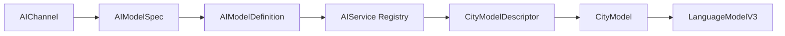
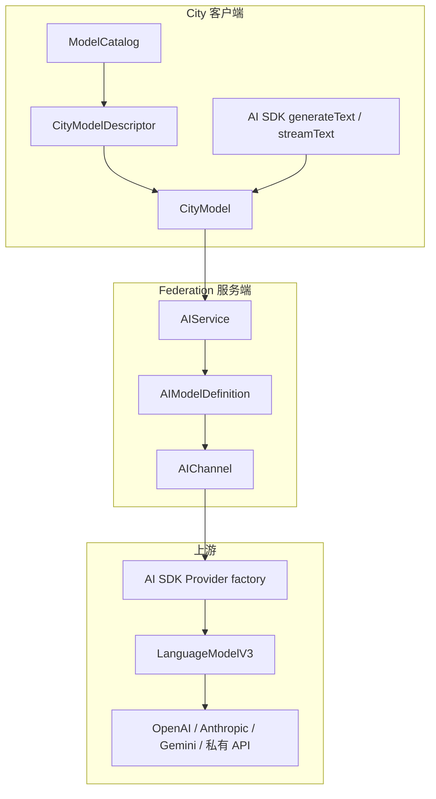
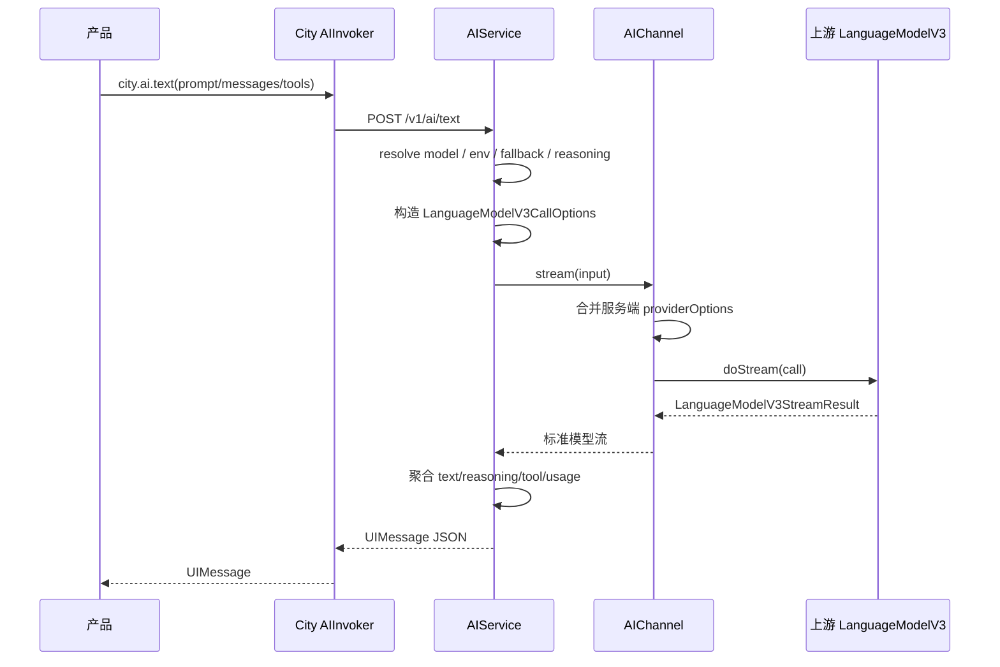
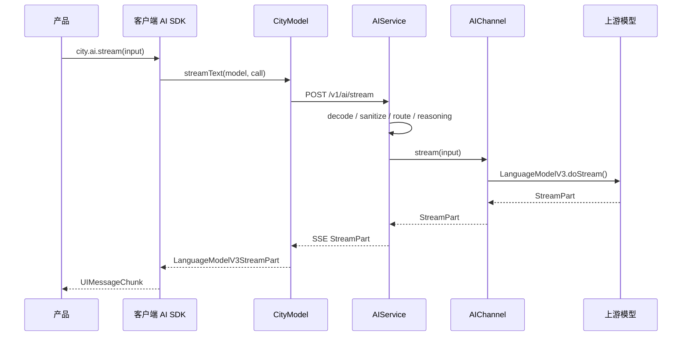
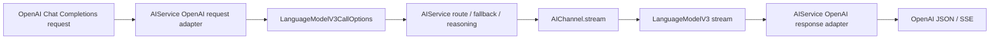

# City AIChannel 与 CityModel 统一架构 PRD

## 1. 文档目的

本文档定义 `@downcity/city` 中 AI 模型体系的下一版统一架构。

本次设计解决以下问题：

- `Provider` 与 AI SDK Provider 同名，但语义不同。
- `ModelConfig`、`PublicModel`、`CityModelDescriptor`、`CityModel` 的生命周期不清晰。
- City 内部存在多组实际等价的 `LanguageModelV3` 类型别名。
- `city.ai.text()`、`city.ai.stream()` 和 `/chat/completions` 仍有不同服务端执行路径。
- `providerOptions` 的客户端、Channel、模型和 reasoning 所有权容易混淆。
- 自定义上游协议需要一个稳定、完整且唯一的执行边界。

最终目标：

```text
AIChannel
  -> AIModelDefinition
  -> CityModelDescriptor
  -> CityModel
  -> LanguageModelV3
```

所有语言调用最终只进入：

```ts
AIChannel.stream(input)
```

## 2. 最终设计结论

### 2.1 核心术语

| 名称 | 所在层 | 定义 |
|---|---|---|
| `LanguageModelV3` | AI SDK | 语言模型标准执行协议 |
| `AIChannel` | Federation 服务端 | 连接并执行一个上游 AI 渠道 |
| `AIModelSpec` | Federation 注册输入 | 开发者声明模型时传入的数据 |
| `AIModelDefinition` | Federation 服务端 | AIService 中已注册、可路由、可执行的模型定义 |
| `CityModelDescriptor` | 公开协议 | 可序列化的模型目录信息 |
| `CityModel` | City 客户端 | 通过 Federation transport 实现的远程 `LanguageModelV3` |
| `AIService` | Federation 服务端 | 模型注册、路由、fallback、reasoning、计费和协议适配 |

### 2.2 核心关系



### 2.3 City 与 AI SDK 的耦合决策

City 明确采用 AI SDK `LanguageModelV3` 作为语言模型标准协议。

这是一项主动依赖，不再在 City 内复制另一套 prompt、tool、usage 和 stream part 协议。

约束：

- `CityModel` 必须实现 `LanguageModelV3`。
- `AIChannel.stream()` 必须接收 `LanguageModelV3CallOptions`。
- `AIChannel.stream()` 必须返回 `LanguageModelV3StreamResult`。
- City transport 只负责 JSON/SSE 编码，不重新定义模型语义。
- City 内不再创建多个语义相同的 `CityRuntime*`、`CityProvider*` 类型别名。

## 3. 背景与现状问题

### 3.1 Provider 命名冲突

AI SDK 中的 Provider 通常是模型工厂：

```ts
const openai = createOpenAI({ apiKey });
const model = openai.responses("gpt-5.6-luna");
```

当前 City `Provider` 则同时负责：

- 保存 Federation env key 和 base URL。
- 保存多个模型共享的默认配置。
- 注册模型。
- 执行语言模型流。
- 声明图片、视频、TTS、ASR 能力。
- 生成账单草稿。

两者都叫 Provider，但不是同一层对象。

### 3.2 ModelConfig 无法表达生命周期

`ModelConfig` 实际包含：

- 公开目录信息。
- Federation 私有连接信息。
- 运行时 action。
- `runtime.stream`。
- fallback。
- billing。

它不是普通配置，而是一个已注册、可执行的服务端模型定义。

### 3.3 PublicModel 是重复别名

公开模型协议已经由 `@downcity/type` 的 `CityModelDescriptor` 表达。

继续保留：

```ts
type PublicModel = CityModelDescriptor;
```

只会增加一个没有新语义的名称。

### 3.4 语言执行仍有第二条路径

当前 `/chat/completions` 可以通过：

```text
独立 OpenAI action
或
baseURL + envKey 自动透传
```

这条路径绕过统一 `stream()`，导致：

- Channel 运行选项可能不一致。
- tools 和 reasoning 适配逻辑可能不同。
- usage 与 billing 收口不同。
- 自定义上游需要实现两遍。

### 3.5 providerOptions 所有权不清晰

系统中存在两类完全不同的 `providerOptions`：

1. 客户端使用 `CityModel` 时传入的 `providerOptions.downcity`。
2. Federation 调用真实 AI SDK model 时传入的 `openai`、`anthropic`、`google` 等上游选项。

如果不明确边界，客户端可能误以为可以控制服务端 `store`、service tier 或数据保留策略。

## 4. 产品目标

### 4.1 单一语言执行边界

以下入口最终必须调用同一个 `AIChannel.stream()`：

```text
city.ai.text()
city.ai.stream()
CityModel.doGenerate()
CityModel.doStream()
POST /v1/ai/chat/completions
```

### 4.2 明确对象生命周期

开发者应能区分：

- 服务端渠道。
- 服务端模型定义。
- 公开模型信息。
- 客户端可执行模型。
- 真实上游 AI SDK model。

### 4.3 Channel 可自定义

Channel 必须同时支持：

- 使用官方 AI SDK Provider。
- 使用 OpenAI Responses。
- 使用 OpenAI Chat Completions。
- 使用 Anthropic、Gemini、DeepSeek。
- 使用私有 HTTP、SSE 或其他协议。

### 4.4 服务端拥有上游策略

以下配置只能由 Federation 服务端决定：

- API Key。
- base URL。
- upstream model ID。
- OpenAI `store`。
- service tier。
- 上游 reasoning 配置。
- Provider 特定 headers 和 metadata。

### 4.5 保持 AI SDK 生态兼容

`CityModel` 可以直接传给：

- AI SDK `generateText()`。
- AI SDK `streamText()`。
- `@downcity/agent` Session。
- 任何接受 AI SDK `LanguageModel` 的宿主。

## 5. 非目标

本 PRD 不处理：

- 自研一套替代 `LanguageModelV3` 的 City 模型协议。
- 改写 AI SDK Provider 内部行为。
- 兼容旧 `Provider`、`ModelConfig`、`PublicModel` 名称。
- 兼容旧 `createClient()` 或自定义 `text()`。
- 重设计图片异步任务协议。
- 重设计视频、TTS、ASR 的返回结构。
- 允许客户端直接传递上游 `providerOptions`。

## 6. 命名方案

### 6.1 对外名称

| 当前名称 | 新名称 | 说明 |
|---|---|---|
| `Provider` | `AIChannel` | Federation AI 执行渠道 |
| `ProviderOptions` | `AIChannelOptions` | Channel 构造参数 |
| `ProviderModelSpec` | `AIModelSpec` | Channel 模型声明参数 |
| `ModelConfig` | `AIModelDefinition` | AIService 内部完整模型定义 |
| `PublicModel` | 删除 | 直接使用 `CityModelDescriptor` |
| `CityLanguageModelV3` | 删除 | 直接使用 AI SDK `LanguageModelV3` |
| `CityProviderStreamCall` | 删除 | 直接使用 `LanguageModelV3CallOptions` |
| `CityProviderStreamResult` | 删除 | 直接使用 `LanguageModelV3StreamResult` |

### 6.2 为什么使用 AIChannel

不使用裸 `Channel`，因为仓库中已经存在 Chat Channel 和 Channel Account。

`AIChannel` 明确表示：

- 该对象属于 AIService。
- 该对象只存在于 Federation 服务端。
- 该对象不是 AI SDK Provider。
- 该对象代表一条可执行的上游 AI 渠道。

## 7. 分层架构



## 8. 核心类型设计

### 8.1 AI SDK 标准类型

直接使用 `@ai-sdk/provider` 类型：

```ts
export type LanguageModelV3 = Extract<
  LanguageModel,
  { readonly specificationVersion: "v3" }
>;

export type LanguageModelV3CallOptions =
  Parameters<LanguageModelV3["doStream"]>[0];

export type LanguageModelV3StreamResult =
  Awaited<ReturnType<LanguageModelV3["doStream"]>>;
```

公共入口只导出上述三个稳定边界。`LanguageModelV3StreamPart` 和
`LanguageModelV3GenerateResult` 仅供内部 transport 聚合使用，不进入 SDK 公共入口。

### 8.2 AI SDK providerOptions 类型

```ts
export type AISDKProviderOptions = NonNullable<
  LanguageModelV3CallOptions["providerOptions"]
>;
```

该类型表示真实上游 AI SDK model 的 Provider 私有选项。

### 8.3 AIChannelOptions

```ts
export interface AIChannelOptions {
  /** Federation 中的 Channel 唯一 ID。 */
  id: string;

  /** Channel 所需的环境变量及其管理员说明。 */
  env?: Record<string, string>;

  /** 上游 API 根地址；只供 Channel 子类使用。 */
  base_url?: string;

  /** Channel 默认 API Key 的 Federation env key。 */
  env_key?: string;

  /** reasoning 映射使用的 AI SDK providerOptions 命名空间。 */
  ai_sdk_provider_id?: string;

  /** Channel 下所有语言模型共享的 AI SDK providerOptions 默认值。 */
  ai_sdk_provider_options?: AISDKProviderOptions;
}
```

说明：

- `base_url` 不再触发 `/chat/completions` 自动透传。
- `env_key` 不再隐式创建任何语言 action。
- Channel 是否支持语言模型，只由是否实现 `stream()` 决定。
- 自定义 Channel 需要多个 key 时使用 `env`，并在子类中显式读取。

Channel 执行不接收通用 Federation `Context`，而是使用明确的领域输入：

```ts
export interface AIChannelModel {
  /** Federation 对外模型 ID。 */
  id: string;
  /** 真实上游模型 ID。 */
  upstream_model: string;
}

export interface AIChannelStreamInput {
  /** 已清理并注入服务端 providerOptions 的标准调用。 */
  call: LanguageModelV3CallOptions;
  /** AIService 已解析完成的最终模型。 */
  model: AIChannelModel;
  /** 读取 Federation 服务端环境变量。 */
  env(key: string): string | undefined;
  /** AIService 已校验的 reasoning。 */
  reasoning?: AIResolvedReasoning;
}

export interface AIChannelActionInput {
  /** 当前非语言 action 的业务输入。 */
  input: Record<string, unknown>;
  /** AIService 已解析完成的最终模型。 */
  model: AIChannelModel;
  /** 读取 Federation 服务端环境变量。 */
  env(key: string): string | undefined;
  /** 当前请求的可选用户 ID。 */
  user_id?: string;
  /** 当前请求所属的可选 City ID。 */
  city_id?: string;
  /** 图片抓取 action 的可选任务上下文。 */
  image_job?: AIImageJobContext;
}
```

### 8.4 AIModelSpec

```ts
export interface AIModelSpec {
  /** Federation 模型目录中的唯一 ID。 */
  id: string;

  /** 真实上游模型 ID，不向普通客户端公开。 */
  upstream_model: string;

  /** 面向用户展示的模型名称。 */
  name: string;

  /** 面向用户展示的模型说明。 */
  description?: string;

  /** 模型总上下文窗口，单位为 token。 */
  context_window?: number;

  /** 模型目录标签。 */
  tags?: string[];

  /** 面向用户展示的价格说明，不参与实际扣费。 */
  price?: string[];

  /** 单模型覆盖的 AI SDK providerOptions。 */
  ai_sdk_provider_options?: AISDKProviderOptions;

  /** 可公开给客户端的模型扩展信息。 */
  meta?: Record<string, unknown>;

  /** 模型公开支持的 reasoning 档位。 */
  reasoning?: CityModelReasoning;

  /** 按媒体输入匹配的 fallback 规则。 */
  fallback?: AIModelFallbackRule[];

  /** 模型成功完成后的账单草稿生成函数。 */
  bill?: AIBill;
}
```

`upstream_model` 从原来的 Channel 级 `passthroughModel` 和隐式 `meta.upstream_model` 中独立出来。

原因：

- 一个 Channel 可以注册多个上游模型。
- upstream ID 是模型私有运行配置，不是 Channel 全局配置。
- 不应把运行时关键字段藏在可公开 `meta` 中。

### 8.5 AIModelFallbackRule

```ts
export interface AIModelFallbackMedia {
  /** 输入媒体的 IANA media type。 */
  media_type: string;

  /** 输入文件名。 */
  filename?: string;

  /** 输入文件 URL 或 Data URL。 */
  url?: string;
}

export interface AIModelFallbackRule {
  /** 判断当前媒体是否需要切换模型。 */
  match: (media: AIModelFallbackMedia) => boolean;

  /** fallback 目标 Federation 模型 ID。 */
  model_id: string;
}
```

fallback 只引用模型 ID，不嵌套另一个完整模型定义。

### 8.6 AIModelRuntime

```ts
type AIModelStream = (
  ctx: Context,
  call: LanguageModelV3CallOptions,
) => Promise<LanguageModelV3StreamResult>;

interface AIModelRuntime {
  /** 可选的标准语言模型执行入口。 */
  stream?: AIModelStream;

  /** 图片、视频、TTS、ASR 等 action。 */
  actions: AIModelActions;
}
```

`AIModelStream`、`AIModelActions` 和 `AIModelRuntime` 是 Federation 内部类型，
不从 `@downcity/city` 根入口导出。语言执行和其它 modality 统一收在一个
`runtime` 字段中，避免 Definition 同时出现两套运行时入口。

### 8.7 AIModelDefinition

```ts
export interface AIModelDefinition
  extends Omit<AIModelSpec, "ai_sdk_provider_options"> {

  /** 当前模型所属 AIChannel ID。 */
  channel_id: string;

  /** 当前模型所需的 Federation 环境变量。 */
  env?: Record<string, string>;

  /** AIService 执行该模型所需的统一内部运行时。 */
  runtime: AIModelRuntime;
}
```

`AIModelDefinition` 只存在于 Federation，不通过 HTTP 返回。`base_url`、`env_key`
只属于 Channel；Definition 只保留注册后真正参与模型路由和执行的数据。

### 8.8 公共类型收敛结果

`@downcity/city` 根入口只导出以下 AI 类型：

```text
AIChannel
AIChannelOptions
AIChannelModel
AIChannelStreamInput
AIChannelActionInput
AIModelSpec
AIModelDefinition
AIModelFallbackMedia
AIModelFallbackRule
AIServiceOptions
LanguageModelV3
LanguageModelV3CallOptions
LanguageModelV3StreamResult
AISDKProviderOptions
AIResolvedReasoning
AICharge
AIBill
AIBillInput
AIChargedResult<T>
AIImageCreateResult
AIImageResult
```

`AIModelStream`、`AIModelActions`、`AIModelRuntime`、路由计划、图片任务 claim、
`LanguageModelV3StreamPart`、`LanguageModelV3GenerateResult` 以及 OpenAI Chat
细粒度协议类型只属于 Federation 内部实现，集中放在 `AI.ts` 或 `AITransport.ts`
但不从公共入口导出。Channel 实现者只接触明确的 Channel 输入、模型声明、标准
LanguageModelV3 边界和统一结果类型，不会接触 AIService 的 Action Context。

### 8.9 CityModelDescriptor

继续使用 `@downcity/type` 的公开协议：

```ts
export interface CityModelDescriptor {
  id: string;
  name: string;
  description: string;
  context_window?: number;
  modalities: string[];
  tags: string[];
  price?: string[];
  meta: Record<string, unknown>;
  reasoning?: CityModelReasoning;
  env_requirements?: CityModelEnvRequirement[];
}
```

公开描述中不包含：

- `channel_id`。
- `upstream_model`。
- API Key。
- base URL。
- `ai_sdk_provider_options`。
- fallback 函数。
- billing 函数。
- runtime function。

如果业务确实需要展示渠道，可以由开发者明确写入 `meta`，不能由系统自动泄露。

### 8.9 CityModel

```ts
export type CityModel = CityModelDescriptor & LanguageModelV3 & {
  /** Downcity 远程模型协议标识。 */
  readonly kind: "downcity.city-model";
};
```

更准确的概念定义：

```text
CityModel
= CityModelDescriptor
+ Federation transport-backed LanguageModelV3 implementation
```

## 9. AIChannel 类设计

### 9.1 基类草案

```ts
export abstract class AIChannel {
  /** Channel 唯一 ID。 */
  readonly id: string;

  /** Channel 环境变量声明。 */
  readonly env?: Record<string, string>;

  /** 上游 API 根地址。 */
  protected readonly base_url?: string;

  /** 默认 API Key 的 Federation env key。 */
  protected readonly env_key?: string;

  /** reasoning 映射使用的 providerOptions 命名空间。 */
  private readonly ai_sdk_provider_id?: string;

  /** Channel 级 AI SDK providerOptions 默认值。 */
  private readonly ai_sdk_provider_options?: AISDKProviderOptions;

  constructor(options: AIChannelOptions);

  /**
   * 可选语言模型执行入口。
   *
   * 子类实现后，该 Channel 注册的模型获得 text 和 stream 能力。
   */
  protected stream?(
    input: AIChannelStreamInput,
  ): Promise<LanguageModelV3StreamResult>;

  /**
   * 把 AIService 已校验的 reasoning 映射为真实上游 providerOptions。
   */
  protected build_reasoning_provider_options(
    input: AIChannelStreamInput,
  ): AISDKProviderOptions | undefined;

  /** 模型调用完成后生成账单草稿。 */
  protected bill?(input: AIBillInput): AICharge | undefined;

  /** 注册当前 Channel 下的一个模型。 */
  model(spec: AIModelSpec): AIModelDefinition;
}
```

### 9.2 Channel 的职责

Channel 只负责：

- 读取服务端 env。
- 创建或调用真实上游模型。
- 选择 Responses、Chat、Anthropic、Gemini 或私有协议。
- 把上游结果适配成 `LanguageModelV3StreamResult`。
- 应用 Channel/Model 私有 AI SDK providerOptions。
- 提供上游特定 reasoning 映射。
- 提供共享 billing 逻辑。

Channel 不负责：

- 解析客户端模型 ID。
- fallback 路由。
- reasoning 档位合法性校验。
- 余额扣款。
- HTTP SSE transport。
- UIMessage 转换。
- OpenAI `/chat/completions` 请求/响应协议转换。

以上职责属于 AIService、CityModel transport 或客户端 AI SDK。

## 10. Channel 使用方式

### 10.1 注册一个 OpenAI Responses Channel

```ts
import { createOpenAI } from "@ai-sdk/openai";
import {
  AIChannel,
  AIService,
  read_required_env,
  type AIChannelStreamInput,
} from "@downcity/city";
import type {
  LanguageModelV3StreamResult,
} from "@ai-sdk/provider";

class OpenAIChannel extends AIChannel {
  protected async stream(
    input: AIChannelStreamInput,
  ): Promise<LanguageModelV3StreamResult> {
    const openai = createOpenAI({
      apiKey: read_required_env(input, this.env_key ?? ""),
      baseURL: this.base_url,
    });
    const model = openai.responses(input.model.upstream_model);
    return model.doStream(input.call);
  }
}

const openai_channel = new OpenAIChannel({
  id: "openai-main",
  env_key: "OPENAI_API_KEY",
  base_url: "https://api.openai.com/v1",
  ai_sdk_provider_id: "openai",
  ai_sdk_provider_options: {
    openai: {
      store: true,
    },
  },
});

const ai = new AIService();

ai.use(openai_channel.model({
  id: "gpt-5.6-luna",
  upstream_model: "gpt-5.6-luna",
  name: "GPT-5.6 Luna",
  context_window: 400_000,
  reasoning: {
    efforts: [
      { id: "low", name: "低" },
      { id: "medium", name: "标准" },
      { id: "high", name: "高" },
    ],
    default_effort: "medium",
  },
}));

base.use(ai);
```

### 10.2 同一 Channel 注册多个模型

```ts
ai.use([
  openai_channel.model({
    id: "fast",
    upstream_model: "gpt-5.6-mini",
    name: "Fast",
  }),
  openai_channel.model({
    id: "quality",
    upstream_model: "gpt-5.6-luna",
    name: "Quality",
    ai_sdk_provider_options: {
      openai: {
        serviceTier: "priority",
      },
    },
  }),
]);
```

`AIChannel` 是共享渠道配置，`AIModelSpec` 是具体模型配置。

### 10.3 OpenAI Chat Channel

Chat 与 Responses 的选择必须写在 Channel 内，不由 City 推断：

```ts
class OpenAIChatChannel extends AIChannel {
  protected async stream(input) {
    const openai = createOpenAI({
      apiKey: read_required_env(input, this.env_key ?? ""),
      baseURL: this.base_url,
    });
    const model = openai.chat(input.model.upstream_model);
    return model.doStream(input.call);
  }
}
```

### 10.4 Anthropic Channel

```ts
class AnthropicChannel extends AIChannel {
  protected async stream(input) {
    const anthropic = createAnthropic({
      apiKey: read_required_env(input, this.env_key ?? ""),
      baseURL: this.base_url,
    });
    const model = anthropic(input.model.upstream_model);
    return model.doStream(input.call);
  }

  protected build_reasoning_provider_options(input) {
    const reasoning = input.reasoning;
    if (!reasoning) return undefined;
    return {
      anthropic: {
        effort: reasoning.effort,
      },
    };
  }
}
```

### 10.5 私有 HTTP Channel

自定义 Channel 不要求使用 AI SDK Provider，但必须返回标准流：

```ts
class PrivateHTTPChannel extends AIChannel {
  protected async stream(
    input: AIChannelStreamInput,
  ): Promise<LanguageModelV3StreamResult> {
    const response = await fetch(`${this.base_url}/generate`, {
      method: "POST",
      headers: {
        authorization: `Bearer ${read_required_env(input, this.env_key ?? "")}`,
        "content-type": "application/json",
      },
      body: JSON.stringify({
        model: input.model.upstream_model,
        prompt: input.call.prompt,
        tools: input.call.tools,
      }),
      signal: input.call.abortSignal,
    });

    return {
      stream: convert_private_response_to_language_model_stream(response),
    };
  }
}
```

私有转换器必须正确产生：

- `stream-start`。
- `response-metadata`。
- `text-start/text-delta/text-end`。
- `reasoning-start/reasoning-delta/reasoning-end`。
- `tool-call`。
- `finish`，包括 `finishReason` 和 `usage`。
- `error`。

## 11. providerOptions 所有权

### 11.1 两类 providerOptions

#### CityModel 客户端选项

当 `CityModel` 被传给 AI SDK 时，调用方可以传：

```ts
providerOptions: {
  downcity: {
    reasoningEffort: "high",
  },
}
```

`downcity` 表示 CityModel 这个远程 AI SDK model 的公开选项。

V1 只允许：

- `downcity.reasoningEffort`。

其它客户端 providerOptions：

- 不进入 Federation Channel。
- 不转换成 `openai`、`anthropic` 或 `google` 选项。
- 在 CityModel transport 边界丢弃。

#### Federation 上游选项

Channel 和模型配置中的：

```ts
ai_sdk_provider_options: {
  openai: {
    store: true,
  },
}
```

只存在于 Federation 服务端，最终传给真实 AI SDK model：

```ts
model.doStream({
  ...call,
  providerOptions: resolved_options,
});
```

### 11.2 合并顺序

```text
AIChannel 默认值
  < AIModelSpec 覆盖值
  < AIService 已校验 reasoning 映射
```

示例：

```ts
const channel_options = {
  openai: {
    store: true,
    serviceTier: "default",
  },
};

const model_options = {
  openai: {
    store: false,
    serviceTier: "priority",
  },
};

const reasoning_options = {
  openai: {
    reasoningEffort: "high",
  },
};
```

最终：

```ts
{
  openai: {
    store: false,
    serviceTier: "priority",
    reasoningEffort: "high",
  },
}
```

按 Provider ID 和第一层字段浅合并。嵌套对象由具体 AI SDK Provider 自己定义整体语义。

### 11.3 store 的所有权

OpenAI Responses `store` 必须由 Channel 或具体模型决定：

```ts
new OpenAIChannel({
  ai_sdk_provider_options: {
    openai: { store: true },
  },
});
```

或：

```ts
openai_channel.model({
  id: "private-model",
  upstream_model: "gpt-5.6-luna",
  name: "Private Model",
  ai_sdk_provider_options: {
    openai: { store: false },
  },
});
```

语义：

- `store: true`：允许 OpenAI 保存 Responses application state，后续可以引用已保存 item。
- `store: false`：后续工具轮次需要发送完整 function call 上下文。
- `store` 不控制 prompt cache。
- CityModel 客户端不能覆盖 `store`。
- AIService 不根据模型名称或 Responses 身份自动猜测 `store`。

### 11.4 自定义 Channel 私有配置

不属于 AI SDK `providerOptions` 的配置，不应塞入 `ai_sdk_provider_options`。

应由 Channel 子类使用明确字段：

```ts
interface PrivateChannelOptions extends AIChannelOptions {
  /** 私有网关租户 ID。 */
  tenant_id: string;

  /** 私有网关签名算法。 */
  signature_algorithm: "hmac-sha256";
}
```

这样可以保持：

- AI SDK providerOptions 只表达 AI SDK 语义。
- Channel 私有连接配置保持强类型。
- 不使用无约束 `Record<string, unknown>` 作为通用配置垃圾桶。

## 12. CityModel 的定义与用法

### 12.1 CityModel 是什么

`CityModel` 是客户端远程模型代理。

```text
普通 AI SDK model
  doStream() -> 直接请求上游

CityModel
  doStream() -> 请求 Federation -> AIChannel -> 上游
```

CityModel 自己不知道：

- 真实 Channel。
- 真实上游模型 ID。
- API Key。
- base URL。
- store。
- billing 价格算法。
- fallback 目标。

### 12.2 从模型目录获得 CityModel

```ts
const catalog = await city.ai.catalog();
const model = catalog.get("gpt-5.6-luna");

if (!model) {
  throw new Error("model not found");
}
```

`catalog.get()` 返回的不是纯 JSON descriptor，而是已经绑定当前 City user 鉴权请求器的 `CityModel`。

### 12.3 交给 AI SDK

```ts
import { generateText } from "ai";

const result = await generateText({
  model,
  prompt: "分析这个仓库",
});
```

### 12.4 交给 AI SDK streamText

```ts
import { streamText } from "ai";

const result = streamText({
  model,
  prompt: "分析这个仓库",
  tools,
});

for await (const chunk of result.fullStream) {
  consume(chunk);
}
```

### 12.5 交给 Downcity Agent

```ts
const session = await agent.session_collection().create_session();

await session.set({ model });

const turn = await session.prompt({
  query: "检查项目状态",
});

const output = await turn.finished;
```

适用场景：

- Agent 不应持有上游 API Key。
- 多个 Agent 共享 Federation 模型目录。
- 需要服务端统一 fallback、reasoning、usage 和 billing。
- 需要运行时切换 Federation 中的模型。
- 宿主已经使用 AI SDK，希望把远程 City 模型当成本地模型使用。

### 12.6 使用 city.ai.text

```ts
const message = await city.ai.text({
  model: "gpt-5.6-luna",
  prompt: "你好",
  reasoning_effort: "high",
  tools,
});
```

适用场景：

- 产品只需要一次完整 `UIMessage`。
- 不需要消费增量流。
- 希望由 Federation 聚合标准模型流。

### 12.7 使用 city.ai.stream

```ts
const stream = await city.ai.stream({
  model: "gpt-5.6-luna",
  prompt: "你好",
  reasoning_effort: "high",
  tools,
});
```

适用场景：

- 产品需要 `UIMessageChunk`。
- 前端需要实时展示 text/reasoning/tool 状态。
- 需要 AI SDK 标准流语义。

### 12.8 不需要 CityModel 的场景

以下情况直接使用真实 AI SDK model：

- 单机应用明确自行持有 API Key。
- 不需要 Federation 模型目录。
- 不需要服务端 fallback 和 billing。
- 不需要 City user/city_id 鉴权。
- 只在本地 Agent SDK 中执行模型。

示例：

```ts
const openai = createOpenAI({ apiKey });
const model = openai.responses("gpt-5.6-luna");

await session.set({ model });
```

## 13. 完整调用链

### 13.1 city.ai.text



### 13.2 city.ai.stream



### 13.3 CityModel.doGenerate

```text
CityModel.doGenerate(call)
  -> CityModel.doStream(call)
  -> /v1/ai/stream
  -> AIChannel.stream(input)
  -> 聚合标准 LanguageModelV3 stream
  -> LanguageModelV3GenerateResult
```

`CityModel.doGenerate()` 不走 `/v1/ai/text`，避免出现第二套 CityModel 模型协议。

## 14. /chat/completions 统一设计

### 14.1 删除 Channel.openai

`AIChannel` 不提供：

```ts
openai(ctx)
```

也不提供 `base_url + env_key` 自动透传。

### 14.2 新调用链



### 14.3 行为要求

请求适配必须支持：

- system/user/assistant/tool messages。
- text 和 image URL。
- function tools。
- tool choice。
- temperature、top_p、max_tokens 等标准字段。
- `reasoning_effort`。
- stream/non-stream。

响应适配必须支持：

- text delta。
- reasoning（在兼容协议允许的扩展字段中表达）。
- tool calls。
- finish reason。
- usage。
- provider error 到 OpenAI error 的稳定映射。

### 14.4 重要行为变化

`/chat/completions` 不再是原始上游透传。

它成为 AIService 的兼容协议适配层，因此：

- 上游原始 header 不保证原样返回。
- 上游私有字段不保证透传。
- 所有请求经过统一 Channel 配置。
- 所有请求经过统一 fallback、reasoning、usage 和 billing。

## 15. AIService 职责

AIService 继续负责：

- Channel 生成的模型定义注册。
- model ID 唯一性。
- env 可用性判断。
- media fallback。
- reasoning 档位校验和默认值解析。
- text 非流式聚合。
- LanguageModelV3 transport。
- OpenAI Chat Completions 双向适配。
- usage 归一化。
- billing 调度与幂等扣费。
- 公开目录生成。

AIService 不负责：

- 创建 OpenAI/Anthropic/Gemini client。
- 猜测具体上游协议。
- 猜测 store。
- 解释 Channel 私有连接配置。

## 16. 错误边界

### 16.1 注册错误

以下情况在注册时失败：

- Channel ID 为空。
- 模型 ID 为空或重复。
- `upstream_model` 为空。
- reasoning effort ID 重复。
- default reasoning effort 不存在。
- fallback 目标模型不存在，在 AIService 完成全部注册后校验。

### 16.2 调用错误

以下情况返回 `422`：

- model ID 不存在。
- Channel env 未配置。
- reasoning effort 不受支持。
- 请求媒体没有可用模型。
- tool schema 无法转换。

以下情况返回上游映射错误：

- 上游认证失败。
- 上游限流。
- 上游上下文超限。
- 上游模型不支持 tool/media。

### 16.3 流错误

标准流必须满足：

- 正常结束一定包含 `finish`。
- `finish` 一定包含 `finishReason` 和 `usage`。
- 异常通过 `error` part 或流异常表达。
- Federation transport 不泄露 API Key、请求 header 或服务端 providerOptions。

## 17. 安全边界

- API Key 只存在于 Federation env。
- `AIModelDefinition` 不通过 HTTP 返回。
- `upstream_model` 默认不公开。
- Channel/Model `ai_sdk_provider_options` 不进入模型目录。
- 客户端 `providerOptions.openai` 等字段全部丢弃。
- 只有 `providerOptions.downcity` 中明确支持的字段可以进入 City transport。
- `/chat/completions` 不能接受任意上游 header 透传。
- billing 和 store 策略不能由普通 City user 覆盖。

## 18. 文件与模块边界

建议结构：

```text
packages/type/src/types/
└── CityModel.ts

packages/city/src/types/
├── AI.ts
└── AITransport.ts

packages/city/src/service/ai/
├── AIChannel.ts
├── ai-service.ts
├── model-registry.ts
├── model-routing.ts
├── language-model-text.ts
├── language-model-stream.ts
├── OpenAIChatCompletionsAdapter.ts
├── charge-runtime.ts
└── helpers.ts

packages/city/src/pact/invoker/ai/
├── index.ts
├── CityModel.ts
└── client-stream.ts
```

约束：

- 所有类型放在 `types/`。
- 每个模块包含模块注释。
- 单模块不超过 800-1000 行。
- 不使用动态导入。
- 关键逻辑使用中文注释。
- 不保留旧名称兼容别名。

## 19. 迁移方案

### 阶段一：类型与命名

- 新增 `AIChannelOptions`。
- 新增 `AIModelSpec`。
- 新增 `AIModelDefinition`。
- `Provider` 改名 `AIChannel`。
- 删除 `PublicModel`。
- 删除重复 LanguageModelV3 类型别名。
- 直接依赖 `@ai-sdk/provider` 的 V3 类型。

### 阶段二：模型注册

- `.model()` 接受 `AIModelSpec`。
- `AIModelDefinition` 保存 `channel_id` 和 `upstream_model`。
- `passthroughModel` 删除。
- `meta.upstream_model` 隐式约定删除。
- 模型目录只生成 `CityModelDescriptor`。

### 阶段三：Channel 执行

- Channel 只通过 `stream()` 提供语言能力。
- `city.ai.text()` 从 stream 派生。
- `city.ai.stream()` 使用同一 stream。
- `CityModel.doGenerate()` 聚合 `doStream()`。
- Channel/Model/reasoning providerOptions 合并统一。

### 阶段四：OpenAI compatible

- 删除 `AIChannel.openai()`。
- 删除 auto passthrough。
- 新增 Chat Completions request adapter。
- 新增 JSON/SSE response adapter。
- `/chat/completions` 统一调用 Channel stream。

### 阶段五：模板和文档

- Node 模板改用 `AIChannel`。
- Edge 模板改用 `AIChannel`。
- 更新 City SDK 中英文文档。
- 更新 Agent 与 CityModel 集成文档。
- 删除所有 Provider/ModelConfig/PublicModel 旧示例。

## 20. 测试要求

### 20.1 类型测试

- `CityModel` 可赋值给 AI SDK `LanguageModelV3`。
- `AIChannel.stream` 参数与 AI SDK V3 完全一致。
- `AIModelDefinition` 不可赋值给 `CityModelDescriptor`，必须显式转换。
- 客户端公开类型不包含 Channel 私有字段。

### 20.2 Channel 测试

- 没有 `stream()` 的 Channel 不注册语言能力。
- 实现 `stream()` 后同时获得 text 和 stream。
- AI SDK model 接收到合并后的 providerOptions。
- Channel 默认配置不会被调用方原地修改。
- 模型配置不会泄露到公开目录。

### 20.3 tools 测试

- prompt + tools。
- messages + tools。
- tool call。
- tool result continuation。
- parallel tool calls。
- OpenAI Responses `store: true` continuation。
- OpenAI Responses `store: false` 完整 function call continuation。

### 20.4 stream 测试

- text。
- reasoning。
- source/file。
- tool-call。
- approval request。
- usage。
- provider metadata。
- abort signal。
- error part。

### 20.5 路由测试

- text fallback。
- stream fallback。
- chat/completions fallback。
- fallback 后 reasoning 按最终模型校验。
- env 不可用模型不会被执行。

### 20.6 OpenAI compatible 测试

- 非流式 JSON。
- 流式 SSE。
- tools。
- image URL。
- reasoning effort。
- usage。
- 上游错误映射。
- 确认不调用独立 Channel openai action。

## 21. 验收标准

以下条件全部满足后，本 PRD 实现完成：

1. 公共 API 不再导出 `Provider`、`ProviderOptions`、`ProviderModelSpec`、`ModelConfig`、`PublicModel`。
2. 公共 API 导出 `AIChannel`、`AIChannelOptions`、`AIModelSpec`、`AIModelDefinition`。
3. `CityModelDescriptor` 是唯一公开模型信息类型。
4. `CityModel` 继续完整实现 `LanguageModelV3`。
5. Channel stream 直接使用 AI SDK V3 标准参数和返回类型。
6. `city.ai.text()`、`city.ai.stream()`、CityModel 和 `/chat/completions` 最终调用同一个 Channel stream。
7. Channel 不再有 `openai()` 方法。
8. AIService 不再有 `base_url + env_key` 自动上游透传。
9. 客户端不能控制真实上游 providerOptions。
10. Channel/Model/reasoning 的 providerOptions 合并顺序有完整测试。
11. OpenAI Responses tools 在 `store: true/false` 下都有 continuation 测试。
12. Node、Edge 模板完成迁移。
13. City 全量测试、全仓 typecheck 和 Homepage build 通过。
14. 中英文用户文档完成同步更新。

## 22. 最终心智模型

```text
AI SDK Provider factory
  -> 创建真实上游 LanguageModelV3

AIChannel
  -> Federation 服务端执行渠道
  -> 持有服务端连接配置
  -> 调用真实上游 LanguageModelV3

AIModelDefinition
  -> AIService 中已注册的服务端模型

CityModelDescriptor
  -> 对外公开的模型目录信息

CityModel
  -> CityModelDescriptor
  + Federation transport-backed LanguageModelV3
```

完整调用关系：

```text
产品 / Agent / AI SDK
  -> CityModel
  -> Federation AIService
  -> AIModelDefinition
  -> AIChannel.stream()
  -> 真实 AI SDK LanguageModelV3
  -> 上游 API
```

这套结构只保留一个模型执行协议、一个服务端语言执行边界，以及一条从服务端注册到客户端执行的清晰生命周期。
