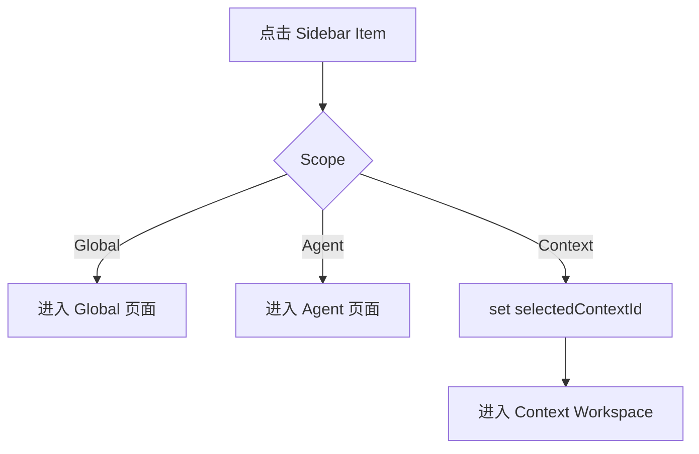
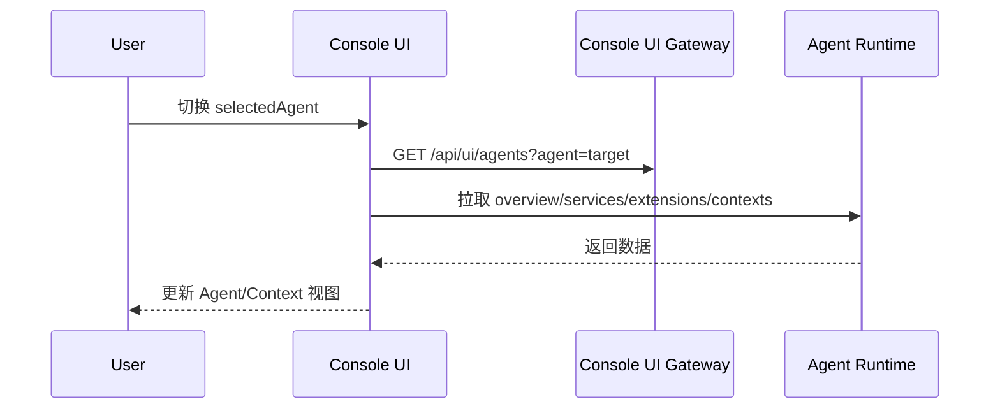
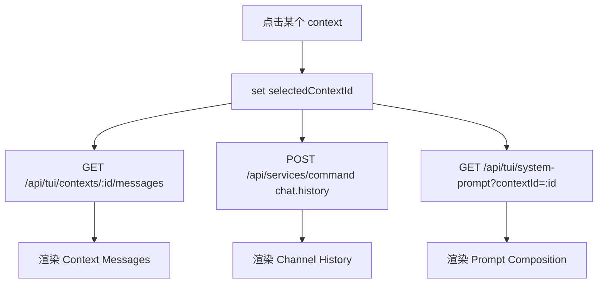

# Console UI 分层重构设计（V3）

## 1. 结论先行

本次不再按“对象名”做主分层（console/agent/context 直接平铺），改为三层模型：

1. `Scope`（作用域层）
2. `Domain`（功能层）
3. `Navigation`（导航层）

目标：任何页面都能清楚回答两件事：

- 我当前作用于哪一层（Global / Agent / Context）？
- 我当前是在观察、操作还是排查（Observe / Operate / Inspect）？

---

## 2. Scope（作用域层）

## 2.1 Global

定义：全局 console 级能力，不依赖单个 context。  
包含：

- console 进程状态
- console ui 状态
- registry 规模与健康
- model 配置管理（activeModel 切换）
- agents 管理与切换
- extensions 运行状态与控制

## 2.2 Agent

定义：当前选中 agent 的 runtime 能力。  
包含：

- services / tasks / logs
- agent 基础状态（host/port/pid/project）

## 2.3 Context

定义：当前选中 context 的会话与历史态。  
包含：

- context 元信息
- context message timeline
- channel history
- system prompt 预览
- `local_ui` 写入入口

---

## 3. Domain（功能层）

## 3.1 Observe（观察）

- overview / status / counts / health
- 只读，不放 destructive 操作

## 3.2 Operate（操作）

- start / stop / restart / test / reconnect / run task
- 必须显式按钮与反馈

## 3.3 Inspect（排查）

- logs / history / prompt composition / run detail
- 面向诊断，不做状态总览混排

---

## 4. Navigation（导航层）

Sidebar 固定三组（按 Scope）：

1. `Global`
2. `Agent`
3. `Context`

## 4.1 Global 组

- Overview（Observe）
- Console Runtime（Observe + Operate）
- Model（Operate + Inspect）
- Agents（Operate + Inspect）
- Extensions（Operate + Inspect）

## 4.2 Agent 组

- Agent Overview（Observe）
- Services（Operate）
- Tasks（Operate + Inspect）
- Logs（Inspect）

## 4.3 Context 组

- Context Overview（Observe）
- `local_ui`（Operate + Inspect）
- 其余 context 列表项（Observe + Inspect）

---

## 5. 页面职责边界

## 5.1 Global / Overview

只显示摘要：

- console running/stopped
- ui running/stopped
- managed agents count
- global warning/error count

禁止：

- service/extension 控制按钮

## 5.2 Global / Console Runtime

显示并操作：

- console 运行状态细节
- model ready 状态
- runtime 刷新、诊断入口

## 5.3 Agent / Services

- service 列表 + `start/restart/stop`
- 不显示 extension 表

## 5.4 Global / Extensions

- extension 列表 + `start/restart/stop`
- 错误信息聚焦显示

## 5.5 Context / Workspace

核心布局：左侧 context 元信息，右侧历史窗口。

左侧：

- context 概览
- system prompt 构成

右侧：

- context messages
- channel history

底部：

- 仅 `local_ui` 显示输入框
- 其他 context 只读

补充：

- channel 链接状态与 `test/reconnect` 入口统一放在 `Context Overview`，不单独开 `Channels` 页面。

---

## 6. Context 视觉与交互规范

每个 context item 必须显示：

- `contextId`（主标题，等宽）
- `lastRole + lastText`（一行摘要）
- `updatedAt`
- `messageCount`

分组显示：

- `local_ui`
- `chat:*`
- `api:*`
- `other`

排序：

- `updatedAt desc`，其次 `contextId asc`

---

## 7. 状态流（State Flow）

顶层状态：

- `selectedAgentId`
- `activeScope` (`global|agent|context`)
- `activePage`
- `selectedContextId`

切换规则：

1. 切 agent：刷新 agent 级数据，并重置 context 选中。
2. 切 scope：不改 agent，仅切页面域。
3. 切 context：刷新 messages/history/prompt。
4. send message：强制 `contextId = local_ui`。

---

## 8. Markdown 原型图

## 8.1 全局骨架

```text
+----------------------------------------------------------------------------------------------------+
| TopBar: [Scope / Page]                         [status pill] [refresh] [selected agent summary]   |
+----------------------------------------------------------------------------------------------------+
| Sidebar                                                                 | Main                      |
|----------------------------------------------------------------------------------------------------|
| [Global]                                                                | 按 Scope + Page 渲染      |
|   - Overview                                                            |                           |
|   - Console Runtime                                                     |                           |
|   - Model                                                               |                           |
|   - Agents                                                              |                           |
|   - Extensions                                                          |                           |
|                                                                          |                           |
| [Agent]                                                                  |                           |
|   - Agent Overview                                                      |                           |
|   - Services                                                            |                           |
|   - Tasks                                                               |                           |
|   - Logs                                                                |                           |
|                                                                          |                           |
| [Context]                                                                |                           |
|   - Context Overview                                                    |                           |
|   - local_ui                                                            |                           |
|   - chat:qq:***                                                         |                           |
|   - chat:telegram:***                                                   |                           |
|   - api:chat:***                                                        |                           |
+----------------------------------------------------------------------------------------------------+
```

## 8.2 Context Workspace

```text
+------------------------------------------------------------------------------------------------------+
| Context Workspace: [contextId]                                                                       |
|------------------------------------------------------------------------------------------------------|
| Left (Meta)                                   | Right (Inspect)                                      |
|----------------------------------------------|------------------------------------------------------|
| Context Card                                  | Context Messages                                     |
| - id                                          | - role / text / ts                                   |
| - count                                       |                                                      |
| - updatedAt                                   | Channel History                                      |
|                                               | - direction / text / ts                              |
| Prompt Composition                            |                                                      |
| - sections                                    |                                                      |
|------------------------------------------------------------------------------------------------------|
| Composer (only local_ui)                                                                            |
| [input.................................................] [send]                                      |
+------------------------------------------------------------------------------------------------------+
```

---

## 9. 交互流程（Mermaid）

## 9.1 Sidebar 导航



## 9.2 切换 Agent



## 9.3 点击 Context



---

## 10. 实施顺序

1. 先改 Sidebar：按 `Global / Agent / Context` 三组重排。
2. 恢复并独立 `Agent/Extensions` 页面。
3. 将 `Context` 统一收敛到 `Context Workspace`。
4. 最后做样式与空态统一。

---

## 11. 验收标准

1. 任意页面可一眼识别当前 Scope 与 Domain。
2. `Extensions` 不与 `Runtime/Services` 混排。
3. Context 列表具备分组、排序、摘要、高亮。
4. 仅 `local_ui` 可发送；其他 context 严格只读。
5. Overview 保持纯 Observe，不混入操作按钮。
