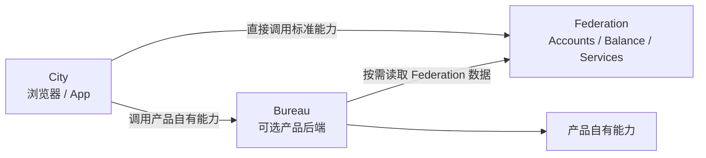
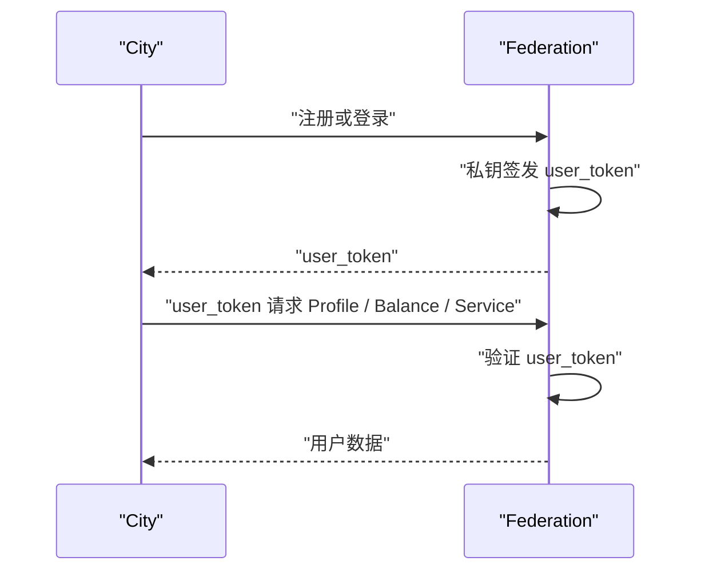
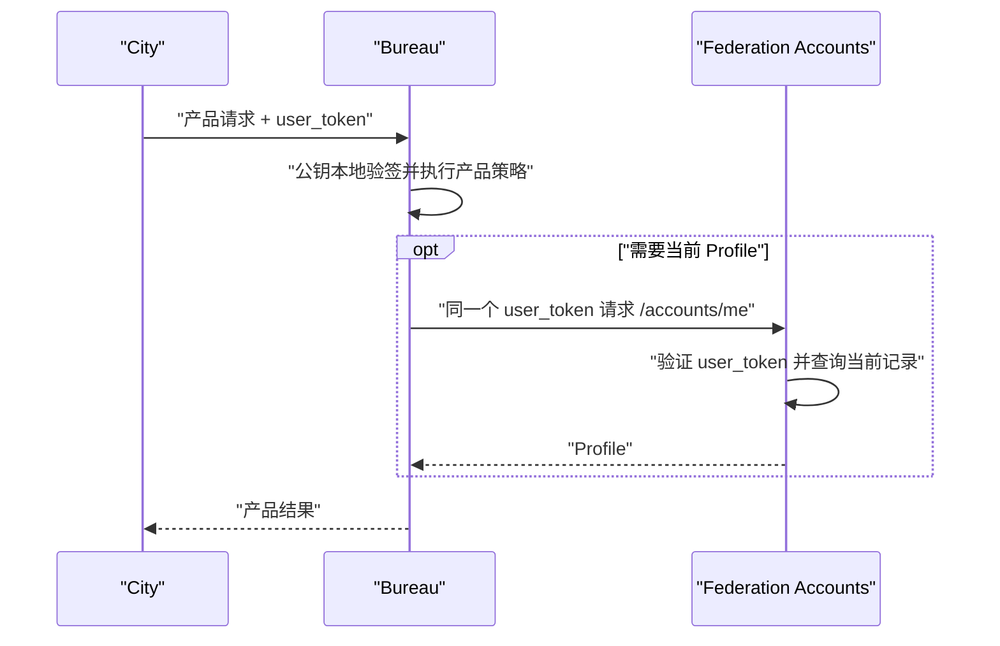

# Federation、City 与 Bureau 鉴权 PRD

## 1. 文档状态

- 状态：已确认并实现
- 范围：`@downcity/city`、Federation Accounts、CLI 与用户文档
- 核心模型：City 直连 Federation；Bureau 是可选产品后端

## 2. 目标

- Federation 是统一账户、Profile、余额和用户 Token 的事实源。
- City 是终端产品客户端，直接访问 Federation，不依赖 Bureau。
- Bureau 是某个 City 部署在独立服务器上的可选后端。
- Federation 使用 Ed25519 私钥签发 `user_token`。
- Bureau 使用 Federation 公钥在本地验证 `user_token`。
- Bureau 只在需要当前 Federation 数据时发起在线请求。
- Bureau 不承载 Federation 管理能力。
- Federation 启动时不默认创建 Bureau Token。

## 3. 系统关系



City 与 Bureau 是 Federation 的两个独立调用方，不是上下游依赖关系。

## 4. 角色定义

### 4.1 Federation

Federation 负责：

- 用户注册与登录。
- Accounts 与 Profile。
- Balance、Usage、Payment。
- 使用 Ed25519 私钥签发 `user_token`。
- 发布 discovery 与 JWKS 公钥。
- 保存 Bureau 注册表。
- 为运维控制面提供独立的 admin 鉴权。

业务侧保持最简初始化：

```ts
const federation = new Federation({ db });
federation.use(new AccountsService());
```

Federation 首次启动会自动创建用户签名 Key Ring，但不会创建任何 Bureau Token。

### 4.2 City

City 是终端用户客户端：

```ts
const city = new City({
  federation_url: "https://fed.example.com",
  user_token,
});
```

City 直接访问 Federation：

```ts
const profile = await city.user().profile();
const models = await city.ai.catalog();
const methods = await city.payment.methods();
```

即使产品没有部署 Bureau，City 仍可使用 Federation 的全部标准用户能力。

### 4.3 Bureau

Bureau 是某个 City 的可选产品后端：

```ts
const bureau = new Bureau({
  federation_url: "https://fed.example.com",
  bureau_token: process.env.DOWNCITY_BUREAU_TOKEN!,
});
```

Bureau 负责：

- 获取自己绑定的 City 上下文。
- 获取并缓存 Federation JWKS。
- 本地验证产品请求携带的 `user_token`。
- 检查用户 Token 是否属于当前 City。
- 执行产品自己的业务策略。
- 按需携带同一个 `user_token` 查询 Federation 当前数据。

Bureau 不负责：

- 创建或管理 City。
- 管理 Federation env。
- 创建或撤销其他 Bureau。
- 使用 Federation admin 权限。
- 每次请求在线 introspection 用户 Token。

### 4.4 FederationAdmin

FederationAdmin 只属于控制面和 CLI：

```ts
const admin = new FederationAdmin({
  federation_url,
  admin_secret_key,
});
```

它与 City 用户请求、Bureau 产品后端请求完全分离。

## 5. 凭证模型

| 凭证 | 主体 | 用途 | 是否参与用户本地验签 |
| --- | --- | --- | --- |
| `user_token` | Federation 用户 | 用户身份与 City 归属 | 是 |
| `bureau_token` | 产品后端 | 获取 Bureau 注册上下文和后端专属权限 | 否 |
| `admin_secret_key` | Federation 控制面 | 运维管理 | 否 |

### 5.1 user_token

`user_token` 是 Ed25519 JWT，至少包含：

- `iss`。
- `aud = downcity:user`。
- `user_id`。
- `city_id`。
- `iat`、`exp`、`jti`。

Federation 持有私钥；Bureau 只获得公钥，因此 Bureau 能验证但不能伪造用户 Token。

### 5.2 bureau_token

Bureau Token 是高熵不透明凭证：

```text
fb_<token_id>.<secret>
```

数据库只保存完整 Token 的 SHA-256 hash，以及：

- `token_id`。
- `name`。
- `city_id`。
- `capabilities`。
- `status`。
- 创建和更新时间。

`bureau_token` 只负责回答“这个后端代表哪个 City”，不用于回答“当前用户是谁”。

## 6. Bureau 注册生命周期

Federation 启动后注册表为空。Bureau Token 不是 Federation 在线签发的对象，
而是由 `fed` CLI 在运维侧生成的部署凭证：

```bash
fed bureau add --name "Product A Backend" --city-id city_product_a
```

CLI 在本地生成明文和 hash，通过 Federation Admin 控制面登记。Federation
数据库只保存 `token_id`、`token_hash`、`city_id` 和权限元数据，明文只显示一次：

```env
DOWNCITY_FEDERATION_URL=https://fed.example.com
DOWNCITY_BUREAU_TOKEN=fb_br_xxx.secret
```

CLI 也提供注册表管理：

```bash
fed bureau list
fed bureau revoke br_xxx
```

Federation 和 Bureau 可以在不同服务器。Bureau 不调用注册接口，也不需要访问
Federation 数据库，只使用环境变量中的凭证请求自己的上下文：

```ts
const bureau = new Bureau({
  federation_url: process.env.DOWNCITY_FEDERATION_URL!,
  bureau_token: process.env.DOWNCITY_BUREAU_TOKEN!,
});
```

Admin SDK 的注册接口只接收 CLI 生成的 hash：

```ts
await admin.bureaus.register({
  token_id,
  token_hash,
  name: "Product A Backend",
  city_id: "city_product_a",
});
```

撤销通过 Admin 控制面执行：

```ts
await admin.bureaus.revoke(token_id);
```

不存在 `federation.bureaus.create()` 或 `bureau.bureaus.create()` 这类运行时签发调用。
HTTP `/v1/bureaus/context` 只允许 Bureau 读取自己的上下文；`register/list/revoke`
只允许 Federation Admin 控制面调用。

## 7. 用户登录与 City 调用



City 不经过 Bureau。

## 8. Bureau 本地鉴权

首次需要验签时，Bureau 获取：

- `/.well-known/downcity.json`。
- `/.well-known/jwks.json`。
- `/v1/bureaus/context`。

之后在缓存期内本地执行：

```ts
const identity = await bureau.identify(request);
```

验证项目：

1. Token 使用 EdDSA。
2. `kid` 存在于 Federation JWKS。
3. Ed25519 签名正确。
4. `iss` 等于可信 Federation issuer。
5. `aud` 等于 `downcity:user`。
6. Token 未过期。
7. `user_token.city_id` 等于 Bureau Context 的 `city_id`。

`identify()` 返回：

```ts
interface BureauIdentity {
  user_id: string;
  city_id: string;
  metadata: Record<string, unknown>;
  token_id: string;
  expires_at: number;
}
```

它不请求 `/accounts/identify`，也不承诺用户当前仍存在于 Accounts。

## 9. Bureau 按需读取 Federation 数据

产品只需要 JWT 身份时：

```ts
const identity = await bureau.identify(request);
```

产品需要当前 Profile 时：

```ts
const user = await bureau.user(request);
const profile = await user.profile();
```

完整流程：



Federation 再次验证同一个 `user_token`，是跨服务器信任边界，不是双 Token 用户鉴权。

## 10. 用户删除与撤销语义

公钥本地验签不能立即感知用户删除，这是离线验证的固有边界。

- 普通产品操作依赖较短的 `user_token` TTL。
- Profile、余额、支付等当前状态由 Federation 在线接口返回。
- 高风险操作可以显式查询 Federation 当前状态。
- 不把所有产品请求强制改成在线 introspection。

Bureau Token 被撤销后，新的 Bureau Context 请求会失败；已经加载的用户公钥本身仍然是公开信息，不赋予签发用户 Token 的能力。

## 11. 验收标准

- `new Federation({ db })` 不默认创建 Bureau Token。
- `fed bureau add` 是 Bureau Token 的部署登记入口。
- Federation 数据库只保存 Bureau Token hash，不保存明文。
- `FederationAdmin.bureaus.register/list/revoke()` 只属于控制面。
- Bureau Token 必须绑定 active City。
- Bureau 运行时接口不能创建、列表或撤销 Token。
- `Bureau` 不暴露 City、env、余额管理能力。
- `Bureau.identify()` 在缓存期内不访问 Federation Accounts。
- Bureau 拒绝错误签名、过期和跨 City 用户 Token。
- `City.user().profile()` 直接访问 Federation。
- `bureau.user(request).profile()` 按需访问同一 Federation Profile。
- FederationAdmin 与 Bureau 类型和权限完全分离。
