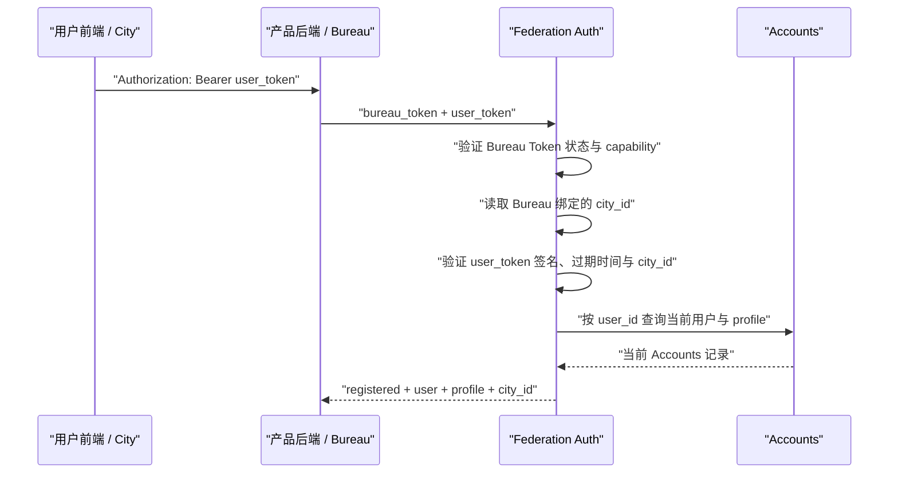

# Federation、City 与 Bureau 身份鉴权 PRD

## 1. 文档状态

- 状态：已确认并实现
- 范围：`@downcity/city`、`@downcity/services` Accounts、CLI 调用方
- 核心变化：`FedBureau` 与 `FederationAdmin` 合并为 `Bureau`

## 2. 目标

建立一套职责清晰、默认在线验证的身份模型：

- `Federation` 是用户身份和 Bureau 权限的唯一事实源。
- `City` 是用户侧客户端，只持有 `user_token`。
- `Bureau` 是可信后端客户端，必须持有 `bureau_token`。
- 产品后端不传 `city_id`；Federation 根据 Bureau Token 的注册记录确定产品归属。
- `Bureau.identify()` 每次在线查询 Federation，返回 Accounts 当前用户记录。
- Federation 管理能力也由 `Bureau` 承载，不再存在独立 `FederationAdmin`。

## 3. 非目标

- 不提供 `UserTokenVerifier` 或离线产品后端验签 SDK。
- 不允许产品后端根据未验证 token 自行选择 Federation。
- 不让用户前端持有 `bureau_token`。
- 不在 `new City()` 中加入管理能力。
- 不要求创建 `Federation` 时传入用户签名私钥。

## 4. 角色与凭证

| 角色 | SDK | 持有凭证 | 职责 |
| --- | --- | --- | --- |
| Federation | `new Federation({ db })` | 内部 Ed25519 私钥、Bureau Token hash | 签发用户凭证、验证身份、保存 Accounts 和权限记录 |
| 用户前端 | `new City(...)` | `user_token` | 以用户身份调用 Federation |
| 产品后端 | `new Bureau(...)` | `bureau_token` | 在线识别用户、读取被授权的信息 |
| 运维后端 | `new Bureau(...)` | 管理型 `bureau_token` | 管理 City、环境变量和 Bureau Token |

### 4.1 user_token

`user_token` 是 Federation 使用 Ed25519 私钥签发的短期用户 JWT，至少包含：

- `iss`：Federation 身份。
- `aud = downcity:user`。
- `user_id`。
- `city_id`。
- `iat`、`exp`、`jti`。

它只证明“某个用户获得了访问某个 City 的凭证”，不代表该用户当前仍存在于 Accounts。

### 4.2 bureau_token

`bureau_token` 是 Federation 为可信后端签发的高熵不透明凭证：

```text
fb_<token_id>.<secret>
```

Federation 数据库只保存完整 Token 的 SHA-256 hash，并在 Token 记录中保存：

- `token_id`。
- `name`。
- `city_id`。
- `capabilities`。
- `status`。
- 创建和更新时间。

因此，调用端不需要也不能再传入可信 `city_id`。Token 字符串只负责定位凭证，真正的 City 归属由 Federation 数据库记录决定。

## 5. Bureau 能力

第一版能力集合：

| capability | 用途 |
| --- | --- |
| `accounts:read` | 在线识别本 Token 所绑定 City 的用户 |
| `federation:admin` | 使用 Federation 管理能力；该 Token 不绑定单个 City |

普通产品 Bureau Token 必须绑定一个 active City。管理型 Bureau Token 不允许绑定 City。

## 6. 最终调用模型

### 6.1 Federation 服务端

```ts
import { Federation } from "@downcity/city";
import { AccountsService } from "@downcity/services";

const federation = new Federation({ db });
federation.use(new AccountsService());

export default {
  fetch: federation.fetch,
};
```

Federation 首次初始化时自动生成并持久化 Ed25519 Key Ring，不要求业务代码传入 signing key。

### 6.2 用户前端

```ts
import { City } from "@downcity/city";

const city = new City({
  federation_url: "https://fed.example.com",
  user_token,
});

const profile = await city.service("accounts").action("me").invoke();
```

用户前端不知道 `bureau_token`，也不承担后端授权。

### 6.3 产品后端

```ts
import { Bureau } from "@downcity/city";

const bureau = new Bureau({
  federation_url: "https://fed.example.com",
  bureau_token: process.env.DOWNCITY_BUREAU_TOKEN!,
});

export async function handle_request(request: Request): Promise<Response> {
  const identity = await bureau.identify(request);
  if (!identity.registered) {
    return new Response("Unauthorized", { status: 401 });
  }

  return Response.json({
    user: identity.user,
    profile: identity.profile,
  });
}
```

`identify(request)` 从请求中读取 `Authorization: Bearer <user_token>`，然后调用：

```text
POST /v1/accounts/identify
Authorization: Bearer <bureau_token>
Content-Type: application/json

{ "user_token": "..." }
```

### 6.4 Federation 管理后端

管理端也使用 `Bureau`，区别仅在 Token capability：

```ts
const bureau = new Bureau({
  federation_url: "https://fed.example.com",
  bureau_token: process.env.DOWNCITY_ADMIN_BUREAU_TOKEN!,
});

const city = await bureau.cities.create({ name: "Product A" });
const issued = await bureau.bureaus.create({
  name: "Product A Backend",
  city_id: city.city_id,
  capabilities: ["accounts:read"],
});
```

`issued.bureau_token` 明文只返回一次，之后数据库中只保留 hash。

## 7. 在线识别流程



Federation 必须按顺序验证：

1. `bureau_token` 存在、hash 匹配且状态为 active。
2. Token 拥有 `accounts:read` 或管理能力。
3. Token 绑定的 City 存在且为 active。
4. `user_token` 签名、issuer、audience 和有效期正确。
5. `user_token.city_id` 等于 Bureau Token 记录的 `city_id`。
6. `user_token.user_id` 当前仍存在于 Accounts。

任一步失败都不能返回其他 City 的用户信息。

## 8. 返回语义

```ts
interface BureauIdentity {
  registered: boolean;
  user_id?: string;
  city_id?: string;
  user?: BureauUserInfo;
  profile?: BureauUserProfile | null;
}
```

- Token 无效、跨 City 或用户不存在时，返回 `registered: false`，不泄漏其他产品的用户状态。
- Bureau Token 缺失、无效或已撤销时，请求返回 `401`。
- Bureau Token 已认证但 capability 不足时，请求返回 `403`。
- `registered: true` 时，`user` 和 `profile` 来自 Federation 当前数据库，不来自用户 JWT 自报字段。

## 9. 安全边界

### 9.1 为什么仅泄漏 user_token 不够

产品后端查询用户信息还必须持有对应的 `bureau_token`。攻击者只拿到用户 token，不能直接调用受保护的 Accounts identify 接口。

### 9.2 为什么仅泄漏 bureau_token 不够

产品 Bureau Token 只允许读取其绑定 City 的用户，并且仍需要一个有效的用户 token。它不能签发用户 token，也不能访问其他 City。

### 9.3 为什么采用在线验证

在线验证使以下状态立即生效：

- Bureau Token 撤销。
- City 暂停。
- 用户从 Accounts 删除或禁用。
- 用户 profile 更新。

代价是产品后端依赖 Federation 可用性和一次网络往返。第一版优先保证统一权限与实时状态，不提供离线降级。

## 10. 废弃 API

以下公共 API 直接移除，不提供兼容层：

- `FedBureau`。
- `FederationAdmin`。
- `FedBureauOptions.city_id`。
- 产品后端 JWKS 本地识别流程。

统一替换为：

```ts
new Bureau({ federation_url, bureau_token });
```

## 11. 验收标准

- `Bureau` 构造时缺少 `bureau_token` 会立即失败。
- 普通 Bureau Token 必须绑定 active City。
- 管理型 Bureau Token 可以管理 City、env 和 Bureau Token。
- 普通 Bureau Token 不能调用管理接口。
- Bureau Token 明文只在签发时返回，数据库不存明文。
- 撤销 Bureau Token 后，下一个请求立即失败。
- 同一用户 token 不能被其他 City 的 Bureau 识别。
- `identify()` 能返回 Accounts 当前 user 和 profile。
- 无效签名、过期 token 和未注册用户返回 `registered: false`。
