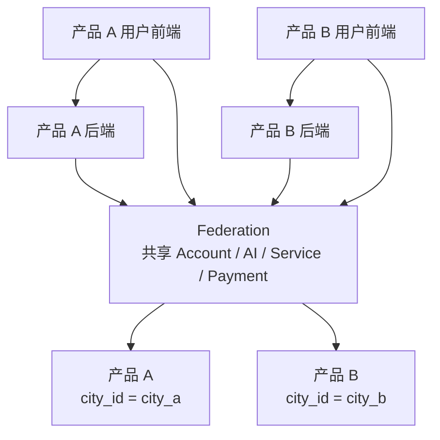
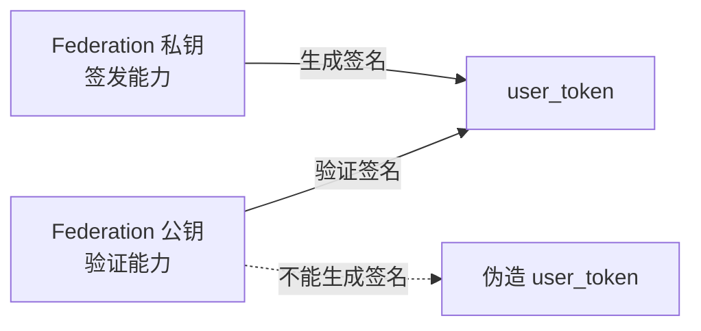
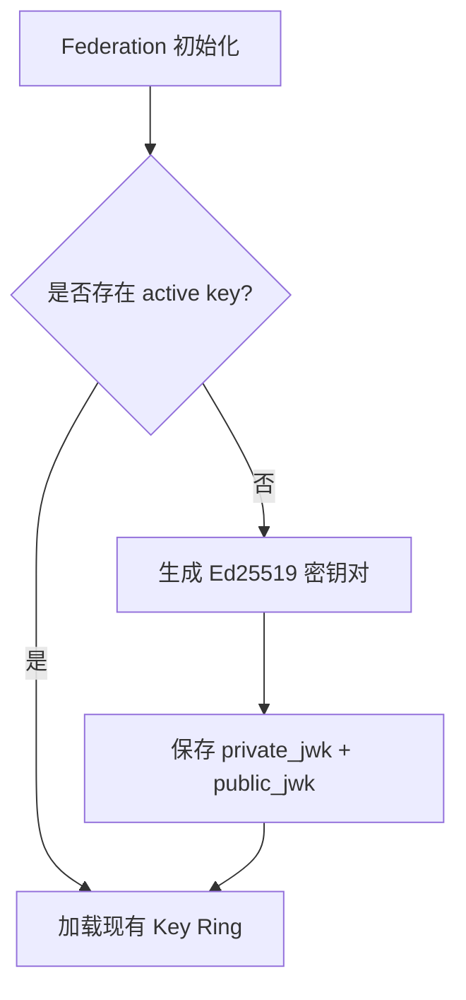
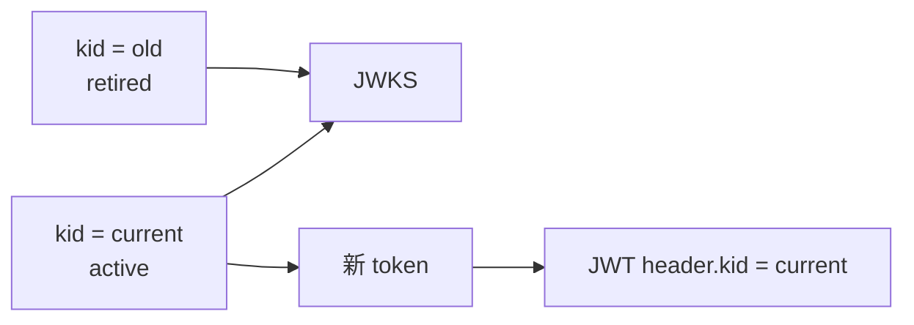
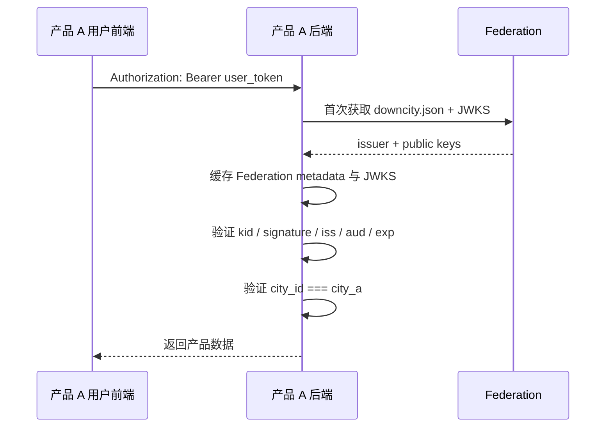
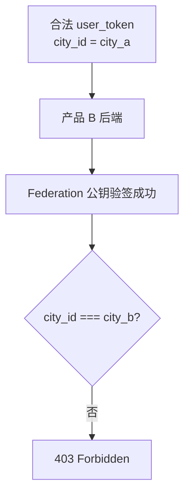
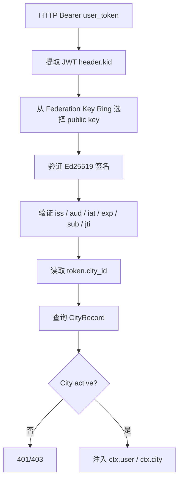
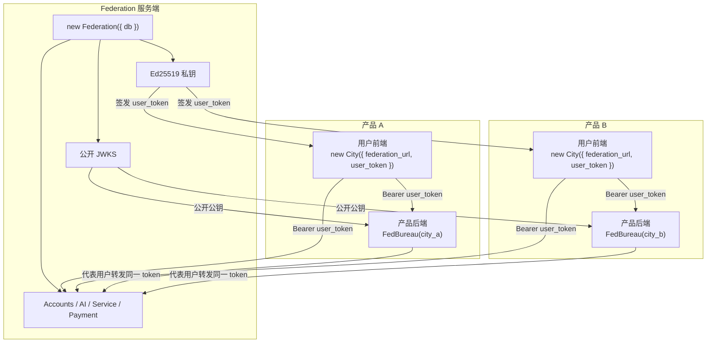

# Federation 与 City 非对称用户鉴权 PRD

## 1. 文档目的

本文档定义 `@downcity/city` 中 Federation、City、产品后端与用户前端之间的下一版用户鉴权模型。

本次设计解决以下问题：

- 当前 `user_token` 使用 HMAC 对称密钥，独立产品后端若要本地验签就必须获得签名密钥，也因此拥有伪造 token 的能力。
- `Federation`、数据库中的 City 实体与 `new City()` 客户端使用同一个 City 名称，职责容易混淆。
- 当前 `City<"admin">` 把 Federation 管理控制面混入了用户侧 City 客户端。
- 产品后端如何验证用户 token、如何限制 token 所属产品、是否需要保存公钥没有明确协议。
- 当前 token 可以不设置过期时间，不适合作为跨服务 Bearer Token。
- 当前没有标准公钥发现、密钥轮换与 `kid` 选择机制。

最终目标：

```text
Federation
  -> 自动生成并保管 Ed25519 私钥
  -> 为用户签发绑定 city_id 的 user_token
  -> 公开 JWKS 公钥集合

City 用户客户端
  -> 保存 federation_url + user_token
  -> 携带 Bearer user_token 调用 Federation 或产品后端

产品后端
  -> 只配置可信 federation_url + city_id
  -> 自动获取并缓存 Federation JWKS
  -> 本地验证 user_token
  -> 不能签发或伪造 user_token
```

## 2. 最终设计结论

### 2.1 系统中没有“产品 token”

普通用户访问链路中只有一种凭证：`user_token`。

不同产品通过 token 中的 `city_id` 区分：

```text
产品 A 用户：user_token.city_id = city_a
产品 B 用户：user_token.city_id = city_b
```

产品后端必须同时验证：

- token 是否由受信任的 Federation 签发。
- token 是否过期。
- token audience 是否正确。
- token 中是否存在有效用户身份。
- token 的 `city_id` 是否等于当前产品后端配置的 `city_id`。

### 2.2 Federation 是唯一用户 token 签发方

Federation 自动生成并持久化 Ed25519 密钥对：

- 私钥只保存在 Federation 服务端。
- 公钥通过公开 JWKS 接口发布。
- 用户、用户前端、产品后端和 `new City()` 都不能获得私钥。
- Federation 构造时不要求开发者传入 token signing key。

### 2.3 City 是用户访问客户端

`new City()` 只表达用户侧访问 Federation：

```ts
const city = new City({
  federation_url: "https://fed.example.com",
  user_token,
});
```

`City` 不再承载 Federation Admin 角色，也不要求调用方重复传入 `city_id`。

已登录用户的 `city_id` 只能从通过验签的 `user_token` 中获得。

### 2.4 产品后端是 user_token Resource Server

产品后端不保存 Federation 私钥，也不需要手工复制公钥内容。

产品后端只配置：

```ts
const bureau = new FedBureau({
  federation_url: "https://fed.example.com",
  city_id: "city_a",
});

const identity = await bureau.identify(request);
```

`FedBureau` 只能从构造参数中预先信任的 `federation_url` 获取 JWKS，不能根据未验证 token 中的任意 URL 获取公钥。

### 2.5 Federation Admin 独立于 City

Federation 管理控制面使用独立客户端：

```ts
const admin = new FederationAdmin({
  federation_url: "https://fed.example.com",
  admin_secret_key,
});
```

`FederationAdmin` 负责：

- 创建、暂停、启用和删除 City。
- 管理 Federation env。
- 管理模型、余额、用户和用量。
- 执行其他 Federation 全局管理操作。

产品后端不应持有全局 `admin_secret_key`。

## 3. 核心术语

| 名称 | 所在位置 | 职责 |
|---|---|---|
| `Federation` | 服务端 | 运行 Service、签发和验证 token、保存 City 状态、发布 JWKS |
| `CityRecord` | Federation 数据库 | 表示一个产品/App/租户边界，包含 `city_id/name/status` |
| `City` | 用户客户端 SDK | 携带 `user_token` 调用 Federation |
| 产品后端 | 外部 Resource Server | 验证属于当前 `city_id` 的 Federation user token |
| 用户前端 | Web/App/CLI | 登录、保存 user token、调用产品后端或 Federation |
| `FederationAdmin` | 管理客户端 SDK | 访问 Federation 控制面 |
| `UserTokenIssuer` | Federation 内部 | 使用私钥签发 user token |
| `FedBureau` | Federation 与产品后端 | 从请求识别并验证 Federation 用户身份 |
| JWKS | Federation 公开接口 | 发布可用于验签的公钥集合 |

## 4. 目标使用场景

一个 Federation 同时服务两个产品：



### 4.1 产品 A 用户

产品 A 用户登录后获得：

```json
{
  "iss": "urn:downcity:federation:fed_xxx",
  "aud": "downcity:user",
  "sub": "user_123",
  "city_id": "city_a",
  "iat": 1780000000,
  "exp": 1780604800
}
```

### 4.2 产品 B 用户

产品 B 用户登录后获得：

```json
{
  "iss": "urn:downcity:federation:fed_xxx",
  "aud": "downcity:user",
  "sub": "user_456",
  "city_id": "city_b",
  "iat": 1780000000,
  "exp": 1780604800
}
```

两个 token 可以由同一个 Federation 当前私钥签发，但产品 A 后端只接受 `city_a`，产品 B 后端只接受 `city_b`。

## 5. 信任边界

### 5.1 必须保密

- Federation Ed25519 私钥。
- Federation Admin Secret。
- 用户持有的 `user_token`。

### 5.2 可以公开

- Federation URL。
- Federation ID 与 issuer。
- Federation JWKS 公钥集合。
- `city_id`。
- token header 中的 `kid`。

### 5.3 为什么公钥可以公开



产品后端获得公钥后只能验证 token，不能为任意 `user_id` 或 `city_id` 生成合法 token。

## 6. 当前实现与目标实现的差异

| 当前实现 | 目标实现 |
|---|---|
| HMAC-SHA256 对称签名 | Ed25519 非对称签名 |
| `DOWNCITY_FEDERATION_TOKEN_SIGNING_KEY` 同时用于签发和验证 | 私钥只签发，JWKS 公钥只验证 |
| 自定义 `payload.signature` token | 带 `kid` 的标准 Compact JWT/JWS，继续保留 `ub_` 前缀 |
| token 可没有 `exp` | 所有 user token 必须有有限有效期 |
| 没有 issuer | Federation 自动生成稳定 issuer |
| 没有 JWKS | 公开 `/.well-known/jwks.json` |
| 没有密钥轮换模型 | Federation Key Ring 支持 active/retired/revoked |
| `City<"admin">` 与 `City<"user">` 共用入口 | `City` 与 `FederationAdmin` 分离 |
| `new City()` 可重复传 `city_id` | 登录后 `city_id` 只来自已验签 token |
| 独立后端需要共享 HMAC 密钥 | 独立后端只获取公开 JWKS |

## 7. 产品目标

### 7.1 Federation 零密钥配置启动

开发者只提供现有运行依赖：

```ts
const federation = new Federation({ db });
```

Federation 初始化时自动确保：

- 存在稳定的 Federation ID。
- 存在一个 active Ed25519 signing key。
- 公钥发现接口可以返回当前可验签 Key Ring。

### 7.2 产品后端安全本地验签

产品后端不持有私钥，不依赖每次请求远程 introspection，并能拒绝其他 City 的 token。

### 7.3 用户 token 可跨 Federation 与产品后端使用

同一个 `user_token` 可以：

- 直接访问 Federation Service。
- 访问 token 所属 City 的产品后端。
- 由产品后端代表当前用户转发给 Federation。

### 7.4 明确控制面与用户面

- `City` 只属于用户面。
- `FederationAdmin` 只属于控制面。
- `FedBureau` 只属于资源服务端身份识别能力。

## 8. 非目标

本期不处理：

- 为每个 City 创建独立 Federation signing key。
- 产品后端使用私钥对每次请求做机器身份签名。
- mTLS、DPoP 或客户端证书。
- 单 token 实时撤销列表。
- Refresh Token 协议。
- 将 Federation Admin Secret 改造成完整 RBAC。
- 兼容旧 HMAC user token。
- 允许产品后端根据未验证 token 动态选择 Federation。

## 9. 密钥模型

### 9.1 Federation Key Ring

Federation 使用专用系统表保存签名 Key Ring，不继续把非对称密钥拆成普通业务 env。

建议表名：

```text
federation_auth_keys
```

每条记录至少包含：

| 字段 | 说明 |
|---|---|
| `key_id` | JWT header 中的 `kid` |
| `algorithm` | 固定为 `EdDSA` |
| `public_jwk` | 可公开的 Ed25519 Public JWK |
| `private_jwk` | 仅 Federation 可读的 Ed25519 Private JWK |
| `status` | `active`、`retired` 或 `revoked` |
| `created_at` | 创建时间 |
| `retired_at` | 停止签发时间 |

所有新增类型字段实现时必须提供详细中文文档注释。

### 9.2 密钥状态

- `active`：当前用于签发，同时可以验签。
- `retired`：不再签发，但在旧 token 最长有效期内继续出现在 JWKS 中。
- `revoked`：不再签发，也不再允许验签。

任意时刻只允许存在一个 active signing key。

### 9.3 首次启动



### 9.4 密钥轮换



旧公钥至少保留到所有由该 key 签发的 token 均已过期。

## 10. Federation 发现协议

### 10.1 Federation 元数据

新增公开接口：

```http
GET /.well-known/downcity.json
```

返回：

```json
{
  "issuer": "urn:downcity:federation:fed_xxx",
  "jwks_uri": "https://fed.example.com/.well-known/jwks.json",
  "user_token_audience": "downcity:user"
}
```

Federation ID 在首次启动时自动生成并持久化，避免要求构造函数传入 issuer。

`jwks_uri` 根据当前部署的可信请求 origin 生成；部署层必须正确处理反向代理的 Host 与 HTTPS 信息。

### 10.2 JWKS

新增公开接口：

```http
GET /.well-known/jwks.json
```

返回：

```json
{
  "keys": [
    {
      "kty": "OKP",
      "crv": "Ed25519",
      "alg": "EdDSA",
      "use": "sig",
      "kid": "key_xxx",
      "x": "..."
    }
  ]
}
```

响应必须包含合理的缓存头，并支持基于 `kid` 未命中时主动刷新。

### 10.3 可信地址约束

产品后端必须预先配置 `federation_url`：

```text
https://fed.example.com
```

禁止执行：

```text
读取未验证 token.iss
  -> 将其当作 URL
  -> 从任意地址下载 JWKS
```

该约束用于避免 SSRF、恶意 JWKS 和 issuer confusion。

## 11. User Token 协议

### 11.1 Token 格式

最终格式：

```text
ub_<compact-jwt>
```

JWT header：

```json
{
  "alg": "EdDSA",
  "typ": "JWT",
  "kid": "key_xxx"
}
```

JWT payload：

```json
{
  "iss": "urn:downcity:federation:fed_xxx",
  "aud": "downcity:user",
  "sub": "user_123",
  "city_id": "city_a",
  "metadata": {},
  "iat": 1780000000,
  "exp": 1780604800,
  "jti": "token_xxx"
}
```

### 11.2 Claim 语义

| Claim | 必填 | 说明 |
|---|---|---|
| `iss` | 是 | 自动生成并持久化的 Federation issuer |
| `aud` | 是 | 固定为 `downcity:user` |
| `sub` | 是 | Federation 用户 ID |
| `city_id` | 是 | token 所属产品/City |
| `iat` | 是 | 签发时间 |
| `exp` | 是 | 过期时间 |
| `jti` | 是 | token 唯一 ID，为后续审计与撤销扩展保留 |
| `metadata` | 否 | 可信但应保持精简的业务元数据 |

对外身份类型可以继续返回 `user_id`，但 token 标准主体字段使用 `sub`。

### 11.3 有效期

所有 user token 必须具有有限 `exp`。

V1 建议：

- 默认有效期：`7d`。
- 最大有效期：`30d`。
- Accounts Service 可以将默认值配置得更短。
- 不允许签发永久 user token。

Refresh Token 不在本期范围内；如果后续需要短期 Access Token，应单独设计刷新协议。

## 12. 完整调用流程

### 12.1 Federation 启动

```ts
const federation = new Federation({ db });

federation.use(accountsService());
federation.use(ai_service);
```

开发者不传入 token 私钥或公钥。

Federation 自动初始化：

```text
federation_id
federation_auth_keys
active Ed25519 key
JWKS endpoints
```

### 12.2 Federation Admin 创建两个 City

```ts
const admin = new FederationAdmin({
  federation_url: "https://fed.example.com",
  admin_secret_key,
});

await admin.cities.create({
  city_id: "city_a",
  name: "Product A",
});

await admin.cities.create({
  city_id: "city_b",
  name: "Product B",
});
```

### 12.3 用户登录产品 A

登录开始时产品前端明确请求进入 `city_a`：

```ts
const public_city = new City({
  federation_url: "https://fed.example.com",
});

const result = await public_city
  .service("accounts")
  .action("login/start")
  .invoke({
    provider: "email",
    city_id: "city_a",
  });
```

登录完成后 Federation：

1. 检查 `city_a` 是否存在且为 `active`。
2. 确定已登录的 `user_id`。
3. 使用 active Federation 私钥签发 token。
4. 在 token 中写入 `city_id = city_a`。
5. 将 `user_token` 返回给用户前端。

### 12.4 用户前端直接调用 Federation

```ts
const city = new City({
  federation_url: "https://fed.example.com",
  user_token,
});

const models = await city.ai.catalog();

const result = await city.ai.text({
  model: "deepseek-v4-flash",
  prompt: "hello",
});
```

请求：

```http
Authorization: Bearer ub_<jwt>
```

Federation 验证签名后从 token 得到：

```ts
ctx.user.user_id;
ctx.city.city_id;
```

调用方不再传入 `city_id`。

### 12.5 用户前端调用产品 A 后端

```ts
await fetch("https://api.product-a.com/profile", {
  headers: {
    authorization: `Bearer ${user_token}`,
  },
});
```

产品 A 后端初始化一个 Bureau：

```ts
const bureau = new FedBureau({
  federation_url: "https://fed.example.com",
  city_id: "city_a",
});
```

每次请求：

```ts
const identity = await bureau.identify(request);

console.log(identity.user_id);
console.log(identity.city_id); // 固定为 city_a
```

内部流程：



后续请求在缓存有效期内不访问 Federation。

### 12.6 产品 A 后端代表用户调用 Federation

产品后端先验证用户 token，再将同一个 token 用于 Federation 调用：

```ts
const identity = await bureau.identify(request);
const user_token = read_bearer_token(request);

const city = new City({
  federation_url: "https://fed.example.com",
  user_token,
});

const result = await city.service("usage").action("summary").invoke({});
```

该调用是用户委托调用，不是产品后端管理调用。

### 12.7 产品 B 后端拒绝产品 A token



签名有效不等于可以访问任意产品。`FedBureau` 构造时传入的 `city_id` 是产品后端必须执行的授权边界。

## 13. SDK API 设计

### 13.1 Federation

保持服务端创建方式：

```ts
const federation = new Federation({ db });
```

密钥初始化属于 Federation 内部生命周期。

### 13.2 City

目标构造参数：

```ts
interface CityOptions {
  /** Federation HTTP 地址。 */
  federation_url: string;

  /** 登录后由 Federation 签发的用户 token；公开登录接口可省略。 */
  user_token?: string;

  /** 自定义 fetch 实现。 */
  fetch?: typeof fetch;
}
```

删除：

- `role`。
- `city_id`。
- `admin_secret_key`。
- `City<"admin">`。
- `city.tokens.apply()` 管理能力。

### 13.3 FederationAdmin

新增独立管理客户端：

```ts
interface FederationAdminOptions {
  /** Federation HTTP 地址。 */
  federation_url: string;

  /** Federation 全局管理密钥。 */
  admin_secret_key: string;

  /** 自定义 fetch 实现。 */
  fetch?: typeof fetch;
}
```

原 `City<"admin">` 的能力迁移到 `FederationAdmin`。

### 13.4 FedBureau

新增产品后端验签入口：

```ts
interface FedBureauOptions {
  /** 预先信任的 Federation HTTP 地址。 */
  federation_url: string;

  /** 当前产品后端唯一允许的 City ID。 */
  city_id: string;

  /** 自定义 fetch 实现。 */
  fetch?: typeof fetch;

  /** JWKS 正常缓存时间，单位毫秒。 */
  jwks_cache_ttl?: number;
}
```

对外方法：

```ts
const identity = await bureau.identify(user_token);
const identity = await bureau.identify(request);
```

返回：

```ts
interface FedIdentity {
  /** Federation 用户 ID，来源于 JWT sub。 */
  user_id: string;

  /** 已验证且与 Bureau city_id 一致的 City ID。 */
  city_id: string;

  /** token 中携带的业务元数据。 */
  metadata: Record<string, unknown>;

  /** token 的唯一 ID。 */
  token_id: string;

  /** token 过期时间，Unix 秒。 */
  expires_at: number;
}
```

实现时所有字段必须保留详细中文文档注释。

## 14. Federation 内部鉴权

Federation 内部继续在路由层统一完成鉴权：



Service Action 不自行解析 token：

```ts
notes.action("create", async (ctx) => {
  return {
    user_id: ctx.user!.user_id,
    city_id: ctx.city!.city_id,
  };
}, { auth: ["user"] });
```

## 15. 安全约束

### 15.1 必须执行的 token 验证

`FedBureau` 与 Federation 内部鉴权器都必须验证：

1. token 前缀与 Compact JWT 格式。
2. header `alg === "EdDSA"`，禁止算法降级。
3. header `kid` 存在且命中受信任 JWKS。
4. Ed25519 签名有效。
5. `iss` 等于可信 Federation metadata 中的 issuer。
6. `aud` 包含 `downcity:user`。
7. `iat`、`exp` 合法，且 token 未过期。
8. `sub`、`city_id`、`jti` 为非空字符串。
9. 产品后端必须验证 `city_id === bureau.city_id`。

### 15.2 Bearer Token 风险

非对称签名解决的是“产品后端不能伪造 token”，不解决 token 被盗后的重放问题。

必须配套：

- 所有生产请求使用 HTTPS。
- 前端避免把 token 暴露给不可信脚本。
- token 必须有有限有效期。
- 日志不得记录完整 Bearer Token。
- 错误响应不得回显 token。

### 15.3 JWKS 缓存

- 正常情况下按 HTTP Cache-Control 缓存。
- `kid` 未命中时只允许主动刷新一次。
- 刷新后仍未命中则返回 401。
- 网络失败但已有未过期缓存时可以继续使用缓存。
- 没有任何可信缓存且无法获取 JWKS 时返回服务不可用错误，不得跳过验签。

### 15.4 City 状态

产品后端本地验签只能证明 token 有效且属于某个 `city_id`，不能实时知道 Federation 中 City 是否刚刚被暂停。

V1 采用：

- Federation 自身请求实时检查 City 状态。
- 外部产品后端依赖有限 token TTL。
- 对强实时暂停有要求的产品，可以额外调用未来的 introspection 接口。

## 16. 错误语义

| 场景 | HTTP 状态 | 建议错误 |
|---|---:|---|
| 缺少 Bearer Token | 401 | `Authentication required` |
| token 格式错误 | 401 | `Invalid user token` |
| `kid` 不存在 | 401 | `Unknown token signing key` |
| 签名错误 | 401 | `Invalid user token signature` |
| token 过期 | 401 | `User token expired` |
| issuer 错误 | 401 | `Invalid user token issuer` |
| audience 错误 | 401 | `Invalid user token audience` |
| 产品后端 City 不匹配 | 403 | `Token does not belong to this City` |
| Federation 中 City 已暂停 | 403 | `City is not active` |
| JWKS 首次加载失败 | 503 | `Federation signing keys unavailable` |

错误日志可以记录 `kid/jti/issuer/city_id`，不得记录完整 token。

## 17. 模块调整建议

### 17.1 `packages/city`

建议拆分：

```text
src/federation/auth/
  federation-key-store.ts
  user-token-issuer.ts
  fed-bureau.ts
  federation-discovery.ts
  authenticator.ts
  types.ts
```

约束：

- 单个模块不超过 800-1000 行。
- 不使用动态导入。
- 所有模块添加文件级中文文档注释。
- 新增公共类型统一放入 `types/` 或 auth 域的公共类型模块。
- 所有新增类型字段提供详细中文注释。
- 新增变量和函数使用 snake_case。

### 17.2 依赖

优先使用经过验证、支持 Web Crypto 与多运行时的 JOSE 实现，不自行实现 JWT/JWK/EdDSA 编解码。

如果选择 `jose`：

- 必须作为 `@downcity/city` 的直接依赖声明。
- 只使用静态导入。
- 必须验证 Node、Cloudflare Workers、Deno/Bun 目标所需的 Web Crypto 能力。

### 17.3 Homepage 用户文档

属于 package 用户可见行为变更，完成实现时同步更新中英文文档：

- City 用户身份与 user token。
- 产品后端如何验证 token。
- JWKS 与 Federation discovery。
- `City` 与 `FederationAdmin` 的调用方式。

## 18. 迁移策略

仓库规则明确不考虑向后兼容，因此采用直接迁移：

- 旧 HMAC `DOWNCITY_FEDERATION_TOKEN_SIGNING_KEY` 不再读取。
- 旧 HMAC user token 在升级后立即失效。
- 删除旧 `TokenSigner` 对称密钥公共用法。
- 删除 `City<"admin">` 与 role 分支。
- 用户需要重新登录获取 Ed25519 user token。
- Federation Admin 调用迁移到 `FederationAdmin`。
- 产品后端迁移到 `FedBureau`。

迁移说明必须明确提醒：升级会使现有 user session 失效。

## 19. 测试要求

### 19.1 Key Ring

- 首次启动自动生成 Federation ID 与 active Ed25519 key。
- 重复启动复用同一 issuer 与 Key Ring。
- JWKS 不包含任何 private JWK 字段。
- active 与 retired key 可以验签。
- revoked key 不能验签。
- 新 token 只使用 active key。

### 19.2 Token

- 合法 token 可完成 Federation 鉴权。
- token payload 被篡改后验签失败。
- token signature 被篡改后验签失败。
- 错误 `alg` 被拒绝。
- 未知 `kid` 被拒绝。
- 错误 issuer 被拒绝。
- 错误 audience 被拒绝。
- 过期 token 被拒绝。
- 缺少 `sub/city_id/jti/exp` 被拒绝。

### 19.3 产品后端 FedBureau

- 首次请求获取 discovery 与 JWKS。
- 后续请求命中缓存。
- `kid` 未命中时刷新一次。
- 产品 A Bureau 接受 `city_a` token。
- 产品 A Bureau 拒绝 `city_b` token。
- JWKS 不可用且无缓存时失败关闭。
- Bureau 不读取 token 中的任意 URL。

### 19.4 SDK

- `new City({ federation_url })` 可以调用公开登录接口。
- `new City({ federation_url, user_token })` 自动携带 Bearer Token。
- City 不再注入客户端 `city_id`。
- `FederationAdmin` 具备原管理能力。
- 产品后端可将已验证 token 原样转发给 Federation。

## 20. 验收标准

实现完成必须满足：

1. Federation 构造函数不接收 token 私钥、公钥或 signing secret。
2. Federation 第一次启动自动创建并持久化 Ed25519 Key Ring。
3. 私钥不会出现在 JWKS、API 响应、日志或客户端类型中。
4. `/.well-known/downcity.json` 与 `/.well-known/jwks.json` 可公开访问。
5. 所有新 user token 使用 EdDSA、`kid`、有限 `exp` 和稳定 issuer。
6. `City` 只表示用户客户端，不再包含 admin role。
7. `FederationAdmin` 独立承载控制面调用。
8. 产品后端只配置 `federation_url + city_id` 即可安全本地识别用户身份。
9. 产品 A token 不能访问产品 B 后端。
10. 产品后端获得公钥后不能签发合法 user token。
11. Federation 自身仍实时检查 City 是否存在且为 active。
12. 相关 package 测试、typecheck、lint 与构建全部通过。
13. 用户可见文档完成中英文同步更新。
14. 按仓库规则运行 `pnpm city:patch:build` 完成版本自增和构建。

## 21. 最终调用总览



最终只有三条规则：

```text
Federation 用私钥签发 user_token。
用户前端用 user_token 访问资源。
产品后端用 Federation 公钥验证 user_token，并检查自己的 city_id。
```
