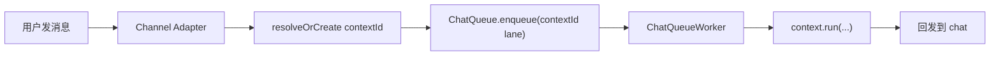
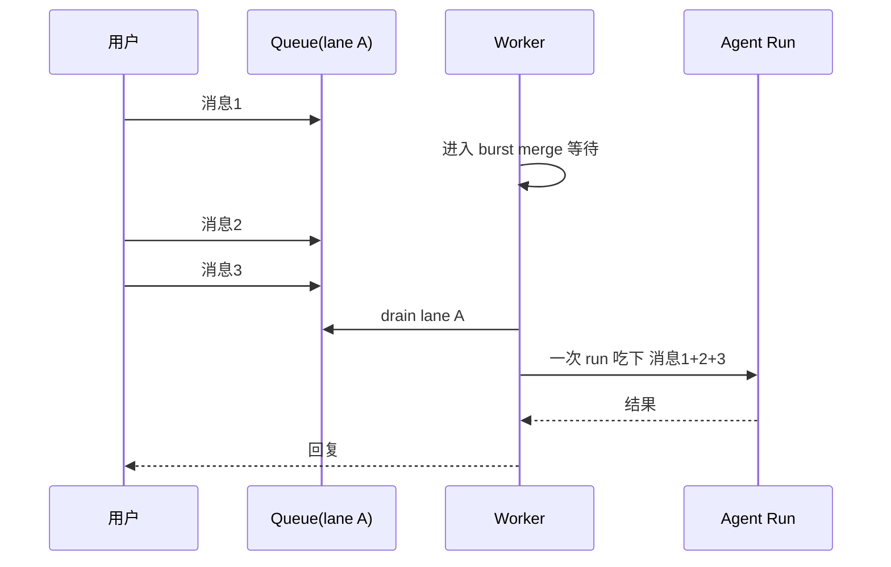
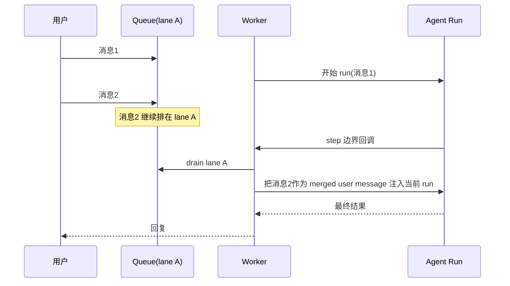
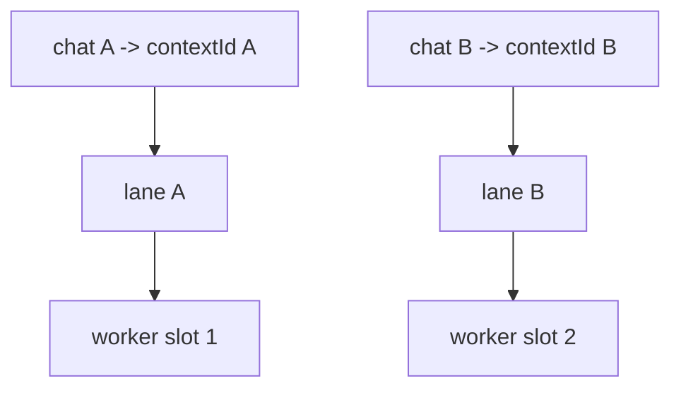
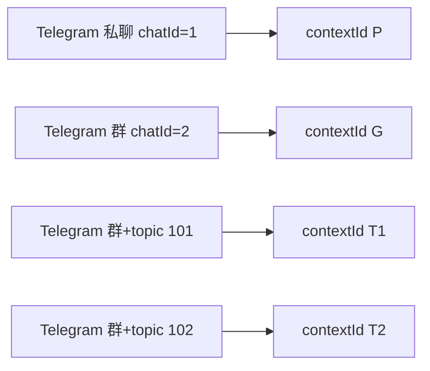
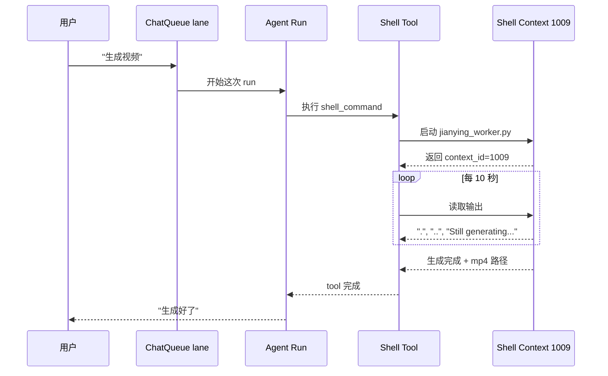
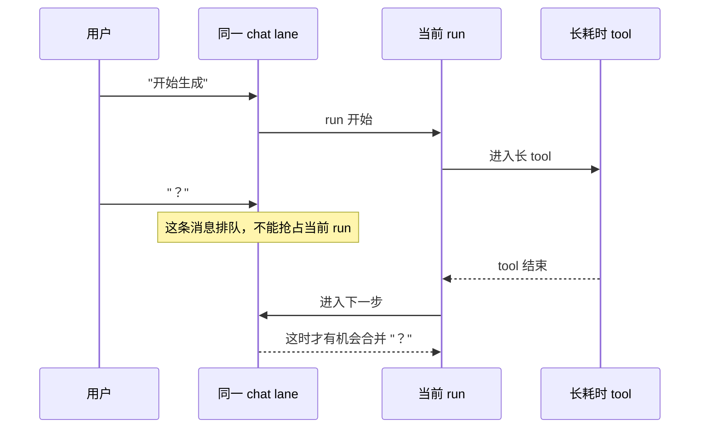
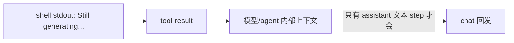
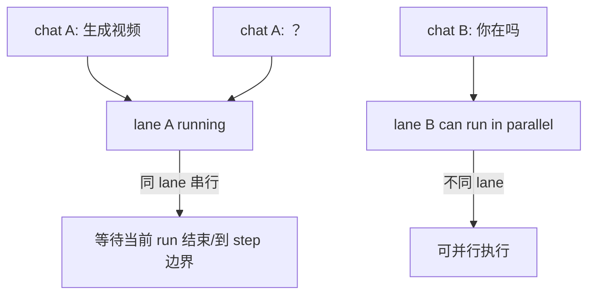

现在的 chat 排队逻辑，核心可以先记成 4 句话：

1. 队列是“进程内内存队列”，不是数据库队列。实现就在 [ChatQueue.ts](/Users/wangenius/Documents/github/shipmyagent/packages/downcity/src/services/chat/runtime/ChatQueue.ts)。
2. 排队是按 `contextId` 分 lane，同一个 lane 串行，不同 lane 可以并行。`contextId` 来自渠道目标映射，不是简单字符串猜出来的，见 [BaseChatChannel.ts](/Users/wangenius/Documents/github/shipmyagent/packages/downcity/src/services/chat/channels/BaseChatChannel.ts) 和 [ChannelContextStore.ts](/Users/wangenius/Documents/github/shipmyagent/packages/downcity/src/services/chat/runtime/ChannelContextStore.ts)。
3. 默认最多同时跑 2 个 lane。配置入口是 `services.chat.queue.maxConcurrency`，默认值在 [Ship.ts](/Users/wangenius/Documents/github/shipmyagent/packages/downcity/src/console/constants/Ship.ts)；worker 在 [RuntimeState.ts](/Users/wangenius/Documents/github/shipmyagent/packages/downcity/src/agent/context/manager/RuntimeState.ts) 启动。
4. 同一个 chat 里，连续消息会“尽量合并”，不是每条都立刻单独跑。合并逻辑在 [ChatQueueWorker.ts](/Users/wangenius/Documents/github/shipmyagent/packages/downcity/src/services/chat/runtime/ChatQueueWorker.ts)。

**先说结论**

不论私聊还是 group，排队规则本质一样：先把“平台 chat 目标”映射成一个 `contextId`，再按这个 `contextId` 串行执行。

差别只在 lane 粒度：

- Telegram 私聊：一个私聊一个 lane
- Telegram 普通群：一个群一个 lane
- Telegram topic：同一群里不同 topic 是不同 lane
- Feishu：当前基本是一个 chat 一个 lane
- QQ：按 chatType + chatId 区分到不同 context

**图 1：单个 chat 的基本队列模型**



这里最关键的是：

- `enqueueChatQueue()` 的 laneKey 就是 `contextId`
- 同一个 `contextId` 只会有一个 worker 在跑
- 不同 `contextId` 可以并发跑，默认总并发上限 2

**图 2：同一个 chat 连发 3 条，且都发生在“真正开跑前”**

默认配置：

- `mergeDebounceMs = 600`
- `mergeMaxWaitMs = 2000`

也就是：第一条来了之后，不会 0ms 立刻跑，会短暂等一会，看看同 lane 还有没有后续消息。



这类场景下，效果是：

- 3 条消息大概率会合成一次 run
- history 里 3 条都会落
- 真正执行时，最后是一次合并执行，不是 3 次独立执行

**图 3：同一个 chat，第一条已经在跑，第二条这时才发进来**

这个场景不会再开第二个 run，而是等当前 run 的 step 边界把新消息“吸进去”。



所以同 chat 的真实语义不是“严格 FIFO 一条条独立跑”，而是：

- 启动前短时间内的连续消息：会做 burst merge
- 运行中的后续消息：会在 step 边界 merge 进当前 run
- 目标是减少“你刚发完补充一句，它又单开一轮”的割裂感

**图 4：两个不同 chat 同时来消息**



默认 `maxConcurrency = 2`，所以通常：

- chat A 和 chat B 可以同时跑
- 如果来了第 3 个 chat，就等前两个任意一个结束后再跑

**图 5：group 和 private 的区别**



实际影响：

- 私聊和普通群，本质一样，都是“一个会话一个 lane”
- Telegram topic 是例外，它会细分成多个 lane
- 所以同一大群里，不同 topic 可以并行；同一 topic 内还是串行

**现在的失败处理逻辑**

**1. 模型暂时不可用怎么办？**

这块在 [ChatQueueWorker.ts](/Users/wangenius/Documents/github/shipmyagent/packages/downcity/src/services/chat/runtime/ChatQueueWorker.ts) 已经有兜底，但注意是“用户可见兜底”，不是“自动重新排队重试”。

当前行为：

- `context.run()` 抛错时，会识别 503 / AI SDK retry error / service unavailable
- 然后生成一条短错误文案
- 再强制尝试回发到 chat

用户最终大概率会看到：

- `⚠️ 模型服务暂时不可用（503），系统已自动重试但仍失败，请稍后再试。`

注意两个边界：

- 这里说的“系统已自动重试”，主要是上游模型 SDK 侧可能已经试过，不是 chat queue 自己做了新一轮排队
- queue 不会把这条消息重新入队等待 30 秒后再跑一次
- 也就是说，当前是“失败即结束，并通知用户”，不是“后台自动重试直到成功”

**2. 没收到怎么办？**

这个要分几层看。

第一层：模型根本没跑到

- 如果在入站解析前就挂了，那不会入队
- 如果入队后进程崩了，因为队列是内存队列，这些未处理项会丢
- 当前没有“重启后恢复未消费 chat 队列”的能力

第二层：模型跑了，但结果没发出去

- direct 分发失败只会记 warning
- 然后 worker 会再走一次 `dispatchTextToChannel()` 强制兜底
- 如果这次也失败，就只剩日志，没有进一步 retry / dead-letter / 补发机制

所以“用户没收到”的当前真实结论是：

- 有一层发送兜底
- 但没有可靠投递保证
- 也没有平台发送失败后的自动重试队列
- 更没有“消息最终一定送达”的确认机制

**3. 连发很多条会不会乱序？**

同一个 lane 内，不会并行乱跑，但会被合并。

所以更准确地说：

- 不会“同 chat 多个 run 并发交错”
- 但会“后来的补充消息合并进当前 run”
- 因此执行语义是“串行 + 合并”，不是机械的一条消息对应一条回复

**4. clear / reset 会怎样？**

如果 lane 里收到了 `control: clear`：

- 当前 run 结束后会 clear agent
- 并清空该 lane 剩余项

所以 `clear` 不是总能瞬时中断正在跑的模型，它更像：

- 给当前 lane 打一个“收尾后清空”的标记

**5. audit 消息是什么？**

不是所有入站都会进执行。

有些只做审计，比如：

- 群里 bot 自己的消息
- 空消息
- 某些不触发执行但要留痕的情况

这些会以 `kind = audit` 入队，只写 history，不触发 `context.run()`。

**一句话总结当前队列语义**

当前 chat 队列更像是：

- “按会话分 lane 的内存串行执行器”
- “同 lane 连续消息会自动合并”
- “不同 lane 可并行，默认并发 2”
- “失败会尽量通知用户，但不会自动重试到成功”
- “发送失败没有持久补偿”
- “进程重启后，内存里的未处理队列会丢”

**如果按你提的 2 个问题直接回答**

1. 模型暂时不可用怎么办？
2. 现在会尽量回一条错误消息给用户
3. 不会自动重新入队等待恢复
4. 需要用户稍后重试，或者后续我们改成自动 retry / backoff

1. 没收到怎么办？
2. 现在只做一次强制兜底发送
3. 如果平台发送还是失败，只会打日志
4. 没有可靠补发、也没有 delivery ack 状态机

**我建议你接下来重点关注的风险**

- 最大风险 1：队列是内存的，进程重启丢未消费消息
- 最大风险 2：发送失败没有 retry / dead-letter / 补发
- 最大风险 3：同 chat 合并语义很强，适合对话，但不适合强事务型逐条处理
- 最大风险 4：`clear` 不是硬中断，用户体感可能会觉得“怎么还回了一条”

如果你愿意，我下一步可以继续做两件事之一：

1. 我把“当前 chat 队列的完整状态机”画成更细的架构图，包含 `audit/exec/control` 三种 item。
2. 我直接给你出一版“应该怎么改”的方案，把 `模型重试 / 发送重试 / 持久化队列 / delivery ack` 拆成几个阶段。


这个例子里，`lucas_whitman` 其实不是“chat 层一直在等待”，而是：

- 同一个 chat 的这次 run 已经进入了一个长耗时 tool
- 这个 tool 内部自己维护了一个 shell 会话 `context_id = 1009`
- 然后在同一轮 run 里不断轮询这个 shell 会话输出
- 所以从 chat 队列视角看，这一整段时间都是“同一个 lane 正在忙”

你贴出来的日志，核心就是这条链：

```text
用户消息
-> agent 开始一轮 run
-> 调 shell tool
-> shell tool 创建 shell context_id=1009
-> 每 10s 读一次 1009 的输出
-> 直到视频生成完成
-> tool 返回
-> assistant 最终回复
```

**它是怎么“一直等待”的**

不是 chat queue 在等，而是这次 agent run 里的 tool 在等。

从代码语义上看：

- `ChatQueueWorker` 只知道“这一条 lane 现在在跑”，见 [ChatQueueWorker.ts](/Users/wangenius/Documents/github/shipmyagent/packages/downcity/src/services/chat/runtime/ChatQueueWorker.ts)
- shell tool 会创建一个独立的 shell 子进程上下文，并返回 `context_id`，见 [ShellContextManager.ts](/Users/wangenius/Documents/github/shipmyagent/packages/downcity/src/agent/tools/shell/ShellContextManager.ts)
- 后续同一轮工具调用里反复轮询这个 `context_id` 的输出，见 [Tool.ts](/Users/wangenius/Documents/github/shipmyagent/packages/downcity/src/agent/tools/shell/Tool.ts)

所以你看到的：

- 第一次 tool-call：启动命令，拿到 `context_id: 1009`
- 后面很多次 tool-call：继续读 `1009` 的输出
- 这些都还属于“同一个 agent run 内部的工具阶段”

**图 1：你这个实际例子的运行方式**



**中间问一句“？”，能不能回？**

结论先说：

- 同一个 chat：通常不能立刻回
- 不同 chat：可以，前提是还有并发槽位

原因是同一个 chat 的 lane 正被这次 run 占着。

你现在的队列语义是：

- 同 chat 串行
- 新消息只能等当前 run 的“step 边界”时被合并进去
- 但长 shell tool 执行期间，通常没有可用的 chat 交互边界

更准确地说：

1. 你中途发的 `？` 会进入同一个 lane
2. 它不会开第二个 run
3. 只有当前 run 到了下一次 `onStepCallback` / step 边界时，才有机会把这条 `？` 合进来
4. 如果当前卡在一个长工具内部轮询，那这段时间基本不会有新的 chat 处理机会

所以你这个例子里出现了：

- `11:27:48` 用户发生成请求
- 中间工具一直跑
- `11:35:47` 用户发 `？`
- assistant 仍然空着

这是符合当前实现的。

**图 2：同一个 chat 中途追问**



**为什么 tool 明明有很多输出，用户却看不到进度？**

因为这些 `tool-result` 输出只是工具输出，不等于 assistant 文本。

当前 chat 回发主要有两种可见路径：

1. assistant 生成了文本 step
2. assistant 最终消息被 direct/cmd 回发到 chat

而你这个例子里的 `"."`、`"Still generating..."`，本质上只是 shell tool 的 stdout 片段。

它们不会自动变成“发给用户的 chat 进度消息”。

所以现在的系统行为是：

- 工具内部看得到进度
- agent 也拿得到这些 tool output
- 但如果模型没有显式输出一条用户可见文本，chat 侧就不会自动转发这些进度

这也是为什么你最后只看到了“生成好了”，没看到每分钟一次的进度播报。

**图 3：为什么 shell 输出不自动发聊天**



也就是说：

- `tool-result != chat message`
- 中间差一层“assistant 要不要把它说出来”

**那它有没有可能中途回复“还在生成中”？**

有可能，但要满足下面任一条件：

1. 模型在长任务期间主动产出 assistant step 文本
2. skill/脚本在轮询时显式调用 `chat_send`
3. 运行时增加“工具进度自动桥接到 chat”的机制

但按你现在这套实现，默认不是这样。

你这个案例更像：

- 模型把整个“发起任务 + 轮询完成”都包在一次工具链里做完
- 中间没有显式 chat progress 回发
- 所以用户体感就是“沉默很久，最后一下子回复”

**同一个 chat 中途发状态询问，当前真实行为**

我给你分成 3 种：

1. 当前 run 只是普通推理，且很快进入 step 边界
2. 有机会把“？”合并进去
3. 但也不是立即秒回

1. 当前 run 卡在长 shell/tool
2. 基本不会立刻回
3. 通常要等 tool 完成或至少退出当前阻塞阶段

1. 当前是另一个 chat / 另一个 context
2. 可以并行处理
3. 默认总并发上限 2

**图 4：同 chat 与不同 chat 的区别**



**所以直接回答你这句**

“我中间询问状况，他可以回复吗？”

现在的答案是：

- 同一个 chat 里，如果它正在做像你这个视频生成这种长工具任务，通常不能及时回复
- 你的“？”会排队，等当前 run 到可合并边界时再处理
- 如果这个 run 一直卡在工具轮询里，那就会表现成长时间不回
- 但别的 chat/context 仍然可以处理，只要没超过并发上限

**为什么你这个案例特别明显**

因为这个脚本不是“发起任务后立刻返回，再后台监控”，而是：

- 前台阻塞式等待最终 mp4
- 每 10 秒内部 polling 一次
- 一直等到下载完成才结束 tool

这对 chat 来说就是最典型的“长占用 lane”。

**一句话总结**

`lucas_whitman` 这个案例里，bot 不是“边聊天边等”，而是“同一个 chat 的一次 run 被长 tool 占住了”；中途同 chat 的追问不会抢占，只会排队，通常也不会自动把 tool 进度发给你。

如果你愿意，我下一步可以继续给你两样东西里的一个：

1. 我画一张“长任务期间，同 chat / 不同 chat / tool progress”的完整状态图。
2. 我直接给你一版改造方案，解决“长任务时用户发 `？` 没人回”的问题，比如：
3. 前台立即回“已开始生成”
4. 后台任务化
5. 中途 `status` 可查
6. 每 60s 自动进度播报
7. 生成完成后主动回传附件