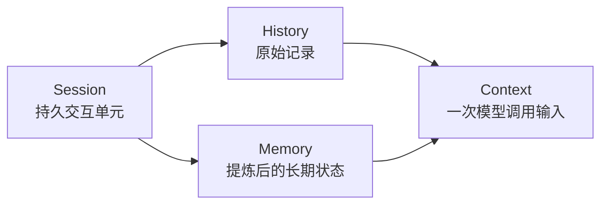

# Memory Concepts

这一篇先不讲实现，先把概念讲清楚。

如果概念不清，系统就会出现三个常见问题：

1. 把 `history` 当 `memory`，结果越聊越长，模型越来越重。
2. 把 `memory` 当 `context`，结果每次都整包塞给模型，成本高且不稳定。
3. 把 `session` 和 `context` 混成一个词，结果接口、目录、服务职责全部变乱。

## 一句话定义

- `Session`：一次持续交互的持久单元。
- `History`：这个 session 中发生过的原始记录。
- `Memory`：从历史里提炼出来、值得跨轮次复用的长期状态。
- `Context`：某一次调用大模型时，临时组装出来的输入。

## 为什么核心应该围绕 Session 设计

因为真正稳定存在、能够承接业务动作的，不是 `context`，而是 `session`。

`context` 是一次 LLM 调用时的输入快照。它天然是瞬时的、一次性的、可重建的。

`session` 才是运行时真正的“主体”：

1. 用户是在和一个 session 交互。
2. history 是挂在 session 上的。
3. working memory 也是挂在 session 上的。
4. agent 的执行状态、调度状态、清理动作，也都是按 session 组织。

所以 Downcity 的主轴应该是：

`Session -> History / Memory -> Context`

而不是：

`Context -> everything`

## 四个概念的关系



## 1. Session 是什么

Session 是系统真正的“会话容器”。

它负责承接：

1. 本次交互属于谁。
2. 本次交互的消息历史。
3. 这个会话的 working memory。
4. 这个会话当前是否在执行。
5. 这个会话对应的 agent 实例缓存。

在当前项目里，`sessionId` 已经是对外统一语义，实际落盘目录也已经迁移到：

```text
.downcity/session/<sessionId>/
```

## 2. History 是什么

History 不是“给模型看的上下文”，而是“真实发生过什么”的记录。

History 的核心特征：

1. 原始。
2. 可追溯。
3. 可审计。
4. 不负责压缩后的表达效率。

History 可以分两类：

1. `session message history`
   这是真正参与 agent 会话持久化的消息源。
   当前在 Downcity 中落到：
   `.downcity/session/<sessionId>/messages/messages.jsonl`
2. `chat event history`
   这是渠道层的入站/出站事件审计流。
   当前在 Downcity 中落到：
   `.downcity/chat/<sessionId>/history.jsonl`

所以，History 的重点不是“聪明”，而是“真实”。

## 3. Memory 是什么

Memory 不是原始记录，而是从历史中提炼出来的可复用状态。

Memory 的核心特征：

1. 有选择。
2. 有压缩。
3. 面向未来复用。
4. 允许被修正、合并、淘汰。

在 Downcity 里，memory 至少分三层：

1. `long-term memory`
   全局长期记忆。
   适合稳定事实、偏好、长期约束。
2. `daily memory`
   按天沉淀的增量记忆。
   适合今天发生了什么、今天值得记住什么。
3. `working memory`
   session 层的工作记忆。
   适合当前会话还没结束、但又不该每次从全 history 重算的信息。

## 4. Context 是什么

Context 只有两层意思。

第一层，名词意义：

它是一次模型调用真正送进去的 messages、system、tools、memory snippets 的组合结果。

第二层，动词意义：

它是一个“上下文化”过程，也就是把 session、history、memory、profile、task state 这些东西，映射成一次可控的大模型输入。

所以 `context` 不应该再被当成主存储单位。

它应该是一个结果：

```text
Context = contextualize(session, history, memory, runtime state)
```

## 一个最重要的设计判断

History 解决“发生过什么”。

Memory 解决“什么值得以后继续带着”。

Context 解决“这一轮到底给模型喂什么”。

Session 解决“这些东西到底归谁管”。

这四者不能再混。
