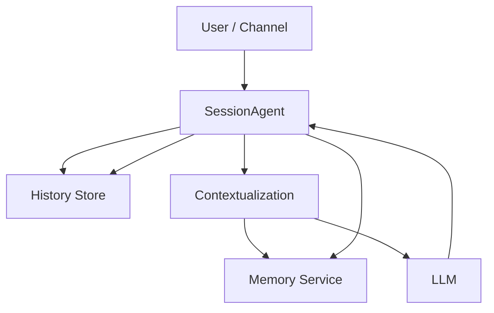
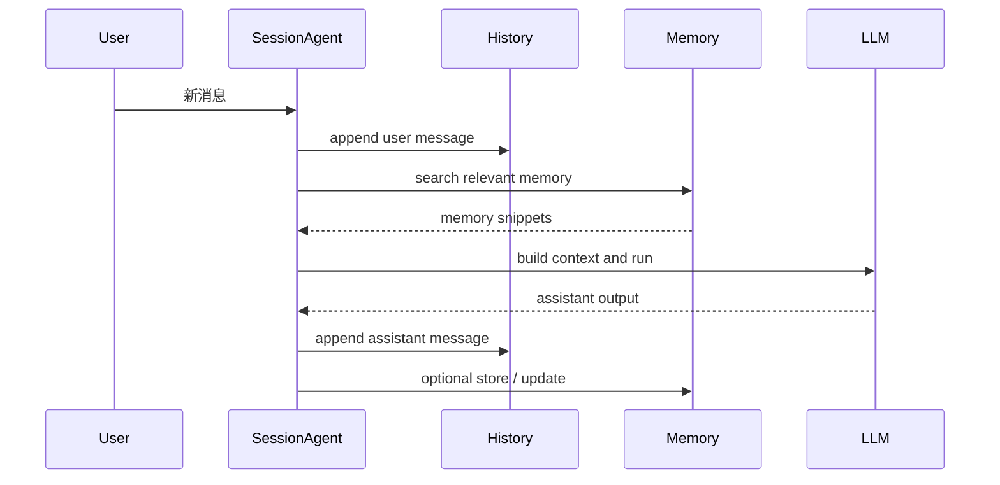
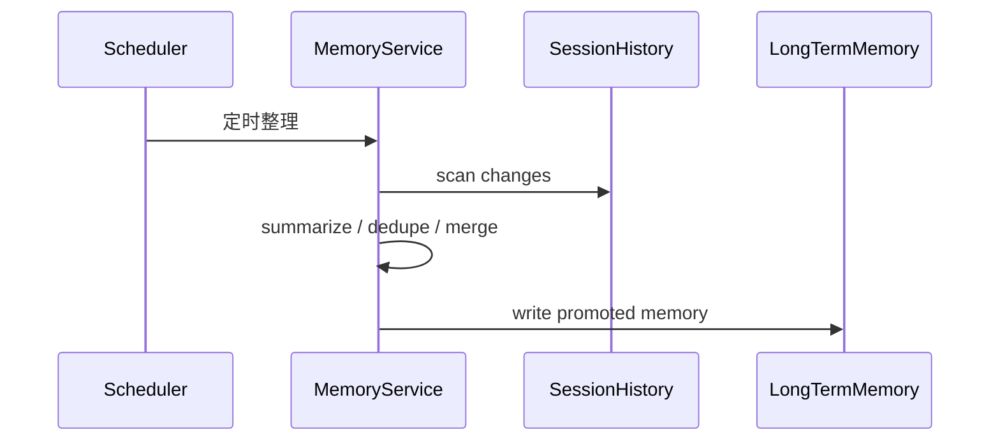
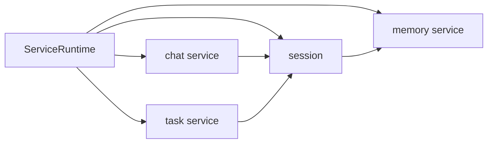

# Memory Architecture

这一篇回答的是实现问题。

目标不是做一个“功能很多”的 memory 系统，而是做一个结构很稳、职责很清楚的系统。

## 总体原则

1. Agent 负责执行与决策。
2. Memory service 负责 memory 的读写、索引、整理。
3. Context 不是一个独立存储体，而是一次构造结果。
4. Session 是运行时主轴。

## 理想结构

## 这张图怎么理解

### 1. SessionAgent 是前台执行者

SessionAgent 负责一轮真实交互：

1. 接收用户输入。
2. 追加 history。
3. 发起 contextualization。
4. 调用 LLM。
5. 写回 assistant message。
6. 必要时触发 memory 写入。

也就是说，SessionAgent 不负责“拥有 memory”，但它负责“驱动 memory”。

### 2. Memory service 是后台治理者

Memory service 不应该承担整轮对话执行。

它更适合做四件事：

1. `store`
   显式写 memory。
2. `search`
   检索候选 memory。
3. `get`
   按需读取 memory 片段。
4. `index / flush / status`
   做索引、整理、巡检。

这意味着 memory service 是一个“状态治理服务”，不是一个“主对话 agent”。

## 最推荐的运行逻辑

### 在线链路

在线链路要轻。

它只做“本轮必须做的事”：

1. 读少量高相关 memory。
2. 必要时写少量 working memory。
3. 不在主链路里做重型总结、重型归档、重型重写。

### 离线链路

离线链路才负责“真正变性感”的部分：

1. 整理今天的记忆。
2. 合并重复事实。
3. 把 working memory 提升为 daily/long-term memory。
4. 清理过期或低价值记忆。

这就是你提到的“每天自动整理 memory”最适合放的位置。

## 为什么不能让 Context 来当主轴

因为 context 有三个先天问题：

1. 它是临时结果，不是稳定实体。
2. 它会随模型、预算、策略变化。
3. 它天然不适合做落盘主键。

如果用 context 当主轴，就会发生：

1. API 名字像“上下文”，但其实在操作会话。
2. 存储目录像“上下文”，但其实在存 history。
3. memory 又挂在“上下文”下面，语义越来越扭曲。

所以正确做法是：

- `session` 负责承载
- `history` 负责记录
- `memory` 负责提炼
- `contextualization` 负责组装

## Downcity 里的推荐服务关系

解释：

1. `ServiceRuntime.session`
   是所有 service 共享的会话主轴。
2. `chat service`
   负责把渠道消息映射到 session。
3. `task service`
   负责把任务执行挂到某个 session 上。
4. `memory service`
   负责为 session 提供长期记忆能力。

## MemoryAgent 要不要存在

可以存在，但它不应该是“每次都站在主链路中间”的大总管。

更合适的定义是：

`MemoryAgent = Memory service 的整理策略执行者`

它主要在离线或异步链路里工作，比如：

1. 每天整理 daily memory。
2. 将 working memory 提升为 long-term memory。
3. 去重、合并、纠错。
4. 生成 memory 索引摘要。

所以更性感的形态不是：

`用户 -> MemoryAgent -> LLM`

而是：

`用户 -> SessionAgent -> LLM`

同时：

`Scheduler -> Memory service / MemoryAgent -> Memory Store`

## 最后收束成一句话

SessionAgent 处理“当前这轮怎么做”。

Memory service 处理“过去的东西怎么沉淀，未来怎么再取回来”。
