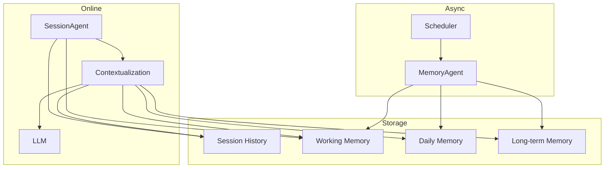

# Downcity Memory Selection

这一篇直接回答选型。

## Downcity 不应该选什么

### 1. 不要把全部 history 直接当 memory

问题：

1. 成本线性上涨。
2. 噪音越来越多。
3. 模型会被低价值旧信息污染。

### 2. 不要把 memory 做成纯向量黑盒

问题：

1. 可解释性弱。
2. 很难人工修正。
3. 对“稳定偏好、规则、身份信息”并不优雅。

### 3. 不要让 memory service 直接接管主对话

问题：

1. 链路太重。
2. 职责会和 SessionAgent 打架。
3. 很容易把“执行系统”做成“记忆系统驱动的一切”。

## Downcity 应该选什么

Downcity 最适合的是：

`分层 memory + session 主轴 + contextualization 组装`

## 选型结论

### A. 主实体：Session

理由：

1. 它稳定。
2. 它和用户交互直接对应。
3. 它天然能承载 history、working memory、execution state。

### B. 事实源：Session History

理由：

1. 原始。
2. 可审计。
3. 可回放。

当前事实源：

```text
.downcity/session/<sessionId>/messages/messages.jsonl
```

### C. 长期状态：Memory

推荐三层：

1. `working`
   当前 session 的临时工作记忆。
2. `daily`
   每日沉淀层。
3. `long-term`
   全局稳定层。

### D. 输入构造：Contextualization

Context 不是存储层，而是构造层。

推荐公式：

```text
LLM Context
= system prompts
+ recent session messages
+ retrieved memory snippets
+ task/runtime state
```

## 为什么这是 Downcity 最合适的方案

因为它同时满足四件事：

1. 简单
   主轴只有一个，就是 session。
2. 清晰
   history、memory、context 分工明确。
3. 可扩展
   以后可以加更强的整理器、检索器、reranker。
4. 可控
   出问题时可以清楚知道问题出在 history、memory 还是 contextualization。

## 推荐落地框架



## 对当前项目的直接建议

1. 对外 API、CLI、目录、dashboard 全部统一成 `session` 语义。
2. 把 `context` 保留为“模型输入构造”的概念，不再承担持久化主语义。
3. Memory service 保持工具化、服务化，不要抢 SessionAgent 的主链路职责。
4. 新增异步整理机制，让 MemoryAgent 定时处理 working -> daily -> long-term 的提升。
5. 后续如果继续重构，优先处理内部残留的 `contextId` 类型名与 ALS 命名。

## 最终一句话

Downcity 理想的 memory 不是一个“大而全的记忆盒子”。

它应该是一个围绕 session 运转、由 history 提供事实、由 memory 提供长期状态、由 contextualization 负责临时组装的系统。
