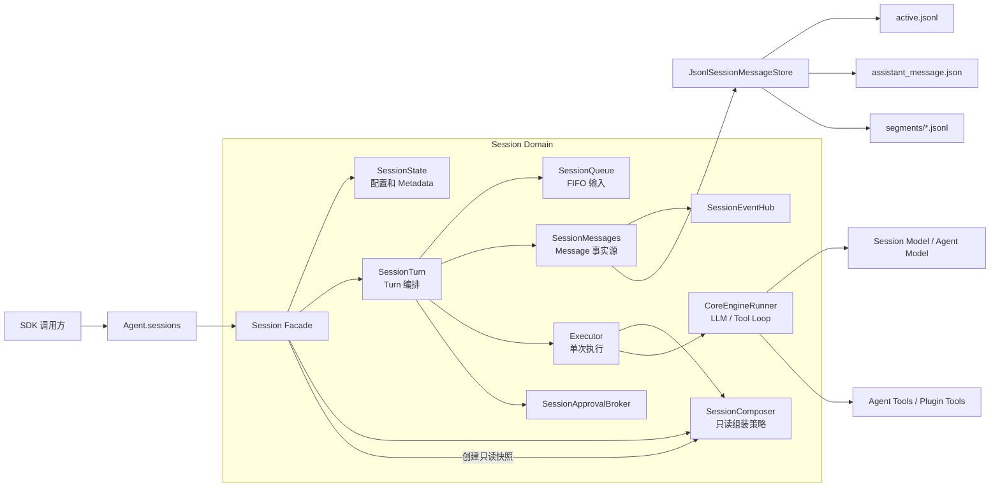
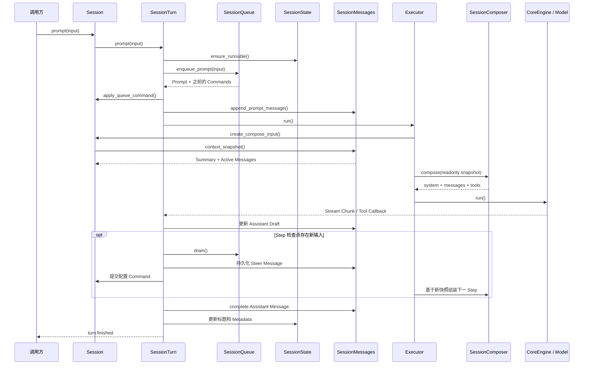
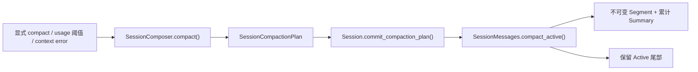

# Session Runtime 架构

## 1. 目标

Agent SDK 的 Session Runtime 遵循以下边界：

- `Session` 是公开 Facade 和对象装配入口。
- `SessionState` 只管理配置、初始化状态、标题和 Metadata。
- `SessionTurn` 只管理输入队列、Turn 生命周期、Steer、停止和执行收口。
- `SessionMessages` 是 canonical Message 的唯一事实源。
- `SessionComposer` 只读取快照并生成模型输入或压缩计划。
- `Executor` 只执行单次 LLM/Tool Loop，不持有 History Store，也不写 Session 文件。

## 2. 模块职责

| 模块 | 职责 | 不负责 |
| --- | --- | --- |
| `AgentSessions` | 创建、恢复、缓存 Session，注入 Agent 级模型、环境、指令和 Plugin | Turn 执行和消息持久化 |
| `Session` | 对外 API、组件装配、模型解析、配置 Command 提交、压缩计划提交 | Tool Loop 细节 |
| `SessionState` | configured/effective 配置、初始化、标题和 Metadata | 创建或更新 Message |
| `SessionQueue` | 按 FIFO 保存 Prompt 和显式 Command | 解释或执行队列项 |
| `SessionTurn` | Turn Handle、Queue 消费、Steer 合并、Abort、Assistant Writer 收口 | 选择模型输入策略 |
| `SessionComposer` | 组装 system、messages、tools，生成压缩计划 | 写 Message、Metadata、Mutation 或 JSONL |
| `Executor` | 单次执行、Step 刷新、上下文超限重试、Plugin Lease | Session 生命周期和持久化 |
| `SessionMessages` | User、Assistant、Action、Error Message 和 Segment 提交 | 选择何时执行或压缩 |
| `JsonlSessionMessageStore` | Active、Assistant Draft、Segment 的物理读写 | Composer 策略 |

## 3. 组件关系



## 4. Prompt 与 Turn



一个 Session 同时只运行一个活跃 Turn。新的 Prompt 如果在 Step 检查点被消费，会作为 `steer` 并入当前 Turn；否则保留到下一个 Turn。`stop()` 取消当前 Turn 和排队 Prompt，但保留尚未提交的配置 Command。

Queue 不保存闭包，只保存以下显式事实：

```text
prompt
session_model
agent_instruction
agent_env
agent_plugins
compact
```

## 5. 模型与配置

模型解析顺序固定为：

```text
effective Session model
  -> configured Session model
  -> Agent model
```

`session.set({ model })` 先更新 configured state，再把 `session_model` Command 放入 Queue。正在运行的 Provider 请求继续使用当前 Step 已捕获的模型；Command 在下一个 Step 检查点提交为 effective state。

Agent instruction、env 和 Plugin 更新同样通过 Queue 在 Step 边界提交，避免同一次 Provider 请求中混用两套运行状态。

## 6. 统一 SessionComposer

过去的四个 Composer 不再构成独立执行管线。当前统一协议是：

```ts
interface SessionComposer {
  compose(input: SessionComposeInput): Promise<SessionStepInput>;
  compact(input: SessionCompactionInput): Promise<SessionCompactionPlan | null>;
  should_compact(error: unknown): boolean;
}
```

### 6.1 旧职责迁移

| 旧能力 | 当前归属 |
| --- | --- |
| `SystemComposer.resolve()` | `DefaultSessionComposer.compose()` + `SessionSystem` |
| `HistoryComposer.prepare()` | `SessionMessages.context_snapshot()` + `SessionMessageCodec.to_executor_history()` |
| `ContextComposer.compose()` 的 tools | `Session.create_compose_input()` + `SessionComposer.compose()` |
| `ContextComposer` 的 Prepare Step / Steer | `SessionTurn` + `CoreEngineRunner` |
| `ContextComposer` 的 onStepFinish | `CoreEngineRunner` 直接调用 `SessionRunContext` Callback |
| `ContextComposer` 的 fallback Assistant | `CoreEngineRunner` + `ExecutorRecoveryPolicy`，由 `SessionTurn` 持久化 |
| `CompactionComposer.shouldCompactOnError()` | `SessionComposer.should_compact()` |
| `CompactionComposer.run()` | `SessionComposer.compact()` 生成计划，`Session` 提交计划 |

### 6.2 Composer 能做什么

- 增删或重排 system messages。
- 筛选、转换或注入本轮模型 messages。
- 调整当前 Step 可见的 tools。
- 根据只读快照生成 `SessionCompactionPlan`。
- 判断模型错误是否需要压缩后重试。

Composer 不能写 Message、Metadata、Mutation、JSONL 或 Segment，也不能消费 Queue 或控制 Turn。

## 7. Message 与持久化

`SessionMessages` 管理四类 canonical Message：

```ts
type SessionMessage =
  | SessionUserMessage
  | SessionAssistantMessage
  | SessionActionMessage
  | SessionErrorMessage;
```

磁盘布局：

```text
messages/
├── active.jsonl
├── assistant_message.json
├── meta.json
└── segments/
    └── <start_sequence>-<end_sequence>.jsonl
```

- `active.jsonl` 保存最新 Compact 之后的完整 Message 快照。
- `assistant_message.json` 保存当前流式 Assistant 草稿。
- Segment 不可变，保存关闭的 Active 前缀和累计 Summary footer。
- Mutation 是持久化成功后的实时通知协议，不是持久化日志。

固定写入顺序：

```text
构造或更新完整 Message
  -> 持久化 Message / Assistant Draft
  -> 更新内存快照
  -> 发布 Mutation
```

## 8. Compaction



Composer 可以调用模型生成 Summary，但只返回计划。Segment 提交、Action Message、Metadata 更新和失败观测全部由 Session 领域完成。

## 9. 架构不变量

1. canonical Message 只有 `SessionMessages` 一个写入入口。
2. Composer 输入是只读快照，Composer 不执行持久化副作用。
3. Executor 不持有 Message Store。
4. Session 配置和 Agent 配置只在 Step 检查点切换 effective state。
5. Assistant 草稿完成前不能提交持久化 Compact。
6. 持久化成功后才能发布对应 Message Mutation。
7. Plugin Execution Lease 以 Step 为边界获取和释放。

## 10. 变更边界

`9f3b6df5` 只移动类型、统一内部 snake_case 命名并补充类型导出，没有修改 Prompt、Queue、模型调用、Tool Loop、Message 持久化或 Compact 的执行顺序。

此前的 Session Runtime 重构改变了内部架构和 SDK 扩展 API：旧多 Composer、HistoryStore、Recorder 和 PromptRuntime 已删除，统一为 `SessionComposer`、`SessionMessages` 和 `SessionTurn`。核心运行行为保持原语义，但自定义 Session 的接入方式和内部持久化模型属于明确变化。
