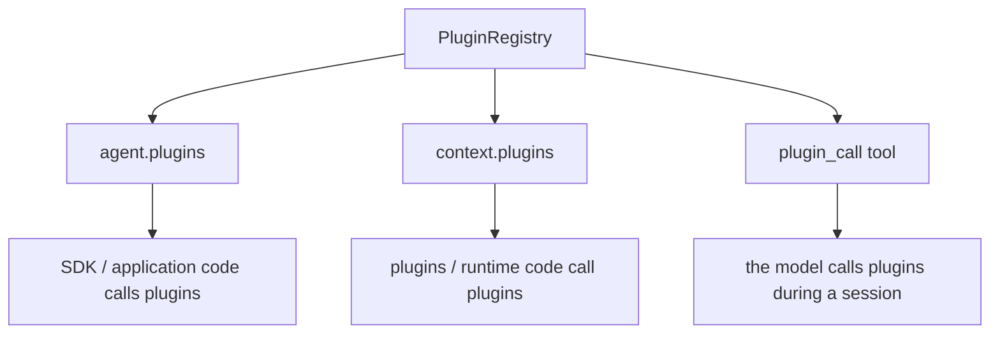
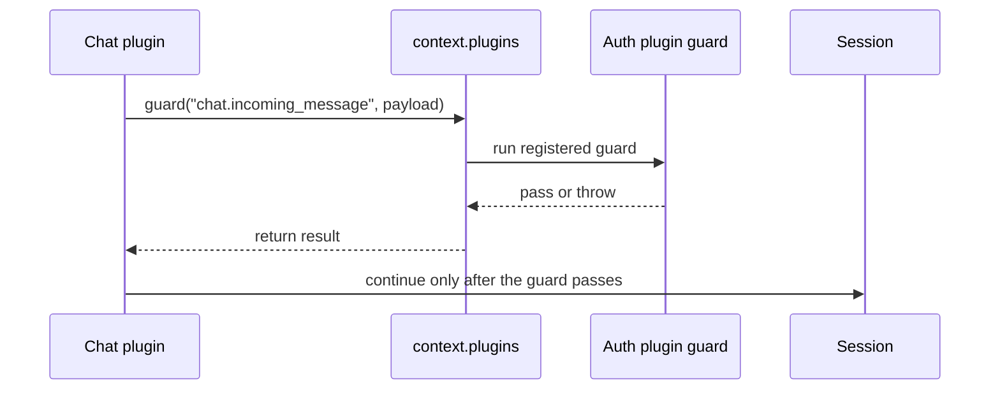

# Plugin Call Surfaces

Downcity has three common plugin call surfaces:

- `agent.plugins`
- `context.plugins`
- `plugin_call` tool

They all end up in the current Agent plugin registry, but they are used by different callers.



## `agent.plugins`

`agent.plugins` is the SDK-facing entry point for application code.

```ts
const result = await agent.plugins.runAction({
  plugin: "skill",
  action: "lookup",
  payload: {
    name: "frontend-design",
  },
});
```

Use it when:

- a server API wants to trigger a plugin action
- a test script needs to call a plugin
- application code needs to list plugins, check availability, or read action results

Common calls:

```ts
agent.plugins.list();
agent.plugins.availability("skill");
agent.plugins.runAction({ plugin: "skill", action: "list", payload: {} });
agent.plugins.pipeline("chat.enrich_message", value);
agent.plugins.guard("chat.authorize_message", value);
agent.plugins.effect("audit.observe", value);
agent.plugins.resolve("auth.resolve_role", value);
```

## `context.plugins`

`context.plugins` is the plugin/runtime-internal entry point.

For example, after the chat plugin receives a Telegram message, it may need the authorization plugin to decide whether the sender is allowed to continue. The chat plugin should not import the authorization plugin's private implementation directly. Instead, it triggers a guard point through the current runtime context:

```ts
await context.plugins.guard("chat.incoming_message", {
  channel: "telegram",
  userId: "123",
  text: "Check the project status",
});
```

The authorization plugin can register that guard:

```ts
hooks: {
  guard: {
    "chat.incoming_message": [
      async ({ value, context }) => {
        // Throw when the sender is not allowed.
      },
    ],
  },
}
```

The flow looks like this:



Use it when:

- one plugin triggers a `pipeline` registered by another plugin
- one plugin triggers a `guard` registered by another plugin
- one plugin triggers audit, sync, or observation `effect` handlers
- one plugin uses `resolve` to ask for one authoritative answer

In one line: `context.plugins` is how plugins collaborate without depending on each other's private implementation.

## `plugin_call` tool

`plugin_call` is the tool-facing entry point for the model.

During a session, the model can call:

```ts
plugin_call({
  plugin: "skill",
  action: "lookup",
  payload: {
    name: "frontend-design",
  },
});
```

The tool turns that into:

```ts
agent.plugins.runAction({
  plugin: "skill",
  action: "lookup",
  payload: {
    name: "frontend-design",
  },
});
```

Use this when you want the model to call registered plugin actions during a conversation.

For example, if the user asks:

```txt
Read the frontend-design skill for me.
```

The model can decide to call `plugin_call`, read the skill content, and continue the answer.

## Which One To Use

| Surface | Caller | Typical use |
| --- | --- | --- |
| `agent.plugins` | SDK / application code | Application code calls plugins directly |
| `context.plugins` | plugin / runtime internals | Plugins collaborate through hooks, resolve points, or actions |
| `plugin_call` | model | The model calls plugin actions during a session |

Use `agent.plugins` when you are writing application code.

Use `context.plugins` when you are writing plugin internals.

Use `plugin_call` when you want the model to trigger plugin actions during a session.

## Related Docs

- [Plugin overview](/en/agent-sdk-docs/plugins/overview)
- [Plugin actions](/en/agent-sdk-docs/plugins/plugin-actions)
- [Plugin hooks and resolve](/en/agent-sdk-docs/plugins/plugin-hooks)
- [Custom plugin](/en/agent-sdk-docs/plugins/custom-plugin)
