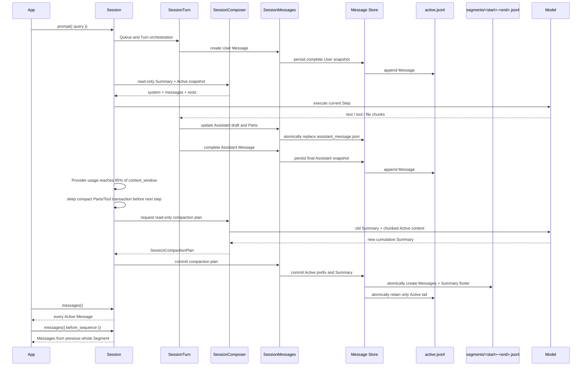

# Metadata and Storage

SDK Sessions are persisted under the project directory. Applications should read and write through the Session API rather than use these files as their own database.

```text
<projectRoot>/.downcity/agents/<agentId>/sessions/<sessionId>/
├── instruction.md
└── messages/
    ├── active.jsonl
    ├── assistant_message.json
    ├── meta.json
    └── segments/
        ├── 000000000001-000000000900.jsonl
        └── 000000000901-000000001500.jsonl
```

`agentId` is part of the storage partition. Multiple Agents in one project can use the same `sessionId` without conflict.

`instruction.md` is an optional complete system snapshot. A Session fixes its first generated system in memory by default. Local `session.snapshot()` creates or overwrites the file. `session.syncshot()` regenerates the in-memory system and also overwrites the file when it already exists. If the file is absent when restored, the Session regenerates from the Agent's current instruction and plugins; deleting the file restores that behavior.

## Active and Segments

`active.jsonl` contains only real `SessionMessage` values still in the active window after the latest Compact. It has no fixed message-count or API page-size limit. The SDK does not estimate tokens before a model call. Compact is scheduled only when the Provider's real `usage.totalTokens` (or `inputTokens + outputTokens` when total is unavailable) reaches 95% of the model's configured `context_window`.

During Compact, the SDK first folds reasoning, text, and tool output at part level in the running model context while keeping the latest tool call/result/approval transaction intact. After the Assistant has finished persisting, the current Active is closed as an immutable Segment named by its sequence range. The Segment stores real Messages first and one cumulative Summary footer last:

```text
message sequence 1
...
message sequence 900
summary through sequence 900
```

The next Compact might create `901-1500`. Its footer merges the previous Summary with new content from 901-1500, so it cumulatively covers 1-1500. A Summary is not a `SessionMessage`, consumes no sequence, and is never stored in Active.

The next real usage after Compact validates the result: 50% of `context_window` or less passes; above 50% schedules another deep compact before the next step. If a Provider returns a context-length error without usage, the SDK also forces an in-memory fold and retries.

## Model context

Each model request reads only:

```text
latest Segment cumulative Summary
+ every User / Assistant Message in Active
```

It does not scan all old Segments. Old Segments serve historical UI, Fork, and audit. `session.messages()` returns all Active Messages; passing `before_sequence` returns the immediately preceding whole Segment.

## Session progression



The Composer only reads snapshots and returns model input or a compaction plan. `SessionMessages` owns the actual writes for Messages, Assistant drafts, and Segments.

## `assistant_message.json`

Before completion, a streaming Assistant atomically replaces one complete draft instead of appending every Delta to Active. On completion, the final snapshot is appended to `active.jsonl` and the draft is removed. Each Session has at most one streaming draft. Text, Tool, and File Parts retain the model's generation order through their own `sequence` values.

## Recovery and consistency

Compact atomically creates the Segment before atomically replacing Active. If the process exits between those operations, the original Messages temporarily exist in both files but are not lost. Initialization uses the latest Segment end sequence to remove the overlapping Active prefix.

When a Session starts or reopens, the SDK also checks the Assistant draft. Existing text, reasoning, tool, and file Parts are retained in their original order.

## Performance boundaries

- Normal model progression reads only the latest Summary and Active, so it does not grow linearly with total history.
- Compact triggering uses only real Provider usage and performs no pre-call token estimation.
- Summary input is chunked to a fixed character bound, so one large Assistant or Tool output cannot bypass folding.
- Loading older history parses one Segment at a time.
- Segment files are immutable and their names are the sequence index; no `manifest.json` is required.
- `fork()` intentionally copies full history and therefore reads every Segment; it is a lower-frequency full-history operation.

## `meta.json`

`meta.json` stores lightweight list and detail fields such as `sessionId`, `agentId`, title, model label, timestamps, message count, history bytes, and timezone. Runtime model instances are never persisted. The SDK updates these summaries as Session properties and Message state change.

Archiving a Session and Compact Segments are distinct. `archive()` moves the entire Session into archived sessions storage; Compact only closes an old Active prefix under the current Session's `segments/` directory.
