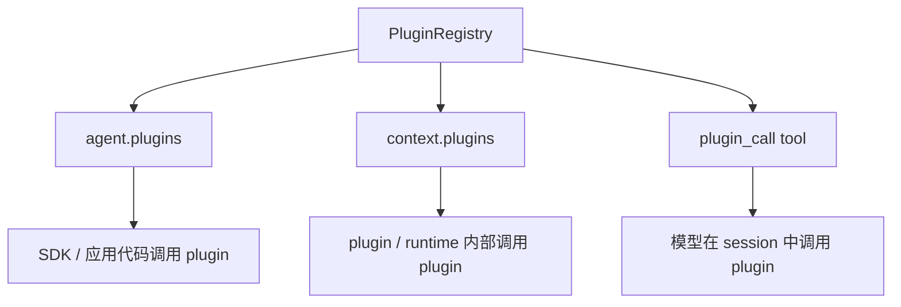
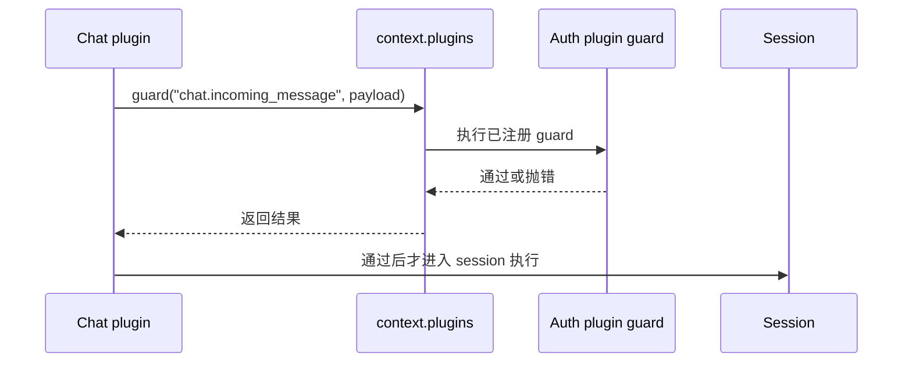

# Plugin 调用入口

Downcity 里有三个常见的 plugin 调用入口：

- `agent.plugins`
- `context.plugins`
- `plugin_call` tool

它们最终都会进入当前 Agent 的 plugin registry，但使用者不同。



## `agent.plugins`

`agent.plugins` 是 SDK 用户在应用代码里调用 plugin 的入口。

```ts
const result = await agent.plugins.runAction({
  plugin: "skill",
  action: "lookup",
  payload: {
    name: "frontend-design",
  },
});
```

适合这些场景：

- 服务端 API 需要主动触发一个 plugin action
- 测试脚本需要调用 plugin
- 应用代码需要读取 plugin 列表、可用性或运行结果

常见调用：

```ts
agent.plugins.list();
agent.plugins.availability("skill");
agent.plugins.runAction({ plugin: "skill", action: "list", payload: {} });
agent.plugins.pipeline("chat.enrich_message", value);
agent.plugins.guard("chat.authorize_message", value);
agent.plugins.effect("audit.observe", value);
agent.plugins.resolve("auth.resolve_role", value);
```

## `context.plugins`

`context.plugins` 是 plugin 或 runtime 内部拿到的调用入口。

例如 chat plugin 收到一条 Telegram 消息后，需要让授权 plugin 判断这个用户是否能继续执行。chat plugin 不应该直接 import 授权 plugin 的私有实现，而是通过当前运行上下文触发一个 guard 点：

```ts
await context.plugins.guard("chat.incoming_message", {
  channel: "telegram",
  userId: "123",
  text: "帮我查一下项目状态",
});
```

授权 plugin 可以注册这个 guard：

```ts
hooks: {
  guard: {
    "chat.incoming_message": [
      async ({ value, context }) => {
        // 没权限时直接 throw，当前消息流就会被阻断。
      },
    ],
  },
}
```

这个流程是：



适合这些场景：

- 一个 plugin 触发其他 plugin 注册的 `pipeline`
- 一个 plugin 触发其他 plugin 注册的 `guard`
- 一个 plugin 触发审计、同步、观测类 `effect`
- 一个 plugin 通过 `resolve` 获取唯一权威答案

一句话：`context.plugins` 是 plugin 之间解耦协作的入口。

## `plugin_call` tool

`plugin_call` 是给模型使用的 tool。

模型在 session 执行过程中可以调用：

```ts
plugin_call({
  plugin: "skill",
  action: "lookup",
  payload: {
    name: "frontend-design",
  },
});
```

tool 内部会把这次调用转成：

```ts
agent.plugins.runAction({
  plugin: "skill",
  action: "lookup",
  payload: {
    name: "frontend-design",
  },
});
```

`plugin_call` 绑定当前 session 所属 Agent 的 plugin registry。多 Agent 宿主在同一进程里缓存或切换 Agent 时，某个 session 的 `plugin_call` 不会读到其他 Agent 的 registry。

这个入口适合让模型在对话中主动使用已注册 plugin。

例如用户问：

```txt
帮我读取 frontend-design skill
```

模型可以决定调用 `plugin_call`，读取 skill 内容后再继续回答。

## 三者怎么选

| 入口 | 谁使用 | 典型场景 |
| --- | --- | --- |
| `agent.plugins` | SDK / 应用代码 | 应用主动调用 plugin |
| `context.plugins` | plugin / runtime 内部 | plugin 之间通过 hooks、resolve 或 action 协作 |
| `plugin_call` | 模型 | 模型在 session 中主动调用 plugin action |

如果你在写应用代码，优先看 `agent.plugins`。

如果你在写 plugin 内部逻辑，使用 `context.plugins`。

如果你希望模型自己在对话中触发 plugin action，使用 `plugin_call` tool。

## 相关文档

- [Plugin 总览](/zh/agent-sdk-docs/plugins/overview)
- [Plugin Actions](/zh/agent-sdk-docs/plugins/plugin-actions)
- [Plugin Hooks 和 Resolve](/zh/agent-sdk-docs/plugins/plugin-hooks)
- [自定义 Plugin](/zh/agent-sdk-docs/plugins/custom-plugin)
