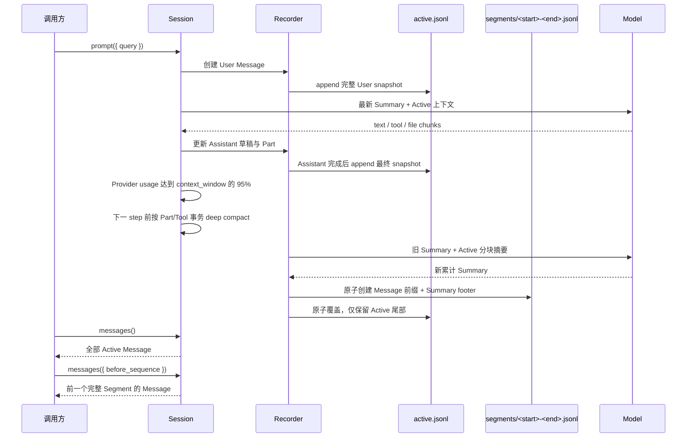

# 元数据与落盘

SDK Session 默认保存在项目目录中。应用应通过 Session API 读写，不要把这些文件当作自己的数据库。

```text
<projectRoot>/.downcity/agents/<agentId>/sessions/<sessionId>/
└── messages/
    ├── active.jsonl
    ├── assistant_message.json
    ├── meta.json
    └── segments/
        ├── 000000000001-000000000900.jsonl
        └── 000000000901-000000001500.jsonl
```

`agentId` 是存储分区的一部分。同一项目中的多个 Agent 可以使用相同 `sessionId` 而不冲突。

## Active 与 Segment

`active.jsonl` 只保存最近一次 Compact 之后仍处于活动窗口中的真实 `SessionMessage`。它没有固定条数上限，也不按 API 页大小切分。SDK 不在模型调用前估算 token；只有 Provider 返回的真实 `usage.totalTokens`（缺失时使用 `inputTokens + outputTokens`）达到模型 `context_window` 的 95% 时，才安排 Compact。

Compact 发生时，SDK 会先在运行中的模型上下文内按 part 折叠 reasoning、文本和工具输出，同时保持最新 tool call/result/approval 事务完整。Assistant 完成落盘后，当前 Active 被关闭为按 sequence 范围命名的不可变 Segment。Segment 每行先保存真实 Message，最后一行保存累计 Summary footer：

```text
message sequence 1
...
message sequence 900
summary through sequence 900
```

下一次 Compact 会创建新的 Segment，例如 `901-1500`，其 footer Summary 会合并旧 Summary 与 901-1500 的新内容，因此它累计覆盖 1-1500。Summary 不是 `SessionMessage`，不占用 sequence，也不放进 Active。

Compact 后的下一次真实 usage 用于验收：不超过 `context_window` 的 50% 即达标；高于 50% 时继续在下一 step 前 deep compact。Provider 直接返回 context-length error 且没有 usage 时，SDK 也会强制折叠当前模型消息并重试。

## 模型上下文

每轮模型输入只需要读取：

```text
最新 Segment 的累计 Summary
+ Active 中的全部 User / Assistant Message
```

不需要扫描所有旧 Segment。旧 Segment 用于历史 UI、Fork 和审计；`session.messages()` 返回 Active 全量，传入 `before_sequence` 时返回紧邻的前一个完整 Segment。

## 推进泳道图



## `assistant_message.json`

流式 Assistant 在完成前不会把每个 Delta 追加到 Active，而是持续原子覆盖当前完整草稿。Assistant 完成后，最终快照追加到 `active.jsonl`，再删除草稿。同一时刻每个 Session 最多有一个流式草稿；Text、Tool、File Part 均按各自 `sequence` 保持模型生成顺序。

## 中断恢复与一致性

Compact 先原子创建 Segment，再原子覆盖 Active。若进程在两步之间退出，原始 Message 会短暂同时存在于 Segment 和 Active，但不会丢失；下次初始化会以最新 Segment 的结束 sequence 为边界，清理 Active 的重叠前缀。

启动或重新打开 Session 时，SDK 还会检查 Assistant 草稿。草稿中的文本、推理、工具和文件 Part 会保留并按原顺序恢复。

## 性能边界

- 正常模型推进只读最新 Summary 与 Active，不随完整历史线性增长。
- Compact 的触发只依赖 Provider 真实 usage，不执行调用前 token 预估。
- 摘要输入按固定字符上限分块；单条巨大 Assistant 或 Tool output 不会绕过折叠。
- 历史向上加载每次只解析一个 Segment。
- Segment 文件不可变，文件名就是 sequence 索引，不需要 `manifest.json`。
- `fork()` 明确复制完整历史，因此会读取所有 Segment；这是低频全量操作。

## `meta.json`

`meta.json` 保存列表和详情所需的轻量属性，包括 `sessionId`、`agentId`、标题、模型标签、时间戳、消息数、历史字节数和时区。运行时模型实例不会持久化。Session 属性或消息状态变化时，SDK 会同步更新这些摘要字段。

归档整个 Session 与 Compact Segment 是两件不同的事。`archive()` 会把整个 Session 移入 archived sessions 区域；Compact 只在当前 Session 的 `segments/` 中关闭旧 Active 前缀。
