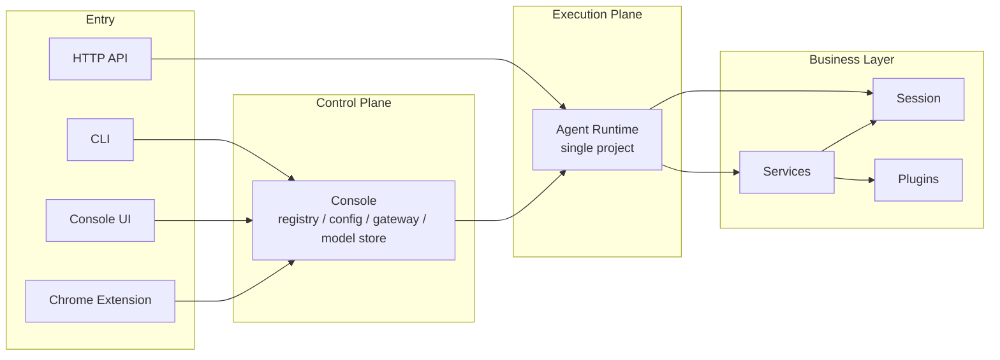
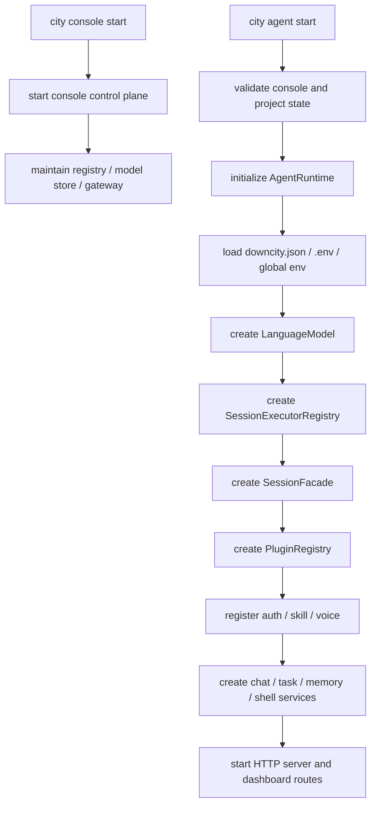
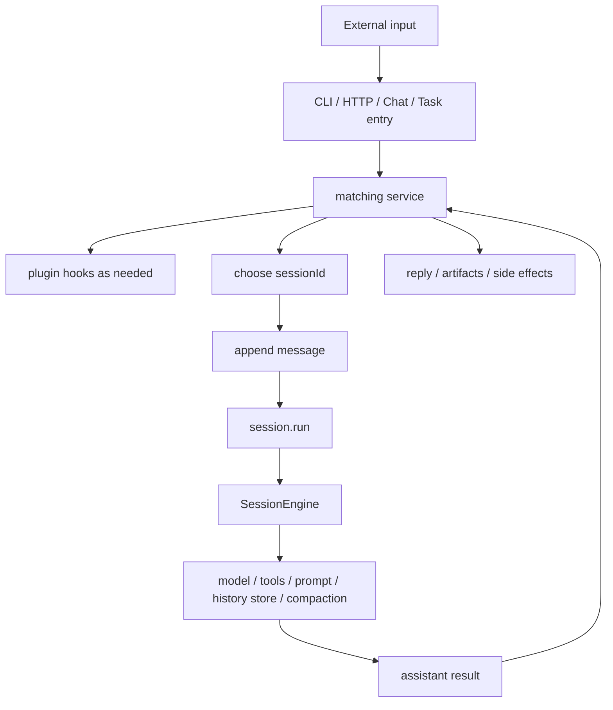

# System Architecture Logic

This page explains how the system actually runs, not just where files live.

## Overall Layers

Downcity is easiest to read as four layers:

1. Entry surfaces: CLI, Console UI, Chrome Extension, HTTP API
2. Control plane: console
3. Execution plane: agent runtime
4. Business layer: session, services, plugins



## Why split console and agent

### Console

Console is the global control plane. It:

- manages multiple agent projects
- maintains registry
- owns global model configuration, shared env, and control state
- provides the common entry for Console UI and extension surfaces

### Agent

Agent is the single-project execution plane. It:

- loads the current project config
- exposes the project HTTP runtime
- owns `AgentRuntime`
- drives session, services, and plugins

## The Runtime Center

The runtime center is:

- `AgentRuntime`

It owns:

- `config`
- `env`
- `systems`
- `model`
- `sessionFacade`
- `services`
- `pluginRegistry`

So the most accurate high-level sentence is:

```text
console manages many agents
each agent runtime is centered on AgentRuntime
AgentRuntime then owns session, services, and plugins
```

## Why split session, service, and plugin

These layers answer different questions.

### Session

Session answers:

- which `sessionId` an input belongs to
- how messages are persisted
- when execution enters the model loop
- how results are written back

The real objects here are:

- `SessionFacade`
- `SessionExecutorRegistry`
- `LocalSessionExecutor`
- `SessionEngine`
- `JsonlSessionHistoryStore`

### Service

Service answers:

- which kind of input it owns
- how the business workflow moves
- when to enter session execution
- which extension points it exposes

The current services are:

- `chat`
- `task`
- `memory`
- `shell`

### Plugin

Plugin answers:

- how to extend a workflow without owning it

Plugin capabilities include:

- actions
- system injection
- hooks

Hook semantics are unified as:

- `pipeline`
- `guard`
- `effect`
- `resolve`

## Startup Path



## Execution Path



## Real Chat Plugin Points

The `chat` service defines and uses:

- `chat.augmentInbound`
- `chat.observePrincipal`
- `chat.authorizeIncoming`
- `chat.resolveUserRole`
- `chat.beforeEnqueue`
- `chat.afterEnqueue`
- `chat.beforeReply`
- `chat.afterReply`

These point names belong to the service. Plugins only implement some of them.

## Core Objects in Code

- `AgentRuntime`: single-project runtime center
- `AgentContext`: unified runtime surface
- `SessionFacade`: session facade
- `SessionEngine`: execution kernel
- `PluginRegistry`: plugin registration and dispatch
- `BaseService`: service instance base class

## In One Sentence

```text
The current system logic is: console manages many agents, each agent runtime is centered on AgentRuntime, and session, services, and plugins all hang off that runtime in clearly separated roles.
```
