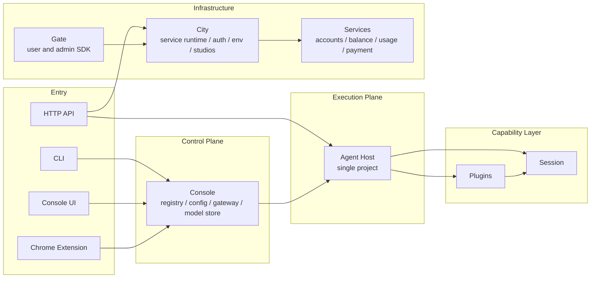
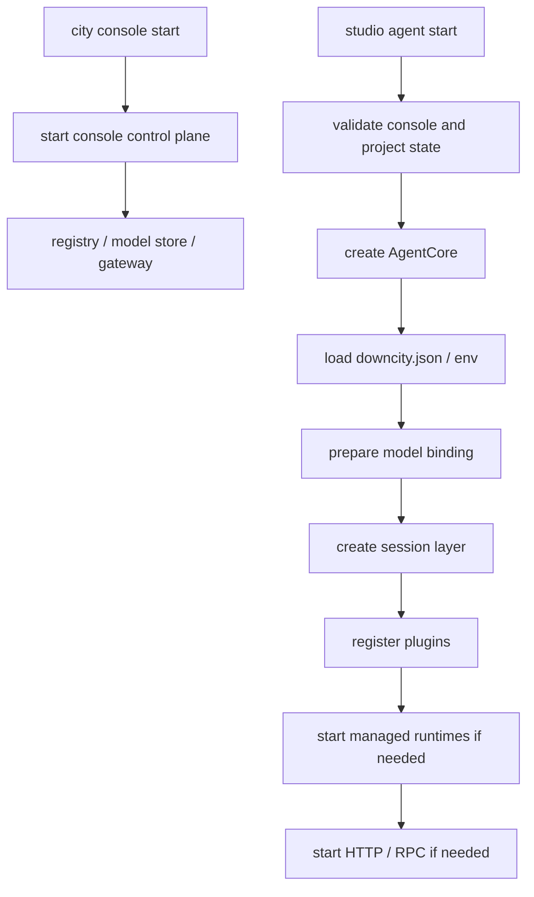
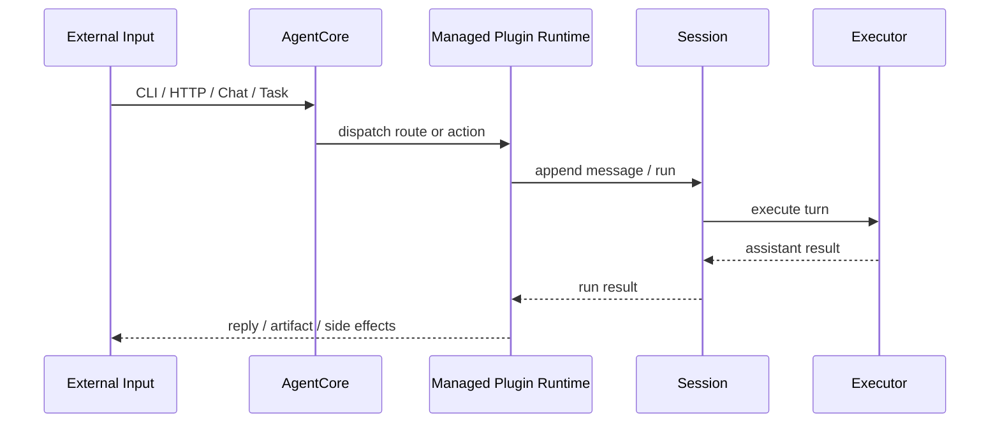

# System Architecture Logic

This page explains how the current system actually runs.

## Overall layers

Downcity is easiest to read as six layers:

1. Entry surfaces: CLI, Console UI, Chrome Extension, HTTP API
2. Control plane: console
3. Execution plane: agent host
4. Capability layer: session and plugins
5. Infrastructure layer: city runtime, auth, env, studio-scoped routing
6. Public services: accounts, balance, usage, payment, and service SDK access

## Why split console and agent

### Console

Console is the global control plane. It:

- manages many project agents
- maintains registry and shared state
- owns model pool coordination and gateway behavior
- provides the common surface used by UI and extension layers

### Agent host

The agent host is the single-project execution plane. It:

- loads project config
- creates one `AgentCore`
- exposes project HTTP or RPC runtime when needed
- coordinates session execution and managed plugin runtime

### City and services

City is the reusable infrastructure for service-style runtimes. It:

- mounts services and actions behind HTTP routes
- owns studio-scoped auth, runtime env, and built-in studio/env tables
- gives City compositions a shared foundation for Node and edge deployments

Services are public city services. They provide accounts, balance, usage, payment, and Stripe payment flows without owning city-level model governance.

## Current runtime center

The real center is `AgentCore`.

It owns:

- config and env
- plugin registry access
- session creation and lookup
- host integration ports
- the shared `AgentContext`

## Why split session and plugin

### Session

Session answers:

- which `sessionId` an input belongs to
- how history is persisted
- when execution enters the model loop
- how results are finalized

### Plugin

Plugin answers:

- which capability surface is exposed
- which runtime point is augmented
- whether one runtime module should stay alive with the host

The stable hook semantics are:

- `pipeline`
- `guard`
- `effect`
- `resolve`

## Startup chain

## Execution chain

