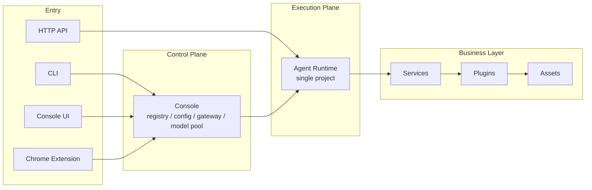
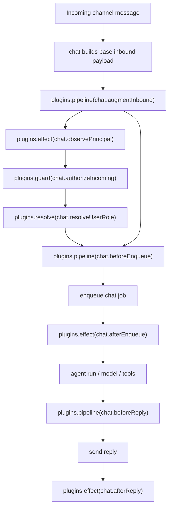

# System Architecture Logic

This page explains how the system actually runs, not just where files live.

## Overall Layers

Downcity can be read as four layers:

1. Entry surfaces: CLI, Console UI, Chrome Extension, HTTP API
2. Control plane: console
3. Execution plane: agent runtime
4. Business layer: services, plugins, assets

## Why split console and agent

### Console

Console is the global control plane. It:

- manages multiple agent projects
- maintains registry
- owns global model pool, shared env, and config state
- provides the common entry for Console UI and extension surfaces

### Agent

Agent is the single-project execution plane. It:

- loads the current project config
- exposes the project HTTP runtime
- drives context, chat, tasks, logs, and services

## Why split service, plugin, and asset

### Service

The question a service answers is:

“Who owns the main workflow and actively participates in the agent lifecycle?”

A service:

1. has lifecycle
2. is tightly coupled to current agent state
3. actively participates in execution
4. owns a business workflow

### Plugin

The question a plugin answers is:

“Who extends the workflow without owning it?”

A plugin:

1. has no standalone lifecycle
2. does not actively participate by itself
3. does not own a runtime state machine
4. attaches through service-defined points

In the current implementation, plugin points converge on four semantics:

- `pipeline`: serial transformation
- `guard`: serial validation with interruption on error
- `effect`: side effects only
- `resolve`: exactly one implementation returns a value

So the system is no longer centered on capabilities. Instead:

- services define point names
- runtime defines execution semantics
- plugins implement the points

### Asset

The question an asset answers is:

“How do low-level dependencies get installed, checked, and used?”

## Real chat plugin points

The `chat` service currently defines and uses:

- `chat.augmentInbound` as `pipeline`
- `chat.observePrincipal` as `effect`
- `chat.authorizeIncoming` as `guard`
- `chat.resolveUserRole` as `resolve`
- `chat.beforeEnqueue` as `pipeline`
- `chat.afterEnqueue` as `effect`
- `chat.beforeReply` as `pipeline`
- `chat.afterReply` as `effect`

## Real chat flow

## Core objects in code

- `HookRegistry`: registers and executes the four plugin semantics
- `PluginRegistry`: registers plugins, runs actions, checks availability
- `PluginPoints.ts`: service-owned stable point names
- `PluginRuntime`: service-side runtime helpers that trigger plugin points
