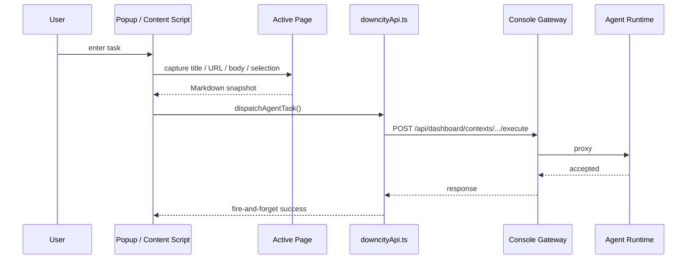

# Chrome Extension Request Flow

The value of the Chrome Extension is not just “one more entry point”. It reduces the distance between seeing content and sending it to an agent.

## The core problem it solves

Without the extension, the clumsy path for sending a page to an agent is usually:

1. copy page content
2. switch back to chat
3. paste content
4. add a task instruction

The extension removes that context-switch cost.

## Main Flow

## How the key modules are split

### `pageMarkdown.ts`

Responsibilities:

- extract structured content from the page
- convert it into Markdown
- include title, source URL, capture time, and related metadata

It is not just a raw text copier. It is a best-effort page normalizer.

### `downcityApi.ts`

Responsibilities:

- fetch agent list
- fetch chatKey and context candidates
- dispatch tasks

Key design points:

- prefer `sendBeacon`
- fall back to `keepalive fetch`
- do not wait for the final execution result, only ensure the request was sent

### `popup/App.tsx`

Responsibilities:

- organize the shortest sending path
- maintain per-page send history
- choose agent and chatKey
- trigger capture and dispatch

## Why the popup does not wait for the result

Because the popup is a short-lived UI surface.

If the popup waits for full task completion, it creates three problems:

1. popup state disappears when it closes
2. users wait inside the extension instead of returning to their main workflow
3. the extension starts taking on responsibilities that belong to the chat surface

So the current strategy is:

- the extension is responsible for dispatch
- users read results back in the normal chat or context surface

## Why popup and content script both exist

### Popup

Good for:

- explicit agent selection
- explicit task instructions
- viewing page-level send history

### Content Script

Good for:

- quick ask on selected text
- near-page interaction in place

They are not duplicates. They remove friction in different situations.

## Design constraints contributors should keep

1. The extension is responsible for capture and dispatch, not for becoming a second Console UI
2. Page capture should stay as structured as possible, not collapse into raw `innerText`
3. The send path should optimize for successful dispatch, not for waiting on final execution
4. Console address, agent selection, and chatKey selection should all fail gracefully when disconnected
