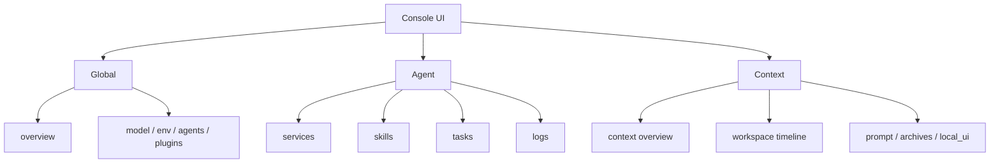
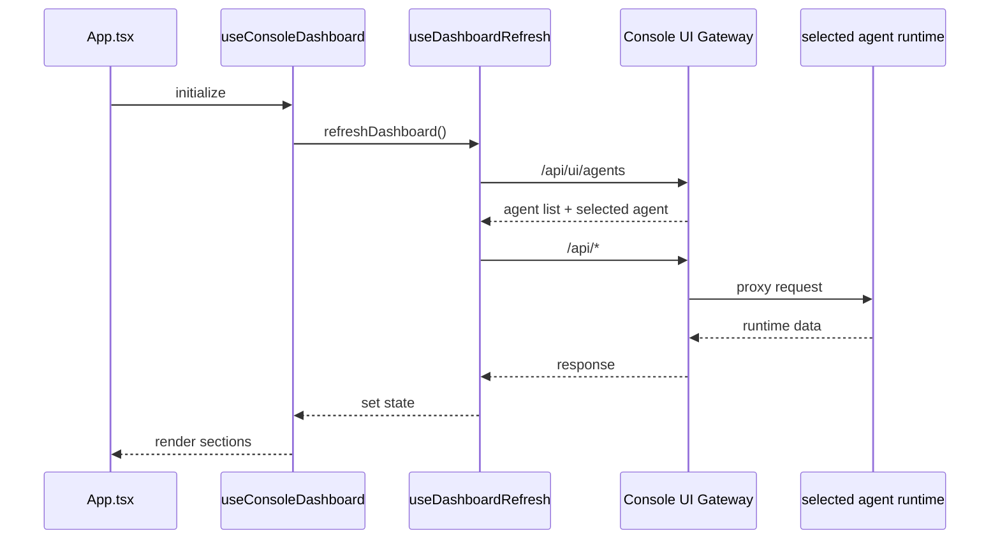

# Console UI Dataflow and Information Architecture

The real value of `products/console/` is not only how the screens look. It is how it separates console-level, agent-level, and context-level information.

## Core Idea

Console UI does not own the runtime. It owns the orchestration of observation and operation entrypoints.

That means its goal is not to stuff every piece of data into one dashboard. Its goal is to make users clearly understand which layer they are acting on.

## Three-Layer Information Architecture

## Why split it this way

These three kinds of information are not the same thing:

- Global is console-level control information
- Agent is current project runtime information
- Context is current session and conversation state

Without that split, users end up facing all of these at once:

- global model pool
- current agent logs
- one context message timeline

That makes it unclear what they are actually operating on.

## Top-Level Dataflow

`useConsoleDashboard` is the composition layer, and `useDashboardRefresh` is the refresh orchestration layer.

## Switching Logic

### Switching agent

When the selected agent changes, the system needs to:

- refresh the agent list
- refresh current agent-level data
- recompute available contexts
- then refresh context-level data

That is why `useDashboardRefresh.ts` first loads `agents`, then session summaries, then chooses the next active session.

### Switching session

When only the session changes, the UI does not need to reload the whole world. It only needs to refresh:

- channel history
- context messages
- archives
- prompt

This keeps local actions from causing a full-page shake.

## Constraints that matter for contributors

### 1. UI should not quietly own business rules

Business decisions should stay in runtime code or shared type contracts whenever possible. The UI should primarily express and trigger.

### 2. Do not mix controls from different scopes

For example:

- global model switching should not hide inside a context page
- context cleanup should not live in a global overview card

### 3. Support degraded views when an agent is offline

This is an important design point in the current implementation:

- when an agent is offline, the UI can still show static config and global data
- the whole control surface should not go blind just because one runtime is down

## Suggested Reading Path

1. `src/App.tsx`
2. `src/hooks/useConsoleDashboard.ts`
3. `src/hooks/dashboard/useDashboardRefresh.ts`
4. `src/lib/dashboard-queries.ts`
5. `src/lib/dashboard-mutations.ts`
6. `src/components/dashboard/*`
