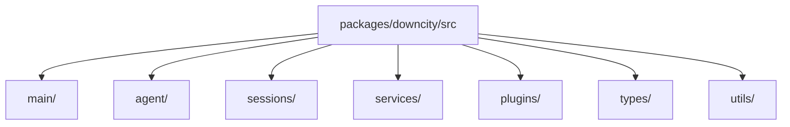

# Package Module Breakdown

`packages/downcity/` is the runtime core. The fastest way to understand it is to follow the real runtime objects, not the old directory names.

## Core Mental Model

- `main/` owns entry assembly
- `agent/` owns the single-project runtime center
- `sessions/` owns the execution axis
- `services/` own workflows
- `plugins/` own extensions

## Current Directory Map

## 1. `main/`

This is the current entry and assembly layer.

It owns:

- HTTP server startup and route mounting
- service and plugin integration entrypoints
- daemon and runtime process management
- env, config, model, and project setup
- dashboard and gateway APIs

### Important subareas

#### `main/index.ts`

The current agent HTTP server entrypoint.

It:

- creates the Hono app
- mounts `static / health / services / plugins / execute / dashboard`
- starts and stops the Node HTTP server

#### `main/service/`

Owns:

- service lifecycle control
- service action execution
- service API registration

Key modules here are:

- `ServiceStateController`
- `ServiceActionRunner`
- `ServiceActionApi`

#### `main/plugin/`

Owns:

- plugin registration
- hook execution
- availability checks
- built-in plugin registration

Key objects here are:

- `HookRegistry`
- `PluginRegistry`

#### `main/runtime/` and `main/daemon/`

Own:

- console and agent process state
- pid, registry, path, and daemon metadata
- agent process discovery and lifecycle

#### `main/ui/`

Owns:

- dashboard and web UI APIs
- gateway behavior
- model, env, and channel-account control APIs

## 2. `agent/`

This is the single-project runtime center.

The most important object here is:

- `AgentState`

`AgentState` holds:

- `cwd`
- `rootPath`
- `config`
- `env`
- `systems`
- `model`
- `sessionStore`
- `services`
- `pluginRegistry`

### `AgentState.ts`

Owns:

- project runtime initialization
- config, env, and static system loading
- model creation
- `SessionRuntimeStore` and `SessionStore` creation
- plugin registry creation
- per-agent service creation
- prompt hot reload

### `ExecutionContext.ts`

Owns:

- the unified execution surface derived from `AgentState`

It exposes:

- `config`
- `env`
- `logger`
- `session`
- `invoke`
- `plugins`

## 3. `sessions/`

This is the execution axis.

### `SessionStore`

The agent-owned session facade.

It exposes:

- `getRuntime`
- `getPersistor`
- `run`
- `appendUserMessage`
- `appendAssistantMessage`

### `SessionRuntimeStore`

Owns:

- runtime caching by `sessionId`
- runtime to persistor creation linkage

### `SessionRuntime`

Owns:

- runtime assembly for a single runnable session

### `SessionCore`

This is the execution kernel.

It owns:

- input assembly
- compaction retries
- tool loop execution
- final assistant message collection

## 4. `services/`

This is the workflow layer. The current core services are:

- `chat`
- `task`
- `memory`
- `shell`

Each service extends `BaseService` and is created per agent.

### `chat`

Owns:

- channel ingress
- chat queue
- session bridge
- reply dispatch
- chat plugin points

### `task`

Owns:

- task definitions
- cron scheduling
- script and agent task execution
- run artifacts

### `memory`

Owns:

- memory writes
- indexing
- search
- flush and status

### `shell`

Owns:

- one-shot shell execution
- long-lived shell sessions
- read / write / wait / close

## 5. `plugins/`

This is the extension layer.

The current built-in plugins are:

- `auth`
- `skill`
- `voice`

Plugins provide:

- explicit actions
- system injection
- hook implementations

The runtime semantics are:

- `pipeline`
- `guard`
- `effect`
- `resolve`

## 6. `types/`

This is the cross-layer contract center.

It matters because:

- dashboard and APIs depend on it
- `AgentState`, `ExecutionContext`, `Service`, and `Plugin` depend on it
- session and runtime result types depend on it

## 7. `utils/`

This is where shared infrastructure lives:

- logger
- sqlite store
- template
- storage
- id
- time

## Suggested Reading Order

1. `src/main/index.ts`
2. `src/agent/AgentState.ts`
3. `src/agent/ExecutionContext.ts`
4. `src/sessions/SessionStore.ts`
5. `src/sessions/SessionRuntimeStore.ts`
6. `src/sessions/SessionCore.ts`
7. `src/main/service/Services.ts`
8. `src/main/registries/ServiceClassRegistry.ts`
9. `src/services/chat/ChatService.ts`
10. `src/services/task/TaskService.ts`
11. `src/services/memory/MemoryService.ts`
12. `src/services/shell/ShellService.ts`
13. `src/main/plugin/Plugins.ts`
14. `src/main/plugin/PluginRegistry.ts`
15. `src/types/*`
