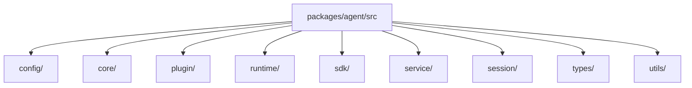
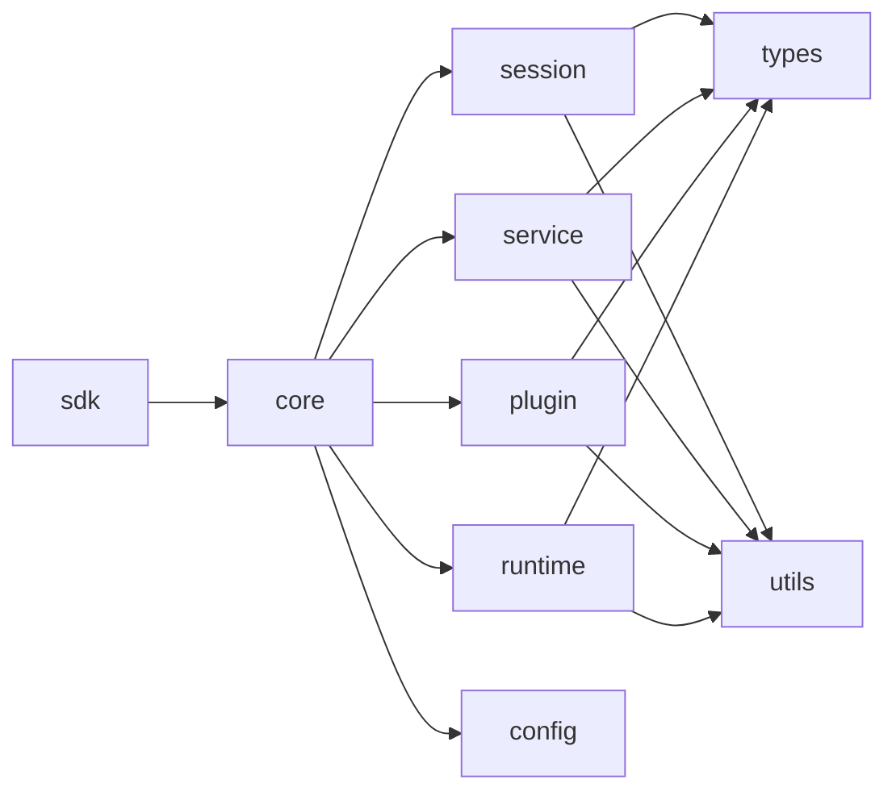

# Package Module Breakdown

The single-agent execution kernel lives in `packages/agent/`. The cleanest way to understand it now is to stop thinking in terms of the old top-level `host/`, `server/`, and `project/` folders, and follow the actual structure:

- `sdk/`: user-facing API surface
- `core/`: instance assembly center
- `session/`: model execution axis
- `service/`: workflow layer
- `plugin/`: extension layer
- `runtime/`: host, HTTP/RPC, sandbox, transport, and model infrastructure

In one sentence:

```text
sdk exposes the runtime, core assembles an agent instance, session / service / plugin own the execution domains, and runtime connects them to the host, network, and command execution environment.
```

## Current Directory Map



## Main Dependency Chain



## 1. `config/`

This directory owns project configuration and project initialization.

- `config/project/AgentInitializer.ts`: creates an agent project, writes default files, and returns initialization results.
- `config/project/types/`: project initialization input/output contracts.
- `config/ExecutionBinding.ts`: execution binding loading, validation, and assertions.

`project/` is no longer a top-level directory because it is fundamentally part of the configuration and initialization domain.

## 2. `core/`

This is the assembly center for one agent instance.

- `AgentCore.ts`: assembles config, session, service, plugin, and runtime into one executable instance kernel.
- `AgentCoreTypes.ts`: defines the instance runtime view.
- `AgentContextTypes.ts`: defines the shared execution surface used by services, plugins, and sessions.

Key points:

- one `AgentCore` corresponds to one agent instance
- the SDK `Agent`, HTTP server, and local RPC server should all work around this instance kernel
- host-level policy should be injected, not hard-coded into the SDK

## 3. `sdk/`

This is the local high-level API surface of `@downcity/agent`.

- `Agent.ts`: local embedded entrypoint; long-lived capabilities are managed through `start()` / `stop()`.
- `Session.ts`: session facade.
- `RemoteAgent.ts`: remote agent client entrypoint.
- `sdk/session/`: SDK session metadata, persistence paths, storage helpers, and service-port adapters.

The current long-lived startup pattern is:

```ts
const agent = new Agent({
  id: "demo",
  path: process.cwd(),
});

await agent.start({
  http: { host: "127.0.0.1", port: 5314 },
  rpc: true,
});
```

Without `start()`, the agent stays in pure library mode.

## 4. `session/`

This is the model execution axis.

- `Executor.ts`: execution entrypoint for a single `sessionId`.
- `executors/local/Runner.ts`: the current model and tool-loop kernel.
- `executors/local/SessionToolLoopRunner.ts`: handles post-response tool execution and continuation.
- `composer/`: history, system, execution, and compaction composition layers.
- `tools/`: tool definitions and tool runtime adapters.

This layer takes a query and drives it all the way to the final assistant reply while persisting messages, steps, and outputs.

## 5. `service/`

This is the workflow layer.

- `service/core/`: service class registration, startup/shutdown, action dispatch, system providers, and state control.
- `service/core/schedule/`: persisted service action scheduling infrastructure.
- `service/builtins/`: built-in services such as `chat`, `contact`, `memory`, `shell`, and `task`.
- `service/types/`: shared service protocol types.

An important boundary here is that scheduling is no longer treated as a separate top-level concept. It now lives under `service/core/schedule/` because it is just delayed execution for service actions.

## 6. `plugin/`

This is the extension layer.

- `plugin/core/`: registration, activation, hook dispatch, local actions, and HTTP route support.
- `plugin/builtins/`: built-in plugins such as `auth`, `skill`, `web`, `asr`, `tts`, `voice`, and `workboard`.
- `plugin/types/`: shared plugin protocol types.

The boundary is:

- services define the workflow and plugin points
- plugins implement some extension points
- plugins do not own the main workflow

## 7. `runtime/`

This directory now collects runtime implementation details in one place instead of scattering them across the top level.

- `runtime/host/`: host-injected capabilities, plugin runtime support, daemon protocol, and project setup.
- `runtime/sandbox/`: command execution isolation and sandbox contracts.
- `runtime/server/`: single-agent HTTP and RPC server implementations.
- `runtime/transport/`: client transport contracts and the local RPC client.

One of the main goals of this refactor is exactly this regrouping: `host/`, `server/`, `transport/`, and `sandbox/` are runtime infrastructure, not first-class business domains.

Model resolution itself does not happen inside `@downcity/agent`. The host should resolve provider/modelId into a `LanguageModel` first, then inject it through `session.set({ model })`.

## 8. `types/`

This directory holds shared cross-module and cross-package contracts.

- `types/common/`: base JSON and template types.
- `types/config/`: `downcity.json`, LLM, execution binding, and start option contracts.
- `types/runtime/host/`: agent host port types.
- `types/runtime/platform/`: city control-plane and managed-agent platform contracts.
- `types/runtime/daemon/`, `types/runtime/rpc/`, `types/runtime/auth/`, and `types/runtime/http/`: daemon, local RPC, auth, and inline instant protocol types.

Domain-local types still stay in their own domains, such as `service/types/`, `plugin/types/`, and `session/types/`. Only stable cross-domain contracts belong in `types/`.

## 9. `utils/`

This directory holds low-level utilities.

- `utils/logger/`: logging.
- `utils/storage/`: storage helpers.
- `utils/cli/`: CLI output helpers.

It should stay as horizontal infrastructure, not become a catch-all business layer.

## Public API Boundary

`src/index.ts` is the only public entrypoint for `@downcity/agent`. It uses an explicit export list and exposes only:

- SDK: `Agent`, `RemoteAgent`, and session configuration/run types.
- plugin/service author APIs: `BaseService`, `ChatService`, built-in plugins, and plugin/service definition types.
- city runtime integration APIs: runtime startup/shutdown, server/RPC startup, service scheduling, project initialization, and model creation.
- cross-package protocol types: platform, daemon, RPC, auth, store, inline instant, and related control-plane contracts.

HTTP routers, sandbox runners, internal service runners, and other implementation details are not exported from the root entrypoint.

## Suggested Reading Order

1. `src/index.ts`
2. `src/sdk/Agent.ts`
3. `src/core/AgentCore.ts`
4. `src/core/AgentContextTypes.ts`
5. `src/session/Executor.ts`
6. `src/session/executors/local/Runner.ts`
7. `src/service/core/Manager.ts`
8. `src/service/builtins/chat/ChatService.ts`
9. `src/plugin/core/PluginManager.ts`
10. `src/runtime/server/http/Server.ts`
11. `src/runtime/server/rpc/Server.ts`
12. `src/runtime/transport/rpc/Transport.ts`

This order lets you understand the public API first, then follow the instance assembly path into the execution kernel and runtime infrastructure.
