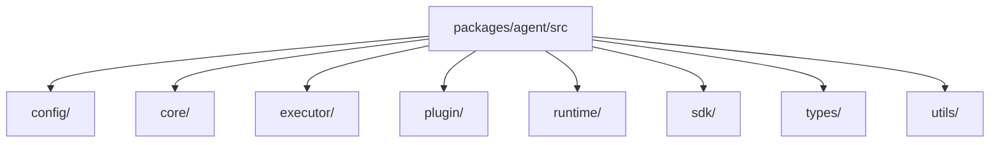

# Package Module Breakdown

The single-agent execution kernel lives in `packages/agent/`.

The cleanest way to understand it now is to follow the real top-level structure:

- `sdk/`: public local and remote API
- `core/`: instance assembly center
- `executor/`: session execution engine, composers, tools, and persistence
- `plugin/`: plugin definitions, hook dispatch, and built-in plugin runtimes
- `runtime/`: host, HTTP/RPC, sandbox, transport, and runtime infrastructure
- `config/`, `types/`, `utils/`: support domains

## Current directory map

## Main dependency story

- `sdk` exposes the public surface
- `core` assembles one `AgentCore`
- `executor` owns turn execution
- `plugin` owns capability and runtime augmentation
- `runtime` connects the agent to the host environment

## 1. `sdk/`

This is the public API of `@downcity/agent`.

- `Agent.ts`: local embedded entrypoint
- `RemoteAgent.ts`: remote HTTP client
- `Session.ts`: session facade
- `AgentSdkTypes.ts`: SDK-facing types

## 2. `core/`

This is the assembly center for one agent instance.

- `AgentCore.ts`: assembles config, session access, plugins, and runtime hooks
- `AgentCoreTypes.ts`: instance runtime view
- `AgentContextTypes.ts`: shared execution surface consumed by plugin runtimes

## 3. `executor/`

This is the execution axis.

- execution engine
- history and system composers
- tools and tool-runtime adapters
- persistence and step facts

This is where the real model and tool loop lives.

## 4. `plugin/`

This is the capability layer.

- built-in plugins such as `chat`, `task`, `memory`, `shell`, `schedule`, `skill`, `web`, and `auth`
- plugin registration and hook dispatch
- plugin runtime-local types

The boundary here is simple:

- session executes
- plugins expose or augment capability

## 5. `runtime/`

This is the infrastructure layer.

- host integration
- HTTP server
- local RPC server
- transport contracts
- sandbox runtime

These are runtime facilities, not product-level workflow domains.

## 6. `types/`

This directory holds stable shared contracts:

- config types
- runtime protocol types
- SDK-facing execution types
- common JSON and utility contracts

## 7. `config/` and `utils/`

- `config/` owns project configuration and initialization support
- `utils/` holds low-level helpers such as logging and storage support

## Public API boundary

`src/index.ts` is the only public entrypoint.

It should expose:

- SDK APIs
- plugin author APIs
- runtime integration APIs
- stable shared protocol types

It should not expose internal router wiring, sandbox runners, or private runtime helpers.
