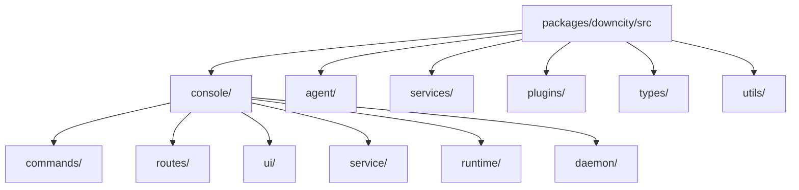

# Package Module Breakdown

`packages/downcity/` is the system core. The best way to understand it is by responsibility, not by memorizing file trees.

## Directory Responsibility Map

## 1. `console/`

This is the global control-plane code.

### `commands/`

Responsibilities:

- parse CLI arguments
- map commands to console, agent, service, or plugin behavior
- avoid owning the real business execution

### `routes/`

Responsibilities:

- provide HTTP protocol entrypoints for runtime APIs
- mount health, execute, services, plugins, dashboard, and other routes

### `service/`

Responsibilities:

- manage service registry
- manage service runtime state
- handle start/stop/restart/status
- provide the unified `ServiceRuntime` contract

### `ui/`

Responsibilities:

- provide gateway routes for Console UI
- expose dashboard, model, env, and related routes

### `runtime/` and `daemon/`

Responsibilities:

- own console pid, registry, paths, and daemon metadata
- manage agent project registration and process discovery

## 2. `agent/`

This is the single-project execution plane.

Responsibilities include:

- prompt assembly
- context-manager collaboration
- persistence and context slicing
- orchestrator, prompter, persistor, and related execution components

## 3. `services/`

This is the primary workflow layer. The current core includes:

- `shell`
- `chat`
- `task`
- `memory`

### `chat`

Owns:

- platform message ingress
- chatKey/context alignment
- history, queue, and visible text
- channel adaptation

It is a service not because chat is “important”, but because it actively participates in the runtime lifecycle.

### `task`

Owns:

- task definitions
- manual and scheduled execution
- cron runtime
- run artifacts

### `memory`

Owns:

- memory read/write and retrieval workflow

## 4. `plugins/`

This is the extension layer, not a second primary workflow layer.

Current built-in examples:

- `auth`
- `skill`
- `voice`

When reading plugins, keep these rules in mind:

- a plugin is not a workflow owner
- a plugin is an enhancement layer
- a plugin has no standalone lifecycle
- a plugin does not actively participate on its own
- a plugin only runs when runtime or a service triggers it

For example, `voice` now more precisely:

- implements voice-related plugin points owned by `chat`
- passively participates during inbound augmentation and transcription
- does not run its own long-lived service state machine

### Better Mental Model

Do not think of plugins as a marketplace of abilities.

A better model is:

- services define workflow and extension points
- runtime provides `pipeline / guard / effect / resolve`
- plugins implement those points
- assets provide low-level dependencies

## 5. `types/`

This is the cross-layer contract center.

It matters because:

- Console UI depends on it
- gateway code depends on it
- runtime depends on it
- services and plugins depend on it

## 6. `utils/`

This holds cross-cutting infrastructure:

- logger
- store
- template
- storage
- id

If something is not business semantics but is reused across layers, it likely belongs here.

## Suggested Reading Order

1. `src/console/index.ts`
2. `src/console/commands/Run.ts`
3. `src/console/service/ServiceRuntime.ts`
4. `src/console/service/Manager.ts`
5. `src/services/chat/Index.ts`
6. `src/services/task/Index.ts`
7. `src/console/ui/ConsoleUIGateway.ts`
8. `src/types/*`
