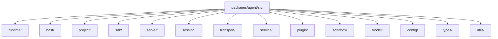

# Package Module Breakdown

The single-agent execution kernel now lives in `packages/agent/`. The fastest way to understand it is to follow the real runtime objects:

- `AgentRuntime`
- `AgentContext`
- `Session`
- `Runner`
- `BaseService`
- `PluginRegistry`

In one sentence:

```text
agent assembles the single-project runtime, session owns the model execution axis, services own workflows, plugins extend those workflows, and server/sdk expose the runtime.
```

## Current Directory Map



## 1. `runtime/`

This is the single-project runtime center.

### `AgentRuntime.ts`

Owns:

- project config, project env, and global env loading
- static system prompt loading
- model creation
- session factory creation
- per-agent service instance creation
- plugin manager initialization
- shell tool runtime binding
- prompt and config hot reload

### `AgentContext.ts`

Derives the unified runtime surface from `AgentRuntime` for services, plugins, and session tools.

It exposes:

- `config`
- `env`
- `logger`
- `session`
- `invoke`
- `chat`
- `plugins`

## 2. `project/`

Owns project initialization, model binding, execution binding, and project structure preparation.

- `AgentInitializer.ts`: agent project creation and default file writing.
- `ProjectExecutionBinding.ts`: project execution target reading and validation.
- `types/`: project initialization types.

## 3. `host/`

This is the port layer between the agent runtime and its host environment.

- `host/runtime/`: host ports, plugin config runtime, and plugin runtime resolver injected into `AgentRuntime`.
- `host/daemon/`: agent-side daemon protocol, project setup, HTTP client, and project-level daemon meta paths.

Daemon process start/stop, pid cleanup, registry sync, and other platform-level management responsibilities belong to `@downcity/city`.

## 4. `sdk/`

This is the local SDK facade.

It owns:

- `Agent`
- `RemoteAgent`
- `Session`
- SDK HTTP/RPC wrappers
- SDK session metadata
- SDK-specific system builder

## 5. `server/`

This is the single-agent server layer.

- `server/http/`: HTTP server and `control / execute / services / plugins / health / static` routes.
- `server/http/auth/`: agent HTTP / CLI-token auth helpers.
- `server/http/control/`: single-agent control API.
- `server/rpc/`: local RPC server.

## 6. `session/`

This is the model execution axis.

### `Executor`

One `sessionId` maps to one internal `Executor` instance.

It owns:

- `run`
- `appendUserMessage`
- `appendAssistantMessage`
- Runner caching
- same-session concurrency protection
- assistant step persistence

### `Runner`

This is the current model and tool-loop execution kernel.

It owns:

- model input assembly
- history compaction
- tool loop execution
- incomplete response recovery
- final assistant message collection

Related helpers:

- `SessionToolLoopRunner.ts`: drives the model-response tool loop and continuation decisions.
- `SessionModelMessageState.ts`: maintains both session-level and model-level message baselines.
- `SessionUiStreamCollector.ts`: consumes the UI stream and collects the final assistant message.
- `SessionExecutionError.ts`: normalizes AI SDK / provider errors.

### `composer/`

Owns the session run composition surfaces:

- `history/`: JSONL history read/write and recovery.
- `system/`: static prompts, service/plugin system prompts, and variable rendering.
- `execution/`: request-to-model-input mapping.
- `compaction/`: context compression.

## 7. `service/`

This is the workflow layer.

- `service/core/`: service class registration, state control, action dispatch, and HTTP route registration.
- `service/builtins/`: built-in service implementations.
- `service/schedule/`: persisted service action scheduling.
- `service/types/`: shared service protocol types.

The current built-in services are:

- `chat`: channel ingress, chat queue, session bridge, reply dispatch, and chat plugin points.
- `contact`: contact-related capabilities.
- `task`: task definitions, scheduling, agent runs, and run artifacts.
- `memory`: memory writes, search, flush, and system prompts.
- `shell`: shell session lifecycle and command execution.

## 8. `plugin/`

This is the extension layer.

- `plugin/core/`: registration, activation, hook dispatch, local actions, and HTTP route support.
- `plugin/builtins/`: `auth`, `skill`, `web`, `asr`, `tts`, `voice`, and `workboard`.
- `plugin/types/`: shared plugin protocol types.

Plugins can provide:

- explicit actions
- system injection
- hook implementations

Hook semantics are unified as:

- `pipeline`
- `guard`
- `effect`
- `resolve`

The key rule:

- services define plugin points
- plugins implement some of those points
- plugins do not own the main workflow

## 9. `sandbox/`

This is the command execution isolation layer.

It owns:

- sandbox config resolution
- safe cwd resolution
- plain shell process spawning
- macOS seatbelt sandbox spawning

Shell tools, shell service, and task service eventually enter command execution through this layer.

## 10. `transport/`

This is the agent client transport protocol layer.

- `transport/rpc/Client.ts`: local RPC client.
- `transport/rpc/Transport.ts`: local IPC / external HTTP transport selector.
- `transport/rpc/Paths.ts`: local RPC endpoint path resolution.
- local RPC protocol types live in `types/rpc/`.

## 11. `types/`

This directory holds shared protocol types used across modules and packages.

- `types/common/`: base JSON and template types.
- `types/config/`: `downcity.json`, execution binding, LLM, and start option types.
- `types/host/`: agent host port types.
- `types/platform/`: city control plane / managed agent platform contracts.
- `types/daemon/`, `types/rpc/`, `types/auth/`, and `types/http/`: daemon, local RPC, auth, and inline instant protocol types.

Domain-local types remain in their domain directories, such as `service/types/`, `plugin/types/`, and `session/types/`.

## 12. `config/`, `model/`, and `utils/`

- `config/`: project config, schema, and project-level paths.
- `model/`: model creation and model management helpers.
- `utils/`: logger, CLI output, storage, id, and time helpers.

## Public API Boundary

`src/index.ts` is the only public entrypoint for `@downcity/agent`. It uses an explicit export list and exposes only:

- SDK: `Agent`, `RemoteAgent`, and session configuration/run types.
- plugin/service author APIs: `BaseService`, `ChatService`, built-in plugins, and plugin/service definition types.
- city runtime integration APIs: runtime startup/shutdown, server/RPC startup, service scheduling, project initialization, and model creation.
- cross-package protocol types: platform, daemon, RPC, auth, store, inline instant, and related control-plane contracts.

HTTP routers, sandbox runners, internal service runners, and other implementation details are not exported from the root entrypoint.

## Suggested Reading Order

1. `src/index.ts`
2. `src/runtime/AgentRuntime.ts`
3. `src/runtime/AgentContext.ts`
4. `src/sdk/Session.ts`
5. `src/session/Executor.ts`
6. `src/session/executors/local/Runner.ts`
7. `src/session/executors/local/SessionToolLoopRunner.ts`
8. `src/service/core/Services.ts`
9. `src/service/core/ServiceClassRegistry.ts`
10. `src/service/builtins/chat/ChatService.ts`
11. `src/service/builtins/task/TaskService.ts`
12. `src/plugin/core/PluginManager.ts`
13. `src/plugin/core/PluginRegistry.ts`
14. `src/server/http/Server.ts`
15. `src/server/rpc/Server.ts`
16. `src/sdk/Agent.ts`
