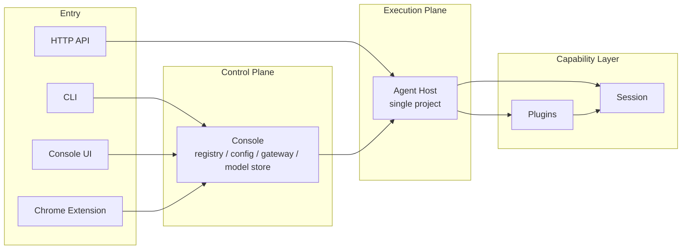
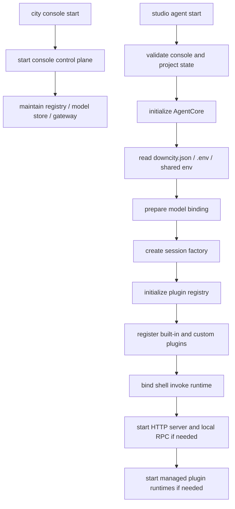
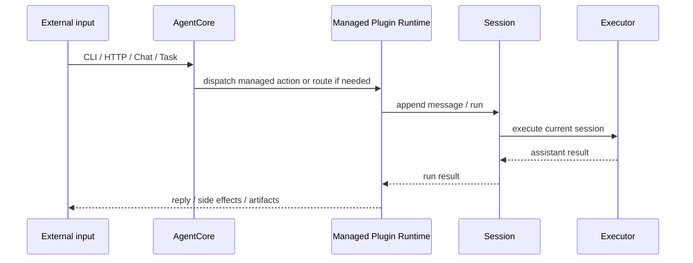

# Runtime, Sessions, and Plugins

This page describes the current package with the objects that actually exist today.

## Core conclusion

- `AgentCore` is the single-agent instance kernel.
- `Session` is the execution owner.
- `Plugin` is the capability unit.
- Managed plugins may own long-lived runtime state, but they still do not replace session execution.

## One-sentence model

```text
AgentCore assembles the agent
session executes the turn
plugins expose and augment capability around that execution
```

## Layer view

Downcity is easiest to read as four layers:

1. Entry surfaces: CLI, Console UI, Chrome Extension, HTTP API
2. Control plane: console
3. Execution plane: agent host
4. Capability layer: session and plugins



## What runtime means now

The runtime center is no longer a separate top-level extension manager.

The real center is the `AgentCore` instance created by the SDK or host. It owns:

- `config`
- `env`
- `plugins`
- session creation and lookup
- host integration ports
- the shared `AgentContext` surface consumed by plugin runtimes

The most accurate high-level sentence now is:

```text
console manages many agents
each agent host owns one AgentCore
AgentCore then coordinates session execution and plugin runtime
```

## Startup order



`city console start` brings up the global control plane. It handles registry, shared configuration, model pool coordination, and UI-facing gateway behavior.

`studio agent start` then assembles one project into a running agent host. That process reads project config, prepares model binding, creates the session layer, registers plugins, and starts managed runtimes when needed.

## What owns what

### Session owns execution

Session answers:

- which `sessionId` a run belongs to
- how history and prompt state are loaded
- when model and tool execution starts
- how results are persisted and returned

### Plugins own capability

Plugins answer:

- what explicit action surface is exposed
- what system text is injected
- which hooks augment runtime behavior
- whether one plugin runtime needs long-lived local state

The unified hook semantics are:

- `pipeline`
- `guard`
- `effect`
- `resolve`

Managed plugins such as `chat`, `task`, `memory`, `contact`, `shell`, `schedule`, and `workboard` may also own background runtime behavior or HTTP routes.

### AgentContext is the shared surface

Plugins consume the stable `AgentContext` surface instead of reaching into random host modules.

That surface includes:

- `config`
- `env`
- `logger`
- `session`
- `invoke`
- `plugins`
- path and plugin-config access

## One real call chain



## Stable model

```text
console owns governance
agent host owns one project
session executes
plugins expose and augment capability
managed plugins own long-lived runtime modules when needed
```
