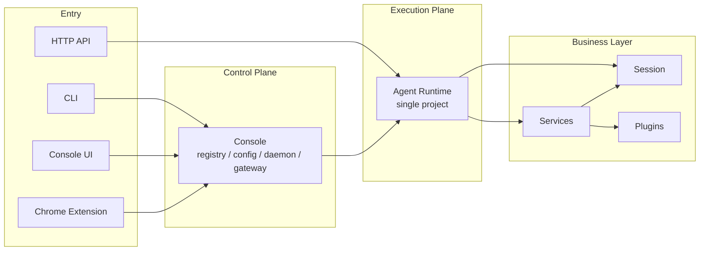
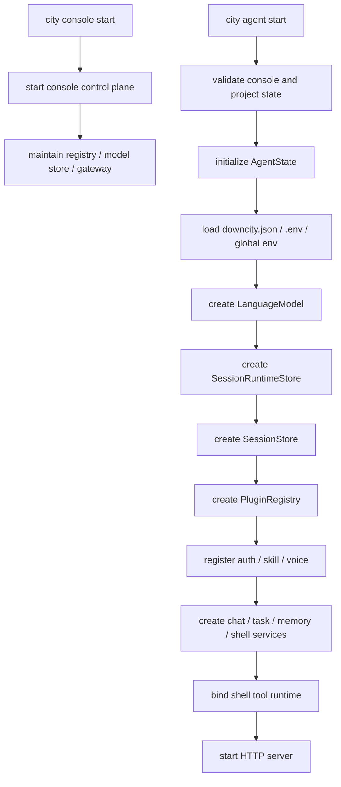
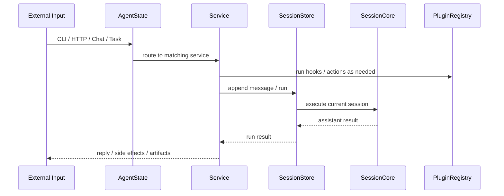

# Runtime, Services, and Plugins

This page has one goal:

- explain the current runtime, service, and plugin layers using the objects that actually exist in the codebase today

## Short Version

- `AgentState` is the single-project runtime center
- services own business workflows
- plugins extend those workflows without owning them

## Current Layering

Downcity is easiest to read as four layers:

1. Entry surfaces: CLI, Console UI, Chrome Extension, HTTP API
2. Control plane: console
3. Execution plane: agent runtime
4. Business layer: sessions, services, plugins



## The Runtime Center

The runtime center is now:

- `AgentState`

It owns:

- `config`
- `env`
- `systems`
- `model`
- `sessionStore`
- `services`
- `pluginRegistry`

So the real mental model is:

```text
console manages many agents
each agent runtime is centered on AgentState
AgentState then holds session, services, and plugins
```

## Startup Order



## How Services Get Runtime Access

Services do not own process orchestration.

They receive:

- `ExecutionContext`

That context exposes the main runtime surface:

- `config`
- `env`
- `logger`
- `session`
- `invoke`
- `plugins`

So a better description is:

- the runtime injects a unified execution surface through `ExecutionContext`

## Service Boundary

Services answer:

- what kind of input they own
- how their workflow moves
- when they enter `session.run`
- which plugin points they expose

The current built-in services are:

- `chat`
- `task`
- `memory`
- `shell`

These are per-agent instances, not global workflow singletons.

## Plugin Boundary

Plugins answer:

- how to extend a workflow without taking ownership of it

Plugins currently provide:

- explicit actions
- system injection
- hooks

Hook semantics are unified as:

- `pipeline`
- `guard`
- `effect`
- `resolve`

The key rule is:

- services define stable point names
- plugins implement some of those points

## Real Chat Plugin Points

The `chat` service currently defines and uses:

- `chat.augmentInbound`
- `chat.observePrincipal`
- `chat.authorizeIncoming`
- `chat.resolveUserRole`
- `chat.beforeEnqueue`
- `chat.afterEnqueue`
- `chat.beforeReply`
- `chat.afterReply`

## Real Execution Path



## In One Sentence

```text
The current package is centered on AgentState, uses SessionStore as the execution axis, lets services own workflows, and uses plugins only as extensions.
```
