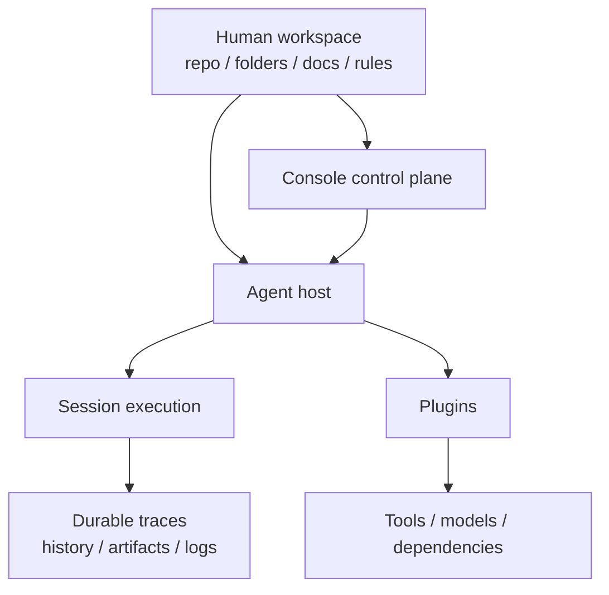

# Design Philosophy and Principles

This page explains the design pressure behind the current architecture.

## Core thesis

Downcity is not trying to move humans into an agent platform.

It is trying to let agents inherit the structure humans already use to run real work.

That means:

- humans keep the workspace
- agents execute inside that workspace
- durable state stays visible in files, logs, and session history

## What Downcity pushes against

Many agent systems start by extracting business state into a new control layer.

That usually creates:

- context loss
- ownership loss
- governance loss

Downcity treats that as the wrong default.

## First principles

1. Repo-native structure comes first.
2. Humans retain interpretive control.
3. Control plane and execution plane stay separate.
4. Session owns execution.
5. Plugins own capability, not the turn itself.

## Practical reading rule

When a new design appears, ask:

- is this moving state closer to the real workspace or farther away from it?
- is this making session execution clearer or hiding it?
- is this capability best expressed as a plugin action, hook, system block, or managed runtime?

## Philosophy-to-architecture map

