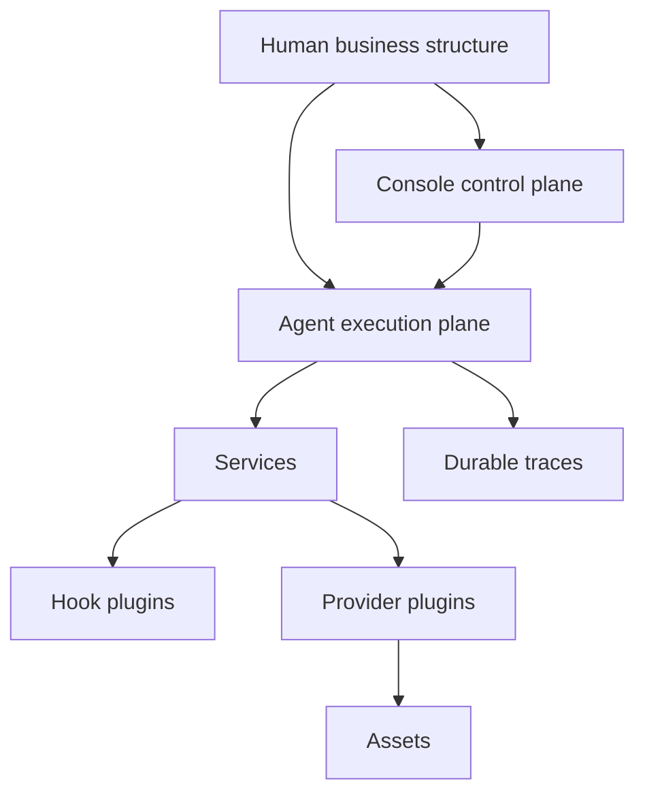

# Design Philosophy and Principles

Downcity is not trying to replace people with an abstract agent platform. It is trying to let agents inherit the structure humans already use to run real work.

## Core Thesis

- Humans should not migrate into an agent platform
- Agents should drop into the human workspace
- Managing folders, docs, config, and context is how you manage the agent

## What Downcity Pushes Against

Many agent systems start by extracting business state into a new platform. That usually creates:

- context loss
- ownership loss
- governance loss

Downcity treats that as the wrong default.

## Human With Agent

The target is not `Human or Agent`, but `Human with Agent`:

- humans define boundaries and fallback responsibility
- agents execute inside those boundaries
- durable traces stay in human-readable forms such as files, logs, and conversation history

## First Principles

1. Business-native structure comes first
2. Humans retain interpretive control
3. Control plane and execution plane stay separate
4. Workflow ownership and enhancement ownership stay separate
5. Services define extension points; plugins only implement them

The service/plugin split is especially important:

- `service` has lifecycle and actively participates in the agent runtime cycle
- `plugin` has no lifecycle and should attach through hooks or providers

## Philosophy-to-Architecture Map

