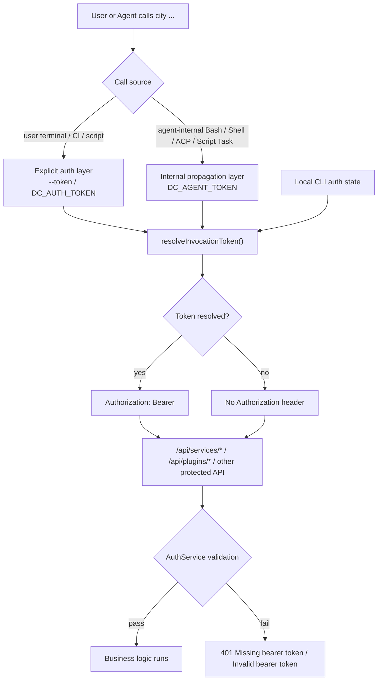
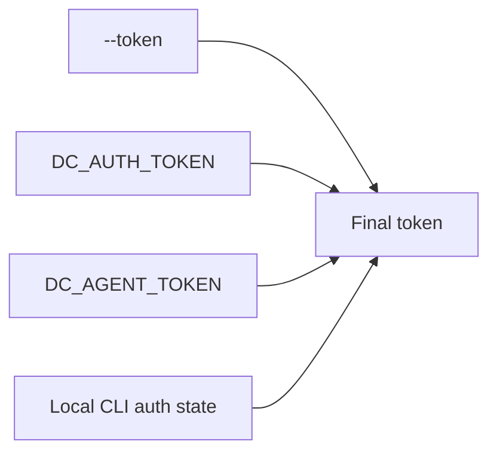
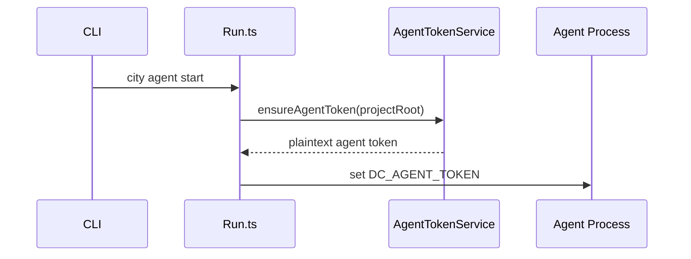
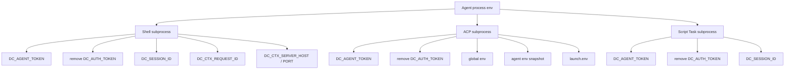
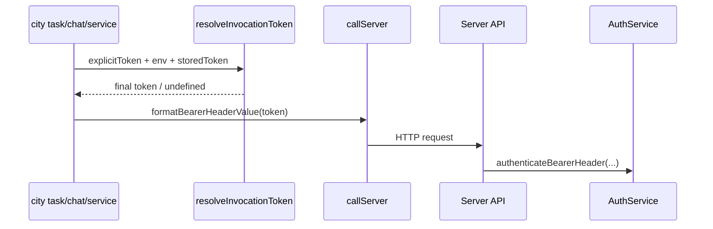
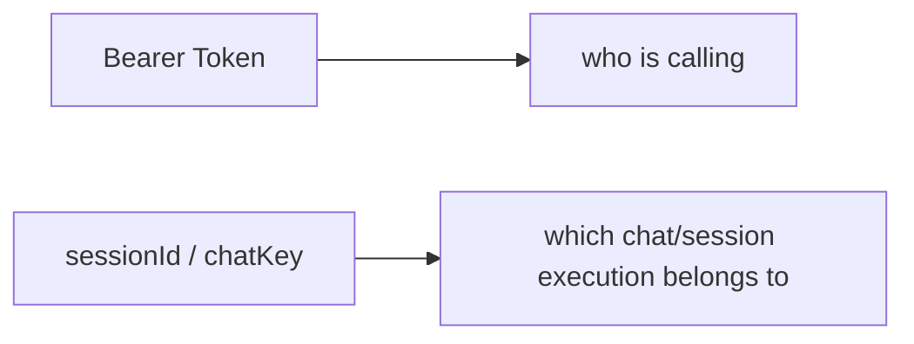

# Auth Env Vars and Token Flow

This page answers one question:

- when the repo runs `city task`, `city chat`, `city service`, or `city plugin`, where does auth actually come from
- what `DC_AUTH_TOKEN` and `DC_AGENT_TOKEN` mean
- why `sessionId` cannot replace a Bearer token
- why `Missing bearer token` happens

Core implementation entry points:

- `packages/downcity/src/main/auth/AuthEnv.ts`
- `packages/downcity/src/main/auth/CliAuthStateStore.ts`
- `packages/downcity/src/main/daemon/Client.ts`
- `packages/downcity/src/main/auth/AgentTokenService.ts`
- `packages/downcity/src/main/commands/Run.ts`
- `packages/downcity/src/main/daemon/Manager.ts`
- `packages/downcity/src/services/shell/runtime/ShellActionRuntimeSupport.ts`
- `packages/downcity/src/session/tools/shell/ShellToolFormatting.ts`
- `packages/downcity/src/session/execution/acp/AcpSessionExecutor.ts`

## One-paragraph summary

The current auth model can be reduced to four rules:

1. Bearer tokens answer who is calling
2. `sessionId` and `chatKey` answer where execution belongs
3. explicit user override uses `--token` / `DC_AUTH_TOKEN`
4. internal agent propagation uses `DC_AGENT_TOKEN` and actively strips inherited `DC_AUTH_TOKEN`

## End-to-end flow

## Variable responsibilities

### `DC_AUTH_TOKEN`

`DC_AUTH_TOKEN` means:

- explicit user override for this CLI/API invocation

Typical use:

- manually running `city task ...` in a terminal
- CI or shell scripts calling `city ...`
- reusing a token obtained from login or token-management APIs

It is not the canonical internal propagation variable.
It is the external explicit input channel.

### `DC_AGENT_TOKEN`

`DC_AGENT_TOKEN` means:

- internal auth propagation inside the agent runtime

Typical use:

- runtime issues an agent-scoped token during startup
- agent internally calls `city task`, `city chat`, or `city service` again
- Bash tool, shell service, ACP subprocess, and script task subprocess continue using the current agent identity

It is not the preferred external integration variable.
It is the runtime's internal auth bus.

## Why keep both variables

Using a single variable would blur explicit user override and runtime-default propagation.

The current split is intentional:

- `DC_AUTH_TOKEN`
  means the user explicitly chose the auth token
- `DC_AGENT_TOKEN`
  means runtime automatically propagated the current agent identity

That gives one strong invariant:

- explicit user input always wins over runtime defaults
- agent-internal automation paths do not accidentally inherit the host shell's user token

## Unified priority order

The final token resolution order is:

1. `--token`
2. `DC_AUTH_TOKEN`
3. `DC_AGENT_TOKEN`
4. local CLI auth state

This is implemented in:

- `packages/downcity/src/main/auth/AuthEnv.ts`
- `packages/downcity/src/main/auth/CliAuthStateStore.ts`

### What this means

- `--token` always wins
- without `--token`, `DC_AUTH_TOKEN` overrides `DC_AGENT_TOKEN`
- without explicit override, agent-internal calls fall back to `DC_AGENT_TOKEN`
- only after all of that does the CLI fall back to local auth state

One extra implementation detail:

- the CLI resolver now checks `--token` / `DC_AUTH_TOKEN` / `DC_AGENT_TOKEN` first
- it only reads local CLI auth state if none of those direct sources are present

So explicit-token paths no longer trigger unnecessary local state reads.

## What happens during agent startup

### Foreground mode

`city agent start --foreground` and the daemon's actual runtime entry both go through `Run.ts`.

The flow is:

1. resolve project root
2. call `ensureAgentToken(projectRoot)`
3. get a plaintext agent token
4. inject `process.env.DC_AGENT_TOKEN`

### Background daemon mode

`Manager.ts` does the same thing before spawning the daemon:

1. issue or rotate the agent token
2. inject `DC_AGENT_TOKEN` into the daemon subprocess env

## Subprocess propagation

### Shell service / shell tool

These paths no longer hand-roll a `DC_AGENT_TOKEN -> DC_AUTH_TOKEN` conversion.

They now do one thing only:

- strip inherited `DC_AUTH_TOKEN`
- propagate `DC_AGENT_TOKEN`
- let the CLI resolve the final auth source later using the shared priority order

Implemented in:

- `ShellActionRuntimeSupport.ts`
- `ShellToolFormatting.ts`

### ACP subprocess

When `execution.type = "acp"`, Downcity launches an external Codex / Claude / Kimi subprocess.

Downcity builds that child env from:

- `process.env`
- global env from store
- agent env snapshot
- ACP `launch.env`
- then strips inherited `DC_AUTH_TOKEN`
- then injects `DC_AGENT_TOKEN`

Implemented in:

- `AcpSessionExecutor.ts`

### Script task subprocess

For `kind = "script"`, the task body runs as `sh task-script.sh`.

That path explicitly injects:

- `DC_SESSION_ID`
- `DC_AGENT_TOKEN`

It also strips inherited `DC_AUTH_TOKEN` so script tasks do not accidentally run under an external user override token.

Implemented in:

- `TaskRunnerRound.ts`

## Env layering

## How the final HTTP Authorization header is produced

No matter whether the call originates from:

- a user terminal `city task`
- an agent-internal Bash tool
- an ACP subprocess running `city service`
- a script task running `city chat`

the auth path eventually converges to:

1. `resolveInvocationToken(...)`
2. `formatBearerHeaderValue(...)`
3. `Authorization: Bearer <token>`

If no token is resolved, the request is sent without `Authorization`.

That is when the server returns:

- `Missing bearer token`

## Where `sessionId` actually matters

This must stay separate from auth.

So:

- `sessionId` is not an auth input
- `chatKey` is not an auth input
- neither can replace a Bearer token

## Why `Missing bearer token` happens

The root cause is always the same:

- the final HTTP request did not include an `Authorization` header

Typical reasons:

1. no `--token`
2. no `DC_AUTH_TOKEN` in the current shell
3. the subprocess did not inherit `DC_AGENT_TOKEN`
4. no local CLI auth state exists

One inverse debugging note:

- if you are worried that an external `DC_AUTH_TOKEN` might leak into agent-internal automation, the current implementation now explicitly scrubs that path
- agent-internal subprocesses are forced onto `DC_AGENT_TOKEN`

Typical non-causes:

- missing `sessionId`
- missing `chatKey`
- malformed task body

Those usually fail in business-layer validation instead.

## The simplified abstraction after the refactor

### Auth input layer

- `--token`
- `DC_AUTH_TOKEN`
- `DC_AGENT_TOKEN`
- local CLI auth state

### Auth resolution layer

- `AuthEnv.ts`
- `CliAuthStateStore.ts`

### Auth propagation layer

- `Run.ts`
- `Manager.ts`
- `ShellActionRuntimeSupport.ts`
- `ShellToolFormatting.ts`
- `AcpSessionExecutor.ts`
- `TaskRunnerRound.ts`

### Auth output layer

- `Authorization: Bearer <token>`

## Recommended mental model

For onboarding new contributors, the shortest correct explanation is:

- `DC_AUTH_TOKEN` means the user explicitly chooses the auth token for this call
- `DC_AGENT_TOKEN` means runtime automatically propagates the current agent identity
- agent-internal paths scrub `DC_AUTH_TOKEN` first so external overrides cannot leak inward
- the CLI resolves both through one shared priority order before making HTTP calls
- `sessionId` is execution context, not authentication
